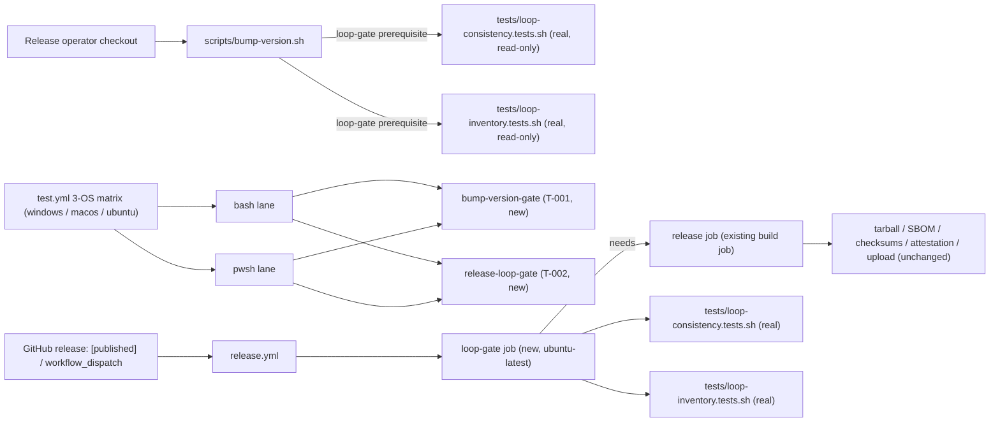

# Infrastructure Specification: epic-159-pillar-b

Release-gate wiring plus two new test-suite pairs and one new required CI
job. No cloud service, deployment target, IaC resource, network route, or
data store is added or changed. The infrastructure-facing edits are: the
new `loop-gate` job and the added `needs:` dependency in
`.github/workflows/release.yml`, and the suite-registration arrays in
`tests/run-all.sh` / `tests/run-all.ps1` and the suite steps in
`.github/workflows/test.yml` — none of which are protected-gate files
(verified in design.md's Protected-File Statement).

## Deployment Topology

## CI/CD Sequence

`.github/workflows/test.yml`'s existing 3-OS matrix (`windows-latest`,
`macos-latest`, `ubuntu-latest`, `test.yml:18`) and existing pwsh/bash step
patterns (direct `.ps1` invocation; bash steps guarded with `if: runner.os
!= 'Windows'` for POSIX-only legs) are unchanged by this feature. Two new
suite pairs join the arrays alongside the existing loop-suite steps already
registered there (`tests/run-all.sh:45-49`; `test.yml`'s "Test loop
inventory/driver/consistency/escalation" and "Test HITL/WFI-audit
terminal-behavior" steps, `test.yml:71-119`): `bump-version-gate` (T-001)
and `release-loop-gate` (T-002), following the same bash-then-pwsh step
pairing precedent.

`.github/workflows/release.yml`'s new `loop-gate` job (T-002) is NOT part
of `test.yml`'s matrix — it runs only when `release.yml` itself is
triggered (`release: [published]` or `workflow_dispatch`,
`release.yml:10-13`, unchanged by this feature). It runs on `ubuntu-latest`
only, matching the workflow's existing single-job, single-OS scope
(`release.yml:32`) — there has never been a 3-OS matrix requirement on
`release.yml`, unlike `test.yml`'s (OQ-002 resolution). The existing build
job (`release:`) gains a `needs: loop-gate` dependency; GitHub Actions'
native `needs:` semantics mean the build job (and therefore every
tarball/SBOM/checksum/attestation/upload step, `release.yml:38-99`) is
skipped entirely if the `loop-gate` job fails — no additional
`if:`-condition logic is required beyond `needs:` itself, and AC-008
additionally asserts neither job carries a `continue-on-error`/`if:
always()` escape hatch that could neutralize this.

Determinism lane (#126 note, carried from epic-159-pillar-a2): every suite
and job in this feature is fully deterministic — no LLM invocation, no
network call beyond `actions/checkout` (already pinned,
`release.yml:34`) and the loop suites' own local execution. When #126
lands the deterministic/LLM CI lane separation, both new `test.yml` suites
join the deterministic lane unchanged; the `release.yml` `loop-gate` job is
unaffected (it already runs in a release-only, non-matrix context).

## Runtime Dependencies

| Dependency | Used by | Absence behavior |
|---|---|---|
| bash | `.sh` suites, `run-all.sh`, the `bump-version.sh` loop-gate prerequisite itself, the `release.yml` `loop-gate` job's steps | lane/job unavailable (CI always provides it; GitHub-hosted `ubuntu-latest` runners ship bash by default) |
| pwsh (PowerShell 7) | `.ps1` twins, `run-all.ps1` | recorded SKIP where a bash-only real script cannot be driven (e.g. `bump-version-gate.tests.ps1` degrades to a named SKIP if `bash` is not found on `PATH`, mirroring `tests/hitl-wfi-terminal.tests.ps1:101-107`) |
| git | `tests/bump-version-gate.tests.sh`/`.ps1`'s fixture-repo copy and baseline commit (design.md API/Contract Plan) | fixture construction fails fast with a named diagnostic; already a repository dependency (`release.yml:55-60` resolves tags via `git`) |
| tar | `tests/bump-version-gate.tests.sh`'s fixture-repo copy, reusing `tests/repository-release-validation.tests.sh:9-16`'s technique | already a repository dependency |
| python3 | `tests/release-loop-gate.tests.sh` (bash lane only, text-marker technique reusing `tests/workflow-state-ci-integration.tests.sh`'s established pattern) | not required by the `.ps1` twin, which re-implements the same logic natively; already a repository dependency (`.github/scripts/generate-sbom.py`) |
| jq | not a direct dependency of any new file in this feature (the loop suites themselves require it, INV-003/INV-004, but this feature only invokes them as opaque subprocesses and consumes only their exit code) | n/a |

No new services, containers, package installations, or network access.

## Environments

| Environment | URL | Auth | Trigger | Classification | Promotion Rule |
|---|---|---|---|---|---|
| local | repository checkout | none / synthetic fixtures | `scripts/bump-version.sh <version>`; `bash tests/run-all.sh` / `pwsh tests/run-all.ps1` | internal fixtures only | suites green; loop-gate prerequisite green |
| CI matrix (`test.yml`) | no network use by suites beyond checkout | scoped `GITHUB_TOKEN` (unchanged) | push / PR / merge_group | synthetic fixtures | all required checks green on 3 OSes |
| release (`release.yml`) | no network use by the `loop-gate` job; the existing build job retains its existing `contents: write`/`id-token: write`/`attestations: write` scopes (`release.yml:25-29`, unchanged) | `release.yml`'s existing permissions (unchanged) | `release: [published]` / `workflow_dispatch` | real repository at the resolved tag | `loop-gate` job green (new, required via `needs:`) |

## Runtime Budget

Neither new suite requires a runtime-budget assertion (design.md Test
Strategy item 3): `tests/bump-version-gate.tests.sh`/`.ps1` (T-001)
defaults its green-path case to trivially-passing stubs rather than
driving the real, multi-round loop suites, and its fixture-repo copy
(tar-based, mirroring `tests/repository-release-validation.tests.sh:9-16`)
is comparably fast to that existing, unbudgeted suite;
`tests/release-loop-gate.tests.sh`/`.ps1` (T-002) is pure text parsing over
a single small YAML file with no subprocess loop-driving at all. The
`release.yml` `loop-gate` job itself runs the REAL, full
`tests/loop-consistency.tests.sh`/`tests/loop-inventory.tests.sh` (each
already self-budgeted at `LOOP_SUITE_BUDGET_SECONDS=300`,
`loop-consistency.tests.sh:431` context / `loop-inventory.tests.sh:41`) —
this is expected and acceptable (OQ-002 resolution): `test.yml` already
proves both suites complete well under budget on `ubuntu-latest`
(INV-002), and `release.yml` runs only on a release-publish event, not on
every push/PR, so the added wall-clock cost is incurred rarely.

## Infrastructure as Code, Scaling, SLOs, and Residency

N/A — no change: no deployed service. The only IaC-like artifacts are
`.github/workflows/release.yml` and `.github/workflows/test.yml`, whose
changes are limited to registering a new job (`release.yml`) and two new
suite steps (`test.yml`).

## Observability

| Logs | Traces | Metrics | Alert | Owner | Runbook |
|---|---|---|---|---|---|
| `scripts/bump-version.sh`'s existing terse stdout/stderr, extended with a named failure diagnostic (`Error: <suite> failed; no release surface was modified.`) plus the failing suite's captured output on the loop-gate prerequisite's red path; suite pass/fail output for the two new suites; GitHub Actions job status for the new `loop-gate` job | N/A | pass/fail per suite per OS per lane (`test.yml`); `loop-gate` job pass/fail per release run (`release.yml`) | CI failure (`test.yml`); release-workflow failure (`release.yml`, blocks the build job via `needs:`) | maintainers | rerun the failing suite locally (`bash tests/loop-consistency.tests.sh` / `bash tests/loop-inventory.tests.sh`) before re-attempting `scripts/bump-version.sh` or re-publishing the release |

## Rollback

Per-item reviewed revert (one issue = one task = one commit). No
human-copy step exists in the rollback path because nothing protected is
touched. Reverting T-001's `scripts/bump-version.sh` edit restores today's
CHANGELOG-heading-only precondition. Reverting T-002's `release.yml` edit
(the `loop-gate` job and the build job's `needs:` line) restores today's
ungated release workflow. Deregistering either new suite from
`run-all.sh`/`run-all.ps1`/`test.yml` without deleting the suite file is
caught by that suite's own self-registration check (design.md API/Contract
Plan; mirrors `tests/second-approval-mask.tests.sh:285-289`'s established
pattern).

## Open Questions

None. Owner: maintainers; non-blocking.
