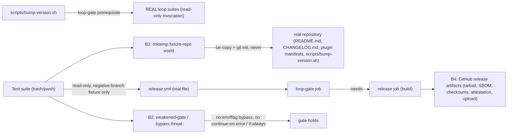

# Security Specification: epic-159-pillar-b

Impact assessment is ALWAYS required for this feature class: this feature
adds a fail-closed release-gate prerequisite to the release path itself —
both `scripts/bump-version.sh` (every plugin manifest, both marketplaces,
`README.md`) and `.github/workflows/release.yml` (the tarball/SBOM/
checksum/sigstore-attestation/upload chain). A harness that leaks fixture
state into the real repository, weakens the new gate, or introduces a
bypass would damage release integrity itself, not merely a test result.
No credential value, secret, or exploit payload belongs in fixtures,
source, logs, or persisted evidence. This feature deliberately implements
only the loop-consistency/loop-inventory subset of the broader
"release.yml not gated on CI" gap (INV-015): the wider risk-adaptive-layer
release-gating work
(`specs/risk-adaptive-layer/{investigation,design}.md`) remains a separate
scope boundary this feature does not cross.

## Trust Boundaries

| Boundary | Source | Destination | Assets | Validation | AuthN/AuthZ | REQ | AC |
|---|---|---|---|---|---|---|---|
| B1 | release path | test-suite fixtures | fixture-repository copies of release surfaces | `mktemp -d` + `trap ... EXIT`; real `README.md`/`CHANGELOG.md`/plugin manifests/`scripts/bump-version.sh` never mutated by any suite in this feature | filesystem isolation | REQ-001 | AC-001..006 |
| B2 | harness/reviewer | gate semantics (non-decreasing) | the loop-gate prerequisite itself (CLI leg + CI leg) | no environment-variable/CLI-flag bypass in the CLI leg (AC-004); no `continue-on-error`/`if: always()` escape hatch in the CI leg (AC-008); negative-branch canary proves the CI leg's check is not vacuous (AC-009) | non-decreasing guarantee | REQ-001, REQ-002 | AC-004, AC-008, AC-009 |
| B3 | test suites | fixture filesystem | synthetic fixture-repo copies (tar-copy + local `git init`), never the real repository | fixture root normalized with `pwd -P`; fixture-scoped `git status --porcelain` used only against the fixture's own baseline commit, never the real repository's git state | filesystem isolation | REQ-001 | AC-002, AC-003, AC-006 |
| B4 | `loop-gate` job | GitHub release artifacts | tarball, SBOM, checksums, sigstore attestation, uploaded release assets | `needs: loop-gate` structurally precedes every artifact-producing step; the `loop-gate` job carries no elevated permissions (no `contents: write`/`id-token: write`/`attestations: write`, unlike the existing build job's scopes at `release.yml:25-29`) | GitHub Actions job dependency semantics | REQ-002 | AC-007, AC-008, AC-010 |

## STRIDE Analysis

| Boundary | Threat | STRIDE | Abuse Case | Mitigation | Verification | REQ | AC |
|---|---|---|---|---|---|---|---|
| B1 | fixture-repo copy accidentally mutates the real repository | Tampering | the tar-copy/`git init` fixture technique is misconfigured and a `sed -i` or `git commit` lands against the real working tree instead of the fixture | fixture root is a freshly created `mktemp -d` directory, never the real repository path; `scripts/bump-version.sh` is invoked as `"${fixture_root}/scripts/bump-version.sh"`, so its own `$ROOT` resolution (`scripts/bump-version.sh:18`) cannot escape the fixture | TEST-001..003 (each asserts fixture-scoped mutation only) | REQ-001 | AC-001..003 |
| B2 | a future edit adds a bypass to the CLI leg (e.g. an env-var skip around the loop-gate block) | Elevation of Privilege | a release operator sets an undocumented environment variable to skip the loop-gate check under time pressure | OQ-007 decision: no bypass exists by design; AC-004's grep-based self-check fails the suite if any conditional wraps the two suite invocations | TEST-004 | REQ-001 | AC-004 |
| B2 | a future edit adds `continue-on-error: true` or `if: always()` to neutralize the `release.yml` gate | Tampering / Elevation of Privilege | a contributor "fixes" a flaky `loop-gate` job by adding `continue-on-error: true`, silently letting every subsequent release bypass the gate | AC-008's text-marker assertion fails the suite if either escape hatch is present in either job's slice of the workflow text | TEST-008 | REQ-002 | AC-008 |
| B2 | the `release.yml` text-marker check itself is vacuously true (asserts a string is present without ever having been able to observe its absence) | Repudiation | the check is authored so loosely that it would pass even against a `release.yml` missing the `needs:` dependency entirely | AC-009's negative-branch canary mutates a fixture copy of `release.yml` (strips `needs:`) and asserts the same check function reports non-compliance on the mutated copy | TEST-009 | REQ-002 | AC-009 |
| B3 | WFI-style fixture leakage: a synthetic fixture path collides with, or is confused for, a real repository path in suite output or logs | Information Disclosure | a diagnostic message prints an absolute fixture path that is later mistaken for a real repository finding | fixture roots are always `mktemp`-generated, `pwd -P`-normalized, and distinguishable by their `/tmp`-rooted prefix; no suite in this feature persists a fixture path into a committed artifact | code review + suite convention check | REQ-001 | AC-001..003, AC-006 |
| B4 | the `loop-gate` job is granted release-upload permissions it does not need, widening the blast radius of a future compromise of that job's steps | Elevation of Privilege | a future edit copies the build job's `contents: write`/`id-token: write`/`attestations: write` permissions onto the `loop-gate` job "for consistency" | the `loop-gate` job's design (design.md API/Contract Plan) grants no elevated permissions — it only checks out the repository and runs local scripts; permission scoping is reviewed at PR time as a Constraint Compliance item, not automated by a suite in this feature | code review | REQ-002 | AC-007 |

## Authorization

| Actor / Role | Resource | Action | Decision Point | Default | Denial Evidence | REQ | AC |
|---|---|---|---|---|---|---|---|
| test suite | `tests/loop-consistency.tests.sh`/`tests/loop-inventory.tests.sh` | invoke (read-only, real or fixture-scoped copy) | filesystem | allow | n/a | REQ-001, REQ-002 | AC-001..003, AC-007 |
| test suite | real `README.md`, `CHANGELOG.md`, plugin manifests, `scripts/bump-version.sh`, `.github/workflows/release.yml` | write | design constraint (B1) | deny (never attempted) | fixture-scoped writes only; `git status --porcelain` on the real repository unaffected | REQ-001, REQ-002 | AC-001..003, AC-009 |
| release operator | `scripts/bump-version.sh <version>` | invoke | CLI (local) | allow, gated by the new loop-gate prerequisite | non-zero exit + unmodified release surfaces on suite failure | REQ-001 | AC-002, AC-003 |
| `loop-gate` job | `tests/loop-consistency.tests.sh`/`tests/loop-inventory.tests.sh` | invoke (real, `ubuntu-latest`) | GitHub Actions job | allow | job failure blocks `needs:`-dependent build job | REQ-002 | AC-007 |
| build job (`release:`) | tarball/SBOM/checksums/attestation/upload steps | execute | `needs: loop-gate` | allow only if `loop-gate` succeeds | job skipped entirely on `loop-gate` failure | REQ-002 | AC-008 |

## Data Classification and Protection

| Entity | Classification | At Rest | In Transit | Retention | Deletion | Access Log | REQ | AC |
|---|---|---|---|---|---|---|---|---|
| fixture-repository copy (`tests/bump-version-gate.tests.sh`/`.ps1`) | synthetic internal (tar-copy of the real repository's tracked files, plus a local `git init` baseline) | mktemp directory | local only | test lifetime | `trap ... EXIT` | test output only | REQ-001 | AC-001..006 |
| mutated `release.yml` copy (`tests/release-loop-gate.tests.sh`/`.ps1`, negative-branch canary) | synthetic internal | mktemp directory | local only | test lifetime | `trap ... EXIT` | test output only | REQ-002 | AC-009 |
| `docs/contributor/release-runbook.md` | internal, committed documentation | repository | local only | repo lifetime | reviewed revert | git history | REQ-003, REQ-004 | AC-012, AC-014 |

No secret, token, credential, or real approval identity appears anywhere
in fixtures or evidence. The `release.yml` build job's existing
permissions (`contents: write`, `id-token: write`, `attestations: write`,
`release.yml:25-29`) are unchanged by this feature; the new `loop-gate`
job requests no elevated permissions.

## OWASP Mapping

| OWASP Risk | Exposure | Control | Verification | Owner |
|---|---|---|---|---|
| Security Misconfiguration | `continue-on-error`/`if: always()` silently neutralizing the `release.yml` gate | AC-008's text-marker assertion + AC-009's negative-branch canary | TEST-008, TEST-009 | maintainers |
| Broken Access Control | fixture writes escaping isolation into the real repository | tar-copy + local `git init` fixture convention; `pwd -P` normalization | TEST-001..003 | maintainers |
| Elevation of Privilege | an undocumented bypass env-var/flag in the CLI leg | AC-004's grep-based self-check | TEST-004 | maintainers |
| Elevation of Privilege | the `loop-gate` job being granted release-upload permissions it does not need | design constraint (no elevated permissions requested) + code review | code review | maintainers |
| Supply Chain Integrity | a release artifact produced from a commit whose loop suites never ran or were red | `needs: loop-gate` structurally precedes every artifact-producing step | TEST-007, TEST-008 | maintainers |

## Secrets Management

No secret is added, read, or logged by this feature. Neither new suite
makes a network call or reads a `.env` file. The `loop-gate` job in
`release.yml` requests no elevated GitHub Actions permissions beyond the
default `contents: read` the workflow file already carries at the
top-level `permissions:` block context (the job itself needs only
checkout + local script execution). Nothing in this feature computes or
verifies a cryptographic hash chain (unlike epic-159-pillar-a's
identity-ledger work) — the fixture's `git status --porcelain` check is a
plain working-tree-diff comparison, not a signature or attestation
mechanism, consistent with ADR-0008's no-signature-crypto boundary; no new
crypto surface is introduced.

## Security Tests

| Test | Boundary | Attack / Control | Expected Result | Evidence | AC |
|---|---|---|---|---|---|
| TEST-002 | B1/B3 | `tests/loop-consistency.tests.sh` stubbed to fail inside the fixture | `scripts/bump-version.sh` exits 1; fixture `git status --porcelain` empty | `tests/bump-version-gate.tests.sh` | AC-002 |
| TEST-003 | B1/B3 | `tests/loop-inventory.tests.sh` stubbed to fail inside the fixture | same fail-closed, zero-mutation outcome, independently of TEST-002 | `tests/bump-version-gate.tests.sh` | AC-003 |
| TEST-004 | B2 | grep for a bypass conditional around the loop-gate invocation | zero matches | `tests/bump-version-gate.tests.sh` | AC-004 |
| TEST-008 | B2/B4 | text-marker scan for `continue-on-error: true` / `if: always()` / `if: success() || failure()` in either job's slice | zero matches; `needs: loop-gate` present in the build job's slice | `tests/release-loop-gate.tests.sh` | AC-008 |
| TEST-009 | B2 | `needs:` line stripped from a fixture copy of `release.yml` | the same check function reports the mutated copy as non-compliant | `tests/release-loop-gate.tests.sh` | AC-009 |

## Open Questions

None security-blocking. All investigation.md security-relevant open
questions are resolved by construction in design.md and verified by
TEST-004, TEST-008, and TEST-009; see requirements.md Open Questions for
the full resolution list.
