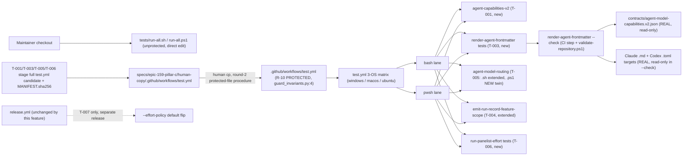

# Infrastructure Specification: epic-159-pillar-c

Contract/CLI/script infrastructure work, new CI drift-checking, and one
production-file-writing generator (`render-agent-frontmatter`). No cloud
service, deployment target, IaC resource, network route, or data store is
added or changed. The infrastructure-facing edits are: the suite arrays in
`tests/run-all.sh`/`.ps1` (UNPROTECTED, agent-edited directly); the
suite/drift-check steps in `.github/workflows/test.yml` (**round-2
correction**: confirmed R-10 PROTECTED at
`plugins/sdd-quality-loop/scripts/generated/guard_invariants.py:4` — this
supersedes this document's round-1 statement that it was unprotected; every
`test.yml`-touching task, T-001/T-003/T-005/T-006, stages its registration
addition via the epic-136 human-copy procedure instead of a direct edit);
and a new `render-agent-frontmatter --check` invocation inside
`tests/validate-repository.ps1` (UNPROTECTED, agent-edited directly) —
verified in design.md's Protected-File Statement.

## Deployment Topology

## CI/CD Sequence

`.github/workflows/test.yml`'s existing 3-OS matrix (`windows-latest`,
`macos-latest`, `ubuntu-latest`) and existing pwsh/bash step patterns
(direct `.ps1` invocation; tee-to-log for bash) are unchanged by this
feature. New suite pairs join the arrays: `agent-capabilities-v2` (T-001),
`render-agent-frontmatter tests` (T-003), and the newly-twinned
`agent-model-routing.tests.ps1` (T-005 — the `.sh` half is already
registered at `tests/run-all.sh:25` and gains new cases in place; only the
`.ps1` half is a new registration). `emit-run-record-feature-scope` (T-004)
and a new `run-panelist-effort` suite (T-006) are extended/added the same
way.

**Round-2 CI-registration procedure correction**: `.github/workflows/test.yml`
is R-10 PROTECTED (`guard_invariants.py:4`), so NONE of T-001/T-003/T-005/T-006
edits it directly — each stages its own full corrected copy under
`specs/epic-159-pillar-c/human-copy/.github/workflows/test.yml`, updates the
shared `MANIFEST.sha256`, and waits for a human maintainer to run the `cp`
before that task's step becomes live in CI. `tests/run-all.sh`/`.ps1` (the
other registration surface) remains a direct, unprotected agent edit — only
`test.yml` itself requires staging. A given task is not eligible for Done
until CI has actually run its newly-registered step at least once
post-human-copy (the observable proof that the staged candidate was applied
correctly).

`render-agent-frontmatter --check` gains its own CI step (bash and pwsh
lanes, matching every other dual-lane step in this workflow — its
REGISTRATION follows the same human-copy staging as every other new step
this feature adds to `test.yml`) AND a call site inside
`tests/validate-repository.ps1` (unprotected, direct edit), so drift is
caught both by the standard push/PR matrix and by the repository-wide
validation surface already invoked elsewhere in this repository's CI/release
tooling. The `--check` step's scope includes the four R-10 protected
reviewer `.md` targets (a read-only comparison, not a write — design.md
Protected-File Statement) so drift on those files is CI-visible even though
only a human can remediate it via the `cp` step.

T-007/#155's default-flip is NOT a new CI/CD step — it is a code-default
change plus a one-time production render, verified by its own
implementation-time smoke check (AC-044) and merged as a separate PR/release
from T-001..T-006 (requirements.md REQ-007, REQ-009). `.github/workflows/release.yml`
is unchanged by any task in this feature.

Determinism lane (#126 note, carried from every prior epic-159-pillar
spec): every suite in T-001..T-006 is fully deterministic — no LLM
invocation, no network call, fixed fixtures (REQ-006's `codex` argv
assertions inspect assembled command lines, never invoking a real `codex`
process). T-007's AC-044 smoke check is the sole exception, scoped to that
task's own implementation-time verification, not to the standard matrix.

## Runtime Dependencies

| Dependency | Used by | Absence behavior |
|---|---|---|
| bash | `.sh` suites, run-all, `render-agent-frontmatter.sh` | lane unavailable (CI always provides it) |
| pwsh (PowerShell 7) | `.ps1` twins, including the newly-authored `agent-model-routing.tests.ps1` | recorded SKIP, matching the run-all.sh guard-r10-port precedent |
| python3 | `select-agent-model.sh`'s existing heredoc technique (unmodified dependency, T-002 additions reuse it); `run-panelist-gpt.sh`'s existing JSON-extraction step (T-006 additions reuse it, do not add a new dependency) | suite fails fast with a named diagnostic where used (already a repository dependency) |
| jq | new test-suite JSON assertions (`agent-model-routing`, `emit-run-record-feature-scope`, `run-panelist-effort`) | suite fails fast with a named diagnostic where used (already a repository dependency) |
| git | T-007's `git merge-base --is-ancestor` prerequisite check (AC-045) | required only at T-007 implementation/release time, not for Phase 1 suites |
| codex CLI | T-006's real Codex-host invocation path; NOT required for T-006's own tests (argv-composition only, AC-040); required for T-007's AC-044 real smoke check | graceful degrade already established at `run-panelist-gpt.sh:62-69` (absent CLI → exit 1, non-zero, not a tool error) |

No new services, containers, package installations, or network access.

## Environments

| Environment | URL | Auth | Trigger | Classification | Promotion Rule |
|---|---|---|---|---|---|
| local | repository checkout | none / synthetic fixtures for tests; real repo for a genuine `render-agent-frontmatter` run | `bash tests/run-all.sh` / `pwsh tests/run-all.ps1` | internal fixtures + real agent-definition files as production render targets | suites green |
| CI matrix | no network use by T-001..T-006 suites | scoped `GITHUB_TOKEN` (unchanged) | push / PR | synthetic fixtures + read-only real-file comparison (`--check`) | all required checks green on 3 OSes |
| Codex-host runtime | codex CLI, local invocation only | operator's own codex CLI auth (unchanged by this feature) | a real quality-gate run on a Codex host | real effort application, T-006/T-007 | AC-044 smoke check passes |

## Runtime Budget

None of this feature's new or extended suites drives a multi-round
review-loop or long-lived fixture (unlike epic-159-pillar-a2's HITL leg);
`agent-capabilities-v2`, `render-agent-frontmatter` tests,
`agent-model-routing.tests.ps1`, `emit-run-record-feature-scope` extensions,
and `run-panelist-effort` tests are each a handful of fast, direct script
invocations against small fixtures and JSON assertions, mirroring
`tests/check-placeholders.tests.sh`'s existing (unbudgeted) pattern — no
new `LOOP_SUITE_BUDGET_SECONDS`-style runtime-budget constant is
introduced. T-007's AC-044 real Codex-host smoke check is bounded by the
`codex` CLI's own invocation, exercised once at T-007 implementation/release
time, not on every CI run.

## Infrastructure as Code, Scaling, SLOs, and Residency

N/A — no change: no deployed service. The only IaC-like artifact is
`test.yml`, whose change is limited to registering the new suite/`--check`
steps.

## Observability

| Logs | Traces | Metrics | Alert | Owner | Runbook |
|---|---|---|---|---|---|
| suite output with counter-based ok/FAIL lines; `render-agent-frontmatter --check` drift diagnostics naming the specific target file and field that diverged; run-record `effort_degraded_reason` values as a structured, queryable field for WFI measurement | N/A | pass/fail per suite per OS per lane; drift count from `--check` (zero expected after each seeded no-op render); `effort_applied` non-null rate on Codex-host runs post-T-007 (WFI observable) | CI failure; `--check` non-zero exit on `validate-repository` run | maintainers | rerun the failing suite locally; for renderer drift, run `render-agent-frontmatter --check -Verbose` (or `.sh` equivalent) to see the exact target/field diff, then either re-render (unprotected targets) or stage-and-`cp` (the four protected targets) |

## Rollback

Per-item reviewed revert (one issue = one task = one commit). T-001..T-006
are each independently revertible; for the five protected targets (round 2:
the four reviewer `.md` files AND `.github/workflows/test.yml`), reverting
a task's own agent-authored commit does NOT automatically undo any
human-applied protected-file change, because that change was never part of
the agent's commit in the first place — a revert PR must separately state
whether the corresponding protected-file content (including the
`test.yml` step) should also be hand-reverted, and by whom. Reverting
T-003's renderer causes `render-agent-frontmatter --check` to disappear
from CI once its own `test.yml` step is (separately, by a human) removed —
the check's own suite removal and its CI step's removal are no longer a
single atomic action post-round-2, since the step lives in a protected
file. T-007's revert
restores the `welded` default and is itself a one-line change plus a
follow-up documentation revert — no data migration exists to unwind
(design.md Data Plan: run-record v2 is additive-only, so no v1 record is
ever rewritten by T-004 or affected by a T-007 revert).

## Open Questions

None. Owner: maintainers; non-blocking.
