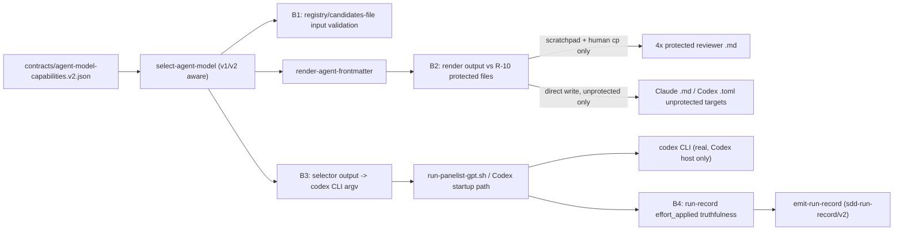

# Security Specification: epic-159-pillar-c

Impact assessment is ALWAYS required for this feature class: this feature
writes to REAL, unattended-CI-consumed agent-definition files on both hosts
(Claude `.md` frontmatter, Codex `.toml` reference comments), stages
corrected content for four R-10 protected gate files a human then copies
into place, constructs `codex` CLI argument lines from registry/selector
output, and emits a run-record field (`effort_applied`) whose truthfulness
downstream WFI measurement depends on. A renderer that writes to a
protected path, a CLI-argument path that admits task-controlled input, or a
run-record field that reports "applied" without confirmation would damage
the enforcement chain, the Codex invocation surface, or the effect
measurement this whole epic exists to enable. No credential value, secret,
or exploit payload belongs in fixtures, source, logs, or persisted
evidence.

## Trust Boundaries

| Boundary | Source | Destination | Assets | Validation | AuthN/AuthZ | REQ | AC |
|---|---|---|---|---|---|---|---|
| B1 | `--registry`/`--candidates-file` input | `select-agent-model` routing decision | v1/v2 registry files, candidate lists | strict schema validation per detected version; malformed `supported_efforts`/`effort_control`/`risk_effort_matrix` rejected fail-closed (`MODEL_SELECTION_ERROR`), same posture as v1's existing validation | filesystem read only, no elevated privilege | REQ-001, REQ-002 | AC-001, AC-006, AC-013 |
| B2 | `render-agent-frontmatter` | R-10 protected reviewer `.md` files vs. unprotected agent-definition files | Claude `.md` frontmatter, Codex `.toml` reference comments | protected basenames structurally excluded from the write-target resolution function; scratchpad + SHA-256 manifest + human `cp` for the four protected files; `--check` read-only against all targets, including protected | R-10 hook-guard non-bypassable by construction (design excludes the write path entirely, not merely relying on the guard) | REQ-003 | AC-014..020 |
| B3 | registry/selector output | `codex` CLI argument construction | `--model`/`--effort` values | values sourced ONLY from registry/selector JSON output, never from unsanitized task or spec text; no shell-interpolation of task-controlled strings into the `codex` invocation | construction — no external input path exists into the argv builder | REQ-006 | AC-035..038, AC-040 |
| B4 | Codex invocation outcome | `sdd-run-record/v2`'s `effort_applied` field | run-record JSON | `effort_applied` is set non-null ONLY by T-006's confirmed-application code path (the `codex --effort` invocation actually succeeding); every other path structurally emits `null` + a named `effort_degraded_reason` | construction — no code path can set `effort_applied` non-null without passing through the confirmed-application step | REQ-004, REQ-006 | AC-021..024, AC-038, AC-039 |

## STRIDE Analysis

| Boundary | Threat | STRIDE | Abuse Case | Mitigation | Verification | REQ | AC |
|---|---|---|---|---|---|---|---|
| B1 | a malformed v2 `risk_effort_matrix` (e.g. a direct `xhigh` mapping) silently bypasses the `--xhigh-reason` justification gate | Elevation of Privilege | a crafted registry entry routes high-risk work straight to `xhigh` without ever requiring a recorded justification | AC-002 asserts no risk key maps directly to `xhigh`; the `--xhigh-reason` eligibility filter (`select-agent-model.sh:237`) is evaluated AFTER matrix selection and escalation bump regardless of registry content, so even a malformed matrix cannot skip the gate | TEST-002, TEST-009, TEST-031 | REQ-001, REQ-002 | AC-002, AC-009, AC-031 |
| B2 | `render-agent-frontmatter` is edited (in a future, unrelated change) to widen its write-target resolution to include a protected basename | Tampering | a corrupted or loosened role→file map causes a direct write attempt against `impl-reviewer-a.md` | TEST-019 asserts the write-target resolution FUNCTION itself excludes the four protected basenames, independent of and in addition to the R-10 hook-guard's own runtime enforcement — a defense-in-depth pairing, not reliance on the guard alone | TEST-019 | REQ-003 | AC-019 |
| B2 | `--check` mode's read of the four protected files is mistaken for, or silently escalated into, a write | Elevation of Privilege | a future edit merges the `--check` and real-render code paths, causing `--check` to write | TEST-020 asserts `--check` performs zero write syscalls/file-open-for-write calls against the four protected paths, and that its exit code reflects drift status only | TEST-020 | REQ-003 | AC-020 |
| B3 | task or spec-file content is interpolated into the `codex --effort`/`--model` argv, enabling command-argument injection | Tampering / Injection | a task description containing shell metacharacters or an unexpected flag string reaches the `codex` invocation | `--effort`/`--model` values originate exclusively from registry/selector JSON output (a closed, schema-validated vocabulary — model names and effort levels enumerated in the registry, never free text); TEST-035..038 assert the assembled argv contains only registry-derived tokens | TEST-035, TEST-036, TEST-037 | REQ-006 | AC-035..037 |
| B4 | `emit-run-record` reports `effort_applied` as non-null for a Codex invocation that actually failed or was never attempted (false-positive telemetry corrupting WFI measurement) | Repudiation | a `codex` CLI failure after the `--effort` flag was assembled is not surfaced back to the run-record, so the record claims application occurred | `effort_applied` is populated only by a confirmed-application signal from T-006's real invocation path, structurally distinct from "flag was assembled" (design.md Constraint Compliance: run-record truthfulness row); TEST-023 asserts both the true-positive (confirmed Codex application) and every negative case | TEST-023, TEST-038 | REQ-004, REQ-006 | AC-023, AC-038 |
| B4 | Claude Code's degradation path is silently dropped instead of recorded, hiding the fact that no effort control was ever possible | Repudiation | a future edit to a Claude-host invocation path omits the `effort_degraded_reason` write, leaving `effort_applied=null` unexplained | AC-024's both-directions field-population lock: `effort_degraded_reason` is asserted non-empty whenever `effort_applied` is null AND a request was made, not merely "sometimes populated" | TEST-024, TEST-039 | REQ-004, REQ-006, REQ-008 | AC-024, AC-039, AC-047 |

## Authorization

| Actor / Role | Resource | Action | Decision Point | Default | Denial Evidence | REQ | AC |
|---|---|---|---|---|---|---|---|
| `render-agent-frontmatter` (agent-run) | unprotected Claude `.md` / Codex `.toml` targets | write (frontmatter line / comment lines only) | role→file map + protected-basename exclusion | allow (unprotected), deny (protected) | n/a (unprotected); guard non-zero exit if a protected write were ever attempted | REQ-003 | AC-014, AC-015, AC-017, AC-018 |
| `render-agent-frontmatter` (agent-run) | four protected reviewer `.md` files | write | design constraint (write-target resolution excludes them structurally) + R-10 guard (defense in depth) | deny (never attempted) | guard non-zero exit if attempted; TEST-019 fails first, before any guard interaction | REQ-003 | AC-019 |
| `render-agent-frontmatter --check` (agent-run or CI) | four protected reviewer `.md` files | read | design constraint (read is not a write) | allow | n/a | REQ-003 | AC-020 |
| human maintainer | `specs/epic-159-pillar-c/human-copy/*` | copy into protected path | human review + SHA-256 manifest verification | n/a (human action) | n/a | REQ-003 | AC-019 |
| `run-panelist-gpt.sh` / Codex startup path (agent-run, Codex host) | `codex` CLI | invoke with `--model`/`--effort` | registry/selector output only | allow | n/a | REQ-006 | AC-035..037 |
| `emit-run-record` (agent-run) | `effort_applied` field | set non-null | confirmed-application signal only | deny (null) unless confirmed | `effort_degraded_reason` populated as the denial evidence | REQ-004, REQ-006 | AC-023, AC-024 |
| human maintainer | T-007's release gate | approve/execute | `git merge-base --is-ancestor` verification + PR review | n/a | n/a | REQ-007 | AC-045, AC-046 |

## Data Classification and Protection

| Entity | Classification | At Rest | In Transit | Retention | Deletion | Access Log | REQ | AC |
|---|---|---|---|---|---|---|---|---|
| `contracts/agent-model-capabilities.v2.json` | internal, committed contract | repository | local only | repo lifetime | reviewed revert | git history | REQ-001 | AC-001..004 |
| `specs/epic-159-pillar-c/human-copy/*` + `MANIFEST.sha256` | internal, committed review artifact (not a secret) | repository | local only | repo lifetime, until human-copied then optionally pruned | reviewed revert | git history | REQ-003 | AC-019 |
| `sdd-run-record/v2` effort fields | internal, generated evidence | `reports/`/run-record output location (unchanged from v1) | local only | run-record lifetime (unchanged) | unchanged from v1 | run-record file itself | REQ-004 | AC-021..026 |
| Claude `.md` / Codex `.toml` rendered targets | internal, unprotected gate-adjacent agent definitions (four protected exceptions handled separately) | repository | local only | repo lifetime | reviewed revert (unprotected); human-controlled revert (protected) | git history | REQ-003 | AC-014, AC-015, AC-019 |

No secret, token, credential, or real approval identity appears anywhere in
the registry, renderer output, run-record fields, or `codex` CLI arguments
this feature constructs. `run-panelist-gpt.sh`'s existing key-isolation
step (`unset SDD_EVIDENCE_KEY SDD_SUDO_KEY SDD_SUDO_KEY_FILE`,
`run-panelist-gpt.sh:84`) is unmodified by T-006's `--effort` addition.

## OWASP Mapping

| OWASP Risk | Exposure | Control | Verification | Owner |
|---|---|---|---|---|
| Broken Access Control | `render-agent-frontmatter` writing to a protected reviewer `.md` file | write-target resolution function structurally excludes protected basenames + R-10 guard (defense in depth) | TEST-019 | maintainers |
| Injection | task/spec content reaching the `codex --model`/`--effort` argv | values sourced exclusively from registry/selector JSON output, a closed enumerated vocabulary | TEST-035..037 | maintainers |
| Security Misconfiguration | v2 registry accepting a malformed `risk_effort_matrix` that bypasses the `xhigh` justification gate | strict schema validation + gate evaluated after matrix/escalation resolution regardless of registry content | TEST-002, TEST-009 | maintainers |
| Repudiation / false telemetry | `effort_applied` reporting non-null without confirmed Codex application | confirmed-application-only field-population design | TEST-023, TEST-038 | maintainers |
| Integrity / Supply Chain | `.toml` reference comments and live selector output drifting apart undetected | AC-038's cross-check makes drift a distinguishable, detectable condition | TEST-038 | maintainers |

## Secrets Management

No secret is added, read, or logged by any component in this feature. The
registry, selector, renderer, and run-record fields carry only model
names, effort levels, tier names, and file paths — none of which are
sensitive. `run-panelist-gpt.sh`'s existing key-isolation (`:84`) and
`prepare-panelist-input.sh`'s existing sanitization (`.env` values,
API keys/tokens, absolute paths, private/RFC-1918 URLs stripped before any
output is written) are both unmodified by this feature's additions.

## Security Tests

| Test | Boundary | Attack / Control | Expected Result | Evidence | AC |
|---|---|---|---|---|---|
| TEST-002, TEST-009, TEST-031 | B1 | matrix/escalation-bumped selection lands on `xhigh` without `--xhigh-reason` | candidate dropped from eligibility (`BLOCKED`-style fail-closed), never silently downgraded or auto-justified | `tests/agent-capabilities-v2.tests.sh`, `tests/agent-model-routing.tests.sh`/`.ps1` | AC-002, AC-009, AC-031 |
| TEST-019 | B2 | write-target resolution invoked with each of the four protected basenames | resolution returns the scratchpad path, never the protected path, for all four | `tests/render-agent-frontmatter.tests.sh`/`.ps1` | AC-019 |
| TEST-020 | B2 | `--check` invoked with the four protected paths in scope | zero write syscalls; correct drift status reported | `tests/render-agent-frontmatter.tests.sh`/`.ps1` | AC-020 |
| TEST-035..037 | B3 | assembled `codex` argv inspected for `--model`/`--effort` values | values match registry/selector output exactly; no other token present | `tests/run-panelist-effort.tests.sh`/`.ps1` | AC-035..037 |
| TEST-023 | B4 | `effort_applied` asserted for both a confirmed-Codex-application case and every degraded case | non-null only in the confirmed case; null + reason in every other | `tests/emit-run-record-feature-scope.tests.sh`/`.ps1` | AC-023 |
| TEST-038 | B4 | rendered `.toml` reference comments deliberately diverged from live selector output | cross-check reports the divergence, does not silently prefer either value | `tests/run-panelist-effort.tests.sh`/`.ps1` | AC-038 |

## Open Questions

None security-blocking. OQ-002's Codex-CLI-reachability question is
resolved by construction in design.md (documentation-only comments, never
CLI-parsed) and verified by TEST-038; see requirements.md Open Questions
for the full resolution list.
