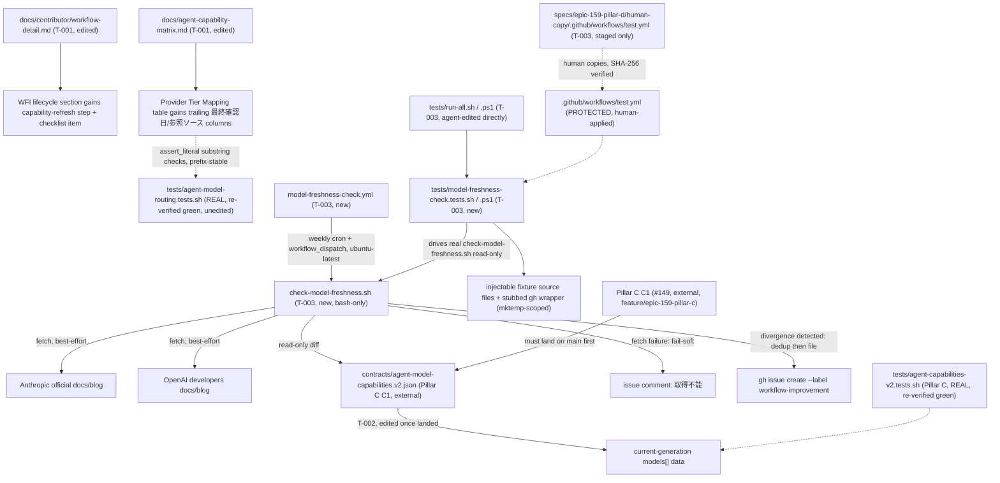

# Design: epic-159-pillar-d

Impl-Review-Status: Pending

Feature Type: contributor-process documentation (T-001) + weekly CI
freshness-check automation (T-003) + registry data population (T-002),
gated by one in-spec dependency (T-003 on T-001) and two external
dependencies (T-002 and T-003 each on Pillar C's C1/#149 landing on
`main`)

## Technical Summary

Three independent deliverables sharing one epic (#159) and one
investigation, but different dependency shapes (requirements.md Main
Workflows). T-001 (#156, D1) is documentation-only: it extends
`docs/contributor/workflow-detail.md`'s existing WFI lifecycle section and
appends two trailing columns to `docs/agent-capability-matrix.md`'s
Provider Tier Mapping table. T-003 (#157, D2) is a new, standalone,
fully-deterministic GitHub Actions workflow plus a bash script plus its
locking test-suite pair — no LLM invocation anywhere (unlike
`self-improvement.yml`, which this design deliberately does not extend;
see Design Decisions). T-002 (#158, D3) is a JSON-data update to a file
this spec does not create (Pillar C's C1 creates
`contracts/agent-model-capabilities.v2.json`; T-002 only populates it once
it exists).

The guiding principle carried from epic-159-pillar-a2/pillar-b: no safety
property is asserted by reimplementation. T-003's locking suite drives the
real `check-model-freshness.sh` read-only against injectable fixtures
(never a live network call); T-002 verifies REAL, already-existing suites
(Pillar C's parity suite, this repository's own `agent-model-routing`
suite) stay green rather than authoring new assertions of its own.

This design also documents one fact this spec's own investigation
(investigation.md INV-012) did not check: `.github/workflows/test.yml` is,
as of this worktree's current HEAD, an enforcement-chain protected file
(`plugins/sdd-quality-loop/scripts/generated/guard_invariants.py:4`,
verified directly — see Protected-File Statement). T-003 is the only task
in this spec that touches it, and does so via the epic-136 human-copy
procedure, not a direct agent write.

## Architecture



## Components

| Component | Responsibility | Technology | New/Existing | Protected? |
|---|---|---|---|---|
| `docs/contributor/workflow-detail.md` | +capability-refresh step + WFI checklist item | Markdown | existing, edited (T-001) | no (verified) |
| `docs/agent-capability-matrix.md` | +trailing confirmation-date/source columns | Markdown | existing, edited (T-001) | no (verified) |
| `.github/workflows/model-freshness-check.yml` | weekly + manual-dispatch freshness check job | GitHub Actions YAML | new (T-003) | no (verified — not `.github/workflows/test.yml`) |
| `.github/scripts/check-model-freshness.sh` | fetch, diff, fail-soft comment, dedup-file issue | Bash | new (T-003), bash-only (no `.ps1` twin, REQ-004) | no (verified — `.github/scripts/*` absent from protected list) |
| `tests/model-freshness-check.tests.sh` / `.ps1` | fetch-failure/diff-detected/no-diff/dedup lock (each branch → its own TEST, AC-009/AC-020) + issue-body allowlist lock (AC-021) + CI-resilience + self-registration + weekly-session-denial proof | Bash / PowerShell twins | new (T-003) | no |
| `tests/run-all.sh` / `.ps1` | suite registration | Bash / PowerShell | existing, edited (T-003) | no (verified) |
| `.github/workflows/test.yml` | suite registration (this feature's ONE protected-file touch) | GitHub Actions YAML | existing, edited via human-copy (T-003) | YES — `protected_gate_suffixes` |
| `contracts/agent-model-capabilities.v2.json` | current-generation model data | JSON | existing-once-C1-lands, edited (T-002) | no (verified) |
| `CHANGELOG.md` | three independent `## Unreleased` entries (#156, #157, #158) | Markdown | existing, edited (T-001/T-002/T-003) | no (verified) |

Real surfaces exercised READ-ONLY (never modified in place):
`tests/agent-model-routing.tests.sh`, `tests/agent-capabilities-v2.tests.sh`
/`.ps1` (Pillar C's own, invoked to re-verify green after T-002's data
edit, never edited by this feature), `self-improvement-pr-guard.sh`
(TEST-010 greps it, never edits it), `self-improvement.yml` (never edited
— Design Decisions).

## Protected-File Statement

Unlike epic-159-pillar-a's and epic-159-pillar-b's own Protected-File
Statements (both correctly "none" AT THEIR OWN spec-authoring time), this
spec's own direct verification finds ONE protected-file touch point.
Verified directly against `_PROTECTED_GATE_SUFFIXES`
(`plugins/sdd-quality-loop/scripts/generated/guard_invariants.py:4`, the
generated module `sdd-hook-guard.py` loads at
`plugins/sdd-quality-loop/scripts/sdd-hook-guard.py:941`; source of truth
`plugins/sdd-quality-loop/references/guard-invariants.json`
`protected_gate_suffixes`): `.github/workflows/test.yml` IS present in
that list. This entry was added by commit `2b8a52f` ("feat(phase2):
implement epic 136 guard gates through T006"), confirmed NOT an ancestor
of the pillar-a/pillar-b investigation commits that each separately
verified `.github/workflows/test.yml` as unprotected at THEIR OWN
spec-authoring time (`git merge-base --is-ancestor 2b8a52f <that commit>`
returns false for both) — i.e. this is a genuine, recent change to the
protected list, not an error in either sibling spec.

Every OTHER deliverable in this spec — `docs/contributor/workflow-detail.md`,
`docs/agent-capability-matrix.md`, `.github/workflows/model-freshness-check.yml`
(a DIFFERENT file from `test.yml`; suffix-matching on the exact string
`.github/workflows/test.yml` does not match it),
`.github/scripts/check-model-freshness.sh`, `tests/model-freshness-check.tests.sh`/
`.ps1`, `tests/run-all.sh`/`.ps1`, `contracts/agent-model-capabilities.v2.json`,
`CHANGELOG.md` — is absent from `_PROTECTED_GATE_SUFFIXES` and
`_PROTECTED_GATE_PLUGIN_JSON_SUFFIXES` alike.

For the one carve-out: T-003 stages the corrected
`.github/workflows/test.yml` candidate under
`specs/epic-159-pillar-d/human-copy/.github/workflows/test.yml` with a
`MANIFEST.sha256` (`epic-136-phase2-gates/tasks.md:16-25`'s established
Human-Copy Procedure, cited verbatim: "The agent stages the exact
candidate under `specs/<feature>/human-copy/<repository-relative-target>`
and prepares `MANIFEST.sha256`; it never writes the live protected
target... the human validates target identity and SHA-256, then copies
only the listed candidates and runs the named suites"). Rule stated for
completeness: no other wiring in this feature demands a protected edit;
if one is ever discovered at implementation time, the same procedure
applies.

## Layer Specifications

| Layer | Summary | Canonical Detail | Owner | Status |
|---|---|---|---|---|
| UX | N/A — no change: no GUI or user-facing surface | [UX specification](ux-spec.md#scope-and-user-journeys) | maintainers | N/A |
| Frontend | N/A — no change: Markdown/Bash/PowerShell/YAML/JSON only | [Frontend specification](frontend-spec.md#technology-stack) | maintainers | N/A |
| Infrastructure | weekly-cron freshness-check job; external-dependency fail-soft handling; suite registration on the existing matrix | [Infrastructure specification](infra-spec.md#cicd-sequence) | maintainers | Planned |
| Security | external-fetch trust boundary; registry write-boundary (D2 never writes); protected-file carve-out | [Security specification](security-spec.md#trust-boundaries) | maintainers | Planned |

## Design System Compliance

N/A — ds_profile: none. Not a UI application; no mockup provided; optional
visualization skipped.

## Cross-Layer Dependencies

| From | To | Contract / Decision | REQ | AC | Verification |
|---|---|---|---|---|---|
| requirements.md | design.md | capability-refresh step + confirmation-date columns | REQ-001 | AC-001..004 | TEST-001..004 |
| requirements.md | design.md | weekly freshness-check workflow + script + fail-soft/dedup + no-diff/no-side-effect branch + issue-body allowlist | REQ-002 | AC-005..011, AC-020..021 | TEST-005..011, TEST-020..021 |
| requirements.md | design.md | v2 registry current-generation data | REQ-003 | AC-012..014 | TEST-012..014 |
| requirements.md | design.md | cross-host recording (docs-neutral, script non-twin, per-host registry fields) | REQ-004 | AC-015..017 | TEST-015..017 |
| requirements.md | design.md | doc-follow + version-bump (three independent entries) | REQ-005 | AC-018..019 | TEST-018..019 |
| requirements.md | infra-spec.md | weekly `cron` schedule; `ubuntu-latest`-only; external-dependency fail-soft handling | REQ-002 | AC-005..008 | TEST-005..008; [infra-spec.md#weekly-schedule](infra-spec.md#weekly-schedule), [infra-spec.md#external-dependency-fail-soft-handling](infra-spec.md#external-dependency-fail-soft-handling) |
| requirements.md | security-spec.md | external-fetch trust boundary (including issue bodies); registry write-boundary; protected-file carve-out | REQ-002 | AC-006, AC-007, AC-011, AC-020, AC-021 | TEST-006, TEST-007, TEST-011, TEST-020, TEST-021; [security-spec.md#trust-boundaries](security-spec.md#trust-boundaries) |

## ADR Change Log

No new ADR. This feature introduces no new vocabulary, schema, or
architectural pattern beyond what epic-159-pillar-b already established
(the text-marker CI-content-assertion precedent,
`tests/workflow-state-ci-integration.tests.sh`, reused here for
`model-freshness-check.yml`'s structural assertions) and what
epic-136-phase2-gates already established (the human-copy procedure,
reused here verbatim for T-003's one protected-file touch).

## Data Plan

**Data Entities:** `contracts/agent-model-capabilities.v2.json`'s
`models[]` array (schema `agent-model-capabilities/v2`, created by Pillar
C's C1, populated by this feature's T-002) — each entry's `name`,
`canonical_tier`, `supported_efforts`, `default_effort`, and
`effort_control` fields are updated to current-generation values; a
confirmation date and reference URL are recorded in an adjacent comment or
sibling doc section (not a new JSON field this spec introduces into the
schema itself — schema shape is C1's ownership, not T-002's).

**Existing Data Affected:** `contracts/agent-model-capabilities.json` (v1)
remains frozen and byte-for-byte unchanged (AC-013).
`docs/agent-capability-matrix.md`'s Provider Tier Mapping table rows
(`docs/agent-capability-matrix.md:127-136`) gain two trailing column
values per row (T-001) — no existing cell content changes, only new
trailing content is appended, preserving
`tests/agent-model-routing.tests.sh`'s existing `assert_literal`
fixed-string checks (API/Contract Plan below). No other existing
persisted data changes.

**Migration Strategy:** none. `contracts/agent-model-capabilities.v2.json`'s
schema is defined and shipped by Pillar C's C1, not by this feature;
T-002 populates data WITHIN that already-defined schema — no schema
migration, no consumer cutover, and v1 stays frozen so any remaining v1
consumer is unaffected (same explicit no-migration-needed shape as
epic-159-pillar-a's design.md:118 and epic-159-pillar-b's Data Plan).

## API / Contract Plan

### `docs/contributor/workflow-detail.md` capability-refresh step (T-001)

Insertion point: inside the existing "### WFI (Workflow Improvement) ライ
フサイクル" section (`docs/contributor/workflow-detail.md:469-516`), as a
new numbered sub-step between the existing step 1 ("Draft") and step 2
("人間が Approved に変更") — placed there because the capability-refresh
check is most relevant at DRAFT time, when a WFI's `Mechanism` field
(`workflow-improvement.template.md:40-46`) might be `model-routing`.
Planned shape (implementation detail, authored at task time):

```markdown
**Mechanism: model-routing の WFI を起票する前に — 能力リフレッシュ
チェックリスト**

`Mechanism: model-routing` の WFI を Draft する前に、以下を確認する:

- 参照する正典ソース: Anthropic 公式 docs（models overview）/ Anthropic
  blog、OpenAI developers docs（Codex）/ OpenAI blog、各 CLI（Claude Code /
  Codex CLI / Copilot CLI）のリリースノート
- チェック項目: モデル ID の有効性 / 新モデル・新機能の有無 /
  effort・ツール対応の変化 / v2 レジストリとの乖離
- 乖離を見つけたら: 定期実行中の D2 起票フロー
  (`.github/workflows/model-freshness-check.yml`) が既に検出・起票済みで
  ないか `workflow-improvement` ラベルの open issue を確認し、無ければ手
  動で issue を起票する。手動起票する issue のタイトルには必ず
  `[model-freshness-divergence]` をそのまま含める（D2 の自動起票と重複判
  定用マーカーが同一文字列であることが必須 — 無いと次回の D2 定期実行が
  同じ乖離を重複起票する）
```

This text is a checklist-style reminder (AC-004's "WFI テンプレートのチェ
ックリストに項目が入る" resolution), placed inside the existing lifecycle
prose rather than as a new template artifact (Design Decisions below).

### `docs/agent-capability-matrix.md` trailing columns (T-001)

The Provider Tier Mapping table (`docs/agent-capability-matrix.md:127-136`)
gains two trailing columns, appended to the header row and all six data
rows:

```markdown
| Tier | Provider | Model family | Reasoning effort | 最終確認日 | 参照ソース |
|---|---|---|---|---|---|
| lightweight | Anthropic | Haiku | low | 2026-0X-XX | <Anthropic models overview URL> |
...
```

Compatibility proof (design-time, re-verified at implementation time):
`tests/agent-model-routing.tests.sh:79-97`'s `assert_literal` calls use
`grep -Fq` (fixed-string, substring) matching, and every asserted string
ends exactly at the row's PRE-EXISTING last column (e.g.
`'| lightweight | OpenAI/Codex | \`gpt-5.1-codex-mini\` | low |'` ends at
`low |`). Because `grep -F` is a substring test, not an anchored full-line
match, appending ` <date> | <url> |` after that exact substring leaves the
substring itself still present and contiguous in the row — the assertion
remains true. This must be re-confirmed by actually running
`tests/agent-model-routing.tests.sh` after the edit (AC-003, TEST-003),
not merely assumed from this design-time analysis.

### `.github/workflows/model-freshness-check.yml` (T-003)

Planned shape (implementation detail, authored at task time):

```yaml
name: Model Freshness Check

on:
  schedule:
    - cron: "0 3 * * 1" # weekly Monday 03:00 UTC (offset from
                         # self-improvement.yml's 00:00 UTC to avoid
                         # runner contention)
  workflow_dispatch: {}

permissions:
  contents: read
  issues: write

concurrency:
  group: model-freshness-check
  cancel-in-progress: false

jobs:
  freshness-check:
    runs-on: ubuntu-latest
    timeout-minutes: 10
    steps:
      - uses: actions/checkout@9c091bb21b7c1c1d1991bb908d89e4e9dddfe3e0 # v7.0.0
      - name: Check model registry freshness
        shell: bash
        env:
          GH_TOKEN: ${{ github.token }}
        run: bash .github/scripts/check-model-freshness.sh
```

No `pull-requests: write` scope (unlike `self-improvement.yml`,
`self-improvement.yml:59-61`) — this job never opens a PR, only issues
and comments (Security Boundaries B2).

### `.github/scripts/check-model-freshness.sh` (T-003)

Planned shape (implementation detail, authored at task time), structured
as three separable, independently-testable functions mirroring the
`prepare-panelist-input.py` read-only/sanitization resilience pattern
INV-009 references:

```
fetch_source_or_unavailable() {
  # $1 = vendor label, $2 = URL (real) or $<VENDOR>_FIXTURE_SOURCE (test
  # injection point — when set, read from that local file instead of
  # network, enabling TEST-006/TEST-007's no-live-network-call fixtures).
  # On curl failure/timeout: return 1, never exit the script.
}

compute_divergence() {
  # Pure function: takes fetched text + the v2 registry's models[].name
  # list; returns a divergence description or empty. No network, no gh.
  # The description is built EXCLUSIVELY from model-ID tokens matching
  # the charset allowlist [A-Za-z0-9.\-]; any fetched token failing the
  # allowlist is discarded, never propagated — so no adversarial payload
  # (markdown injection, instruction text, script fragments) can traverse
  # into an issue body (AC-021, Security Boundaries B1).
}

file_or_dedupe_issue() {
  # Searches `gh issue list --search
  # '"[model-freshness-divergence]" in:title' --state open` (the stable
  # title marker, requirements.md Field Definitions — the SAME literal
  # string D1's manual checklist requires in manually-filed issue titles,
  # AC-002); comments "取得不能" on fetch failure (a DIFFERENT, dedicated
  # tracking issue carrying the [model-freshness-fetch-unavailable]
  # marker — Design Decisions); creates a NEW issue labeled
  # workflow-improvement on a genuine, previously-unfiled divergence,
  # whose title carries [model-freshness-divergence] and whose body is
  # fixed template text plus compute_divergence's allowlist-validated
  # tokens only (AC-021); does nothing if a matching open issue already
  # exists (dedup).
}

main() {
  anthropic="$(fetch_source_or_unavailable anthropic "$ANTHROPIC_SOURCE_URL")" \
    || { file_or_dedupe_issue --unavailable anthropic; exit 0; }
  openai="$(fetch_source_or_unavailable openai "$OPENAI_SOURCE_URL")" \
    || { file_or_dedupe_issue --unavailable openai; exit 0; }
  divergence="$(compute_divergence "$anthropic" "$openai")"
  [ -z "$divergence" ] && exit 0
  file_or_dedupe_issue --divergence "$divergence"
}
```

`main`'s fail-soft branches (`exit 0` after filing the "取得不能" comment)
are the AC-006 behavior; the divergence branch is AC-007. Neither branch
ever writes `contracts/` (Non-goals; Security Boundaries B2) — the
function names and structure enforce this by construction (no function in
this script opens a file under `contracts/` for writing).

### `tests/model-freshness-check.tests.sh` / `.ps1` test technique (T-003)

1. Set `ANTHROPIC_FIXTURE_SOURCE`/`OPENAI_FIXTURE_SOURCE` (or equivalent
   env-var injection points `fetch_source_or_unavailable` reads before
   falling back to a real URL) to local fixture files under a mktemp
   directory, `pwd -P`-normalized immediately after creation (AC-009).
2. Stub `gh` via a `PATH`-prepended shell function/script that records its
   invocation arguments to a file instead of calling the network, mirroring
   the read-only/no-live-call convention this repository already applies
   to its other fixture-driven suites.
3. Fetch-failure cases (AC-006/TEST-006), three scenarios: (i) BOTH
   fixture files omitted (or pointed at nonexistent paths); (ii) only the
   Anthropic fixture failing while the OpenAI fixture is present and
   valid; (iii) the inverse — Anthropic present and valid, OpenAI failing.
   In each scenario `fetch_source_or_unavailable` returns non-zero for the
   failing vendor(s); assert `main` exits 0, the stubbed `gh` recorded a
   comment call containing "取得不能", and ZERO issue-create calls were
   recorded — the asymmetric scenarios (ii)/(iii) additionally prove
   `main` never computes a divergence from the surviving vendor's partial
   data alone (by construction, `main` takes its fail-soft exit on the
   first fetch failure, before `compute_divergence` ever runs —
   API/Contract Plan above).
4. Divergence case (AC-007/TEST-007): both fixture files present; a
   fixture-scoped copy of the v2 registry (never the real
   `contracts/agent-model-capabilities.v2.json`) omits a model token the
   fixture source text contains; assert `main` exits 0 and the stubbed
   `gh` recorded an issue-create call labeled `workflow-improvement`.
5. Dedup case (same test, second invocation): stub `gh issue list` to
   return an already-open matching issue (title carrying
   `[model-freshness-divergence]`); assert zero additional issue-create
   calls.
6. No-diff case (AC-020/TEST-020): both fixture files present; the
   fixture-scoped v2 registry copy contains EVERY model token the fixture
   source texts contain; assert `main` exits 0 and the stubbed `gh`
   recorded ZERO invocations of any kind (no create, no comment, no list —
   `main` returns before `file_or_dedupe_issue` on an empty divergence).
7. Issue-body trust-boundary case (AC-021/TEST-021): a fixture source
   containing markdown injection, instruction-like text, and script
   fragments PLUS one genuinely-missing model token; assert the recorded
   issue-create body argument contains the allowlist-validated missing
   token, contains NO adversarial fixture substring verbatim, and that
   every embedded token matches `[A-Za-z0-9.\-]`.
8. CI-resilience + self-registration (AC-009/TEST-009): as in
   epic-159-pillar-b's established convention — `pwd -P` fixture-root
   normalization, no possibly-empty array under `set -u`, no jq
   consumption (non-use declaration), no real-validator invocation
   (non-use declaration), grep-based self-check of own basename in
   `tests/run-all.sh`/`.ps1` and `.github/workflows/test.yml`.
9. Weekly-session-denial proof (AC-010/TEST-010): grep the real
   `self-improvement-pr-guard.sh` source for its `.github/workflows/*`
   case pattern (`self-improvement-pr-guard.sh:34`) and assert it still
   matches the literal string
   `.github/workflows/model-freshness-check.yml`.

The `.ps1` twin re-implements the same fixture/stub logic natively
(PowerShell functions + a `gh.ps1`-shaped stub on `PATH`), following the
full-parity-port idiom (`tests/release-loop-gate.tests.ps1`'s native
reimplementation, not a bash-shell-out) — `check-model-freshness.sh` is a
GitHub-Actions-only script with no cross-host runtime claim (REQ-004), so
there is no `Get-Command bash`-degradation branch needed; both lanes run
unconditionally (mirrors epic-159-pillar-b's `release-loop-gate` suite,
not its `bump-version-gate` suite).

### `contracts/agent-model-capabilities.v2.json` data update (T-002)

Once Pillar C's C1 lands the file, T-002 edits only DATA (model entries'
`name`/`canonical_tier`/`supported_efforts`/`default_effort`/
`effort_control` values), never the schema shape C1 defines. A
confirmation date and reference URL per vendor family are recorded
adjacent to the file (a top-of-file JSON comment is not valid JSON — the
concrete placement, e.g. a sibling `contracts/agent-model-capabilities.v2.md`
note or a `PLUGIN-CONTRACTS.md` addendum, is a task-time decision T-002
makes once C1's actual landed file structure is visible; this design
commits only to "recorded, reviewable, and citing a specific URL per
vendor," not to a specific file). After editing, T-002 re-runs Pillar C's
`tests/agent-capabilities-v2.tests.sh`/`.ps1` and the existing
`tests/agent-model-routing.tests.sh` and records both as green (AC-014) —
it authors no new test suite of its own (Non-goals).

## Test Strategy

1. T-001's document-conformance checks (TEST-001..004) are reviewed at
   PR time (grep/manual inspection against the exact strings design.md's
   API/Contract Plan specifies) — no new automated test suite is
   authored for documentation-only content, matching
   epic-159-pillar-b's own precedent for its `docs/contributor/release-runbook.md`
   deliverable (verified by review, not a dedicated suite). TEST-003's
   existing-suite regression (`tests/agent-model-routing.tests.sh` staying
   green) IS mechanically re-run, not merely reviewed.
2. T-003's RED-demonstrable proof is the TEST-006/TEST-007 positive/negative
   pair (fail-soft vs. divergence-detected), mirroring
   epic-159-pillar-b's AC-002/AC-003 pairing convention, adapted to this
   feature's fail-soft/fail-closed split (requirements.md Edge Cases);
   TEST-006 covers all three fetch-failure shapes AC-006's "either"
   wording implies — both-fail plus the two asymmetric single-vendor
   failures, neither of which may diff the surviving vendor's partial
   data.
   TEST-020 completes the branch quartet AC-009 names (no-diff → zero
   side effects, guarding against unconditional-filing bugs), and
   TEST-021 locks the issue-body half of trust boundary B1 (adversarial
   payload never reaches an issue body verbatim; only allowlist-validated
   model-ID tokens do). TEST-005's text-marker check on the workflow YAML
   mirrors `tests/release-loop-gate.tests.sh`'s established technique.
3. T-002 authors no new suite; its RED-demonstrable proof is external —
   Pillar C's own `tests/agent-capabilities-v2.tests.sh` already proves the
   parity invariant; T-002's own contribution (TEST-012/TEST-013) is
   reviewed via diff/hash inspection, and TEST-014 mechanically re-runs
   the existing suites.
4. No runtime-budget assertion is added to `model-freshness-check.tests`:
   it is pure fixture-driven function testing with no subprocess
   loop-driving and no live network call, comparable in cost to
   epic-159-pillar-b's `release-loop-gate` suite (Test Strategy item 3
   there), which carries the same exemption.
5. Full suite: `bash tests/run-all.sh` and `pwsh tests/run-all.ps1`
   locally; the 3-OS CI matrix (for `model-freshness-check.tests`) plus
   the freshness-check-only `ubuntu-latest` schedule/dispatch (exercised
   only when `model-freshness-check.yml` actually runs) are authoritative.
6. Self-registration: `tests/model-freshness-check.tests.sh` greps
   `tests/run-all.sh`/`.ps1`/`.github/workflows/test.yml` for its own
   basename, mirroring `tests/second-approval-mask.tests.sh:285-289`'s
   established pattern (TEST-009) — the `.github/workflows/test.yml` half
   of this self-check greps the LIVE file only, with no staged-candidate
   fallback: it is expected RED until the human maintainer applies the
   staged human-copy candidate as a pre-merge commit on the feature PR
   branch (AC-011), and green in the PR's own CI from that commit onward.
   The red window is the designed fail-closed gate, not a special case
   (Protected-File Statement; Deployment / CI Plan).

## Design Decisions (resolving open questions)

- OQ-001 → External Blocker on T-002/T-003, re-verified at each task's
  actual start (requirements.md Main Workflows, Open Questions).
- OQ-002 → the only Phase-2+ overlap this design's own verification finds
  is the `.github/workflows/test.yml` protection change itself (Protected-
  File Statement) — already the human-copy carve-out; no other overlap
  identified.
- OQ-003 → one feature branch / one PR for all three tasks, matching
  epic-159-pillar-a/pillar-b precedent; T-001 may land independently first
  if the external Blocker on T-002/T-003 has not yet cleared
  (Deployment / CI Plan).
- OQ-004 → C1 completes the v2 schema; T-002 completes v2 data currency;
  T-003 is an ongoing hardening addition, not part of "effort-routing v2"'s
  own completion criteria.
- OQ-005 → D1 (#156) is manual/event-triggered; D2 (#157) supplies the
  fixed weekly cadence (requirements.md REQ-001/REQ-002).
- New decision (not carried from an investigation OQ): whether to extend
  `.github/workflows/self-improvement.yml` or author a new, standalone
  workflow file for D2. Decided: new file
  (`.github/workflows/model-freshness-check.yml`). Rationale:
  `self-improvement.yml` is a broad, Claude-agent-driven session
  (45-minute timeout, `CLAUDE_CODE_OAUTH_TOKEN` auth,
  `concurrency: group: self-improvement`, `pull-requests: write` scope,
  `self-improvement.yml:33-133`) with runtime/permission semantics D2's
  fully-deterministic fetch-diff-file job does not need; coupling them
  would force D2's schedule and failure-reporting to inherit
  `self-improvement.yml`'s own session budget and PAT-fallback complexity
  (`self-improvement.yml:22-31,85-125`) for no benefit. A separate file
  also keeps D2's own permission grant minimal
  (`contents: read`/`issues: write` only, AC-005) rather than inheriting
  `self-improvement.yml`'s broader `contents: write`/`pull-requests: write`
  grant it does not need.
- New decision: where to resolve #156's "WFI テンプレートのチェックリスト
  に項目が入る" Done condition, given no dedicated "WFI checklist"
  template artifact exists in this repository (only
  `workflow-improvement.template.md`, the WFI DRAFT template, and
  `wfi-audit-report.template.md`, the per-cycle AUDIT report template —
  neither is a general pre-drafting checklist). Decided: extend the
  existing WFI lifecycle prose inside
  `docs/contributor/workflow-detail.md:469-516` (API/Contract Plan above)
  rather than fabricate a new template file, matching investigation.md
  INV-001's own two-file target-file list for #156.
- New decision: where D2 posts its "取得不能" fail-soft comment. Decided:
  a SEPARATE, dedicated tracking issue from the divergence-report issue
  (both labeled `workflow-improvement` but with distinct, stable title
  markers: `[model-freshness-divergence]` for divergence reports,
  `[model-freshness-fetch-unavailable]` for the fetch-failure tracking
  issue — requirements.md Field Definitions; D1's manual filing path uses
  the SAME divergence marker string so manual and automated issues dedup
  against each other, AC-002/AC-007) — mirroring `self-improvement.yml`'s
  own established
  search-existing-or-create failure-issue pattern
  (`self-improvement.yml:205-228`) but kept as a DIFFERENT issue thread
  from a genuine divergence report, because "the official source was
  unreachable this week" and "the registry has actually drifted" are
  different signals a maintainer triages differently.
- New decision: whether `check-model-freshness.sh`'s divergence detection
  is a precise parser or a conservative heuristic. Decided: conservative
  heuristic (Non-goals) — false negatives acceptable (D1's manual
  checklist is the primary defense), false positives human-triaged via the
  filed issue, never auto-applied to the registry (Security Boundaries
  B2).
- New decision: WHEN the human-copy candidate is applied. Decided: the
  human maintainer applies the staged `.github/workflows/test.yml`
  candidate as a commit on the feature PR branch BEFORE merge, never as a
  post-merge follow-up. Rationale: AC-009's live-file self-check then
  passes in the PR's own CI run, so the merge gate itself proves the
  registration landed; until that commit exists the PR's CI is red — the
  designed fail-closed state — and no staged-candidate fallback or other
  special case is added to make it green earlier (requirements.md AC-011,
  Roles and Permissions, Main Workflows T-003).

## Global Constraints

- `tests/run-all.sh` / `tests/run-all.ps1` — T-003 adds
  `model-freshness-check.tests`; no other task in this spec adds a suite.
  No cross-task serialization is needed (unlike epic-159-pillar-b's
  T-001/T-002, which both touched the same array).
- `.github/workflows/test.yml` — T-003's ONLY protected-file touch,
  staged via the human-copy procedure (Protected-File Statement); no
  other task touches this file.
- `CHANGELOG.md`'s `## Unreleased` section — each of T-001/T-002/T-003
  cites a DIFFERENT issue number (#156/#158/#157), so each creates its OWN
  entry — no create-then-append serialization across tasks is needed
  (unlike epic-159-pillar-b's single shared-issue two-task entry).
- T-003 is additionally blocked, in-spec, on T-001 (requirements.md Main
  Workflows) purely for CONTENT consistency (D2's filed-issue body cites
  the same canonical-source list T-001 documents) — this is a content
  dependency, not a shared-file-collision dependency, so it does not
  require the same two-commit-per-task landing-plan machinery
  epic-159-pillar-b introduced for its own shared-file collisions.

## Security Boundaries

| Trust Boundary | Auth/Authz Mechanism | Data Classification | OWASP Concerns |
|---|---|---|---|
| B1: external official-source fetch vs. repository state | fetched content is diff input only, never executed or written verbatim into any repository file OR issue body — only charset-allowlist-validated (`[A-Za-z0-9.\-]`) model-ID tokens reach an issue body (AC-021); `fetch_source_or_unavailable` returns a failure code on any fetch error, never raises an unhandled exception that could propagate untrusted content further | public vendor documentation only, no credentials | Untrusted Input Handling |
| B2: freshness-check job vs. registry/release surfaces | `check-model-freshness.sh` and `model-freshness-check.yml` request no write scope beyond `issues: write`; no function in the script opens `contracts/` for writing (API/Contract Plan) | internal source | Broken Access Control (prevented by design) |
| B3: protected `.github/workflows/test.yml` vs. agent-direct edits | staged under `specs/epic-159-pillar-d/human-copy/` with `MANIFEST.sha256`; only a human applies it (Protected-File Statement) | internal source | Security Misconfiguration (prevented by process) |
| B4: fixture world vs. real repository/network state | mktemp-scoped, `pwd -P`-normalized fixture source files and a stubbed `gh` wrapper; no suite in this feature makes a live network call or invokes the real `gh` CLI | synthetic fixtures only | Supply Chain / Test Isolation |

Detailed controls: [Security specification](security-spec.md#trust-boundaries).

## External Integrations

`check-model-freshness.sh` makes best-effort HTTP(S) fetches to Anthropic's
and OpenAI's official documentation/blog sources (URLs recorded in the
task's implementation report, per REQ-001's canonical source list) — the
ONE new outbound network dependency this feature introduces. No other
network call is added; `model-freshness-check.yml` otherwise only checks
out the repository (already-pinned `actions/checkout` SHA, matching
`release.yml:34`/`self-improvement.yml:90`'s existing pin) and invokes
`gh issue`/`gh issue comment` against the GitHub API using the workflow's
own scoped `github.token` (`issues: write` only, AC-005).

## Deployment / CI Plan

No runtime deployment. `tests/model-freshness-check.tests.sh`/`.ps1` join
`tests/run-all.sh`/`.ps1` and (once human-copied)
`.github/workflows/test.yml` on the existing 3-OS matrix, deterministic
lane (no LLM invocation anywhere in this feature — #126 lane-separation
note, unchanged from wave-1/epic-159-pillar-a2/pillar-b).
`model-freshness-check.yml`'s own observable effect (a fetch + diff +
possible issue) only occurs on its weekly schedule or a manual
`workflow_dispatch`, never on ordinary push/PR
(`test.yml:1-7`'s own trigger surface, unchanged by this feature). Because
T-002 and T-003 each carry an External Blocker (Pillar C's #149 landing on
`main`), this spec's single feature branch/PR (OQ-003) may land T-001
first and independently, with T-002/T-003's commits following once the
external landing clears — the branch is not required to hold all three
tasks' commits simultaneously before opening a PR. T-003's human-copy
application is itself a pre-merge commit on this same PR branch (AC-011,
Design Decisions): the PR is expected red on AC-009's live-file
self-check until the human maintainer pushes that commit, and must be
green — staged candidate applied, suite registered in the live
`test.yml` — before merge. Rollback for T-001 is a
reviewed revert (docs-only, nothing protected). Rollback for T-003 is a
reviewed revert of its commits PLUS a second human-copy application
reverting `.github/workflows/test.yml`'s registration line (the same
human-in-the-loop mechanism that applied it). Rollback for T-002 is a
reviewed revert of the JSON data edit; v1 was never touched, so no
consumer-facing rollback risk exists there.

## Constraint Compliance

| Requirement Constraint | Design Response |
|---|---|
| no-bypass on genuine drift (REQ-002, AC-007; Edge Cases "No-bypass on genuine drift") | `file_or_dedupe_issue`'s divergence branch has no environment-variable or configuration-flag conditional that could suppress issue creation once a real divergence is computed — locked by TEST-007's positive assertion (an issue-create call IS recorded) paired with TEST-007's own dedup negative-branch (proving the check distinguishes "already filed" from "suppressed") |
| external-dependency fail-soft (REQ-002, AC-006; INV-009; Edge Cases) — the ONE place fail-SOFT, not fail-closed, is correct | `main`'s fetch-failure branches `exit 0` after posting the "取得不能" comment — a fetch outage NEVER fails the CI job — locked by TEST-006; this row is the deliberate inverse of the row above and of every other epic-159 pillar's own no-bypass row, and is called out explicitly so a future reviewer does not conflate the two |
| CI resilience: bash 3.2 `set -u` empty-array safety (INV-008) | `tests/model-freshness-check.tests.sh` declares no possibly-empty array under `set -u`; fixture file lists are fixed, literal paths |
| CI resilience: macOS `$TMPDIR` symlink normalization (`pwd -P` convention) | the suite's fixture root and any negative-branch fixture copy are normalized with `pwd -P` immediately after creation, mirroring `tests/lib/loop-driver.sh:124` |
| CI resilience: Windows jq CRLF stripping | the suite consumes no jq output (non-use declaration IS the compliance — fixture files are plain text/JSON read via native shell/PowerShell parsing, not piped through jq) |
| CI resilience: real-validator capability probe | the suite drives no real validator (non-use declaration) |
| protected file — `.github/workflows/test.yml` (Protected-File Statement) | T-003's registration line is staged under `specs/epic-159-pillar-d/human-copy/` with `MANIFEST.sha256`; the human applies it as a pre-merge commit on the feature PR branch (AC-011), bounding the fail-closed red window inside the PR itself; every other deliverable in this feature is agent-editable and verified absent from `_PROTECTED_GATE_SUFFIXES` |
| untrusted fetched content never reaches an issue body verbatim (REQ-002, AC-021; Security Boundaries B1) | `compute_divergence` emits only charset-allowlist-validated (`[A-Za-z0-9.\-]`) model-ID tokens, discarding any token that fails the allowlist; `file_or_dedupe_issue` builds issue bodies from those tokens plus fixed template text only — locked by TEST-021's adversarial-fixture positive/negative assertion |
| `.sh`/`.ps1` twin pairs mandatory (for test suites) | `model-freshness-check.tests` ships as a twin pair from the start; `check-model-freshness.sh` itself is the recorded, explicit non-twin (REQ-004 row below) |
| cross-host (Claude Code / Codex) | D1's docs are host-neutral prose (no branch); D2 is GitHub-Actions-only CI, recorded as such, not silently assumed; D3 populates BOTH hosts' `effort_control` paths per model entry (issue #149's schema) |
| doc-following in same PR | REQ-005's per-task doc-surface verification; three independent `CHANGELOG.md` entries (#156/#157/#158), never merged into one |
| version bump via `scripts/bump-version.sh` only | this feature makes no version-literal edit anywhere; carries forward `specs/epic-159-pillar-a/requirements.md:164-173` REQ-006's rule unmodified |

## Assumptions

Pillar C's C1 (#149) lands `contracts/agent-model-capabilities.v2.json`
with the schema shape issue #149's body describes, without material
changes between this spec's authoring time and T-002/T-003's actual
implementation time (requirements.md Assumptions; re-verified at each
task's start, not assumed permanently true).
`self-improvement-pr-guard.sh`'s `.github/workflows/*` denylist
(`self-improvement-pr-guard.sh:34`) remains scoped to the weekly session's
own self-authored PRs, not to normal PR flow (INV-004) — this feature's
implementation lands via normal PR flow.
`tests/agent-model-routing.tests.sh:79-97`'s `assert_literal` calls remain
fixed-string (`grep -F`) substring matches (API/Contract Plan
Compatibility proof) — if a future, unrelated edit converts those checks
to anchored full-line matches before T-001 implements, T-001 must
re-verify compatibility against the landed check logic, not this design's
analysis alone.

## Open Questions

None blocking. All investigation.md OQ-001..OQ-005 are resolved above with
design decisions; the five additional decisions this design makes (new
standalone `model-freshness-check.yml` rather than extending
`self-improvement.yml`; WFI-lifecycle-prose placement for the "WFI
checklist" Done condition rather than a new template artifact; a separate
tracking issue for "取得不能" vs. a genuine divergence report, with the
two literal stable title markers pinned and shared with D1's manual
filing path; a conservative divergence heuristic rather than a precise
parser; pre-merge human-copy application on the feature PR branch) are
stated as resolved decisions, not left open, because all five are
reversible, low-risk, additive choices a future issue could revisit
without touching this feature's other deliverables.

## Risks

Principal risk is the external Blocker on T-002/T-003 (Pillar C's #149):
if C1's landed schema differs materially from issue #149's own
description, T-002's data-population plan and T-003's diff-target field
names (`models[].name`) would need re-verification against the actual
landed file before implementation, not this design's description.
Mitigation: requirements.md Assumptions and this design's own Assumptions
both state this explicitly, and Main Workflows requires re-verification at
each task's actual start. Secondary risk is
`check-model-freshness.sh`'s heuristic imprecision (Design Decisions);
mitigation is that it is a conservative, human-triaged safety net
complementing D1's manual checklist, not the sole detection path, and it
never auto-mutates the registry (Security Boundaries B2). Tertiary risk is
that a future, unrelated edit could remove
`.github/workflows/test.yml` from `_PROTECTED_GATE_SUFFIXES` or add MORE
files this feature touches to that list between this design's authoring
time and T-003's actual implementation; mitigation is that
Protected-File Statement's verification method (grep the generated module
directly) is itself the re-verification procedure any implementer should
re-run, not a one-time check whose result is assumed permanent.
