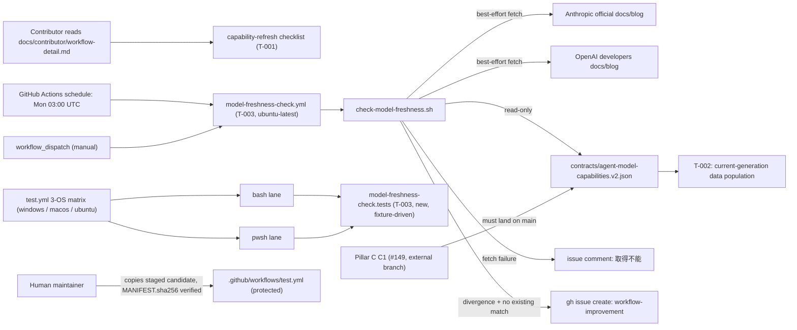

# Infrastructure Specification: epic-159-pillar-d

Contributor-process documentation plus one new, standalone weekly CI
workflow plus a registry data update. No cloud service, deployment target,
IaC resource, network route (beyond one new outbound best-effort HTTP(S)
fetch, External Integrations below), or data store is added or changed
beyond the single new GitHub Actions workflow and its script/suite. The
infrastructure-facing edits are: the new `.github/workflows/model-freshness-check.yml`
file itself, the suite-registration array in `tests/run-all.sh`/
`tests/run-all.ps1` (agent-editable), and the suite-registration steps in
`.github/workflows/test.yml` (staged via the epic-136 human-copy
procedure — the one protected-file touch in this feature, design.md
Protected-File Statement).

## Deployment Topology

## CI/CD Sequence

`.github/workflows/test.yml`'s existing 3-OS matrix (`windows-latest`,
`macos-latest`, `ubuntu-latest`, `test.yml:18`) and existing pwsh/bash step
pairing pattern are unchanged in SHAPE by this feature; one new suite pair
(`model-freshness-check.tests`) joins the arrays alongside the existing
suite steps already registered there (`test.yml:71-119`'s established
"Test loop `<x>` (bash)"/"(pwsh)" pairing convention). Because
`.github/workflows/test.yml` is itself an enforcement-chain protected file
(`plugins/sdd-quality-loop/scripts/generated/guard_invariants.py:4`,
design.md Protected-File Statement), this registration is staged under
`specs/epic-159-pillar-d/human-copy/.github/workflows/test.yml` with a
`MANIFEST.sha256` and applied only by a human, following
`epic-136-phase2-gates/tasks.md:16-25`'s established Human-Copy Procedure
verbatim. The application is a commit the human pushes onto the feature
PR branch BEFORE merge (requirements.md AC-011): until it lands, the PR's
own CI is red on the suite's live-file self-check (AC-009) — the designed
fail-closed state, with no staged-candidate fallback — and turns green in
the PR's own CI once the commit exists (design.md Deployment / CI Plan).

`.github/workflows/model-freshness-check.yml` (T-003) is NOT part of
`test.yml`'s matrix — it runs only on its own weekly `schedule:` trigger or
a manual `workflow_dispatch:` (see [Weekly Schedule](#weekly-schedule)
below), mirroring `release.yml`'s own release-only trigger scope
(epic-159-pillar-b's infra-spec.md precedent: "runs only when `release.yml`
itself is triggered... never on ordinary push/PR"). It runs on
`ubuntu-latest` only — there is no cross-OS requirement for a CI-only
automation job that never runs on a contributor's own workstation
(REQ-004; frontend-spec.md Technology Stack).

Determinism lane (#126 note, carried from epic-159-pillar-a2/pillar-b):
every suite and job in this feature is fully deterministic — no LLM
invocation, no network call beyond `actions/checkout` (pinned,
matching `release.yml:34`/`self-improvement.yml:90`'s existing pin) and
the ONE new outbound network dependency this feature introduces
(External Integrations, design.md). When #126 lands the deterministic/LLM
CI lane separation, `model-freshness-check.tests` joins the deterministic
lane unchanged; `model-freshness-check.yml`'s own job is unaffected (it
already runs in a schedule/dispatch-only, non-matrix context, same as
`self-improvement.yml` and `release.yml` today).

## Weekly Schedule

`model-freshness-check.yml` runs on `cron: "0 3 * * 1"` — every Monday at
03:00 UTC, three hours after `self-improvement.yml`'s own
`cron: "0 0 * * 1"` (`self-improvement.yml:34-36`) — a deliberate offset
to avoid the two scheduled, repository-auditing jobs contending for the
same GitHub-hosted runner pool window. A `workflow_dispatch: {}` trigger
is included for the manual-run Done condition (requirements.md AC-008,
"手動 dispatch で diff → 起票の一連が動作"). `concurrency: group:
model-freshness-check, cancel-in-progress: false` prevents overlapping
runs if a manual dispatch happens to coincide with the weekly schedule,
mirroring `self-improvement.yml:63-65`'s own concurrency-group pattern
(scoped to this feature's own group name, never colliding with
`self-improvement.yml`'s `group: self-improvement`).

## External Dependency Fail-Soft Handling

The ONE new outbound network dependency this feature introduces —
`check-model-freshness.sh`'s best-effort fetch of Anthropic's and OpenAI's
official documentation/blog sources — is explicitly fail-soft, not
fail-closed (design.md Constraint Compliance; the deliberate inverse of
every other epic-159 pillar's own no-bypass row). A fetch failure for
EITHER vendor:

1. never fails the `freshness-check` job (`main`'s failure branches
   `exit 0`, design.md API/Contract Plan);
2. posts or updates a comment on a dedicated tracking issue stating
   "取得不能" (fetch unavailable), distinct from a genuine
   divergence-report issue (design.md Design Decisions);
3. is retried only on the NEXT scheduled run (weekly cadence) or a manual
   `workflow_dispatch` — no in-run retry loop is added beyond whatever
   `curl`'s own default timeout/retry behavior provides, keeping the job's
   `timeout-minutes: 10` budget (API/Contract Plan) comfortably bounded.

This is the single most important infra-facing behavior this feature adds:
an external documentation-site outage, redesign, or rate-limit must never
turn into a red required-check anywhere in this repository's CI, because
no release surface or merge gate depends on this workflow's outcome
(Security Boundaries B2 — the job holds no write path to any release
surface).

## Runtime Dependencies

| Dependency | Used by | Absence behavior |
|---|---|---|
| bash | `check-model-freshness.sh`, `tests/model-freshness-check.tests.sh`, `run-all.sh`, `model-freshness-check.yml`'s own step | job/suite unavailable (GitHub-hosted `ubuntu-latest` runners ship bash by default; local `run-all.sh` requires it as already established repository-wide) |
| pwsh (PowerShell 7) | `tests/model-freshness-check.tests.ps1`, `run-all.ps1` | suite unavailable locally without pwsh (already an established repository-wide precondition for every `.ps1` suite; no new degradation this feature introduces, since `check-model-freshness.sh` itself has no `.ps1` twin to shell out to — REQ-004) |
| curl (or equivalent HTTP client) | `check-model-freshness.sh`'s `fetch_source_or_unavailable` | fetch failure branch (External Dependency Fail-Soft Handling above) — already a GitHub-hosted-runner default, no new installation step needed |
| gh (GitHub CLI) | `check-model-freshness.sh`'s `file_or_dedupe_issue`; `tests/model-freshness-check.tests.sh`/`.ps1`'s stubbed wrapper (never the real CLI in tests) | already a repository dependency (`self-improvement.yml`, `self-improvement-pr-guard.sh`'s own `gh pr`/`gh issue` usage); real invocation only inside the actual `freshness-check` job, never inside the test suite |
| git | `tests/model-freshness-check.tests.sh`/`.ps1`'s human-copy staging verification (AC-011) | already a repository dependency |

No new services, containers, package installations beyond what
GitHub-hosted `ubuntu-latest` runners already provide.

## Environments

| Environment | URL | Auth | Trigger | Classification | Promotion Rule |
|---|---|---|---|---|---|
| local | repository checkout | none / synthetic fixtures | `bash tests/run-all.sh` / `pwsh tests/run-all.ps1` | internal fixtures only | `model-freshness-check.tests` green |
| CI matrix (`test.yml`) | no network use by the new suite beyond checkout | scoped `GITHUB_TOKEN` (unchanged) | push / PR / merge_group | synthetic fixtures | all required checks green on 3 OSes, once the human-copied `test.yml` registration is live (applied as a pre-merge commit on the feature PR branch, AC-011) |
| freshness-check schedule/dispatch (`model-freshness-check.yml`) | best-effort outbound fetch to public vendor documentation; `gh` calls scoped to `issues: write` only | workflow's own `github.token` (`issues: write`, `contents: read` — AC-005) | `schedule: cron "0 3 * * 1"` / `workflow_dispatch` | public documentation (read) + repository issues (write) | job green is not a merge gate for anything — it has no `needs:` consumer anywhere in this repository |

## Runtime Budget

`tests/model-freshness-check.tests.sh`/`.ps1` requires no runtime-budget
assertion (design.md Test Strategy item 4): it is pure fixture-driven
function testing with a stubbed `gh` wrapper and no live network call, no
subprocess loop-driving, comparable in cost to epic-159-pillar-b's own
`release-loop-gate` suite (which carries the same exemption).
`model-freshness-check.yml`'s own job carries `timeout-minutes: 10`
(API/Contract Plan) — generous relative to a handful of `curl` calls and a
`gh issue` round-trip, and the External Dependency Fail-Soft Handling
section above ensures a slow/unreachable external source degrades to a
comment rather than a timeout-driven failure wherever `curl`'s own
per-request timeout is set below the job's overall budget.

## Infrastructure as Code, Scaling, SLOs, and Residency

N/A — no change: no deployed service. The only IaC-like artifacts are
`.github/workflows/model-freshness-check.yml` (new) and
`.github/workflows/test.yml` (existing, protected — one registration line
added via human-copy).

## Observability

| Logs | Traces | Metrics | Alert | Owner | Runbook |
|---|---|---|---|---|---|
| `check-model-freshness.sh`'s stdout/stderr per run (fetch attempt outcomes, divergence summary or "no divergence" — the no-diff branch performs zero `gh` invocations, AC-020; issue-create/comment/dedup decision); GitHub Actions job status for `freshness-check`; the filed issue or "取得不能" comment itself is the primary durable observability artifact (not a log file) | N/A | pass/fail per suite per OS per lane (`test.yml`, unchanged mechanism); `freshness-check` job pass/fail per weekly run or manual dispatch (`model-freshness-check.yml`) — note per External Dependency Fail-Soft Handling, "pass" here means "ran to completion," not "no divergence found" | none — this job intentionally has no `needs:` consumer and blocks no merge; its only "alert" is the filed issue/comment itself, triaged like any other `workflow-improvement`-labeled issue | maintainers | re-run `bash .github/scripts/check-model-freshness.sh` locally (with fixture env vars unset, to exercise the real fetch) before re-dispatching the workflow, if a filed issue's diagnosis needs reproduction |

## Rollback

Per-item reviewed revert (one issue = one task = one set of commits).
Reverting T-003's commits removes `model-freshness-check.yml`,
`check-model-freshness.sh`, and the test suite; the
`.github/workflows/test.yml` registration line additionally requires a
second human-copy application (staging a candidate with that line removed,
then a human re-applying it) — the same human-in-the-loop mechanism that
added it, never a direct agent revert of a live protected file. Reverting
T-001's commits restores today's WFI lifecycle section and Provider Tier
Mapping table content exactly (docs-only, nothing protected). Reverting
T-002's commits restores the v2 registry's pre-T-002 data (still C1's own
"may start with v1-equivalent content" bootstrap state, per issue #149) —
v1 was never touched, so no consumer-facing rollback risk exists there.

## Open Questions

None. Owner: maintainers; non-blocking.
