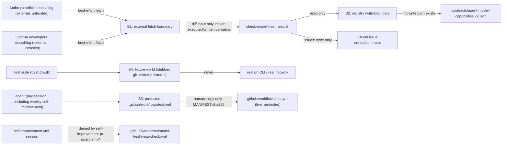

# Security Specification: epic-159-pillar-d

Impact assessment is required for this feature class: T-003 adds a new
GitHub Actions workflow that both makes an outbound network call to
external, untrusted vendor documentation AND writes GitHub issues/comments
with a scoped `issues: write` token. A harness that trusts fetched content
too far, silently swallows a genuine registry divergence, or is granted
more write scope than "file/comment on an issue" would widen this
feature's blast radius well beyond its stated purpose. No credential
value, secret, or exploit payload belongs in fixtures, source, logs, or
persisted evidence. T-002's registry-data edit and T-001's documentation
edit carry materially lower risk (no network call, no write scope beyond
the repository's own files) and are covered here for completeness rather
than because either introduces a new trust boundary of its own.

## Trust Boundaries

| Boundary | Source | Destination | Assets | Validation | AuthN/AuthZ | REQ | AC |
|---|---|---|---|---|---|---|---|
| B1 | Anthropic/OpenAI official docs (external, untrusted) | `check-model-freshness.sh` | fetched HTML/text content | treated as diff input only, never executed, never written verbatim into any repository file; fetch failure is handled as a first-class outcome (fail-soft), not an exception that could propagate | none (public content, unauthenticated GET) | REQ-002 | AC-006, AC-007 |
| B2 | `freshness-check` job | `contracts/` and every other release surface | write access | NO write path exists — `check-model-freshness.sh` has no function that opens a `contracts/` file for writing (design.md API/Contract Plan by construction); the workflow requests no `contents: write` scope (AC-005) | GitHub Actions job permission scoping | REQ-002 | AC-005 |
| B3 | any agent session (including a normal PR session AND the weekly `self-improvement.yml` session) | `.github/workflows/test.yml` (live, protected) | enforcement-chain integrity | staged candidate under `specs/epic-159-pillar-d/human-copy/` + `MANIFEST.sha256`; only a human applies it (epic-136 Human-Copy Procedure) | `_PROTECTED_GATE_SUFFIXES` (`guard_invariants.py:4`) + human review | REQ-002 | AC-011 |
| B4 | test suites | fixture filesystem / stubbed `gh` | synthetic fixture source files, stubbed `gh`-wrapper invocation logs | mktemp-scoped, `pwd -P`-normalized; no live network call, no live `gh` invocation anywhere in the suite | filesystem/PATH isolation | REQ-002 | AC-009 |

## STRIDE Analysis

| Boundary | Threat | STRIDE | Abuse Case | Mitigation | Verification | REQ | AC |
|---|---|---|---|---|---|---|---|
| B1 | fetched vendor content is trusted too far and influences repository state beyond a diff computation | Tampering | a crafted or compromised documentation page causes the script to write attacker-controlled content into a repository file or execute fetched text as a command | `compute_divergence` is a pure function over fetched text and the registry's own model-name list; no `eval`/`source`/subshell execution of fetched content anywhere in `check-model-freshness.sh` (design.md API/Contract Plan); only a bounded diff description reaches the issue body, never raw fetched HTML | code review + TEST-007 (divergence content is the recorded diff description, not raw fetched text) | REQ-002 | AC-007 |
| B1 | an external source outage or slow response is mishandled and turns into a CI failure or a hang | Denial of Service | a vendor documentation redesign or outage makes every weekly run fail, generating alert fatigue or a false "everything is fine, the job just failed" signal | `fetch_source_or_unavailable` returns a failure code, never raises; `main`'s failure branches `exit 0` after a "取得不能" comment; job carries `timeout-minutes: 10` (infra-spec.md Runtime Budget) | TEST-006 | REQ-002 | AC-006 |
| B2 | the freshness-check job is granted write access to `contracts/` or another release surface it does not need "for convenience" in a future edit | Elevation of Privilege | a future edit adds `contents: write` to `model-freshness-check.yml` "so it can also fix the registry automatically," widening the blast radius of a future compromise of the fetch step | `permissions:` declares only `contents: read`/`issues: write` (AC-005); design constraint that no function in the script writes `contracts/` (Non-goals, Security Boundaries B2); reviewed at PR time as a Constraint Compliance item | code review + TEST-005 (permissions text-marker check) | REQ-002 | AC-005 |
| B2 | a genuine divergence is silently swallowed (the mirror-image threat of a fetch failure being silently treated as a failure) | Repudiation | a bug in `compute_divergence` or `file_or_dedupe_issue` causes a real drift to produce no issue and no signal at all | TEST-007's positive assertion (an issue-create call IS recorded for a genuine, previously-unfiled divergence) is the RED-demonstrable proof this cannot silently pass | TEST-007 | REQ-002 | AC-007 |
| B3 | the weekly `self-improvement.yml` session self-modifies `model-freshness-check.yml` or `test.yml`, bypassing normal PR review | Tampering / Elevation of Privilege | the automated session, in a future run, decides to "improve" its own freshness-check sibling workflow directly, without human review | `self-improvement-pr-guard.sh:34`'s `.github/workflows/*` case pattern denies any session-created PR touching either file (INV-004); TEST-010 asserts this pattern still matches `model-freshness-check.yml`'s literal path | TEST-010 | REQ-002 | AC-010 |
| B3 | `.github/workflows/test.yml`'s registration line is written directly by an agent, bypassing the human-copy procedure | Elevation of Privilege | an implementer, unaware of the protected-file status this design discovered (design.md Protected-File Statement), edits the live file directly | staged-candidate + `MANIFEST.sha256` workflow (AC-011); `sdd-hook-guard.py`'s own PreToolUse enforcement independently denies the direct write attempt regardless of implementer awareness | TEST-011 + hook-guard enforcement (defense in depth) | REQ-002 | AC-011 |

## Authorization

| Actor / Role | Resource | Action | Decision Point | Default | Denial Evidence | REQ | AC |
|---|---|---|---|---|---|---|---|
| `freshness-check` job | Anthropic/OpenAI public documentation | fetch (read, unauthenticated) | network | allow | fetch failure → fail-soft comment, not a denial | REQ-002 | AC-006 |
| `freshness-check` job | `contracts/agent-model-capabilities.v2.json` | read | filesystem | allow | n/a | REQ-002 | AC-007 |
| `freshness-check` job | `contracts/agent-model-capabilities.v2.json` | write | design constraint (B2) | deny (never attempted — no function performs this write) | no write call exists anywhere in the script | REQ-002 | AC-005 |
| `freshness-check` job | GitHub issues | create / comment | `issues: write` scope | allow, only via `file_or_dedupe_issue`'s dedup-checked path | dedup check prevents duplicate creation; no other write path | REQ-002 | AC-007 |
| weekly `self-improvement.yml` session | `.github/workflows/model-freshness-check.yml`, `.github/workflows/test.yml` | write (self-authored PR) | `self-improvement-pr-guard.sh` denylist | deny | run fails with enforcement-chain violation listing the path | REQ-002 | AC-010 |
| any agent session | `.github/workflows/test.yml` (live) | write | `_PROTECTED_GATE_SUFFIXES` (hook guard) | deny (human-copy staging required) | `sdd-hook-guard.py` PreToolUse denial; staged-candidate + `MANIFEST.sha256` is the only path forward | REQ-002 | AC-011 |
| task implementer | `contracts/agent-model-capabilities.v2.json` data fields | write (T-002, once C1 has landed) | design constraint (schema owned by C1, data owned by T-002) | allow (data only, not schema) | n/a | REQ-003 | AC-012 |

## Data Classification and Protection

| Entity | Classification | At Rest | In Transit | Retention | Deletion | Access Log | REQ | AC |
|---|---|---|---|---|---|---|---|---|
| fetched vendor documentation content (`check-model-freshness.sh`) | public, external, untrusted input | not persisted verbatim — only a bounded diff description is written into an issue body | HTTPS (best-effort; failure is a first-class outcome) | none — re-fetched each run | n/a (never stored) | job run log | REQ-002 | AC-006, AC-007 |
| stubbed `gh`-wrapper invocation log (`tests/model-freshness-check.tests.sh`/`.ps1`) | synthetic internal | mktemp directory | local only | test lifetime | `trap ... EXIT` (or PowerShell `finally` equivalent) | test output only | REQ-002 | AC-009 |
| staged `.github/workflows/test.yml` candidate + `MANIFEST.sha256` (`specs/epic-159-pillar-d/human-copy/`) | internal, committed staging artifact | repository (staging path, not the live protected target) | local only | until a human applies and the staging directory is cleaned up per the epic-136 convention | reviewed revert | git history | REQ-002 | AC-011 |
| `contracts/agent-model-capabilities.v2.json` data (T-002) | internal, committed configuration data | repository | local only | repo lifetime | reviewed revert | git history | REQ-003 | AC-012, AC-013 |

No secret, token, or credential appears anywhere in fixtures, source, or
evidence. `check-model-freshness.sh`'s only credential use is the
workflow's own scoped `github.token` (`issues: write`, `contents: read`),
identical in kind to `self-improvement.yml`'s and `release.yml`'s own
established pattern of passing `github.token` rather than a broader PAT
for CI-internal operations.

## OWASP Mapping

| OWASP Risk | Exposure | Control | Verification | Owner |
|---|---|---|---|---|
| Injection / Untrusted Input Handling | fetched vendor documentation content influencing repository state beyond a diff computation | `compute_divergence` is pure, no `eval`/execution of fetched content; only a bounded diff description reaches the issue body | TEST-007 (code review) | maintainers |
| Security Misconfiguration | `model-freshness-check.yml` requesting more permission scope than `contents: read`/`issues: write` | AC-005's text-marker assertion (TEST-005) | TEST-005 | maintainers |
| Elevation of Privilege | the weekly self-improvement session self-modifying `model-freshness-check.yml` or `test.yml` | `self-improvement-pr-guard.sh:34`'s `.github/workflows/*` denylist (INV-004) | TEST-010 | maintainers |
| Security Misconfiguration | `.github/workflows/test.yml`'s registration line written directly, bypassing human review | epic-136 human-copy procedure + `sdd-hook-guard.py` PreToolUse enforcement | TEST-011 + hook-guard denial | maintainers |
| Denial of Service | an external documentation-site outage turning into a CI failure or alert-fatigue signal | fail-soft `exit 0` + "取得不能" comment path (External Dependency Fail-Soft Handling, infra-spec.md) | TEST-006 | maintainers |
| Repudiation | a genuine registry divergence silently producing no signal | TEST-007's positive assertion that a divergence produces an issue-create call | TEST-007 | maintainers |

## Secrets Management

No secret is added, read, or logged by this feature. Neither
`check-model-freshness.sh` nor its locking test suite reads a `.env` file
or any `SDD_SUDO_KEY`/`SDD_EVIDENCE_KEY`-class credential. The
`freshness-check` job in `model-freshness-check.yml` requests only
`contents: read` and `issues: write` from the workflow's own scoped
`github.token` — no PAT, no `id-token: write`, no OIDC exchange (unlike
`self-improvement.yml`'s own more elaborate token-fallback machinery,
`self-improvement.yml:22-31,85-125`, which this feature deliberately does
not inherit — design.md Design Decisions). Nothing in this feature
computes or verifies a cryptographic hash chain beyond the human-copy
procedure's own `MANIFEST.sha256` (a plain content-integrity check for
human verification, not a signature or attestation mechanism, consistent
with ADR-0008's no-signature-crypto boundary — same characterization
epic-159-pillar-b's security-spec.md applied to its own `git status
--porcelain` check).

## Security Tests

| Test | Boundary | Attack / Control | Expected Result | Evidence | AC |
|---|---|---|---|---|---|
| TEST-006 | B1 | both vendor fetches stubbed to fail | `main` exits 0; a "取得不能" comment call is recorded; no CI failure | `tests/model-freshness-check.tests.sh` | AC-006 |
| TEST-007 | B1/B2 | fetch succeeds with a fixture containing a model token absent from a fixture-scoped v2 registry copy | an issue-create call labeled `workflow-improvement` is recorded; a second run with a stubbed already-open matching issue records zero additional creates | `tests/model-freshness-check.tests.sh` | AC-007 |
| TEST-005 | B2 | text-marker scan for `permissions:` block content in `model-freshness-check.yml` | only `contents: read` and `issues: write` present; no `pull-requests: write`/`contents: write` | `tests/model-freshness-check.tests.sh` | AC-005 |
| TEST-010 | B3 | grep the real `self-improvement-pr-guard.sh` source for its `.github/workflows/*` case pattern | the pattern still matches `.github/workflows/model-freshness-check.yml` as a literal path | `tests/model-freshness-check.tests.sh` | AC-010 |
| TEST-011 | B3 | staged human-copy candidate + `MANIFEST.sha256` vs. the live (unmodified) `.github/workflows/test.yml` | staged candidate's hash matches `MANIFEST.sha256`; live file's pre-staging content is confirmed unmodified by the agent | `tests/model-freshness-check.tests.sh` / review-time diff | AC-011 |

## Open Questions

None security-blocking. All investigation.md security-relevant open
questions are resolved by construction in design.md and verified by
TEST-005, TEST-006, TEST-007, TEST-010, and TEST-011; see requirements.md
Open Questions for the full resolution list.
