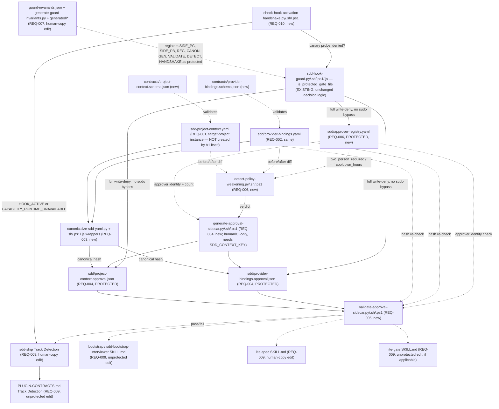

# Design: epic-189-a1-project-context

Impl-Review-Status: Pending
Feature Type: schema + security-infrastructure (canonicalization, HMAC
approval sidecar, protected-file registration, hook-guard extension,
track-selection contract migration) — no UI, no new plugin, no Provider
integration

## Technical Summary

Eleven requirements land as one dependency-ordered chain, root-first:
REQ-001/REQ-002 (the two YAML schemas) are consumed by REQ-003 (the
canonicalizer, which needs something byte-stable to hash) and by REQ-009
(track-selection reads `workflow.*`); REQ-003 is consumed by REQ-004
(the sidecar's HMAC preimage is canonical-JSON bytes) and by REQ-006 (the
weakening detector diffs canonicalized before/after documents); REQ-004 is
consumed by REQ-005 (the validator recomputes REQ-004's own construction);
REQ-005 and REQ-006 are consumed by REQ-009 (a Project Context that fails
validation, or whose weakening approvals are incomplete, is treated as
absent); REQ-007 (protected registration) is a precondition every other new
script and the two new sidecar/registry files structurally depend on for
their integrity claim to hold; REQ-008 (hook-guard extension) is not new
code — it is the existing `_is_protected_gate_file` deny path, activated by
REQ-007's registration, with its own dedicated test coverage; REQ-010 (hook
handshake) is consumed by REQ-009's migrated call site; REQ-011 (3-env
tests) closes every REQ above.

The guiding principle, carried from ADR-0019's own Context section: an
unsigned hash is a *binding*, never an *authenticity* claim. Every new
mechanism in this design either produces a binding (REQ-003's canonical
hash), an authenticity claim (REQ-004's HMAC, signed by a key no agent ever
holds), or a check that both hold before anything is trusted (REQ-005). No
new mechanism in this design ever asserts authenticity from a hash alone.

## Architecture



## Components

| Component | Responsibility | Technology | New/Existing | Protected? |
|---|---|---|---|---|
| `contracts/project-context.schema.json` | schema for `sdd/project-context.yaml` (`sdd-project-context/v1`) | JSON Schema | new | no |
| `contracts/provider-bindings.schema.json` | schema for `sdd/provider-bindings.yaml` (`sdd-provider-bindings/v1`), skeleton only | JSON Schema | new | no |
| `contracts/approval-sidecar.schema.json` | schema for both `*.approval.json` sidecars | JSON Schema | new | no |
| `contracts/approver-registry.schema.json` | schema for `sdd/approver-registry.yaml` | JSON Schema | new | no |
| `canonicalize-sdd-yaml.py` | YAML 1.2 core-schema parse, anchor/tag/dup-key reject, NFC, RFC 8785 JCS, sha256 | Python | new | **YES** (REQ-007) |
| `canonicalize-sdd-yaml.sh` / `.ps1` / `.js` | thin dispatchers, `sdd-hook-guard.sh` shape (INV-005) | POSIX sh / PowerShell / Node | new | **YES** (REQ-007) |
| `generate-approval-sidecar.py` / `.sh` / `.ps1` | human/CI tool: compute hash, accept approver(s), HMAC-sign | Python + sh/ps1 wrappers | new | **YES** (REQ-007) |
| `validate-approval-sidecar.py` / `.sh` / `.ps1` | hash match + HMAC verify + approver-identity + `effective_at` gate | Python + sh/ps1 wrappers | new | **YES** (REQ-007) |
| `detect-policy-weakening.py` / `.sh` / `.ps1` | before/after diff classification + two-person/cooldown verdict | Python + sh/ps1 wrappers | new | **YES** (REQ-007) |
| `check-hook-activation-handshake.py` / `.sh` / `.ps1` | canary probe; `HOOK_ACTIVE` / `CAPABILITY_RUNTIME_UNAVAILABLE` | Python + sh/ps1 wrappers | new | **YES** (REQ-007) |
| `sdd/project-context.yaml`, `provider-bindings.yaml` | target-project content instances (not created by A1) | YAML | n/a (consumer-owned) | no |
| `sdd/project-context.approval.json`, `provider-bindings.approval.json` | approval sidecars | JSON | new (schema only; instances are consumer-owned) | **YES** (REQ-007/008) |
| `sdd/approver-registry.yaml` | registered approver identities | YAML | new | **YES** (REQ-007) |
| `plugins/sdd-quality-loop/references/guard-invariants.json` | protected-file inventory | JSON | existing, edited (REQ-007) | **YES** |
| `plugins/sdd-quality-loop/scripts/generate-guard-invariants.py` | generator + exact-match validator | Python | existing, edited (REQ-007) | **YES** |
| `plugins/sdd-quality-loop/scripts/generated/guard_invariants.{py,js,ps1,sh}` | generated provenance modules | Python/JS/PS1/sh | existing, regenerated (REQ-007) | **YES** |
| `plugins/sdd-quality-loop/scripts/sdd-hook-guard.{py,sh,ps1,js}` | `_is_protected_gate_file` deny path (read-only reference; no decision-logic edit) | Python/sh/PS1/JS | existing, UNCHANGED (REQ-008) | **YES** |
| `PLUGIN-CONTRACTS.md` | Track Detection section revision | Markdown | existing, edited (REQ-009) | no |
| `plugins/sdd-ship/skills/ship/SKILL.md` | Step 2 Track Detection revision | Markdown (skill) | existing, human-applied (REQ-009) | **YES** |
| `plugins/sdd-bootstrap/skills/bootstrap/SKILL.md` | track-selection revision | Markdown (skill) | existing, edited (REQ-009) | no |
| `plugins/sdd-bootstrap/skills/sdd-bootstrap-interviewer/SKILL.md` | `spec_profile` gating revision | Markdown (skill) | existing, edited (REQ-009) | no |
| `plugins/sdd-lite/skills/lite-spec/SKILL.md` | track-selection revision | Markdown (skill) | existing, human-applied (REQ-009) | **YES** |
| `plugins/sdd-lite/skills/lite-gate/SKILL.md` | track-selection revision, if applicable | Markdown (skill) | existing, edited (REQ-009) | no (verified) |
| `.github/workflows/test.yml` | new-suite CI registration | YAML | existing, human-applied (REQ-011) | **YES** |
| `tests/run-all.sh` / `.ps1` | new-suite registration | Bash / PowerShell | existing, edited (REQ-011) | no |

## Protected-File Statement

Verified directly against
`plugins/sdd-quality-loop/scripts/generated/guard_invariants.py:4` (the
module `sdd-hook-guard.py:891`'s `_load_guard_invariants()` loads) at
design time. **This epic's tasks touch nine already-protected files**:
`plugins/sdd-quality-loop/references/guard-invariants.json`,
`plugins/sdd-quality-loop/scripts/generate-guard-invariants.py`, the four
`generated/guard_invariants.{py,js,ps1,sh}` files,
`plugins/sdd-ship/skills/ship/SKILL.md`,
`plugins/sdd-lite/skills/lite-spec/SKILL.md`, and
`.github/workflows/test.yml` — none is ever opened for write directly by an
agent; each is staged under
`specs/epic-189-a1-project-context/human-copy/<repository-relative-path>`
with a `MANIFEST.sha256` entry, for a human to `cp` and verify (INV-011;
epic-159-pillar-c precedent, not `apply-protected-files.ps1`, which is
pinned to its own frozen bootstrap inventory and out of this epic's edit
scope).

**This epic's tasks additionally CREATE five new protected files** — the two
approval sidecar schema instances' runtime paths
(`sdd/project-context.approval.json`, `sdd/provider-bindings.approval.json`),
`sdd/approver-registry.yaml`, and the eleven new script files
(`canonicalize-sdd-yaml.{py,sh,ps1,js}`,
`generate-approval-sidecar.{py,sh,ps1}`,
`validate-approval-sidecar.{py,sh,ps1}`,
`detect-policy-weakening.{py,sh,ps1}`,
`check-hook-activation-handshake.{py,sh,ps1}`). These are NOT protected at
authoring time (they do not exist yet); they become protected only once
REQ-007's human-copy-applied `guard-invariants.json`/
`generate-guard-invariants.py` update lands. The implementation sequencing
this implies (recorded here for the Phase 2 task decomposition that will
consume it): author the scripts UNPROTECTED first
(agent-editable, fully testable), THEN stage the guard-invariants
registration that protects them going forward — never the reverse, since
staging protection for a file that does not exist yet would fail
`generate-guard-invariants.py`'s own path-existence-agnostic but
content-exact-match validation trivially (the path string is accepted
regardless of whether the file exists on disk; `_validate_repo_path`,
`generate-guard-invariants.py:121-127`, checks path SHAPE only) but would
leave no reviewable, tested script for a human to actually apply.

**Exact-match constraint (INV-006, critical for this REQ)**:
`generate-guard-invariants.py:145-147`'s `load_and_validate` requires the
live `protected_gate_suffixes` array to equal
`BASELINE_SUFFIXES + (PHASE2_TARGETS-not-in-BASELINE)`, a tuple HARDCODED in
the generator's own Python source (lines 37-88) — not merely schema-checked.
Editing `guard-invariants.json`'s array without a matching edit to
`generate-guard-invariants.py`'s own constants makes `--check` fail (CI step
`.github/workflows/test.yml:27-35`), for every subsequent unrelated change
in this repository, not just this epic's own. This design therefore
introduces a THIRD constant tuple in the generator,
`EPIC_A1_TARGETS` (16 entries — the five new data/registry files plus the
eleven new script files), added to `expected_protected`'s computation
alongside `BASELINE_SUFFIXES`/`PHASE2_TARGETS`, and a matching
`epic_a1_targets` array added to `guard-invariants.json`'s own JSON (a new
top-level key; `REQUIRED_TOP_LEVEL`, `generate-guard-invariants.py:16-23`,
is extended to include it) — validated the same way
`phase2_human_copy_targets` already is (exact-tuple match, ordered,
no duplicates). `PHASE2_TARGETS` itself is left untouched (it is a frozen,
historical, epic-136-scoped constant; this epic does not conflate its own
additions with that one). REQ-007's task stages ALL SIX touched files
(`guard-invariants.json`, `generate-guard-invariants.py`, the four generated
outputs) together in one human-copy batch, with a staged-tree
`generate-guard-invariants.py --check` proof recorded before any live
application (AC-021).

## ADR Change Log

No new ADR. Every design decision this epic makes is already recorded in
`docs/adr/0016-workflow-axes-separation.md`, `0018-provider-binding-separation.md`,
`0019-approval-sidecar-protection.md`, `0020-conditional-predicate-dsl.md`,
and `0023-track-selection-contract-migration.md` — this design implements
those five ADRs' decisions, it does not make a new one requiring its own
ADR. The one genuinely new artifact this design introduces without a
direct ADR citation — `sdd/approver-registry.yaml` (REQ-006/OQ-001) — is a
necessary supporting file for ADR-0019 item 6's already-Accepted
"approver registry" concept, not an independent architectural decision; if
impl-review disagrees, promoting it to its own ADR is a low-cost follow-up
(Design Decisions, below, records this as a resolved-but-revisitable
choice, not a gap).

## Data Plan

Data Entities:

- `sdd/project-context.yaml` (REQ-001; consumer-owned instance, not created
  by A1): `schema` (const `sdd-project-context/v1`), `workflow`
  (`spec_profile`, `artifact_layout`, `capability_enforcement`),
  `components[]` (`id`, `artifact_kinds[]`, `runtime_classes[]`,
  `platform_targets[]` (`{os, architecture}`), `characteristics`
  (`pii`, `ui`, `auto_update`, `local_persistence`, `long_running`,
  `replayable`, `human_in_the_loop` — all boolean), `distribution_channels[]`
  (string), `data_classification[]` (string), `provider_binding_ids[]`
  (string), `paths` (`include[]`, `exclude[]`, glob strings)),
  `shared_paths[]` (`pattern` + either `components[]` or
  `classification: cross-cutting`).
- `sdd/provider-bindings.yaml` (REQ-002): `schema` (const
  `sdd-provider-bindings/v1`), `bindings[]` (`id`, `provider`, `product`,
  `purpose` — all required string; `state_authority`, `credentials` —
  optional, unconstrained object passthrough).
- `sdd/project-context.approval.json` / `provider-bindings.approval.json`
  (REQ-004): `schema` (const, one of the two approval schema ids),
  `context_sha256` (`sha256:<64-hex>`), `primary_approval`
  (`status: "Approved"`, `approver`, `approved_at`), `second_approval`
  (`null` or same shape), `effective_at` (`null` or ISO 8601),
  `hmac` (64 lowercase hex chars).
- `sdd/approver-registry.yaml` (REQ-006/OQ-001, new): `schema` (const
  `sdd-approver-registry/v1`), `approvers[]` (`id` unique string, `name`
  string, `registered_at` ISO 8601) — the count of DISTINCT `id` entries is
  what REQ-006's detector compares against the two-person threshold.
- `specs/epic-189-a1-project-context/human-copy/` (new, committed as a
  review artifact for a future implementation session, not deleted by any
  test): staged corrected copies of the nine already-protected files this
  epic's tasks touch, plus `MANIFEST.sha256`.

Existing Data Affected: `plugins/sdd-quality-loop/references/guard-invariants.json`,
`generate-guard-invariants.py`, and the four `generated/guard_invariants.*`
files are READ (for re-verification, Assumptions below) throughout
implementation and WRITTEN only via the human-copy procedure, exactly once,
by REQ-007's task. `PLUGIN-CONTRACTS.md` is edited directly (unprotected).
No existing production `sdd/*.yaml` instance exists anywhere in this
repository today (verified: `find . -path ./node_modules -prune -o -path
'*/sdd/project-context.yaml' -print` returns no match) — this design
creates no such instance either (Non-goals; Epic A9 scope).

Migration Strategy: none. Every artifact this epic defines is wholly new;
no existing schema, script, or content file is migrated in place.

## API / Contract Plan

### `contracts/project-context.schema.json` (REQ-001)

```json
{
  "$schema": "http://json-schema.org/draft-07/schema#",
  "title": "SDD Forge project-context",
  "type": "object",
  "additionalProperties": false,
  "required": ["schema", "workflow"],
  "properties": {
    "schema": { "const": "sdd-project-context/v1" },
    "workflow": {
      "type": "object",
      "additionalProperties": false,
      "required": ["spec_profile", "artifact_layout", "capability_enforcement"],
      "properties": {
        "spec_profile": { "enum": ["full", "lite"] },
        "artifact_layout": {
          "enum": ["lite-three-file", "legacy-seven-layer", "facet-hybrid", "facet-native"]
        },
        "capability_enforcement": { "enum": ["advisory", "required"] }
      }
    },
    "components": {
      "type": "array",
      "items": {
        "type": "object",
        "additionalProperties": false,
        "required": ["id"],
        "properties": {
          "id": { "type": "string", "minLength": 1 },
          "artifact_kinds": { "type": "array", "items": { "type": "string" } },
          "runtime_classes": { "type": "array", "items": { "type": "string" } },
          "platform_targets": {
            "type": "array",
            "items": {
              "type": "object",
              "additionalProperties": false,
              "required": ["os", "architecture"],
              "properties": { "os": { "type": "string" }, "architecture": { "type": "string" } }
            }
          },
          "characteristics": {
            "type": "object",
            "additionalProperties": false,
            "properties": {
              "pii": { "type": "boolean" },
              "ui": { "type": "boolean" },
              "auto_update": { "type": "boolean" },
              "local_persistence": { "type": "boolean" },
              "long_running": { "type": "boolean" },
              "replayable": { "type": "boolean" },
              "human_in_the_loop": { "type": "boolean" }
            }
          },
          "distribution_channels": { "type": "array", "items": { "type": "string" } },
          "data_classification": { "type": "array", "items": { "type": "string" } },
          "provider_binding_ids": { "type": "array", "items": { "type": "string" } },
          "paths": {
            "type": "object",
            "additionalProperties": false,
            "properties": {
              "include": { "type": "array", "items": { "type": "string" } },
              "exclude": { "type": "array", "items": { "type": "string" } }
            }
          }
        }
      }
    },
    "shared_paths": {
      "type": "array",
      "items": {
        "type": "object",
        "required": ["pattern"],
        "oneOf": [
          { "required": ["components"], "properties": { "components": { "type": "array", "items": { "type": "string" } } } },
          { "required": ["classification"], "properties": { "classification": { "const": "cross-cutting" } } }
        ]
      }
    }
  }
}
```

### `contracts/provider-bindings.schema.json` (REQ-002)

```json
{
  "$schema": "http://json-schema.org/draft-07/schema#",
  "title": "SDD Forge provider-bindings (skeleton)",
  "type": "object",
  "additionalProperties": false,
  "required": ["schema", "bindings"],
  "properties": {
    "schema": { "const": "sdd-provider-bindings/v1" },
    "bindings": {
      "type": "array",
      "items": {
        "type": "object",
        "additionalProperties": false,
        "required": ["id", "provider", "product", "purpose"],
        "properties": {
          "id": { "type": "string", "minLength": 1 },
          "provider": { "type": "string", "minLength": 1 },
          "product": { "type": "string", "minLength": 1 },
          "purpose": { "type": "string", "minLength": 1 },
          "state_authority": { "type": "object" },
          "credentials": { "type": "object" }
        }
      }
    }
  }
}
```

### `contracts/approval-sidecar.schema.json` (REQ-004)

```json
{
  "$schema": "http://json-schema.org/draft-07/schema#",
  "title": "SDD Forge approval sidecar",
  "type": "object",
  "additionalProperties": false,
  "required": ["schema", "context_sha256", "primary_approval", "second_approval", "effective_at", "hmac"],
  "properties": {
    "schema": { "enum": ["sdd-project-context-approval/v1", "sdd-provider-bindings-approval/v1"] },
    "context_sha256": { "type": "string", "pattern": "^sha256:[0-9a-f]{64}$" },
    "primary_approval": { "$ref": "#/definitions/approval" },
    "second_approval": { "oneOf": [{ "type": "null" }, { "$ref": "#/definitions/approval" }] },
    "effective_at": { "oneOf": [{ "type": "null" }, { "type": "string", "format": "date-time" }] },
    "hmac": { "type": "string", "pattern": "^[0-9a-f]{64}$" }
  },
  "definitions": {
    "approval": {
      "type": "object",
      "additionalProperties": false,
      "required": ["status", "approver", "approved_at"],
      "properties": {
        "status": { "const": "Approved" },
        "approver": { "type": "string", "minLength": 1 },
        "approved_at": { "type": "string", "format": "date-time" }
      }
    }
  }
}
```

### Canonicalization procedure (REQ-003)

1. Read file bytes; decode as UTF-8 (reject on decode error).
2. Parse as YAML restricted to the 1.2 **core schema** resolver (no 1.1
   `on`/`off`/`yes`/`no` → boolean coercion). Reject (non-zero exit, named
   diagnostic) if the document contains an anchor, an alias, any tag other
   than the core-schema implicit tags, or a mapping with a duplicate key at
   any nesting level.
3. Walk the parsed structure; normalize every string scalar to Unicode NFC
   (`unicodedata.normalize("NFC", s)`).
4. Serialize to canonical JSON per RFC 8785 (JCS): object keys sorted by
   UTF-16 code unit; numbers in the shortest round-tripping form with no
   exponent for integers; strings escaped per JCS's minimal-escaping rule;
   no insignificant whitespace.
5. Emit: the canonical UTF-8 byte sequence (stdout, or `--out <path>`), and
   `sha256:<hex>` of that byte sequence (`--hash-only` mode).

`canonicalize-sdd-yaml.sh` / `.ps1` / `.js` each locate a `python3` (or
`python`, or `pwsh`/`powershell` for `.ps1`'s fallback) on `PATH` and exec
`canonicalize-sdd-yaml.py "$@"` with stdin/stdout passed through unchanged;
none re-parses YAML independently — mirrors `sdd-hook-guard.sh:36-50`
exactly (INV-005), including its `deny_unavailable`-equivalent fail-closed
exit when no runtime is found.

### HMAC preimage and signing (REQ-004)

Preimage = `canonicalize-sdd-yaml` applied to the approval JSON object with
the `hmac` key removed (JSON, not YAML, input mode — REQ-003's canonicalizer
accepts either). `hmac = HMAC-SHA256(key, preimage_bytes).hex()`, key
resolved via: env `SDD_CONTEXT_KEY` → env `SDD_CONTEXT_KEY_FILE` (BOM/
whitespace-stripped) → `<HOME>/.sdd/context-key` (same stripping) → none
(fail-closed — `generate-approval-sidecar` refuses to write an unsigned
sidecar). `validate-approval-sidecar` recomputes the identical preimage and
compares with `hmac.compare_digest` (constant-time), matching
`sdd-hook-guard.py:478-481`'s pattern exactly.

### Policy-weakening categories (REQ-006)

| Category | Detected as | Foundation status |
|---|---|---|
| `capability_enforcement` weakened | `required` → `advisory` | implemented |
| Capability removed from a component | `artifact_kinds`/`runtime_classes` set shrinks | implemented (proxy; no Capability vocabulary exists yet) |
| Component path narrowed | `paths.include` set shrinks | implemented |
| Component path widened via exclude | `paths.exclude` set grows | implemented |
| Public distribution de-scoped | `distribution_channels` entry removed | implemented |
| Criticality lowered | — | documented N/A (no such field exists in Foundation schema) |
| Provider allowlist widened | — | documented N/A (no allowlist field in REQ-002's skeleton) |
| Production write-path changed | — | documented N/A (no such field exists) |
| Required Gate removed | — | documented N/A (Gate declarations are Epic A2 scope) |
| `spec_profile` moved `full`→`lite` | direct field comparison | implemented |

A verdict of `policy_weakening: true` on ANY one category is sufficient
(Edge Cases, requirements.md); N/A categories are explicitly reported as
such in the detector's diagnostic output, never silently omitted.

## Test Strategy

1. Dual/multi-runtime hash-equality (REQ-003, AC-009): the SAME fixture file
   canonicalized by `.py` directly, by `.sh` (dispatch to `.py`), by `.ps1`
   (dispatch to `.py` or `pwsh` fallback), and by `.js` (where Node is
   available) must all produce an identical SHA-256 — proven as a
   dispatch-verification test (assert the wrapper's underlying call target),
   not merely a hash-equality coincidence.
2. Anchor/alias/tag/duplicate-key rejection (REQ-003, AC-005): one fixture
   per category, each independently asserted to exit non-zero with a
   category-specific diagnostic — a single "any invalid YAML rejected"
   fixture would not prove each category is actually detected.
3. NFC/JCS canonical-output determinism (REQ-003, AC-007/AC-008): a
   precomposed-vs-decomposed Unicode fixture pair asserts identical output;
   a hand-computed expected byte sequence for at least one JCS fixture is
   committed as a golden comparison target.
4. HMAC preimage self-reference exclusion (REQ-004, AC-012): an internal
   preimage-dump test hook (not a production code path) proves the `hmac`
   field's own value never affects the preimage — two sidecars differing
   ONLY in `hmac` produce the identical preimage.
5. Key-resolution byte-parity (REQ-004, AC-013): a 4-case fixture matrix
   (env var / env-file / home-path / none) asserts identical key-selection
   and BOM/whitespace-stripping behavior to `_resolve_sudo_key`/
   `resolve_evidence_key` — not merely "a key is found," but the SAME bytes.
6. Four-way validator negative proof (REQ-005, AC-014): hash mismatch, HMAC
   mismatch, unregistered approver, premature `effective_at` — each its own
   independent fixture and assertion, mirroring epic-159-pillar-c's
   "positive/negative field-population pairs" convention (never one
   combined "rejects bad input" case).
7. Weakening-category coverage plus negative case (REQ-006, AC-016/AC-017):
   one fixture per implemented category, one N/A-reporting proof per
   documented-N/A category, and one strengthening-change fixture that MUST
   NOT be misclassified as weakening — the same red/green discipline
   epic-159-pillar-a2/b/c established for golden baselines, applied here to
   a classification function instead of a byte-identical comparison.
8. Protected-file write-boundary proof (REQ-008, AC-023): a write attempt
   against each of the three new protected basenames, through the same
   tool-call surface a real agent write would use, INCLUDING under an
   active `SDD_SUDO` token — the never-bypass proof, mirroring
   epic-159-pillar-c's TEST-019/TEST-020 write/read-boundary pairing shape.
9. Handshake fail-closed proof (REQ-010, AC-027): against a real, correctly
   installed guard, `HOOK_ACTIVE`; against a fixture stub guard that does
   NOT deny, `CAPABILITY_RUNTIME_UNAVAILABLE` — never the reverse.
10. Self-registration (REQ-011): every new `.sh` suite greps
    `tests/run-all.sh`/`.ps1` for its own basename (unprotected, checked
    directly at agent-commit time), mirroring
    `tests/second-approval-mask.tests.sh:285-289`'s established pattern;
    `.github/workflows/test.yml` registration is proven by the
    staged/live-unchanged/post-copy-registered three-part shape
    epic-159-pillar-c's AC-027 established, generalized to every task that
    touches it here.
11. No suite in this feature invokes a real LLM, `gh`, or `sdd-sudo`
    (declared non-use, matching every prior epic-159-pillar spec's
    convention); every mktemp fixture root is `pwd -P`-normalized
    immediately after creation (`tests/lib/loop-driver.sh:124`); no
    possibly-empty bash array is expanded under `set -u`.

## Design Decisions (resolving open questions)

- OQ-001 (approver-registry location) → `sdd/approver-registry.yaml`, new,
  protected via the same REQ-007 human-copy batch as the sidecars (Data
  Plan, above). Revisitable: if impl-review judges this warrants its own
  ADR (a new file format decision, not merely a schema addition to an
  already-decided ADR), promoting it is a low-cost follow-up that does not
  block this epic's other deliverables.
- OQ-002 (`distribution_channels`/`data_classification` shape) →
  arrays-of-string, not scalars, because ADR-0020's DSL example uses
  `contains`/`in` against these fields, and both operators are meaningless
  against a scalar (`contains`: "array ∋ scalar"; `in`: "scalar ∈ array
  literal") — API/Contract Plan's schema reflects this choice.
- OQ-003 (`tasks.md`/`traceability.md` Phase-2-deferral question,
  investigation.md) → RESOLVED by coordinator decision (2026-07-22): this
  package follows the repository's Phase model exactly — `tasks.md`/
  `traceability.md` are Phase 2 outputs and are not part of this package's
  committed content; a Draft task decomposition authored during this
  spec-authoring session is preserved outside the repository for
  reintroduction once the impl-review gate passes and this document's
  header is updated accordingly by that later session.
- New decision: whether `canonicalize-sdd-yaml`'s YAML parser is a
  hand-rolled 1.2-core-schema parser or a widely available library
  constrained to core-schema-only behavior (e.g. Python's `PyYAML` with
  `yaml.BaseLoader`/`SafeLoader` plus an explicit anchor/alias/duplicate-key
  post-check, since neither loader natively rejects duplicate keys or
  anchors by default). Decided: use a standard library (`PyYAML` or
  `ruamel.yaml`, confirmed available at a future implementation session) in
  its strictest built-in mode, plus an explicit post-parse walk that rejects
  any node the loader tags as an alias/anchor/non-core-tag or any mapping
  with a duplicate key BEFORE trusting the parsed structure — never rely on
  a loader flag alone without an independent structural check, since a
  library's "safe" mode is not guaranteed to reject duplicate keys (PyYAML's
  `SafeLoader` silently keeps the LAST occurrence of a duplicate key by
  default).
- New decision: whether the four `generate-guard-invariants.py`-generated
  files need a FIFTH consumer (a `.py`/`.sh`/`.ps1` trio for the new
  `EPIC_A1_TARGETS` constant, analogous to `PHASE2_HUMAN_COPY_TARGETS`).
  Decided: no new generated-file consumer is needed — `EPIC_A1_TARGETS` is
  folded into the SAME `protected_gate_suffixes`/`PROTECTED_GATE_SUFFIXES`
  list every existing consumer already reads (Protected-File Statement,
  above); it does not need its own generated-output projection the way
  `phase2_human_copy_targets` does, because this epic's own human-copy
  procedure (epic-159-pillar-c shape) does not consult
  `PHASE2_HUMAN_COPY_TARGETS`/`BootstrapTargets` at all.

## Global Constraints

Files touched by more than one task in this epic:

- `plugins/sdd-quality-loop/references/guard-invariants.json`,
  `generate-guard-invariants.py`, and the four `generated/guard_invariants.*`
  files (**R-10 PROTECTED**) — exactly ONE task (REQ-007's) edits these, in
  a single staged human-copy batch; no other task in this epic stages a
  competing edit to any of the six.
- `tests/run-all.sh` / `.ps1` (UNPROTECTED) — every REQ-003..REQ-007/
  REQ-010 task appends only its OWN new suite's registration lines, in
  dependency order (canonicalizer → sidecar generator → validator →
  weakening detector → guard-invariants registration test → handshake),
  landed in serialized, per-task commits.
- `.github/workflows/test.yml` (**R-10 PROTECTED**) — the same tasks each
  stage their own registration addition via human-copy, in the SAME
  serialized order, so no two tasks' staged candidates race under
  `specs/epic-189-a1-project-context/human-copy/`.
- `PLUGIN-CONTRACTS.md` — REQ-009's task is the sole editor within this
  epic.
- `CHANGELOG.md`'s `## Unreleased` section — each task adds its own entry
  citing issue #189 (a single source issue for this whole epic, unlike
  epic-159-pillar-c's seven-issue fan-out) — tasks append distinct entries,
  never edit another task's entry in place.

## Security Boundaries

| Trust Boundary | Auth/Authz Mechanism | Data Classification | Concern |
|---|---|---|---|
| B1: content vs. approval separation | content files (`project-context.yaml`, `provider-bindings.yaml`) are freely agent-editable; EVERY consumer requires a fresh, validated sidecar (REQ-005) before trusting content — editability and trust are structurally decoupled | internal | Tampering (mitigated by hash+HMAC binding) |
| B2: sidecar/registry write boundary | full deny, no `sudo` bypass, for `*.approval.json` and `approver-registry.yaml` (REQ-007/REQ-008) | internal | Elevation of Privilege (prevented at the tool-mediated layer; adversarial-agent resistance additionally relies on the external HMAC key + human review, per ADR-0019's two-tier scope) |
| B3: HMAC key custody | `SDD_CONTEXT_KEY`/`_FILE`/home-path never read by an agent-driven signing operation | internal | Spoofing (an agent cannot forge a valid signature without the key) |
| B4: policy-weakening self-approval | two-person/cooldown verdict re-derived from the protected registry at BOTH generation and validation time | internal | Repudiation / self-approval (an agent cannot manufacture a favorable verdict) |
| B5: track-selection fail-open | a Project Context failing validation is treated as absent, never as an implicit grant in either direction | internal | Broken Access Control (prevented by fail-closed compatibility fallback) |
| B6: `generate-guard-invariants.py`'s own exact-match self-defense | a JSON-only edit to `guard-invariants.json` (without the matching Python-constant edit) fails `--check` deterministically | internal | Tampering (a single-file forgery of the protected-file inventory does not silently take effect) |

## Deployment / CI Plan

No runtime deployment; no new plugin. New suite pairs join
`tests/run-all.sh`/`.ps1` directly (unprotected); each corresponding
`.github/workflows/test.yml` step is staged via human-copy (Global
Constraints, above) rather than joining the file directly.
`generate-guard-invariants.py --check` (already CI-wired,
`.github/workflows/test.yml:27-35`) is the first CI signal that would catch
an incomplete or out-of-order REQ-007 human-copy application. Deterministic
lane: every test this epic adds requires no LLM invocation, no network call,
and no `gh` invocation — including REQ-010's handshake test, which uses a
fixture guard stub, not a live agent session. Rollback: every task is
independently revertible (all new files, no existing behavior removed);
reverting REQ-007's agent-authored staging commit does NOT automatically
revert an already-human-applied `guard-invariants.json`/generated-file
change — the revert description must state explicitly whether a human
should also hand-revert that application.

## Constraint Compliance

| Requirement Constraint | Design Response |
|---|---|
| `workflow.*` single-valued, no array notation (REQ-001, ADR-0016) | schema `enum` on each of the three fields, `additionalProperties: false` on the `workflow` object rejects any array or extra key |
| `distribution_channels`/`data_classification` newly defined as component fields (REQ-001, ADR-0020) | both present as first-class array-of-string fields directly under `components[]` in the schema (API/Contract Plan, above) |
| Provider name never appears in Project Context (REQ-001, REQ-002, ADR-0018) | `provider_binding_ids` is the ONLY cross-reference field; the schema has no `provider` field anywhere under `components[]` |
| `provider-bindings.yaml` skeleton only, no `credentials`/`state_authority` vocabulary (REQ-002) | both fields typed `{"type": "object"}` with no nested schema — any object passes, nothing is validated beyond "is an object" |
| YAML 1.2 core schema, anchor/tag/dup-key rejected (REQ-003) | explicit post-parse structural walk (Design Decisions, above), not a bare loader-flag reliance |
| RFC 8785 JCS canonical JSON (REQ-003) | deterministic key order, canonical numeric formatting, minimal string escaping — golden byte-sequence fixture asserts this directly, not merely "valid JSON" |
| single Python implementation + thin wrappers (REQ-003, decision doc §18.3) | `.sh`/`.ps1`/`.js` are dispatch-only, mirroring `sdd-hook-guard.sh:1-53` exactly; no wrapper reimplements canonicalization |
| HMAC preimage excludes `hmac` field itself (REQ-004, ADR-0019 v2.1) | preimage construction operates on a field-excluded copy of the object, never the object with `hmac` present; AC-012's self-reference-exclusion test is the executable proof |
| key never read by an agent-driven operation (REQ-004) | `generate-approval-sidecar` is authored and tested by an agent, but its SIGNING invocation is a human/CI-only operation — this is a documented operational constraint the design surfaces (Roles and Permissions, requirements.md), not one the script can enforce technically against a human who chooses to expose the key to an agent shell — the design's actual guarantee is that no key material is ever committed, logged, or echoed by the script itself |
| approver identity checked against a protected registry (REQ-005, REQ-006) | `sdd/approver-registry.yaml` is itself protected (REQ-007) — an agent cannot expand or shrink it to manufacture a favorable validation or weakening-detector outcome |
| policy-weakening N/A categories reported, not silently skipped (REQ-006) | the detector's diagnostic output enumerates all nine decision-doc §9 categories every run, marking the four not-yet-schema-backed ones N/A explicitly (API/Contract Plan table, above) |
| exact-match guard-invariants registration (REQ-007) | `EPIC_A1_TARGETS` constant added to the generator alongside `guard-invariants.json`'s new key, staged together in one human-copy batch, staged-tree `--check` proof recorded before live application |
| no hook-guard decision-logic edit (REQ-008) | `_is_protected_gate_file`'s suffix-match logic is unchanged; this epic relies on the EXISTING mechanism activating automatically once REQ-007's inventory lands, verified by test rather than by a new code path |
| CLI-flag stricter-only once Project Context exists (REQ-009, ADR-0023) | `full` + `--lite` is an explicit, loud error (never silently ignored); `lite` + `--full` promotes; both no-op cases pass through unchanged — mirrors ADR-0016 §10's `capability_enforcement` override asymmetry exactly |
| Project Context validation failure ⇒ treated as absent (REQ-009, AC-026) | every migrated consumer calls REQ-005's validator before applying the Project-Context-present rule; a failure routes to the EXISTING compatibility-fallback branch, never to an ad hoc third behavior |
| hook not firing ⇒ stop, never silent fallback (REQ-010, decision doc §7 v2) | `CAPABILITY_RUNTIME_UNAVAILABLE` is a distinct, named stop condition wired into the one call site this epic touches; it is never conflated with `disabled-legacy` (ADR-0016's normal no-Project-Context state) |
| `.sh`/`.ps1` twin pairs mandatory, `.js` for the canonicalizer specifically (REQ-011, decision doc §18.3) | every new script ships both twins from creation; the canonicalizer additionally ships `.js`, matching `sdd-hook-guard`'s own four-runtime precedent |
| CI resilience (bash 3.2 array safety, macOS `$TMPDIR`, Windows `jq.exe` CRLF, no real-validator probing) | carried verbatim from epic-159-pillar-a2/b/c's established Constraint Compliance rows; Test Strategy item 11 restates the non-use declarations |

## Assumptions

`_PROTECTED_GATE_SUFFIXES`
(`plugins/sdd-quality-loop/scripts/generated/guard_invariants.py:4`) and
`generate-guard-invariants.py`'s exact-match validation (lines 129-167)
remain as observed at design time (2026-07-21); REQ-007's implementer
re-verifies both at task-start time. No existing script or schema already
defines an approver registry, a Project Context schema, or a canonical
YAML/JCS procedure anywhere in this repository (investigation.md
Assumptions). `sdd-hook-guard.py`'s decision logic (`_is_protected_gate_file`
and its call sites) is assumed stable for the duration of this epic — REQ-008
adds no new call site, it relies on the existing ones.

## Open Questions

None blocking. OQ-001 and OQ-002 (investigation.md) are resolved above with
design decisions, both explicitly revisitable at low cost. OQ-003
(investigation.md — the `tasks.md`/`traceability.md` Phase-2-deferral
question) is resolved above (Design Decisions) by following the
repository's Phase model; it does not block this design's own content.

## Risks

Principal risk is an incomplete or out-of-order REQ-007 human-copy
application (Protected-File Statement, above) — mitigated by requiring the
staged-tree `--check` proof before any live application and by CI's own
`--check` step catching drift immediately after. Secondary risk is a
weakening-category under-classification (design.md Data Plan /
API-Contract-Plan table) letting a policy-weakening change through as
ordinary, single-approval content — mitigated by Test Strategy item 7's
per-category coverage plus negative (non-weakening) case. Tertiary risk is
key-material handling discipline for `SDD_CONTEXT_KEY` depending on human
operational practice the design cannot enforce technically (Constraint
Compliance, above) — mitigated by documenting the constraint explicitly
rather than presenting the script as a stronger guarantee than it is.
Quaternary risk is a future implementation session reintroducing
`tasks.md`/`traceability.md` from the preserved Draft (Open Questions,
above) without re-verifying it still matches this requirements.md/design.md
pair after any intervening spec-review/impl-review edits — mitigated by
recording the preserved draft's location and provenance in
investigation.md rather than leaving it as tribal knowledge.
