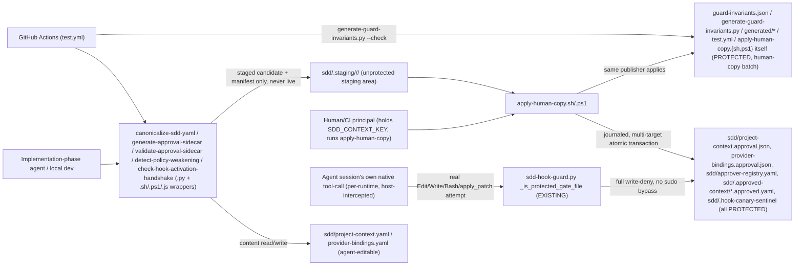
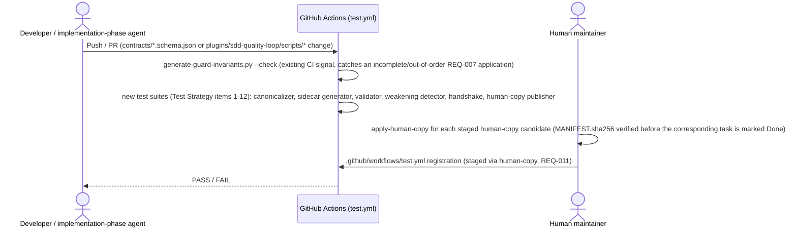

# Infrastructure Specification: epic-189-a1-project-context

No new runtime deployment. This document expands design.md's Deployment /
CI Plan, Architecture, and Data Plan into the review harness's canonical
layer-file shape; it introduces no new infrastructure judgment beyond what
those sections already fix.

## Deployment Topology

No region, no network boundary — every deliverable is repository-internal
(Architecture diagram, above; design.md header, Feature Type: "no UI, no new
plugin, no Provider integration" — no new runtime service is introduced).
Fault domain: a single script invocation (a CI job, a local script run, or a
single `apply-human-copy` batch transaction); there is no shared/long-running
service to carry a fault domain of its own.

## CI/CD Sequence

Deterministic lane: every test this Epic adds requires no LLM invocation, no
network call, and no `gh` invocation — including REQ-010's handshake tests,
which use fixture recorded-result evidence, not a live agent session
(Deployment / CI Plan; Test Strategy item 12's non-use declarations). No
release-version bump is implied by this Epic alone.

## Environments

| Environment | URL | Auth | Trigger | Classification | Promotion Rule |
|---|---|---|---|---|---|
| local dev (monorepo checkout) | `sdd/` + `contracts/` + `plugins/sdd-quality-loop/scripts/` (repo-relative) | OS user (filesystem); human/CI-only for the signing operation (`SDD_CONTEXT_KEY` resolution, REQ-004) | manual script invocation / `tests/run-all.sh`/`.ps1` | internal | PR + CI green |
| CI (GitHub Actions `test.yml`) | N/A — ephemeral runner | GitHub Actions default | push / PR | internal | required check before merge (`generate-guard-invariants.py --check`, already CI-wired, Deployment / CI Plan) |
| staging / production | N/A | — | — | — | N/A — no runtime service, no cloud deployment is introduced by this Epic (design.md header, Feature Type: no UI, no new plugin, no Provider integration) |

## Infrastructure as Code

N/A — no cloud. Every deliverable is a schema, a script added to the
existing `plugins/sdd-quality-loop/` plugin family, or a protected data file
(Components). No Terraform/IaC module is introduced by this Epic.

## Scaling Strategy

N/A — no runtime service, no concurrency model of its own. Each script is a
single, deterministic, synchronous CLI invocation; Test Strategy item 12
declares no suite invokes a real LLM, `gh`, or `sdd-sudo`, and every mktemp
fixture root is `pwd -P`-normalized immediately after creation — this Epic's
scripts are designed for single-invocation determinism, not concurrent load.

## Service Level Objectives

N/A — no live service to hold an availability/latency SLO. The closest
analog is a correctness objective, already fixed as a design contract rather
than a measured runtime signal: byte-identical output across `.py`/`.sh`/
`.ps1`(/`.js`) invocations of `canonicalize-sdd-yaml` for identical input
(REQ-011, Test Strategy item 1's dual/multi-runtime hash-equality proof,
AC-009), and `generate-guard-invariants.py --check`'s exact-match
self-defense (B6, AC-021, AC-038) that gates CI/human-copy application
rather than alerting a running system.

## Data Residency and Retention

| Entity | Residency | Retention | Backup | Deletion Verification | REQ | AC |
|---|---|---|---|---|---|---|
| `sdd/project-context.yaml`, `sdd/provider-bindings.yaml` | repository working tree (git); no target-repository instance created by this Epic itself (Non-goals, Epic A9 scope) | indefinite, version-controlled | git remote(s) | not applicable, no delete operation exists in scope | REQ-001, REQ-002 | AC-001, AC-003 |
| `sdd/project-context.approval.json`, `sdd/provider-bindings.approval.json` (PROTECTED) | repository working tree, full-write-deny protected | published/republished only via a complete `apply-human-copy` transaction; never hand-edited | git remote(s) | overwrite-only via the publisher; no delete path exists in scope | REQ-004, REQ-007 | AC-011, AC-033 |
| `sdd/approver-registry.yaml` (PROTECTED) | repository working tree, full-write-deny protected | `id` is the immutable identity key; append/edit only via `apply-human-copy` | git remote(s) | overwrite-only; no delete path exists | REQ-006, REQ-007 | AC-044, AC-045, AC-046 |
| `sdd/.approved-context/project-context.approved.yaml`, `provider-bindings.approved.yaml` (PROTECTED) | repository working tree, full-write-deny protected | byte-exact snapshot, superseded only by a new complete `apply-human-copy` publish, in lockstep with its accompanying sidecar | git remote(s) | overwrite-only; no delete path exists | REQ-006, REQ-007 | AC-030, AC-033 |
| `sdd/.hook-canary-sentinel` (PROTECTED, path-existence-agnostic) | repository working tree (typically git-untracked, transient) | transient — absent-before/absent-after on the hook-fires branch; created-then-confirmed-cleaned-up on the hook-inactive branch | none — no defined content shape to back up | required cleanup delete with a confirmed result; the NEXT `--emit-challenge` invocation self-heals a stale sentinel via its stale-start check | REQ-007, REQ-010 | AC-032 |
| `sdd/.staging/<schema-id>/<nonce>/` and `sdd/.staging/<batch-nonce>/TRANSACTION.json` (UNPROTECTED) | repository working tree, git-untracked | transient — deleted by `apply-human-copy` on successful commit; a stale journal is auto-cleaned by the recovery scan at the START of the next invocation | none — already-transient staging area, inspectable/manually clearable by a human | not applicable; a fixture proving recovery correctness drives it only through `apply-human-copy`'s own CLI, never by hand-crafting a journal file (Global Constraints) | REQ-004, REQ-007 | AC-011, AC-033 |
| `guard-invariants.json`, `generate-guard-invariants.py`, `generated/guard_invariants.*` (PROTECTED, existing) | repository working tree, full-write-deny protected | exactly ONE task (REQ-007's) edits these, in a single staged human-copy batch (Global Constraints) | git remote(s) | overwrite-only via `apply-human-copy`; SHA-256 of the LIVE files unchanged before/after this Epic's own agent commits (AC-022) | REQ-007 | AC-021, AC-022, AC-038 |

No database, no migration, no runtime storage anywhere in this Epic (Data
Plan; Migration Strategy: "none — every artifact this epic defines is wholly
new").

## Observability

| Logs | Traces | Metrics | Alert | Owner | Runbook |
|---|---|---|---|---|---|
| `canonicalize-sdd-yaml.py`: one category-specific diagnostic per rejection (`DUPLICATE_KEY_REJECTED`, `NON_STRING_KEY_REJECTED`, `POST_NFC_DUPLICATE_KEY_REJECTED`, `NUMBER_OUT_OF_RANGE_REJECTED`, etc.), stderr only, stdout carries only canonical bytes / `sha256:<hex>` on success (REQ-003, Canonicalization procedure); `validate-approval-sidecar.py`: six independently-named rejection reasons (content-schema, hash mismatch, HMAC mismatch, unregistered approver, duplicate approver identity, premature `effective_at`, REQ-005, Test Strategy item 6); `detect-policy-weakening.py`: per-category verdict output, all nine categories reported every run, 3 implemented + 6 documented-N/A, never silently omitted (REQ-006); `check-hook-activation-handshake.py`: `HOOK_ACTIVE` / `CAPABILITY_RUNTIME_UNAVAILABLE` / `SENTINEL_CLEANUP_UNCONFIRMED` (REQ-010) | N/A — no distributed request, single-process CLI invocation per script | N/A — no running service to emit a metric; CI pass/fail (`generate-guard-invariants.py --check` and the new `test.yml` suites) is the closest observable signal | CI failure on any `test.yml` step (Deployment / CI Plan) | Implementation task owner | none designed beyond CI's own PASS/FAIL signal and the documented rollback procedure, below; Epic A8's cross-runtime handoff suite is the designated future regression check for the host-canary handshake specifically (Risks, quinary risk) |

## Cost Estimate

N/A — no cloud cost. Every deliverable runs inside the repository's existing
CI compute (`test.yml`, already provisioned) and on local
developer/maintainer machines; no new infrastructure spend is introduced
(design.md header, Feature Type: no UI, no new plugin, no Provider
integration; no new runtime service).

## Rollback

- Trigger: a `generate-guard-invariants.py --check` failure in CI
  (Deployment / CI Plan, "the first CI signal that would catch an incomplete
  or out-of-order REQ-007 human-copy application"), a
  `validate-approval-sidecar` regression discovered post-merge, or a stale
  `TRANSACTION.json` journal discovered on a subsequent `apply-human-copy`
  invocation (Risks, septenary risk).
- Per-task revertibility: every task is independently revertible — all new
  files, no existing behavior removed (Deployment / CI Plan).
- Protected-file caveat (the most important rollback nuance): reverting
  REQ-007's agent-authored staging commit does NOT automatically revert an
  already-human-applied `guard-invariants.json`/generated-file change — the
  revert description must state explicitly whether a human should also
  hand-revert that application (Deployment / CI Plan, verbatim). The same
  caveat applies to any other protected-file change this Epic stages
  (sidecar-signature publication, skill-file edits, CI registration) — a
  reverted staging commit alone does not undo a completed
  `apply-human-copy` publish.
- Staged-but-never-applied artifacts leave no live-state rollback need: a
  staged sidecar-signing candidate (REQ-004) that is never applied leaves no
  live-state change to roll back at all (staging-only output, B3) — a
  strictly LOWER-risk rollback surface than the guard-invariants batch
  (Deployment / CI Plan).
- Stale `TRANSACTION.json` journal recovery: the automatic recovery scan
  runs at the START of every subsequent `apply-human-copy` invocation (no
  separate "remember to clean up" step); the journal and its `pre/` backups
  live in the already-UNPROTECTED, already-transient `sdd/.staging/` area,
  so a human can always inspect or manually clear a long-stale one without
  needing elevated access (Risks, septenary risk). A crash mid-recovery is
  itself safely resumable by the next invocation, since recovery is proven
  idempotent and re-entrant (Human-copy publisher transactional bundle
  contract, step 5).
- No data-compatibility concern: this Epic performs no migration and
  deletes no data (Data Plan, Migration Strategy: none); a reverted schema,
  script, or content file simply returns to its prior git-committed state.
- Verification after rollback: re-run the relevant `tests/*.tests.sh`/
  `.tests.ps1` pairs (Test Strategy) and `generate-guard-invariants.py
  --check` to confirm the reverted/re-applied state matches expectations.

## Open Questions

- None — no new infrastructure judgment is introduced beyond what
  Deployment / CI Plan, Architecture, and Data Plan already fix.
