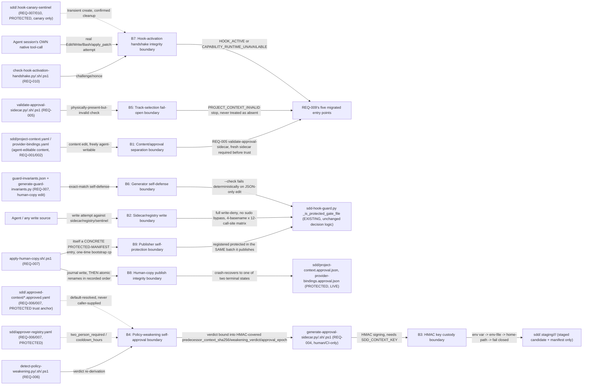

# Security Specification: epic-189-a1-project-context

This document expands design.md's Security Boundaries (B1-B9) and Global
Constraints into the review harness's canonical layer-file shape. It
introduces no new security judgment beyond what design.md already fixes;
every boundary, mitigation, and REQ/AC/TEST reference below traces to
design.md or requirements.md/acceptance-tests.md content approved at
Spec-Review-Status: Passed.

Framing (design.md Technical Summary, Architecture, and Security Boundaries):
unlike a read-only catalog Epic, this Epic's own attack surface centers on
signed approval and protected-file integrity, not content correctness alone.
The guiding principle carried from ADR-0019's own Context section is that
"an unsigned hash is a *binding*, never an *authenticity* claim" — every new
mechanism in this design either produces a binding (REQ-003's canonical
hash), an authenticity claim (REQ-004's HMAC, signed by a key no agent ever
holds), or a check that both hold before anything is trusted (REQ-005); no
new mechanism ever asserts authenticity from a hash alone. This Epic's own
attack surface is therefore the nine boundaries design.md's Security
Boundaries section already names: (B1) content/approval separation, (B2)
sidecar/registry write-boundary elevation of privilege, (B3) HMAC key
custody, (B4) policy-weakening self-approval, (B5) track-selection fail-open,
(B6) `generate-guard-invariants.py`'s own exact-match self-defense, (B7)
hook-activation handshake integrity, (B8) human-copy publish integrity, and
(B9) publisher self-protection.

## Trust Boundaries

| Boundary | Source | Destination | Assets | Validation | AuthN/AuthZ | REQ | AC |
|---|---|---|---|---|---|---|---|
| B1 — Content/approval separation | Agent (content author, freely editable) | REQ-009's five migrated entry points, which must not trust content without a fresh check | `sdd/project-context.yaml` / `provider-bindings.yaml` content bytes | REQ-005's `validate-approval-sidecar` (hash+HMAC+approver-identity+`effective_at`) must PASS before content is trusted; a present-but-invalid file explicitly stops with `PROJECT_CONTEXT_INVALID` rather than being silently trusted (REQ-009) | None — OS/filesystem user boundary only; content is intentionally agent-writable, approval is not (Security Boundaries B1) | REQ-001, REQ-002, REQ-004, REQ-005, REQ-009 | AC-025, AC-026 |
| B2 — Sidecar/registry write boundary | Agent, or any other write source | `sdd/project-context.approval.json`, `sdd/provider-bindings.approval.json`, `sdd/approver-registry.yaml`, `sdd/.hook-canary-sentinel` (4-basename matrix) | Approval sidecars, approver registry, canary sentinel | `sdd-hook-guard.py`'s `_is_protected_gate_file` full write-deny, across all 12 mutation surfaces it is consulted from, under both `SDD_SUDO` states — never a bypass (REQ-007/REQ-008) | Two-tier defense: the tool-mediated full-deny layer (guard-invariants, no sudo bypass) PLUS an independent external-HMAC-key layer, per ADR-0019's two-tier scope (Security Boundaries B2) | REQ-007, REQ-008 | AC-023 |
| B3 — HMAC key custody | `generate-approval-sidecar.py`/`.sh`/`.ps1` (human/CI-only invocation) | `sdd/.staging/<schema-id>/<nonce>/` (staged candidate + manifest, never the live path) | `SDD_CONTEXT_KEY`/`SDD_CONTEXT_KEY_FILE`/`<HOME>/.sdd/context-key` key material; the HMAC signature itself | Key-resolution chain (env var -> env-file, BOM/whitespace-stripped -> home-path, same stripping -> none, fail-closed); `validate-approval-sidecar` recomputes the identical preimage and compares via constant-time `hmac.compare_digest`, matching `sdd-hook-guard.py:478-481`'s pattern | Human/CI-only signing operation; key never read by an agent-driven signing operation (Security Boundaries B3) | REQ-004, REQ-005 | AC-011, AC-012, AC-013, AC-034, AC-036 |
| B4 — Policy-weakening self-approval | `detect-policy-weakening.py`/`.sh`/`.ps1`, invoked at BOTH generation and validation time | `generate-approval-sidecar` (gates two-person signing), `validate-approval-sidecar` (re-derives verdict) | `sdd/approver-registry.yaml` (`two_person_required`/`cooldown_hours`); `sdd/.approved-context/*.approved.yaml` (trust anchor) | Verdict re-derived from the protected registry and the protected approved-context anchor at BOTH generation and validation time; `DUPLICATE_APPROVER_IDENTITY` checked before any hashing work; predecessor/verdict/epoch fields HMAC-bound into the live sidecar (revised, closes the historical weakening-binding gap) | Anchor changes ONLY via a complete, human/HMAC-signed `apply-human-copy` publish, never via a commit to the live content file (Security Boundaries B4) | REQ-004, REQ-005, REQ-006 | AC-018, AC-019, AC-020, AC-030, AC-043, AC-044, AC-045, AC-046 |
| B5 — Track-selection fail-open | REQ-009's five migrated entry points (`sdd-ship`, `sdd-bootstrap`, `sdd-bootstrap-interviewer`, `lite-spec`, `lite-gate`) | Compatibility fallback OR `PROJECT_CONTEXT_INVALID` explicit stop | The track-selection decision (`full` vs `lite`) | Physical-presence check FIRST; REQ-005 validation THEN, when present; a validation failure routes to a NAMED stop, never to the compatibility-fallback branch (REQ-009, revised, closes Blocker B1) | None — filesystem presence plus validator outcome only (Security Boundaries B5) | REQ-009 | AC-025, AC-026, AC-039 |
| B6 — Generator self-defense | An edit to `guard-invariants.json` (JSON only, without a matching Python-constant edit) | `generate-guard-invariants.py --check` (CI signal) | `protected_gate_suffixes` array / `EPIC_A1_TARGETS` constant (28 entries) | `load_and_validate` requires the live JSON array to equal a tuple HARDCODED in the generator's own Python source; `--check` fails deterministically for every subsequent unrelated repository change until both agree (Protected-File Statement, Exact-match constraint) | None — a correctness gate, not an authorization gate (Security Boundaries B6) | REQ-007 | AC-021, AC-038 |
| B7 — Hook-activation handshake integrity | Agent session's OWN native tool-call attempt against `sdd/.hook-canary-sentinel`, following `--emit-challenge` | `check-hook-activation-handshake --verify-response` | Challenge nonce; recorded raw tool-call result | `HOOK_ACTIVE` requires BOTH a runtime-matched expected-deny-signature AND a matching nonce; the sentinel cleanup delete's OWN result must be recorded and confirmed successful (never merely attempted); the NEXT `--emit-challenge` invocation detects and cleans up a stale sentinel at START | Host-intercepted `PreToolUse` event; the protected script itself never attempts a write (Security Boundaries B7; Design Decisions, defense-tier scope B4) | REQ-010 | AC-027, AC-032, AC-035 |
| B8 — Human-copy publish integrity | `validate-approval-sidecar` PASS (staged candidate) | Live sidecar/anchor/guard-invariants paths, via `apply-human-copy` | Staged candidates; `sdd/.staging/<batch-nonce>/TRANSACTION.json` journal; `pre/<target-basename>` backups | Journal-write-before-rename; atomic renames in recorded commit order; crash-recovery scan converges every target to exactly one of two terminal states; readers perform their OWN generation-consistency check, failing closed (`HUMAN_COPY_PUBLISH_IN_PROGRESS`) on a live journal | Held handle, handle-relative traversal, temp-rehash, atomic rename, no path-copy fallback (Security Boundaries B8) | REQ-004, REQ-006, REQ-007 | AC-033, AC-043 |
| B9 — Publisher self-protection | `apply-human-copy.{sh,ps1}`'s own FIRST-ever application (one-time human-verified plain `cp` + SHA-256 check) | `apply-human-copy.{sh,ps1}` registered protected in the SAME human-copy batch it publishes | The publisher tool's own two basenames | Every subsequent application — of any staged artifact, including a future revision of `apply-human-copy` itself — goes through the tool while it is already protected | Same full write-deny mechanism as B2, applied reflexively to the publisher itself (Security Boundaries B9) | REQ-007 | AC-021, AC-023 |

## STRIDE Analysis

| Boundary | Threat | STRIDE | Abuse Case | Mitigation | Verification | REQ | AC |
|---|---|---|---|---|---|---|---|
| B1 | A consumer trusts un-approved or hand-edited content without a fresh sidecar check | Tampering | A consumer reads `project-context.yaml` directly and acts on it without calling `validate-approval-sidecar` first | Content editability and trust are structurally decoupled — content is freely agent-editable but EVERY consumer requires a fresh, validated sidecar before trusting it (Technical Summary's core principle: "an unsigned hash is a binding, never an authenticity claim"); REQ-009's five migrated entry points all call REQ-005's validator before trusting content | TEST-025, TEST-026, TEST-039 | REQ-004, REQ-005, REQ-009 | AC-025, AC-026, AC-039 |
| B2 | An agent (or a compromised write path) attempts to write directly to a sidecar/registry/sentinel path, bypassing the human-copy publish flow | Elevation of Privilege | `echo x > sdd/project-context.approval.json`, or an equivalent write attempt, through any of the 12 `sdd-hook-guard.py` call sites, with or without an active `SDD_SUDO` token | Full write-deny, no sudo bypass, for all 4 protected basenames (REQ-007/REQ-008) — the existing `sdd-hook-guard.py` `_is_protected_gate_file` deny path, activated by REQ-007's registration; two-tier defense (tool-mediated full-deny PLUS an independent external-HMAC-key layer, ADR-0019) | TEST-023 (96 independent assertions) | REQ-007, REQ-008 | AC-023 |
| B3 | An attacker without the signing key forges a valid HMAC over a favorable candidate, or smuggles an unsigned/invalid candidate onto the live path | Spoofing | A crafted sidecar JSON with an attacker-chosen `hmac` value; or completing a partial staged artifact left by a simulated mid-write failure | `SDD_CONTEXT_KEY`/`_FILE`/home-path resolution is human/CI-only, never read by an agent-driven signing operation; the signer itself never opens the live sidecar path for writing (staging-only output); `apply-human-copy` publishes ONLY after `validate-approval-sidecar` independently recomputes the preimage and passes a constant-time HMAC comparison | TEST-011, TEST-012, TEST-013, TEST-034, TEST-036 | REQ-004, REQ-005 | AC-011, AC-012, AC-013, AC-034, AC-036 |
| B4 | An agent controlling only the content file manufactures a favorable weakening verdict, self-diffs against its own candidate as anchor, or satisfies a two-person requirement with one identity presented twice | Repudiation (self-approval) | A single approver id supplied as both `primary_approval.approver` and `second_approval.approver`; or a `--approved-context` override pointed at the candidate itself; or committing a weakening change directly, then re-diffing against the new HEAD | Verdict re-derived from a protected approver registry and a protected approved-context anchor (never caller-supplied, never git-HEAD, changes only via a complete `apply-human-copy` publish) at BOTH generation and validation time; `DUPLICATE_APPROVER_IDENTITY` checked before any hashing work; verdict provenance additionally bound into the live sidecar's own HMAC-covered `predecessor_context_sha256`/`weakening_verdict`/`approval_epoch` fields, checkable indefinitely via `validate-approval-sidecar --verify-provenance` | TEST-018, TEST-019, TEST-020, TEST-030, TEST-043 | REQ-004, REQ-005, REQ-006 | AC-018, AC-019, AC-020, AC-030, AC-043 |
| B4 (zero-identity boundary) | A zero-entry approver registry (`approvers: []`) is treated as an ambiguous or silently-permissive state rather than a defined boundary | Repudiation | A schema-valid but empty registry used to sign or validate a policy-weakening change | Zero-identity classifies identically to the 1-identity case (`two_person_required: false, cooldown_hours: 24`); `generate-approval-sidecar`/`validate-approval-sidecar` structurally refuse to sign/validate against a zero-entry registry since no `id` can ever resolve | TEST-046 | REQ-004, REQ-005, REQ-006 | AC-046 |
| B5 | An attacker induces a validation failure against an existing Project Context (sidecar tampering, replay, key-rotation-window exploitation), hoping the consumer falls back to the permissive compatibility path | Tampering (fail-open via induced failure) | A physically-present but sidecar-invalid `project-context.yaml` misread as "absent" and silently granted the compatibility fallback's implicit behavior | A PHYSICALLY PRESENT but failing-validation Project Context STOPS with `PROJECT_CONTEXT_INVALID` — a named, distinct outcome from the compatibility fallback (which applies ONLY when physically absent); never a single "treated as absent" branch reused for both | TEST-026, TEST-039 | REQ-009 | AC-026, AC-039 |
| B6 | A JSON-only edit to `guard-invariants.json` (without a matching edit to `generate-guard-invariants.py`'s own hardcoded constants) attempts to silently narrow or widen the protected-file inventory | Tampering | An edited `protected_gate_suffixes` array that drops one of the 28 `EPIC_A1_TARGETS` entries, or adds an unauthorized one, without a matching Python-constant change | `generate-guard-invariants.py:145-147`'s `load_and_validate` requires the live array to exactly equal a tuple HARDCODED in the generator's own Python source; `--check` fails deterministically for every subsequent unrelated repository change, not just this Epic's own, until both files agree | TEST-021 (staged-tree `--check` proof), TEST-038 | REQ-007 | AC-021, AC-038 |
| B7 | An agent fabricates a `HOOK_ACTIVE` verdict without a genuine, host-intercepted tool-call denial, or a race between sentinel creation and cleanup leaves it stuck / silently ignored | Tampering / false-negative Capability Mode activation | A recorded-result file with a stale or mismatched nonce, or a missing recorded-result file, accepted as evidence of an active hook; or a cleanup delete denied mid-race, leaving a stuck sentinel silently unreported | `--verify-response` requires BOTH a runtime-matched expected-deny-signature AND a matching nonce (nonce generated by the protected script, never the agent); the standalone script never itself attempts a write; the cleanup delete's OWN result must be recorded and confirmed successful, not merely attempted (`SENTINEL_CLEANUP_UNCONFIRMED` otherwise); the NEXT `--emit-challenge` invocation detects and cleans up a pre-existing stale sentinel at START | TEST-027, TEST-032, TEST-035 | REQ-010 | AC-027, AC-032, AC-035 |
| B8 | A crash or interrupt between renaming a batch's first and second live target (e.g. sidecar published, accompanying anchor not, or vice versa) leaves a torn, partially-published state a reader might trust | Tampering / TOCTOU / partial-publish inconsistency | A reader (`detect-policy-weakening` or `validate-approval-sidecar`) reads the anchor mid-publish, after it has already been renamed to its new bytes but the accompanying sidecar has not yet (or vice versa) | Journal-write-before-rename, atomic renames in recorded commit order, and an automatic crash-recovery scan (run at the START of every subsequent `apply-human-copy` invocation) that converges every target to exactly one of two terminal states, never a standing mix, and is itself idempotent/re-entrant; readers additionally perform their OWN reader-side generation-consistency check and fail closed (`HUMAN_COPY_PUBLISH_IN_PROGRESS`) on a live journal naming a path they just read | TEST-033, TEST-043 (reader-side fixture) | REQ-004, REQ-006, REQ-007 | AC-033, AC-043 |
| B9 | Once REQ-007 lands, an agent modifies `apply-human-copy.{sh,ps1}` itself to weaken its own atomicity, verification, or no-path-copy-fallback guarantees | Elevation of Privilege / Tampering | An agent edits `apply-human-copy.sh` directly to skip the temp-rehash step or accept a path-copy fallback, then uses the weakened tool to publish an otherwise-invalid candidate | `apply-human-copy.{sh,ps1}` is a CONCRETE `PROTECTED-MANIFEST.md` entry, registered protected in the SAME human-copy batch it is used to publish, after exactly ONE human-verified bootstrap `cp` + SHA-256 check; every subsequent application — of any staged artifact, including a future revision of `apply-human-copy` itself — goes through the tool while it is already protected, so no agent-mediated write path can reach the publisher's own basenames any more than it can reach the sidecars it publishes | TEST-021 (publisher self-protection scope), TEST-023 (write-boundary matrix covers the publisher's own protected basenames once registered) | REQ-007 | AC-021, AC-023 |

## Authentication Flow

N/A — this Epic defines no user-authentication mechanism. Every actor is
bound by the local OS-user/filesystem boundary: an Agent's direct content
edit, a Human/CI principal's signing operation (`SDD_CONTEXT_KEY` resolution,
human/CI-only), a Human maintainer's `apply-human-copy` invocation, or a CI
runner's script execution (Roles and Permissions, requirements.md; design.md
Security Boundaries). This Epic's HMAC signing (REQ-004) is a content
authenticity/integrity mechanism, not a user-authentication flow — it proves
"this exact content was signed by a holder of `SDD_CONTEXT_KEY`," not "this
request came from an authenticated user session." See the OWASP Mapping's
Cryptographic Failures row, below, for how this differs from a content-hash-
only framing.

## Authorization

| Actor / Role | Resource | Action | Decision Point | Default | Denial Evidence | REQ | AC |
|---|---|---|---|---|---|---|---|
| Agent | `sdd/project-context.yaml` / `provider-bindings.yaml` (content) | write (direct edit) | No in-band authorization — OS/filesystem user boundary only; REQ-005's validator is a trust/correctness gate on the READER side, not a write-authorization gate | allow (content is intentionally agent-editable, Security Boundaries B1) | not applicable — content write always succeeds; only downstream TRUST is gated | REQ-001, REQ-002 | AC-001, AC-003 |
| Agent, or any other write source | Sidecar/registry/sentinel paths (`*.approval.json`, `approver-registry.yaml`, `.hook-canary-sentinel`) | write | `sdd-hook-guard.py`'s `_is_protected_gate_file` (existing repository-wide guard, activated by REQ-007's registration) | deny (full write-deny, no `sudo` bypass) | guard's own denial surfaced via the host's own reporting, across all 12 call sites, under both `SDD_SUDO` states | REQ-007, REQ-008 | AC-023 |
| Human/CI principal holding `SDD_CONTEXT_KEY` | Approval sidecar candidate | sign (write to staging only) | Key-resolution chain (env var -> env-file -> home-path -> fail-closed) | deny (fail-closed, no staged artifact) if no key resolves; allow (staging-only write) once resolved | non-zero exit, no staged artifact written at all | REQ-004 | AC-011, AC-013 |
| Human maintainer | Staged human-copy candidate (any protected target) | publish (`apply-human-copy`) | `MANIFEST.sha256` verification, required before the corresponding task can be marked Done; one-time bootstrap `cp` + SHA-256 check for the publisher's own basenames only | allow, human-initiated only — no script this design defines writes a protected path directly | staged-tree `--check` proof required before any live application (REQ-007); no automated agent path exists | REQ-007 | AC-021, AC-022, AC-033 |
| Any of REQ-009's five migrated consumers | Project Context trust decision (`full`/`lite`) | read + validate | Physical-presence check, then REQ-005 validation when present | deny-to-explicit-stop (`PROJECT_CONTEXT_INVALID`) if present-but-invalid; compatibility fallback if physically absent | named stop error, never a silent fallback | REQ-009 | AC-025, AC-026, AC-039 |

## Data Classification and Protection

| Entity | Classification | At Rest | In Transit | Retention | Deletion | Access Log | REQ | AC |
|---|---|---|---|---|---|---|---|---|
| `sdd/project-context.yaml`, `sdd/provider-bindings.yaml` | internal (repo-committed, agent-editable content, no secrets) | git-versioned working tree | filesystem read/write by local scripts/CI only; no network transmission | version-controlled indefinitely (git history); this Epic creates no instance data (Non-goals, Epic A9 scope) | never deleted by any script this Epic defines | git commit history | REQ-001, REQ-002 | AC-001, AC-003 |
| `sdd/project-context.approval.json`, `sdd/provider-bindings.approval.json` (approval sidecars, PROTECTED) | internal, security-load-bearing | git-versioned working tree, full-write-deny protected | filesystem only; published ONLY via `apply-human-copy`'s journaled, multi-target atomic transaction | regenerated/republished on every approved content change; never hand-edited | overwritten only by a complete `apply-human-copy` publish; no delete operation exists in scope | git commit history + the sidecar's own HMAC-covered `predecessor_context_sha256`/`weakening_verdict`/`approval_epoch` provenance chain | REQ-004, REQ-007 | AC-011, AC-033, AC-043 |
| `sdd/approver-registry.yaml` (PROTECTED) | internal, identity-load-bearing | git-versioned working tree, full-write-deny protected | filesystem only | `id` is the IMMUTABLE identity key every `approval.approver` field references; append/edit only via `apply-human-copy` | not deleted by any script this Epic defines | git commit history | REQ-006, REQ-007 | AC-044, AC-045, AC-046 |
| `sdd/.hook-canary-sentinel` (PROTECTED, path-existence-agnostic) | internal, canary-only, never real content | git-untracked, transient (no defined content shape) | filesystem only, local to a single handshake invocation | transient: absent-before/absent-after when the hook fires; created-then-confirmed-cleaned-up when it does not (Data Plan) | required cleanup delete, with its OWN result recorded and confirmed; a stale sentinel is self-healed by the NEXT `--emit-challenge` invocation's stale-start check | the handshake's own recorded challenge/response evidence | REQ-007, REQ-010 | AC-032 |
| `sdd/.approved-context/project-context.approved.yaml`, `provider-bindings.approved.yaml` (PROTECTED trust anchor) | internal, security-load-bearing | git-versioned working tree, full-write-deny protected | filesystem only; published ONLY via `apply-human-copy`, in the SAME journaled transaction as the sidecar it accompanies | byte-exact snapshot of the content last hashed into the live sidecar's `context_sha256`; superseded only by a new complete publish | overwritten only by a complete `apply-human-copy` publish; never shares a basename with the live content files (which would otherwise also become protected, breaking B1) | git commit history | REQ-006, REQ-007 | AC-030, AC-033 |
| `sdd/.staging/<schema-id>/<nonce>/` and `sdd/.staging/<batch-nonce>/TRANSACTION.json` (UNPROTECTED staging area) | internal, transient, never itself trusted as live approval state | git-untracked, filesystem only | filesystem only, local to a single generation/publish cycle | staged candidate + manifest (REQ-004); transaction journal + `pre/` backups (REQ-007), written and deleted ONLY by `apply-human-copy` | journal deleted on successful commit; a stale journal is cleaned up automatically by the recovery scan at the START of the next `apply-human-copy` invocation | none — an UNPROTECTED, already-transient area a human can inspect or manually clear | REQ-004, REQ-007 | AC-011, AC-033 |
| `SDD_CONTEXT_KEY` / `SDD_CONTEXT_KEY_FILE` / `<HOME>/.sdd/context-key` | secret — never repo-resident | user-controlled environment variable, file, or home-path outside the repository | never transmitted by any script this Epic defines; never committed, logged, or echoed by the signer (Constraint Compliance) | operator-controlled, outside this design's scope | operator-controlled | none — this design cannot technically enforce human key-handling discipline (Constraint Compliance; Risks, tertiary risk) | REQ-004 | AC-013 |

No PII, and no provider-specific detail, is stored by any artifact this
Epic designs — `provider_binding_ids` is the ONLY cross-reference field
between Project Context and Provider Bindings (Constraint Compliance,
ADR-0018).

## OWASP Mapping

| OWASP Risk | Exposure | Control | Verification | Owner |
|---|---|---|---|---|
| Injection (arbitrary content masquerading as approved) | Content files (`project-context.yaml`/`provider-bindings.yaml`) are freely agent-editable | Content/approval separation — every consumer requires a fresh, validated sidecar (REQ-005) before trusting content; a present-but-invalid file explicitly stops rather than silently falling back | AC-025, AC-026 | Implementation task owner |
| Broken Access Control | Protected sidecar/registry/sentinel paths (`*.approval.json`, `approver-registry.yaml`, `.hook-canary-sentinel`) | Full write-deny via `sdd-hook-guard.py`, 4-basename x 12-call-site matrix, no `sudo` bypass (REQ-007/REQ-008) | AC-023 | Implementation task owner |
| Cryptographic Failures | Approval sidecar authenticity — this Epic OWNS the HMAC signing mechanism (REQ-004), unlike a content-identity-hash-only framing | HMAC-SHA256 over an RFC-8785-canonicalized, field-complete preimage (the `hmac` field itself excluded), key resolved human/CI-only via a 4-step chain, constant-time comparison at validation time (`hmac.compare_digest`, matching `sdd-hook-guard.py:478-481`'s pattern) | AC-012 (self-reference exclusion), AC-013 (key-resolution byte-parity), AC-036 (golden vector + 15 one-field-mutation fixtures) | Implementation task owner |
| Security Misconfiguration | `guard-invariants.json` / `generate-guard-invariants.py` drift — a JSON-only edit without a matching Python-constant edit | Exact-match self-defense (B6): `load_and_validate` requires the live array to equal a hardcoded generator-source tuple; `--check` fails deterministically | AC-021, AC-038 | Implementation task owner |
| Software and Data Integrity Failures | Multi-target human-copy publish (sidecar+anchor pair, the six-file guard-invariants batch, the publisher's own self-protection batch) crashing mid-publish | Journaled, multi-target transaction protocol; crash-recovery-to-one-of-two-terminal-states, itself idempotent/re-entrant; reader-side generation-consistency check fails closed on a live journal | AC-033, AC-043 (reader-side fixture) | Implementation task owner |
| Identification and Authentication Failures | Approver identity spoofing or duplication (an unregistered id, or the same identity presented twice for a two-person requirement) | Approver `id` checked against the protected `sdd/approver-registry.yaml` at BOTH generation and validation time; `DUPLICATE_APPROVER_IDENTITY` refused before any hashing work; the registry's own `id` uniqueness is itself semantically validated (`DUPLICATE_APPROVER_REGISTRY_ID`) | AC-014, AC-019, AC-044, AC-045, AC-046 | Implementation task owner |

## Secrets Management

- `SDD_CONTEXT_KEY` / `SDD_CONTEXT_KEY_FILE` / `<HOME>/.sdd/context-key` are
  never read by an agent-driven signing operation — signing is human/CI-only
  (Roles and Permissions, requirements.md; Security Boundaries B3).
- `generate-approval-sidecar` resolves the key via a 4-step chain: env
  `SDD_CONTEXT_KEY` -> env `SDD_CONTEXT_KEY_FILE` (BOM/whitespace-stripped)
  -> `<HOME>/.sdd/context-key` (same stripping) -> none (fail-closed — the
  tool refuses to write an unsigned sidecar, staged or live, HMAC preimage
  and signing).
- The design's actual guarantee is that no key material is ever committed,
  logged, or echoed by the script itself — key-handling discipline for
  `SDD_CONTEXT_KEY` otherwise depends on human operational practice the
  design cannot enforce technically (Constraint Compliance; Risks, tertiary
  risk: "the design's actual guarantee is that no key material is ever
  committed, logged, or echoed by the script itself" — a documented
  operational constraint, not a stronger technical guarantee than the design
  actually provides).
- Key-resolution byte-parity with the existing `_resolve_sudo_key`/
  `resolve_evidence_key` pattern is proven directly (AC-013's 4-case fixture
  matrix: env var / env-file / home-path / none), not merely asserted.
- An agent MAY read a PUBLIC sidecar's `hmac` field (verification-only, no
  key needed) but never the signing key itself (requirements.md Security
  Boundaries B3).

## SBOM and Supply Chain

- No new external (npm/pip/etc.) package dependency beyond a standard YAML
  library (PyYAML or `ruamel.yaml`, Design Decisions) for
  `canonicalize-sdd-yaml.py`'s YAML 1.2 core-schema parsing — confirmed
  available at a future implementation session, used in its strictest
  built-in mode plus an explicit post-parse structural walk (never relying
  on a loader flag alone, since a library's "safe" mode is not guaranteed to
  reject duplicate keys by default).
- Every other new script family (`generate-approval-sidecar`,
  `validate-approval-sidecar`, `detect-policy-weakening`,
  `check-hook-activation-handshake`) is Python + thin `sh`/`ps1` wrapper
  pairs, matching the existing `sdd-hook-guard.sh` dispatch pattern already
  used repository-wide (Components); `apply-human-copy.sh`/`.ps1` is the one
  exception with no `.py` master (frontend-spec.md Technology Stack).
- No network dependency and no Provider integration is introduced by this
  Epic (design.md header, Feature Type: "no UI, no new plugin, no Provider
  integration").

## Security Tests

| Test | Boundary | Attack / Control | Expected Result | Evidence | AC |
|---|---|---|---|---|---|
| TEST-011, TEST-034 | B3 | Signer staging-only contract; mid-write failure simulated between candidate, snapshot, and manifest writes | Never opens the live sidecar/anchor path for writing under any invocation; no partial artifact left at the final staged path; a re-run after failure succeeds with a fresh nonce | `tests/generate-approval-sidecar.tests.sh`/`.ps1` | AC-011, AC-034 |
| TEST-012, TEST-036 | B3 | HMAC preimage self-reference exclusion; golden vector + 15 one-field-at-a-time mutations | Preimage excludes the `hmac` field itself; the golden fixture's HMAC matches a hand-verified value; each of 15 mutated variants produces a DIFFERENT HMAC | `tests/generate-approval-sidecar.tests.sh`/`.ps1`, `tests/validate-approval-sidecar.tests.sh`/`.ps1` | AC-012, AC-036 |
| TEST-019 | B4 | Same-identity two-person rejection (`primary_approval.approver == second_approval.approver`) | Refused at generation time (`DUPLICATE_APPROVER_IDENTITY`); independently rejected at validation time | `tests/generate-approval-sidecar.tests.sh`/`.ps1`, `tests/validate-approval-sidecar.tests.sh`/`.ps1` | AC-019 |
| TEST-030 | B4 | Approved-context anchor injection-attempt rejection: candidate landed as an ordinary git commit, then re-diffed | A new commit alone never moves the anchor; the production call path (no `--approved-context`) is immune to a caller-supplied override; `NO_APPROVED_CONTEXT_ANCHOR` bootstrap rule independently asserted | `tests/detect-policy-weakening.tests.sh`/`.ps1` | AC-030 |
| TEST-043 | B4, B8 | Historical weakening re-provability + reader-side fail-closed check | `--verify-provenance` PASSES with a distinct second approver even after the predecessor anchor is deleted/never materialized; FAILS `WEAKENING_PROVENANCE_UNDERAPPROVED` when `second_approval` is null or duplicated, despite an otherwise-valid hash/HMAC; reader fails closed (`HUMAN_COPY_PUBLISH_IN_PROGRESS`) on a live `TRANSACTION.json` journal naming the path being read | `tests/validate-approval-sidecar.tests.sh`/`.ps1` | AC-043 |
| TEST-023 | B2, B9 | Protected-write-boundary + never-bypass, full matrix | 4 basenames x 12 mutation surfaces x 2 `SDD_SUDO` states = 96 independent denials, never a bypass | `sdd-hook-guard.py` protected-path suite (existing mechanism, activated by REQ-007's registration) | AC-023 |
| TEST-021, TEST-038 | B6, B9 | Staged-inventory conformance, manifest-derived count; reserved-category inventory | Staged `guard-invariants.json` candidate includes all 24 concrete + 4 reserved = 28 entries (incl. `apply-human-copy`'s own 2 concrete entries); staged-tree `--check` passes | staged-tree `generate-guard-invariants.py --check` suite | AC-021, AC-038 |
| TEST-027, TEST-032, TEST-035 | B7 | Host-canary challenge/response fail-closed proof; sentinel two-branch non-mutation + cleanup-confirmation + stale-start recovery; full entry-point wiring inventory | `HOOK_ACTIVE` only for a runtime-matched deny-signature AND a matching nonce; live sidecars byte-identical before/after every invocation; sentinel absent-before/after with a CONFIRMED cleanup result (never merely attempted); all five REQ-009 entry points independently wired | `tests/check-hook-activation-handshake.tests.sh`/`.ps1` | AC-027, AC-032, AC-035 |
| TEST-033 | B8 | Multi-target crash-recovery proof: crash injected between renames, at journal-write, and mid-recovery | Converges to exactly one of two terminal states (all-PRE or all-POST), never a mix; recovery itself proven idempotent under a second injected crash | `tests/apply-human-copy.tests.sh`/`.ps1` | AC-033 |
| TEST-044, TEST-045, TEST-046 | B4 | Approver-registry schema conformance; duplicate-`id` rejection; zero-identity boundary | Parameterized required-field rejection (`id`, `name`); `DUPLICATE_APPROVER_REGISTRY_ID` rejected BEFORE AC-018's distinct-identity count; a zero-entry registry yields `two_person_required: false, cooldown_hours: 24` AND structurally refuses signing/validation against it | approver-registry validator suite (`tests/validate-approval-sidecar.tests.sh`/`.ps1`, `tests/detect-policy-weakening.tests.sh`/`.ps1`) | AC-044, AC-045, AC-046 |

## Open Questions

- None — every boundary above traces to a Security Boundaries (B1-B9) item
  or a Global Constraint already fixed in design.md; no new security
  judgment is introduced by this document.
