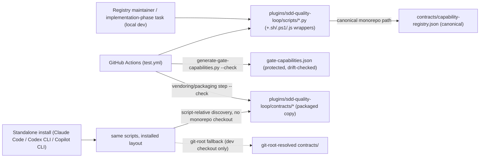
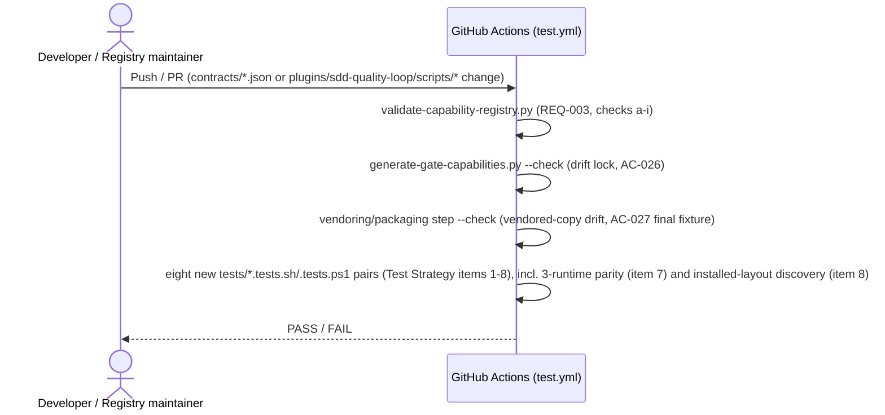

# Infrastructure Specification: epic-190-a2-capability-registry

No new runtime deployment. This document expands design.md's Deployment /
CI Plan, Architecture, and Data Plan into the review harness's canonical
layer-file shape; it introduces no new infrastructure judgment beyond what
those sections already fix.

## Deployment Topology

No region, no network boundary — every deliverable is repository-internal
(External Integrations: None); no cloud runtime is provisioned by this Epic
(Technical Summary: "no new runtime service"). Fault domain: a single script
invocation (CI job or local script run); there is no shared/long-running
service to carry a fault domain of its own.

## CI/CD Sequence

No release-version bump is implied by this Epic alone; any version bump
goes exclusively through `scripts/bump-version.sh` (Deployment / CI Plan),
which must not proceed while a vendored copy is stale relative to its
canonical source (Risks — closed 2026-07-22, orchestrator ruling P10). The
packaged/vendored `contracts/` copy under `plugins/sdd-quality-loop/` is
refreshed as part of that same version-bump/packaging step (Deployment / CI
Plan); the exact wiring is implementation-phase work (Assumptions).

## Environments

| Environment | URL | Auth | Trigger | Classification | Promotion Rule |
|---|---|---|---|---|---|
| local dev (monorepo checkout) | `contracts/` + `plugins/sdd-quality-loop/scripts/` (repo-relative) | OS user (filesystem) | manual script invocation / `tests/run-all.sh`/`.ps1` | internal | PR + CI green |
| CI (GitHub Actions `test.yml`) | N/A — ephemeral runner | GitHub Actions default | push / PR | internal | required check before merge (Protected-File Statement's `test.yml` wiring) |
| standalone install (Claude Code / Codex CLI / Copilot CLI) | `<install-root>/plugins/sdd-quality-loop/` | OS user (filesystem) | plugin install / script invocation by host process | internal | distributed only via `scripts/bump-version.sh`-gated release, after the vendored-copy drift check passes |
| staging / production | N/A | — | — | — | N/A — no runtime service, no cloud deployment (Technical Summary; External Integrations: None) |

## Infrastructure as Code

N/A — no cloud. Every deliverable is a static contract file plus a script
added to an already-packaged plugin (Components; Assumptions: "No new
plugin manifest is needed"). No Terraform/IaC module is introduced by this
Epic.

## Scaling Strategy

N/A — no runtime service, no concurrency model of its own. Each script is a
single, deterministic, synchronous CLI invocation (Global Constraints'
determinism requirement). The only "scaling" dimension is Registry size,
which this spec leaves unconstrained (no `maxItems` is stated for
`gates[]`/`capabilities[]`, API / Contract Plan).

## Service Level Objectives

N/A — no live service to hold an availability/latency SLO. The closest
analog is a correctness objective, already fixed as a design contract
rather than a measured runtime signal: byte-identical output across
`.sh`/`.ps1`(/`.js`) invocations of the same script for identical input
(Global Constraints; Test Strategy item 7's 3-runtime parity suite, AC-031,
AC-033), and the `--check` drift-detection contracts (AC-026, AC-027 final
fixture) that gate CI/release rather than alert on a running system.

## Data Residency and Retention

| Entity | Residency | Retention | Backup | Deletion Verification | REQ | AC |
|---|---|---|---|---|---|---|
| `contracts/capability-registry.json` / `.schema.json` / `lite-upgrade-reason-catalog.json` | repository working tree (git) | indefinite, version-controlled ("No data is deleted or migrated; this is a net-new contract with no prior version" — Data Plan) | git remote(s) — no separate backup mechanism is designed | not applicable, no delete operation exists in scope | REQ-001, REQ-003(h) | AC-001, AC-022 |
| `plugins/sdd-quality-loop/scripts/generated/gate-capabilities.json` + vendored `plugins/sdd-quality-loop/contracts/*` | repository working tree, protected (Protected-File Statement) | regenerated/re-vendored on demand; drift-checked in CI (never hand-edited) | git remote(s) | overwrite-only; no delete path exists | REQ-005 | AC-025, AC-026, AC-027 |

No database, no migration, no runtime storage anywhere in this Epic (Data
Plan).

## Observability

| Logs | Traces | Metrics | Alert | Owner | Runbook |
|---|---|---|---|---|---|
| Registry validator: one diagnostic line per failed check, `registry: <check-id>: <detail>` (API / Contract Plan, matching `check-sdd-structure.sh`'s `missing: <item>` convention); Predicate evaluator: `WARN`-reasoned Evidence entries, never a thrown error on well-formed input (API / Contract Plan) | N/A — no distributed request, single-process CLI invocation | N/A — no running service to emit a metric; CI pass/fail is the closest observable signal | CI failure on any `test.yml` step (Deployment / CI Plan) | Implementation task owner | none designed beyond CI's own PASS/FAIL signal; building the Resolver/consumer-facing tooling that would need its own runbook is Non-goals (Epic A5) |

## Cost Estimate

N/A — no cloud cost. Every deliverable runs inside the repository's
existing CI compute (`test.yml`, already provisioned) and on local
developer/maintainer machines; no new infrastructure spend is introduced
(Technical Summary: no new runtime service; External Integrations: None).

## Rollback

- Trigger: a `generate-gate-capabilities.py --check` or vendored-copy
  drift-check failure in CI (Deployment / CI Plan), or a
  `validate-capability-registry.py` regression discovered post-merge.
- Unprotected-file changes (scripts, `references/provider-terms.json`,
  `tests/run-all.sh`/`.ps1` registrations — Protected-File Statement) revert
  via a standard git revert of the offending commit/PR; no special
  procedure is designed beyond that.
- Protected-file changes (`guard-invariants.json` and its generated
  siblings, `test.yml`) can only be reverted the same way they were
  applied — a human re-`cp`ing a corrected `human-copy/` candidate with its
  own `MANIFEST.sha256` (Protected-File Statement); no script this spec
  designs writes to a protected path directly, so no automated rollback
  path exists for that portion by design.
- No data-compatibility concern: this Epic performs no migration and
  deletes no data (Data Plan); a reverted Registry/schema/catalog simply
  returns to its prior git-committed state.
- Verification after rollback: re-run the eight `tests/*.tests.sh`/
  `.tests.ps1` pairs (Test Strategy) and `generate-gate-capabilities.py
  --check` to confirm the projection matches the reverted Registry.

## Open Questions

- None — no new infrastructure judgment is introduced beyond what
  Deployment / CI Plan and Assumptions already fix.
