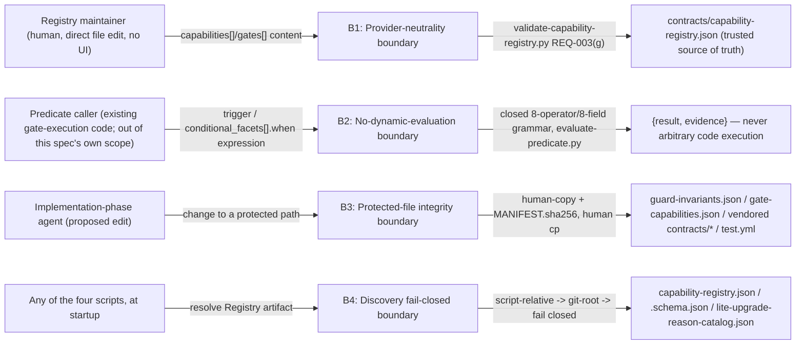

# Security Specification: epic-190-a2-capability-registry

This document expands design.md's Security Boundaries (B1-B4) and Global
Constraints into the review harness's canonical layer-file shape. It
introduces no new security judgment beyond what design.md already fixes;
every boundary, mitigation, and REQ/AC/TEST reference below traces to
design.md or requirements.md/acceptance-tests.md content approved at
Spec-Review-Status: Passed.

Framing (from design.md and decision v2 §13): the Capability Registry is a
**read-only catalog** from the perspective of every consumer this Epic
builds (validator, evaluator, digest generator, projection generator, and
the downstream `sdd-quality-loop` Gate execution / Epic A5 Resolver that
read it) — it is hand-edited only by a Registry maintainer via direct file
edit, never written by any script this Epic designs. Human-issued approval
and its cryptographic authenticity guarantee (decision v2 §10's Approval
Sidecar: external-key HMAC, conditional two-person approval) belong to Epic
A1's scope, not this Epic's — this Epic's own hard dependency on Epic A1 is
limited to importing its canonicalizer for `registry_digest` generation
(requirements.md Dependencies), and defines no approval or secret-handling
mechanism of its own (Global Constraints: "No secrets, credentials, or
provider-specific detail anywhere in `contracts/capability-registry.json`").
This Epic's own attack surface is therefore narrower than a typical service:
(1) provider-neutrality of Registry content, (2) determinism/no-dynamic-
evaluation of the Predicate DSL, (3) protected-file integrity for generated/
registered artifacts, and (4) fail-closed Registry discovery — the same four
boundaries design.md's Security Boundaries section already names as B1-B4.

## Trust Boundaries

| Boundary | Source | Destination | Assets | Validation | AuthN/AuthZ | REQ | AC |
|---|---|---|---|---|---|---|---|
| B1 — Provider-neutrality | Registry maintainer (direct file edit, no UI) | Registry content trusted as source of truth by downstream consumers (`sdd-quality-loop` Gate execution, Epic A5 Resolver) | Capability/Gate entries' string-valued fields | `references/provider-terms.json` case-insensitive scan across every string field (REQ-003(g)) | None — OS/filesystem user boundary only; this Epic defines no authentication mechanism (Global Constraints, External Integrations: None) | REQ-003(g) | AC-020 |
| B2 — No dynamic evaluation | Predicate caller (existing gate-execution code; building that caller is Non-goals) | `evaluate-predicate.py` | `trigger`/`conditional_facets[].when` predicate expressions | Schema-level closed `oneOf` (API / Contract Plan `#/definitions/predicate`, 8-operator/8-field allowlist); malformed input is `PREDICATE_SCHEMA_ERROR`, not evaluated | Not applicable — the evaluator never executes caller-supplied code and has no privilege boundary of its own (Global Constraints) | REQ-002 | AC-011, AC-012, AC-040 |
| B3 — Protected-file integrity | Implementation-phase agent (proposed edit) | Guard-invariants-protected paths (`guard-invariants.json`, `gate-capabilities.json`, vendored `plugins/sdd-quality-loop/contracts/*`, `test.yml`) | Protected-file integrity | Human-copy staging under `specs/epic-190-a2-capability-registry/human-copy/` + `MANIFEST.sha256` per file; no script this spec designs writes to a protected path directly | Human-only `cp` action (Protected-File Statement); the guard is the existing repository-wide `guard_invariants.py`, not new to this Epic | Protected-File Statement | AC-029, AC-030 |
| B4 — Discovery fail-closed | Any of the four scripts, at process startup | Registry artifact (`capability-registry.json`/`.schema.json`/`lite-upgrade-reason-catalog.json`) | Registry discovery result | Script-relative real-path resolution -> git-root fallback -> per-artifact version check; an unresolved path or a failed version check exits non-zero with a diagnostic naming every attempted path | Not applicable — filesystem-only, same OS-user boundary as every other script in this plugin; no network is involved (External Integrations: None) | REQ-005 | AC-027 |

## STRIDE Analysis

| Boundary | Threat | STRIDE | Abuse Case | Mitigation | Verification | REQ | AC |
|---|---|---|---|---|---|---|---|
| B1 | A Capability/Gate entry names a real cloud provider, disguising a provider-specific policy as provider-neutral guidance | Tampering (of the "sole machine-readable source of truth" premise, decision v2 §13) | A maintainer adds `azure`/`aws`/`durable-functions`-flavored wording to a `capabilities[]`/`gates[]` string field | `provider-terms.json` allowlist scan, case-insensitive, over every string-valued field (REQ-003(g)); fails validation before the entry can be trusted | TEST-020 | REQ-003(g) | AC-020 |
| B2 | A predicate expression attempts to use an operator or field outside the closed set, seeking a "raw expression" escape hatch | Elevation of Privilege (arbitrary code as configuration, ADR-0020's own stated risk) | A `trigger` or `conditional_facets[].when` node uses an unsupported operator (e.g. `regex`, `jsonpath`) or a field outside the 8-path allowlist | Schema-level `oneOf` rejects the shape before evaluation; `PREDICATE_SCHEMA_ERROR` is a construction-time error, never silently evaluated | TEST-011, TEST-040 | REQ-002 | AC-011, AC-040 |
| B2 | A malformed `not` node supplies zero or more than one child, attempting to bypass the documented truth table | Tampering | `{"not": [<a>, <b>]}` or `{"not": {}}` | `not`'s schema shape structurally enforces arity exactly 1; a non-conforming shape cannot even parse against the schema | TEST-012 | REQ-002 | AC-012 |
| B3 | An agent attempts to write directly to a guard-invariants-protected path instead of staging via human-copy | Tampering / Elevation of Privilege | An implementation-phase agent edits `guard-invariants.json` or `gate-capabilities.json` directly | No script this spec designs writes to a protected path directly; the only sanctioned path is human-copy staging plus a human `cp` (Protected-File Statement) — the existing repository-wide guard, not new to this Epic | AC-029 | Protected-File Statement | AC-029 |
| B4 | A standalone-installed plugin's script is pointed at a stale or absent Registry artifact (e.g. a partially-completed vendoring run) | Tampering / Denial of Service | Neither the packaged copy nor the git-root fallback resolves, or a resolved artifact fails its own per-artifact version check | Fail-closed: non-zero exit with a diagnostic naming every attempted path; no script proceeds with a stale or absent artifact | TEST-027 | REQ-005 | AC-027 |
| B4 (release gate) | A vendored/packaged `contracts/*` copy silently drifts from its canonical `contracts/*` source between packaging runs | Tampering (of the standalone-install trust chain) | The vendoring/packaging step is skipped or fails partway through a release | Vendored-copy drift check: sha256 comparison of each canonical file against its vendored counterpart, gating any release/version bump (Deployment / CI Plan; Risks, closed 2026-07-22 orchestrator ruling P10) | TEST-027 (final fixture) | REQ-005 | AC-027 |
| B2/B4 | The generated projection (`gate-capabilities.json`) is hand-edited after generation, diverging from what regeneration would produce | Tampering | A direct edit to the protected, generated file | `--check` mode recomputes in memory and compares byte-for-byte against the committed file, exiting non-zero on any difference; an mtime-unchanged assertion proves it performs no write | TEST-026 | REQ-005 | AC-026 |
| REQ-004 (digest) | An ID list is supplied in a different order, or with duplicates, in an attempt to make two semantically-identical fragment requests disagree (or to mask a real content change as a "reordering") | Repudiation (of digest-based tamper detection) | `--capability-ids b,a,a` vs. `--capability-ids a,b` | Dedupe plus stable lexicographic sort before serialization, so identical semantic ID sets always produce identical digests; conversely, a single-character content mutation changes the digest (self-check, Test Strategy item 3) | TEST-024, TEST-032 | REQ-004 | AC-024, AC-032 |

## Authentication Flow

N/A — this Epic defines no authentication mechanism. Every actor is bound by
the local OS-user/filesystem boundary: a Registry maintainer's direct file
edit, a CI runner (`test.yml`), or a script's own caller within the same
process boundary (External Integrations: None; Global Constraints: no
secrets/credentials anywhere in this Epic's artifacts).

## Authorization

| Actor / Role | Resource | Action | Decision Point | Default | Denial Evidence | REQ | AC |
|---|---|---|---|---|---|---|---|
| Registry maintainer (human) | `contracts/capability-registry.json` / `contracts/lite-upgrade-reason-catalog.json` | write (direct edit) | No in-band authorization — OS/filesystem user boundary only; the Registry validator (REQ-003) is a correctness gate, not an authorization gate | allow (no ACL is designed by this Epic) | validator diagnostic on the next `validate-capability-registry.py` run | REQ-003 | AC-014..AC-022, AC-039 |
| Implementation-phase agent | Guard-invariants-protected paths | write | Protected-file guard (existing repository-wide `guard_invariants.py`, not new to this Epic) | deny (agent write) | `guard_invariants.py`'s own rejection; this spec's only sanctioned path is human-copy staging | Protected-File Statement | AC-029, AC-030 |
| Any of the four scripts | Registry artifact (packaged or git-root copy) | read | Discovery contract (script-relative -> git-root -> fail closed) | deny (fail closed) if neither location resolves or the version check fails | non-zero exit plus diagnostic naming both attempted paths | REQ-005 | AC-027 |

## Data Classification and Protection

| Entity | Classification | At Rest | In Transit | Retention | Deletion | Access Log | REQ | AC |
|---|---|---|---|---|---|---|---|---|
| `contracts/capability-registry.json` | internal (repo-committed, no secrets — Global Constraints) | git-versioned working tree; no database (Data Plan) | filesystem read by local scripts/CI only; no network transmission (External Integrations: None) | version-controlled indefinitely (git history) | never deleted by any script this Epic designs (no delete operation exists in scope) | git commit history | REQ-001 | AC-001 |
| `contracts/lite-upgrade-reason-catalog.json` | internal, same as above | same | same | additive/versioned — REQ-003(h) requires catalog membership, never redefines/removes existing reasons within Foundation's scope | not deleted | git commit history | REQ-003(h) | AC-022 |
| `plugins/sdd-quality-loop/scripts/generated/gate-capabilities.json` | internal, derived/generated (never hand-edited, protected) | git-versioned, protected | filesystem only | regenerated on every projection-generator run; drift-checked in CI | not deleted; overwritten only by the generator itself | `_generated` block's own `sha256`/`source` provenance fields (API / Contract Plan) | REQ-005 | AC-025, AC-026 |
| Provider-terms allowlist (`references/provider-terms.json`) | internal, itself provider-neutral data (Components: "not itself profane, the same way a profanity filter's word list is not itself profane") | git-versioned, not protected (expected to grow) | filesystem only | append-only in practice, not schema-enforced | not deleted | git commit history | REQ-003(g) | AC-020 |

No PII, no credential, no provider-specific detail is stored by any artifact
this Epic designs (Global Constraints; ADR-0018).

## OWASP Mapping

| OWASP Risk | Exposure | Control | Verification | Owner |
|---|---|---|---|---|
| Injection (arbitrary code as configuration) | Predicate DSL (`trigger`/`conditional_facets[].when`) | Closed grammar (schema-level `oneOf`, fixed 8-operator/8-field set); no raw-expression escape hatch anywhere in the grammar (Global Constraints, ADR-0020 item 3) | TEST-011, TEST-040 | Implementation task owner |
| Broken Access Control | Guard-invariants-protected paths | Human-copy staging plus `MANIFEST.sha256`; no direct agent write path (Protected-File Statement) | AC-029, AC-030 | Implementation task owner |
| Security Misconfiguration | Registry entry naming a real provider, undermining provider-neutrality | `provider-terms.json` allowlist scan (REQ-003(g)) | TEST-020 | Implementation task owner |
| Software and Data Integrity Failures | Generated projection (`gate-capabilities.json`) diverging from its source Registry, or a vendored copy drifting from its canonical source | `--check` drift mode (byte-for-byte comparison, no write); vendored-copy drift check gating release (Deployment / CI Plan) | TEST-026, TEST-027 (final fixture) | Implementation task owner |
| Cryptographic Failures | N/A — this Epic performs content-identity hashing (sha256, via Epic A1's canonicalizer) for drift/tamper *detection*, not authenticity or non-repudiation; it defines no signing key and carries no credential (Global Constraints). Authenticity of a human-issued approval is decision v2 §10's Approval Sidecar (external-key HMAC) scope, owned by Epic A1, not this Epic | — | — |
| Identification and Authentication Failures | N/A — no authentication mechanism anywhere in this spec (External Integrations: None); every actor is bound by the local OS-user/filesystem boundary | design review | — |

## Secrets Management

- This Epic introduces no secret, credential, or key of any kind.
  `contracts/capability-registry.json` and its sibling artifacts must never
  carry a real provider name or provider-specific detail (Global
  Constraints, ADR-0018), enforced by REQ-003(g)'s scan — but this is a
  provider-neutrality check, not a secrets-redaction control, since no
  secret-shaped field exists in the schema at all (API / Contract Plan's
  `capabilities[]`/`gates[]` shapes carry no credential-typed property).
- `registry_digest` (REQ-004) is a content-identity sha256 digest, not a
  signature; it detects unintended change, it does not authenticate who made
  the change. Human-issued approval and its HMAC-signed evidence are
  decision v2 §10's Approval Sidecar, owned by a different Epic — this
  Epic's own Assumptions section notes REQ-004 is blocked on Epic A1's
  canonicalizer contract, not on the Approval Sidecar itself.
- No script this spec designs reads an environment variable, a `.env` file,
  or `SDD_SUDO`/`SDD_EVIDENCE_KEY`-style key material — none is referenced
  anywhere in design.md.

## SBOM and Supply Chain

- No new external (npm/pip/etc.) package dependency is introduced. All four
  scripts are added to the existing `plugins/sdd-quality-loop/` plugin
  (Components; Design Decisions rejects a new plugin) and run on
  already-vendored runtimes shared with that plugin's existing scripts — a
  Python master plus thin `.sh`/`.ps1` wrapper pair, the same
  `sdd-hook-guard.sh` pattern already used repository-wide (INV-014);
  `generate-registry-digest`'s additional `.js` wrapper exists only because
  it calls Epic A1's canonicalizer, which itself ships a `.js` wrapper
  (Components, decision v2 §18.3) — it does not add a new JS runtime
  dependency of its own.
- `plugins/sdd-quality-loop/`'s existing 3-environment manifest
  (`.claude-plugin/plugin.json`, `.codex-plugin/`, `copilot-agents/`,
  `hooks/*`) is structurally unaffected — only its `scripts/`/`references/`/
  `contracts/` inventories grow (Assumptions).

## Security Tests

| Test | Boundary | Attack / Control | Expected Result | Evidence | AC |
|---|---|---|---|---|---|
| TEST-020 | B1 | Provider name embedded in a Capability/Gate string field (one fixture per provider-terms category) | `provider-name-detected` diagnostic; clean fixture using provider-neutral vocabulary (e.g. `durable_workflow`) passes | `tests/validate-capability-registry.tests.sh`/`.ps1` | AC-020 |
| TEST-011, TEST-040 | B2 | Predicate using a field outside the 8-path allowlist, or an operator outside the closed 8-operator set | `PREDICATE_SCHEMA_ERROR`, non-zero exit, never evaluated | `tests/evaluate-predicate.tests.sh`/`.ps1` | AC-011, AC-040 |
| TEST-012 | B2 | Malformed `not` node (zero or two children) | `PREDICATE_SCHEMA_ERROR` (schema-level arity enforcement) | `tests/evaluate-predicate.tests.sh`/`.ps1` | AC-012 |
| TEST-026 | B2/B4 | Hand-mutated `gate-capabilities.json` | `--check` exits non-zero; mtime-unchanged assertion proves no write occurs | `tests/generate-gate-capabilities.tests.sh`/`.ps1` | AC-026 |
| TEST-027 (final fixture) | B4 (release gate) | Vendored `plugins/sdd-quality-loop/contracts/*` copy's sha256 diverges from its canonical `contracts/*` source | `--check` mode fails, naming the stale file | Registry-discovery suite | AC-027 |
| TEST-024, TEST-032 | REQ-004 digest | Reordered/duplicated ID list vs. a real single-character content mutation | Identical digest for the reordered/duplicated case; changed digest for the content mutation (negative self-check) | `tests/generate-registry-digest.tests.sh`/`.ps1` | AC-024, AC-032 |
| TEST-029 | B3 | A staged human-copy candidate for a protected-path addition | `MANIFEST.sha256` entry correct; live protected file byte-identical until a human applies it | Protected-file procedure proof | AC-029 |

## Open Questions

- None — every boundary above traces to a Security Boundaries item or a
  Global Constraint already fixed in design.md; no new security judgment is
  introduced by this document.
