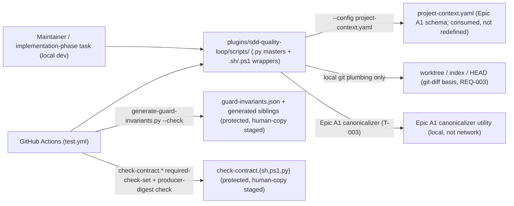
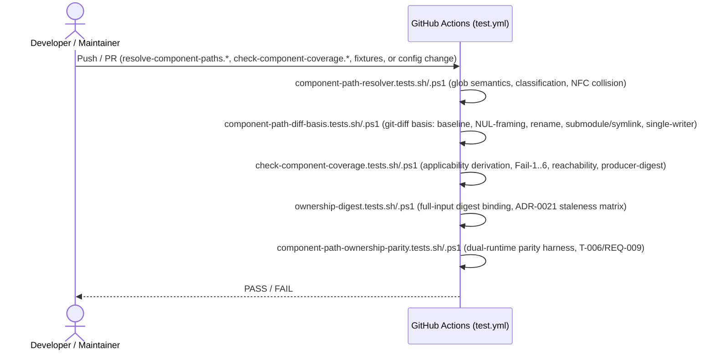

# Infrastructure Specification: epic-191-a3-path-ownership

No new runtime deployment. This document expands design.md's Deployment /
CI Plan, Architecture, and Data Plan into the review harness's canonical
layer-file shape; it introduces no new infrastructure judgment beyond what
those sections already fix.

## Deployment Topology

No cloud, no region, no network boundary — this feature calls only local
`git` plumbing commands and (T-003) a local Epic A1 canonicalizer utility;
no network call, no external service, no `gh` invocation (design.md External
Integrations: "None"). Scripts live under the same
`plugins/sdd-quality-loop/scripts/` script tree design.md's Data Plan cites
for `check-component-coverage.py` (`plugins/sdd-quality-loop/scripts/check-component-coverage.py`),
plus new `tests/` fixtures/suites under `tests/fixtures/component-path-ownership/`
(design.md Components). Design.md does not state an explicit directory path
for `resolve-component-paths.py` beyond this same script tree, so no more
specific path is asserted here. Fault domain: a single script invocation (CI
job or local script run); there is no shared/long-running service to carry a
fault domain of its own.

## CI/CD Sequence

The five new `.sh`/`.ps1` suite pairs (`component-path-resolver`,
`component-path-diff-basis`, `check-component-coverage`, `ownership-digest`,
`component-path-ownership-parity`) register in `tests/run-all.sh`/`.ps1`
(direct edit) and stage their CI step additions into
`.github/workflows/test.yml` via human-copy (INV-010). No new CI job/matrix
dimension is introduced — the new suites run in the existing deterministic,
3-OS lane alongside `agent-model-routing`, `render-agent-frontmatter`, etc.
(design.md Deployment / CI Plan, verbatim). The
`component-path-ownership-parity` suite (T-006/REQ-009) is the dual-runtime
parity harness among these five — it feeds identical fixture+argv directly
to the two product wrapper pairs (`resolve-component-paths.{sh,ps1}`,
`check-component-coverage.{sh,ps1}`) and diffs their canonical normalized
stdout JSON / exit code / WARN category / argv pass-through directly,
running as part of this same CI sequence, not a separate lane.

## Environments

| Environment | URL | Auth | Trigger | Classification | Promotion Rule |
|---|---|---|---|---|---|
| local dev (monorepo checkout) | `plugins/sdd-quality-loop/scripts/` + `tests/` (repo-relative) | OS user (filesystem) | manual script invocation / `tests/run-all.sh`/`.ps1` | internal | PR + CI green |
| CI (GitHub Actions `test.yml`) | N/A — ephemeral runner | GitHub Actions default | push / PR | internal | required check before merge (Protected-File Statement's `test.yml` wiring) |
| staging / production | N/A | — | — | — | N/A — no runtime service, no cloud deployment (design.md External Integrations: "None"; Technical Summary describes no new runtime service) |

design.md does not describe any packaged/standalone-install distribution
model for this feature (unlike epic-190-a2's Registry, which is vendored
into installed plugin layouts) — no such row is included here.

## Infrastructure as Code

N/A — no cloud. Every deliverable is a static script or test-fixture file
added to the existing `plugins/sdd-quality-loop/` script tree. No
Terraform/IaC module is introduced by this feature.

## Scaling Strategy

N/A — no runtime service, no concurrency model of its own. Each script
(`resolve-component-paths`, `check-component-coverage`, and the
`--diagnose` subcommand) is a single, deterministic, synchronous CLI
invocation (design.md Architecture; API / Contract Plan).

## Service Level Objectives

N/A — no live service to hold an availability/latency SLO. The closest
analog is a correctness objective already fixed as a design contract rather
than a measured runtime signal: byte-identical output across `.sh`/`.ps1`
invocations of the same wrapper for identical fixture+argv (REQ-009's
dual-runtime parity harness; design.md's "Canonical normalized stdout JSON
form"; AC-050, AC-051).

## Data Residency and Retention

| Entity | Residency | Retention | Backup | Deletion Verification | REQ | AC |
|---|---|---|---|---|---|---|
| Gate verdict / evidence record (`check-component-coverage-verdict/v1`, design.md Data Plan) | repository working tree / CI artifact (consumed by `quality-gate`'s evidence bundle) | design.md does not define a separate retention policy for this record beyond `quality-gate`'s own existing evidence-bundle convention — not restated or invented here | git remote(s) — no separate backup mechanism is designed | not applicable, no delete operation exists in scope | REQ-004 | AC-026, AC-027, AC-054 |
| `specs/epic-191-a3-path-ownership/human-copy/` staged files + `MANIFEST.sha256` (ten entries) | repository working tree (git) | git-versioned, "committed as a review artifact — never deleted by any test" (design.md Data Plan) | git remote(s) | not applicable, "never deleted by any test" (design.md Data Plan) | REQ-004 | AC-036 |

No database, no migration, no runtime storage anywhere in this feature
(design.md Data Plan).

## Observability

| Logs | Traces | Metrics | Alert | Owner | Runbook |
|---|---|---|---|---|---|
| `check-component-coverage`'s Gate verdict / evidence record itself — `schema`, `state`, `fail_conditions[]`, `warnings[]` fields (design.md Data Plan) — is the observability signal for this feature; `resolve-component-paths --diagnose` emits Fail-1/3/5/6-conditional findings for early feedback (design.md API / Contract Plan) | N/A — no distributed request, single-process CLI invocation | N/A — no running service to emit a metric; CI pass/fail on `tests/run-all.sh`/`.ps1` and the five new suites is the closest observable signal | CI failure on any `test.yml` step (design.md Deployment / CI Plan) | Implementation task owner | design.md describes no logging/tracing/runbook infrastructure beyond the evidence record and CI pass/fail signal above; none is invented here |

## Cost Estimate

N/A — no cloud cost. Every deliverable runs inside the repository's existing
CI compute (`test.yml`, already provisioned) and on local
developer/maintainer machines; no new infrastructure spend is introduced
(design.md External Integrations: "None"; Technical Summary describes no new
runtime service).

## Rollback

- Trigger: a CI test failure in any of the five new suites
  (`component-path-resolver`, `component-path-diff-basis`,
  `check-component-coverage`, `ownership-digest`,
  `component-path-ownership-parity`), or a regression discovered post-merge.
- Unprotected-file changes (the new scripts, tests, fixtures, the new ADR,
  `CHANGELOG.md` entries, `risk-gate-matrix.md`'s direct edit, and
  `tests/run-all.sh`/`.ps1` registration) revert via a standard `git revert`
  of the offending commit — no special procedure is designed beyond that
  (mirroring design.md's own framing of these as direct, unprotected edits).
- Protected-file changes — the two human-copy bundles design.md's
  Protected-File Statement names (situation 1: the six-file
  `guard-invariants.json`/generator/generated-siblings/`test.yml` bundle;
  situation 2: the three-file `check-contract.{sh,ps1,py}` bundle) — can
  only be reverted the same way they were applied: a human re-`cp`ing a
  corrected `human-copy/<real-relative-path>` candidate against its own
  `MANIFEST.sha256` entry (design.md Protected-File Statement); no
  automated rollback path exists for these by design, since no script this
  feature ships writes to a protected path directly.
- No data-compatibility concern: design.md Data Plan states human-copy
  artifacts are "never deleted by any test," and no migration exists.
- Verification after rollback: re-run the five `tests/*.tests.sh`/
  `.tests.ps1` pairs (design.md Test Strategy) to confirm the reverted state
  is consistent.

## Open Questions

- None — no new infrastructure judgment is introduced beyond what
  Deployment / CI Plan and Global Constraints already fix.
