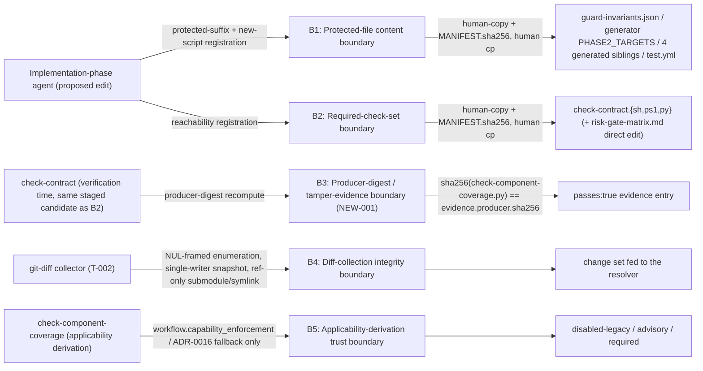

# Security Specification: epic-191-a3-path-ownership

This document expands design.md's Protected-File Statement, Design
Decisions ("Protected-gate-suffix registration + generator-inventory
parity", "Protected required-check-set registration, independent of suffix
protection"), Security Boundaries, and External Integrations ("None"), plus
requirements.md's own Security Boundaries section, into the review harness's
canonical layer-file shape. It introduces no new security judgment beyond
what those sections already fix; every boundary, mitigation, and REQ/AC/TEST
reference below traces to design.md or requirements.md/acceptance-tests.md
content approved at Spec-Review-Status: Passed.

Framing (design.md External Integrations: "None. This feature calls only
local `git` plumbing commands and (T-003) a local Epic A1 canonicalizer
utility — no network call, no external service, no `gh` invocation."): this
feature's attack surface is entirely local — filesystem and git-plumbing
only. Its security-relevant boundaries are (1) protected-file content
integrity for the new Gate script's own suffix registration, (2)
required-check-set reachability independent of that content protection, (3)
evidence producer-digest tamper-evidence for the same registration, (4)
git-diff-collection integrity (NUL framing, snapshot consistency, and the
submodule/symlink reference-only boundary), and (5) Gate-applicability
derivation trust (never file-presence-selected) — the five boundaries B1-B5
below.

## Trust Boundaries

| Boundary | Source | Destination | Assets | Validation | AuthN/AuthZ | REQ | AC |
|---|---|---|---|---|---|---|---|
| B1 — Protected-file content boundary | Implementation-phase agent (proposed edit) | `guard-invariants.json`, `generate-guard-invariants.py` (`PHASE2_TARGETS` tuple), 4 generated siblings, `.github/workflows/test.yml` (situation 1, six files) **and** the new `check-component-coverage.{sh,ps1,py}` suffix registration itself (situation 3) | protected-file content integrity for the six-file bundle plus the new-suffix registration | staged under `specs/epic-191-a3-path-ownership/human-copy/<real-relative-path>` + `MANIFEST.sha256`; human `cp` + SHA-256 verification; `generate-guard-invariants.py --check` must exit 0 (design.md Protected-File Statement situations 1 and 3) | human-only `cp` action; the guard is the existing repository-wide `guard_invariants.py`, not new to this feature | REQ-004 | AC-036 |
| B2 — Reachability / required-check-set boundary | Implementation-phase agent | `check-contract.{sh,ps1,py}` (already R-10 protected) + `risk-gate-matrix.md` (unprotected, direct edit) | required-check-set reachability (`check-component-coverage` registered at `high`/`critical` tier) | staged human-copy + `MANIFEST.sha256` for `check-contract.*`; `risk-gate-matrix.md` direct edit kept in sync per `tests/gates.tests.sh` T-003's existing invariant (design.md Protected-File Statement situation 2; INV-017) | human-only `cp` action for `check-contract.*`; direct agent edit for `risk-gate-matrix.md` (unprotected) | REQ-004 | AC-035 |
| B3 — Producer-digest / tamper-evidence boundary (NEW-001) | `check-contract` (verification time, same staged candidate as B2) | `check-component-coverage` evidence record's `producer.sha256` field | tamper-evidence / footgun-prevention for evidence authenticity claims | independently recomputes the live sha256 of `check-component-coverage.py`, rejects a `passes:true` entry whose `producer.sha256` does not match or is absent (design.md Protected-File Statement situation 2 final paragraph; NEW-001) | N/A — deterministic script-level check, not an authentication mechanism; scoped to footgun-prevention/tamper-evidence per the ADR-0019 two-tier defense scope, not unconditional adversarial-agent-proof reachability | REQ-004 | AC-054, AC-055 |
| B4 — Diff-collection integrity boundary | git-diff collector (T-002, invoked by the `.sh`/`.ps1` wrappers) | resolver's change set / ownership-classification input | diff-collection integrity (path framing, snapshot consistency, submodule/symlink reference-only boundary) | NUL-safe path framing (`-z` on every path-enumerating git invocation, raw-byte parsing, invalid-UTF-8 fails closed with a diagnostic); single-writer/TOCTOU snapshot check (HEAD OID + index/worktree fingerprint, one retry then fail-closed); submodule/symlink reference-only boundary (the resolver never dereferences a symlink or descends into a submodule's working tree) (requirements.md REQ-003, Security Boundaries) | N/A — filesystem/git-plumbing-only boundary, same OS-user boundary as every other script in this plugin | REQ-003 | AC-021, AC-024, AC-025 |
| B5 — Applicability-derivation trust boundary | `check-component-coverage` (applicability derivation) | derived state (`disabled-legacy`/`advisory`/`required`) | Gate-applicability integrity (never file-presence-derived) | reads only `workflow.capability_enforcement`/the ADR-0016 file-absence fallback, never Facet Manifest file presence; `disabled-legacy` still requires an honest, evidenced `state: "not-applicable (disabled-legacy)"` record (requirements.md Security Boundaries) | N/A — misrepresenting `capability_enforcement` to obtain a permissive outcome is a Project-Context approval/policy concern (ADR-0019), out of this feature's own Gate-logic scope | REQ-004 | AC-026, AC-027 |

## STRIDE Analysis

| Boundary | Threat | STRIDE | Abuse Case | Mitigation | Verification | REQ | AC |
|---|---|---|---|---|---|---|---|
| B1 | An agent edits a protected-suffix-registered path, or the new suffix registration itself, directly instead of staging via human-copy | Tampering / Elevation of Privilege | An implementation-phase agent writes directly to `guard-invariants.json` or `generate-guard-invariants.py`'s `PHASE2_TARGETS` tuple to register (or bypass) the new Gate script's protected-suffix entry | No script this feature ships writes to a protected path directly; the only sanctioned path is human-copy staging + `MANIFEST.sha256` + human `cp` + `generate-guard-invariants.py --check` (design.md Protected-File Statement situations 1, 3) | TEST-036 | REQ-004 | AC-036 |
| B2 | An agent deletes or renames the unprotected `quality-gate/SKILL.md` invocation line, or substitutes an unregistered replacement script, to bypass the Gate's reachability without touching protected suffix content | Elevation of Privilege / Tampering | The `## Process` bullet invoking `check-component-coverage` is deleted or renamed; the Gate script's content stays protected but is never invoked | `check-component-coverage` is registered as a required contract-check id in `check-contract`'s protected hardcoded tier-minimum set for `high`/`critical` (independent of SKILL.md's own text), staged via human-copy (design.md Protected-File Statement situation 2; INV-017) | TEST-035 | REQ-004 | AC-035 |
| B3 | An unprotected caller is replaced and paired with a fabricated same-id `passes:true` evidence entry pointing at any existing file | Repudiation / Tampering | A substituted script produces a `passes:true` `check-component-coverage` evidence entry whose `producer.sha256` does not correspond to the real `check-component-coverage.py` (or omits `producer` entirely) | `check-contract`'s staged candidate independently recomputes the live sha256 of `check-component-coverage.py` and rejects the entry on mismatch or absence (NEW-001; two-tier defense scope, ADR-0019: footgun prevention and tamper-evidence, not unconditional adversarial-agent-proof reachability — that depends on the external boundary of protected files, the `high`/`critical` HMAC-signed evidence bundle, branch protection/CODEOWNERS, and human review) | TEST-054, TEST-055 | REQ-004 | AC-054, AC-055 |
| B4 (NUL framing) | A path containing invalid-UTF-8 bytes, or a literal TAB/LF, is silently truncated, misparsed, or dropped by a line-oriented diff parse, causing ownership classification to silently miss or misattribute a changed path | Tampering / Information Disclosure | A crafted filename with invalid-UTF-8 bytes is used to evade Fail-1/Fail-2 classification | every path-enumerating git plumbing invocation uses NUL-delimited output (`-z`), parsed as raw bytes; invalid-UTF-8 fails closed with a diagnostic (requirements.md REQ-003) | TEST-021 | REQ-003 | AC-021 |
| B4 (submodule/symlink reference-only) | A diff smuggles in ownership-classification input the resolver's own repository does not control, via a dereferenced symlink or a submodule's own working tree | Tampering / Information Disclosure | A dirty-but-pointer-unchanged submodule, or a symlink target dereference, is used to inject content the resolver never actually classifies against its own declared ownership config | submodule (gitlink) and symlink entries are evaluated only for the reference/pointer change itself; the resolver never dereferences a symlink or descends into a submodule's working tree (requirements.md Security Boundaries, REQ-003) | TEST-024 | REQ-003 | AC-024 |
| B4 (single-writer/TOCTOU) | A mid-sequence mutation of HEAD or the index between the collector's own multi-command sequence produces a silently mixed-snapshot result | Tampering | A concurrent writer mutates the working tree/index between the collector's start and end snapshot, producing an inconsistent change set | HEAD OID + index/worktree fingerprint captured at start and end; one retry on mismatch, then fail-closed with a diagnostic (requirements.md REQ-003) | TEST-025 | REQ-003 | AC-025 |
| B5 | An agent forces a permissive or degraded Gate outcome merely by omitting a Facet Manifest file, or by setting `capability_enforcement: disabled-legacy` without an honest evidenced record | Elevation of Privilege / Tampering | A Facet Manifest file is omitted hoping the Gate silently degrades; or `capability_enforcement` is set to `disabled-legacy` to avoid genuine evaluation | applicability is derived solely from `workflow.capability_enforcement`/the ADR-0016 file-absence fallback, never Facet Manifest file presence — there is no degrade path left to force into; `disabled-legacy` still requires an honest, evidenced `state: "not-applicable (disabled-legacy)"` record (requirements.md Security Boundaries) | TEST-026, TEST-027 | REQ-004 | AC-026, AC-027 |

## Authentication Flow

N/A — this feature defines no authentication mechanism. Every actor is bound
by the local OS-user/filesystem boundary: an implementation-phase agent's
staged edit, a human maintainer's direct `cp`, a CI runner (`test.yml`), or a
script's own caller within the same process boundary (design.md External
Integrations: "None" — no network call, no `gh` invocation, no credential
anywhere in this feature).

## Authorization

| Actor / Role | Resource | Action | Decision Point | Default | Denial Evidence | REQ | AC |
|---|---|---|---|---|---|---|---|
| Implementation-phase agent | Protected paths (`guard-invariants.json`, `generate-guard-invariants.py`, generated siblings, `.github/workflows/test.yml`, `check-contract.{sh,ps1,py}`) | write (direct) | Protected-file guard (existing repository-wide `guard_invariants.py`, not new to this feature) | deny (agent write) | `guard_invariants.py`'s own rejection; the only sanctioned path is human-copy staging (requirements.md Roles and Permissions) | Protected-File Statement | AC-036 |
| Human maintainer | staged human-copy candidates (`human-copy/<real-relative-path>` + `MANIFEST.sha256`) | apply via `cp` + SHA-256 verification | Protected-File Statement's human-`cp` procedure | allow (human-only action) | N/A — this is the allow path (requirements.md Roles and Permissions) | Protected-File Statement | AC-036 |
| quality-gate evaluator | `check-component-coverage`'s Gate verdict | consume as part of the Implementation Gate; only `quality-gate` (or `lite-gate`) may mark a Task Done | requirements.md Roles and Permissions, "quality-gate evaluator" bullet (AGENTS.md invariant, unchanged by this feature) | allow (existing, unchanged mechanism) | not specified — no new denial-evidence mechanism is introduced by this feature | REQ-004 | — |

## Data Classification and Protection

| Entity | Classification | At Rest | In Transit | Retention | Deletion | Access Log | REQ | AC |
|---|---|---|---|---|---|---|---|---|
| Gate verdict / evidence record (`check-component-coverage-verdict/v1`) | internal — never embeds raw file contents from a changed path, only path strings and component ids, so it cannot itself become a channel for smuggling sensitive file content into a report artifact (design.md Security Boundaries) | repository working tree / CI artifact, consumed by `quality-gate`'s evidence bundle | filesystem/CI only, no network transmission (design.md External Integrations: "None") | not specified by design.md beyond `quality-gate`'s own existing evidence-bundle convention — no separate retention policy is defined for this record | not specified — no delete operation for this artifact is described in design.md | git commit history / CI artifact log | REQ-004 | AC-026, AC-027, AC-054 |
| `ownership_digest` | internal, binding/provenance metadata (ADR-0021 `context_binding` block) — a content-identity digest, not a signature; it detects unintended change but does not authenticate who made it | same artifact as `resolver.version`/`resolver.rule_set_revision` in `context_binding`; design.md does not further specify a separate storage location | filesystem only, no network transmission | identical for every Feature sharing a config at a given commit; changes whenever any declared ownership entry or the matcher semantics version changes (design.md Data Plan) | not specified | not specified | REQ-005 | AC-037, AC-038 |
| `specs/epic-191-a3-path-ownership/human-copy/` staged files + `MANIFEST.sha256` (ten entries) | internal, protected-file staging artifact | git-versioned working tree | filesystem only | git-versioned indefinitely, "committed as a review artifact — never deleted by any test" (design.md Data Plan) | never deleted by any test (design.md Data Plan; Protected-File Statement final paragraph) | git commit history | REQ-004 | AC-036 |

Fail-6's Provider Binding check never reads `sdd/provider-bindings.yaml`'s
`credentials` block — out of scope; credential values are a Provider Binding
concern never surfaced to the resolver or Gate (requirements.md Security
Boundaries bullet 5). REQ: REQ-004.

## OWASP Mapping

| OWASP Risk | Exposure | Control | Verification | Owner |
|---|---|---|---|---|
| Broken Access Control | Protected-file write boundary (B1/B2: `guard-invariants.json` bundle, `check-contract.*` required-check-set bundle) | human-copy staging + `MANIFEST.sha256`; no direct agent write path (design.md Protected-File Statement) | AC-035, AC-036 | Implementation task owner |
| Software and Data Integrity Failures | Producer-digest verification (B3, NEW-001); NUL-framing/TOCTOU integrity (B4) | `check-contract`'s producer-digest recompute + rejection on mismatch/absence; NUL-safe path framing; single-writer/TOCTOU snapshot check | AC-054, AC-055, AC-021, AC-025 | Implementation task owner |
| Security Misconfiguration | Rejects file-presence-driven mode selection, ADR-0016 compliance (B5) | `capability_enforcement`-derived three-state applicability, never Facet Manifest file presence | AC-026, AC-027 | Implementation task owner |
| Cryptographic Failures | N/A — this feature performs content-identity hashing (sha256, via `check-contract`'s producer-digest recompute and Epic A1's canonicalizer for `ownership_digest`) for drift/tamper *detection*, not authenticity or signing; it defines no signing key and carries no credential | — | — | — |
| Identification and Authentication Failures | N/A — no authentication mechanism anywhere in this feature (design.md External Integrations: "None"); every actor is bound by the local OS-user/filesystem boundary | design review | — | — |

## Secrets Management

- This feature introduces no secret, credential, or key of any kind.
- Fail-6 explicitly never reads the `credentials` block of
  `sdd/provider-bindings.yaml` (requirements.md Security Boundaries bullet
  5) — credential values are a Provider Binding concern never surfaced to
  the resolver or Gate.
- `ownership_digest` is a content-identity digest computed via Epic A1's
  canonicalizer, not a signature or credential; it detects unintended
  change, it does not authenticate who made the change.
- No script this feature ships reads an environment variable, a `.env`
  file, or any key-material-bearing input — none is referenced anywhere in
  design.md.

## SBOM and Supply Chain

- No new external (npm/pip/etc.) package dependency is introduced. This
  feature's scripts are added to the existing `plugins/sdd-quality-loop/`
  script tree and run on already-vendored runtimes: a Python master plus a
  thin `.sh`/`.ps1` wrapper pair per master (INV-008/INV-014 convention).
- Unlike epic-190-a2's digest generator, this feature introduces **no**
  `.js` wrapper at all — `resolve-component-paths` and
  `check-component-coverage` each ship only `.py` + `.sh`/`.ps1` (see
  frontend-spec.md's Technology Stack table).
- `resolve-component-paths.py` (T-003) calls Epic A1's canonicalizer as an
  imported dependency, not a vendored or reimplemented one (frontend-spec.md
  Dependencies) — no new package is introduced by this call.

## Security Tests

| Test | Boundary | Attack / Control | Expected Result | Evidence | AC |
|---|---|---|---|---|---|
| TEST-021 | B4 (NUL framing) | A TAB/LF-containing path, and a path with invalid-UTF-8 bytes, fed to every path-enumerating git invocation | TAB/LF path round-trips correctly; invalid-UTF-8 path fails closed with a diagnostic, never truncated/misparsed/dropped | `tests/component-path-diff-basis.tests.sh`/`.ps1` | AC-021 |
| TEST-024 | B4 (submodule/symlink reference-only) | Four fixtures: dirty-only submodule, gitlink OID change, symlink target-text change, referent-only content change | (a) not reported; (b) reported as the submodule path only; (c) reported for the symlink path only, target-text only; (d) not reported | `tests/component-path-diff-basis.tests.sh`/`.ps1` | AC-024 |
| TEST-025 | B4 (single-writer/TOCTOU) | A fixture mutates HEAD or the index mid-sequence | one retry, then a fail-closed diagnostic, never a silently mixed-snapshot result | `tests/component-path-diff-basis.tests.sh`/`.ps1` | AC-025 |
| TEST-026 | B5 | A fixture with a present manifest file but `capability_enforcement` deriving `disabled-legacy` | records `disabled-legacy` (no evaluation of that manifest), proving file presence is not a selector | `tests/check-component-coverage.tests.sh`/`.ps1` | AC-026 |
| TEST-027 | B5 | `disabled-legacy` derived-state execution | a real evidence record with `state: "not-applicable (disabled-legacy)"`, no Fail conditions evaluated, no WARN, exit 0 — genuine, not a placeholder | `tests/check-component-coverage.tests.sh`/`.ps1` | AC-027 |
| TEST-035 | B2 | A fixture deletes/renames the `quality-gate/SKILL.md` invocation, or substitutes an unregistered replacement script paired with a same-id, mismatched-digest `passes:true` evidence entry | the `high`/`critical` Gate still fails via `check-contract`'s protected required-check-set + producer-digest verification (footgun-prevention/tamper-evidence scope, not unconditional adversarial-agent reachability) | `tests/check-component-coverage.tests.sh`/`.ps1` | AC-035 |
| TEST-036 | B1 | Staged six-file candidate set (`guard-invariants.json`, `generate-guard-invariants.py`, four `generated/*` files) with a correct `MANIFEST.sha256` | `generate-guard-invariants.py --check` exits 0 against the staged tree; live files byte-unchanged before/after; a post-human-copy self-registration grep confirms the three `check-component-coverage.*` entries are present | `tests/check-component-coverage.tests.sh`/`.ps1` | AC-036 |
| TEST-054 | B3 | Every evidence record, in all three derived states, inspected for `schema`, `check_id`, `producer.sha256` | conformant fields present; a fixture with a mismatched or missing `producer.sha256` is rejected | `tests/check-component-coverage.tests.sh`/`.ps1` | AC-054 |
| TEST-055 | B3 | A substituted-script fixture paired with a stale/unrelated evidence file, `passes:true` | staged `check-contract.{sh,ps1,py}` candidate recomputes the live sha256 and fails the entry on mismatch | `tests/check-component-coverage.tests.sh`/`.ps1` (+ direct `check-contract` invocation) | AC-055 |

## Open Questions

- None — every boundary above traces to design.md's Protected-File
  Statement / Security Boundaries or requirements.md's Security Boundaries
  section already fixed at Spec-Review-Status: Passed; no new security
  judgment is introduced by this document.
