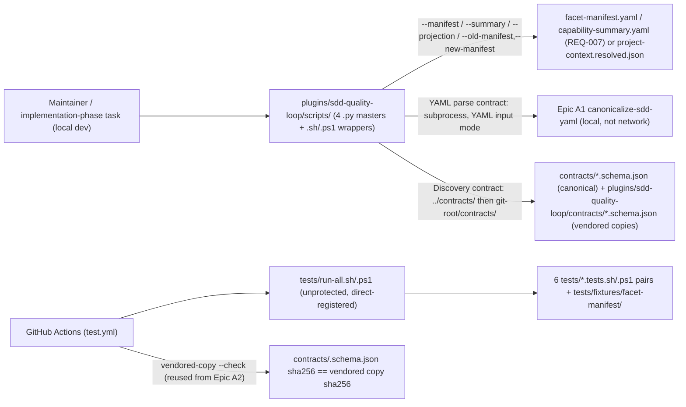
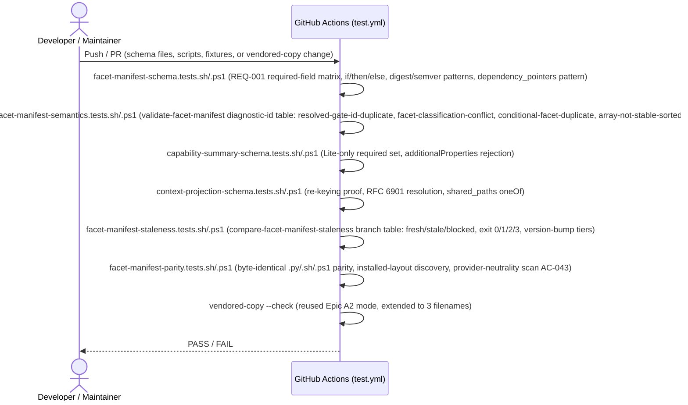

# Infrastructure Specification: epic-192-a4-facet-manifest

No new runtime deployment. This document expands design.md's Deployment /
CI Plan, Architecture, Data Plan, and Global Constraints into the review
harness's canonical layer-file shape; it introduces no new infrastructure
judgment beyond what those sections already fix.

## Deployment Topology

No cloud, no region, no network boundary — this feature's scripts call only
a local Epic A1 canonicalizer subprocess (`validate-facet-manifest`/
`validate-capability-summary` YAML parse contract) and local filesystem
reads; no network call, no external service, no `gh` invocation (design.md
External Integrations: "None. This feature has no dependency on any provider
API, cloud service, or external network resource"). Scripts live under the
existing `plugins/sdd-quality-loop/scripts/` tree (design.md Components); the
three canonical schema files live under repository-root `contracts/`, with
vendored packaged copies under `plugins/sdd-quality-loop/contracts/`
(design.md Components, Data Plan), plus new `tests/` fixtures/suites under
`tests/fixtures/facet-manifest/` (design.md Components). Fault domain: a
single script invocation (CI job or local script run); there is no
shared/long-running service to carry a fault domain of its own.

## CI/CD Sequence

The six new `.sh`/`.ps1` suite pairs (`facet-manifest-schema`,
`facet-manifest-semantics`, `capability-summary-schema`,
`context-projection-schema`, `facet-manifest-staleness`,
`facet-manifest-parity`) register in `tests/run-all.sh`/`.ps1` (direct edit,
unprotected, design.md Test Strategy) and stage their CI step additions into
`.github/workflows/test.yml` via human-copy (protected, matching Epic A2's
own precedent for CI-registration edits, AC-033). No new CI job/matrix
dimension is introduced — each validator's schema-conformance check and the
comparator's fresh/stale/blocked exit code are "wired the same way Epic A2's
`generate-gate-capabilities.py --check` is wired — a fixture-driven
`tests/run-all.sh`/`.ps1` registration, not a standalone CI job of its own"
(design.md Deployment / CI Plan, verbatim). The vendoring step that refreshes
`plugins/sdd-quality-loop/contracts/{facet-manifest,capability-summary,
context-projection}.schema.json` from their canonical `contracts/` originals
reuses Epic A2's already-CI-wired vendored-copy `--check` mode, extended to
cover three more filenames — three schema files, not four, since
`compare-facet-manifest-staleness` has no schema of its own to vendor
(design.md Deployment / CI Plan; Discovery contract).

## Environments

| Environment | URL | Auth | Trigger | Classification | Promotion Rule |
|---|---|---|---|---|---|
| local dev (monorepo checkout) | `plugins/sdd-quality-loop/scripts/` + `contracts/` + `tests/` (repo-relative) | OS user (filesystem) | manual script invocation / `tests/run-all.sh`/`.ps1` | internal | PR + CI green |
| installed-plugin layout | `plugins/sdd-quality-loop/contracts/*.schema.json` (vendored copy; no monorepo `contracts/`, no reachable `.git`) | OS user (filesystem) | script invocation via the Discovery contract's script-relative resolution (design.md Discovery contract; AC-032) | internal | vendored-copy `--check` drift gate (reused from Epic A2) |
| CI (GitHub Actions `test.yml`) | N/A — ephemeral runner | GitHub Actions default | push / PR | internal | required check before merge (`test.yml` wiring, human-copy staged, AC-033) |
| staging / production | N/A | — | — | — | N/A — no runtime service, no cloud deployment (design.md External Integrations: "None"; Technical Summary describes no new runtime service) |

Unlike a runtime service, the installed-plugin layout row above is a
*discovery* environment, not a deployment target: the same static scripts run
against a vendored schema copy when the monorepo `contracts/` tree and `.git`
are both absent (design.md Discovery contract, mirroring Epic A2's own
three-fixture per-runtime discovery proof, INV-018/AC-032).

## Infrastructure as Code

N/A — no cloud. Every deliverable is a static contract file, script, or
test-fixture file added to the existing `plugins/sdd-quality-loop/` tree and
repository-root `contracts/` tree. No Terraform/IaC module is introduced by
this feature.

## Scaling Strategy

N/A — no runtime service, no concurrency model of its own. Each script
(`validate-facet-manifest`, `validate-capability-summary`,
`validate-context-projection`, `compare-facet-manifest-staleness`) is a
single, deterministic, synchronous CLI invocation (design.md Architecture;
API / Contract Plan).

## Service Level Objectives

N/A — no live service to hold an availability/latency SLO. The closest
analog is a correctness objective already fixed as a design contract rather
than a measured runtime signal: byte-identical output (stdout, stderr, exit
code) across `.py`/`.sh`/`.ps1` invocations of the same script for identical
fixture+argv (design.md Diagnostic determinism contract: fixed
`(check-id, JSON-Pointer-path)` sort order, RFC 6901 path representation,
UTF-8/LF-only bytes, fixed exit codes; AC-031).

## Data Residency and Retention

| Entity | Residency | Retention | Backup | Deletion Verification | REQ | AC |
|---|---|---|---|---|---|---|
| `contracts/{facet-manifest,capability-summary,context-projection}.schema.json` (canonical) + `plugins/sdd-quality-loop/contracts/*` (vendored copies) | repository working tree (git) | git-versioned; content-frozen once design review passes (acceptance-tests.md "Post-review artifact freeze") | git remote(s) — no separate backup mechanism is designed | not applicable; no delete operation exists in scope | REQ-001/REQ-002/REQ-003 | AC-001, AC-012, AC-015 |
| `tests/fixtures/facet-manifest/` hand-authored fixture instances | repository working tree (git) | git-versioned | git remote(s) | not applicable | REQ-006 | AC-031, AC-032 |
| `specs/<feature>/facet-manifest.yaml`, `specs/<feature>/capability-summary.yaml` (REQ-007 storage-location convention) | repository working tree (git), per-Feature | git-versioned per Feature; no instance is committed by this feature itself — the convention applies to every future Feature once Epic A5 exists (design.md Components) | git remote(s) | not applicable; per-Feature artifact, reviewed per Feature | REQ-007 | AC-034 |

No database, no migration, no runtime storage anywhere in this feature
(design.md Data Plan: "Migration Strategy: none. Every artifact this epic
defines is wholly new").

## Observability

| Logs | Traces | Metrics | Alert | Owner | Runbook |
|---|---|---|---|---|---|
| Each validator's exit code (0/1) plus its `<script>: <check-id>: <detail>` diagnostic lines, and `compare-facet-manifest-staleness`'s `facet-manifest-staleness: <status>:<reason>` stdout verdict line / exit-3 stderr diagnostic (design.md API / Contract Plan; Diagnostic determinism contract) are the observability signal for this feature | N/A — no distributed request, single-process CLI invocation | N/A — no running service to emit a metric; CI pass/fail on `tests/run-all.sh`/`.ps1` and the six new suites is the closest observable signal | CI failure on any `test.yml` step (design.md Deployment / CI Plan) | Implementation task owner | design.md describes no logging/tracing/runbook infrastructure beyond the diagnostic lines and CI pass/fail signal above; none is invented here |

## Cost Estimate

N/A — no cloud cost. Every deliverable runs inside the repository's existing
CI compute (`test.yml`, already provisioned) and on local
developer/maintainer machines; no new infrastructure spend is introduced
(design.md External Integrations: "None"; Technical Summary describes no new
runtime service).

## Rollback

- Trigger: a CI test failure in any of the six new suites
  (`facet-manifest-schema`, `facet-manifest-semantics`,
  `capability-summary-schema`, `context-projection-schema`,
  `facet-manifest-staleness`, `facet-manifest-parity`), a vendored-copy
  drift-check failure, or a regression discovered post-merge.
- Unprotected-file changes (the three schema files, their vendored copies,
  the four scripts, tests, fixtures, `CHANGELOG.md` entries, and the
  `tests/run-all.sh`/`.ps1` registration) revert via a standard `git revert`
  of the offending commit — no special procedure is designed beyond that
  (mirroring design.md's framing of these as direct, unprotected edits).
- Protected-file changes — this feature adds no new entry to
  `guard-invariants.json`'s `protected_gate_suffixes` or
  `phase2_human_copy_targets` (design.md Protected-File Statement); the only
  protected surface it touches is the `.github/workflows/test.yml`
  registration, staged via human-copy under
  `specs/epic-192-a4-facet-manifest/human-copy/` with a `MANIFEST.sha256`
  entry (AC-033). That change can only be reverted the same way it was
  applied — a human re-`cp`ing a corrected candidate — since no script this
  feature ships writes to a protected path directly.
- No data-compatibility concern: design.md Data Plan states this feature
  performs "no write against" any Epic A1/A2/A3 artifact and defines no
  migration; every schema and script is wholly new.
- Verification after rollback: re-run the six `tests/*.tests.sh`/
  `.tests.ps1` pairs (design.md Test Strategy) and the vendored-copy
  `--check` to confirm the reverted state is consistent. `scripts/
  bump-version.sh`'s existing release gate is unaffected by this feature
  (design.md Deployment / CI Plan; REQ-008).

## Open Questions

- None new to infrastructure. OQ-002 (Context Projection's regeneration
  cadence — CI-gated drift check vs. on-demand) is explicitly an Epic A5
  CI-wiring decision, not a decision this feature's own schema/validator
  design makes (requirements.md Open Questions; design.md Open Questions).
