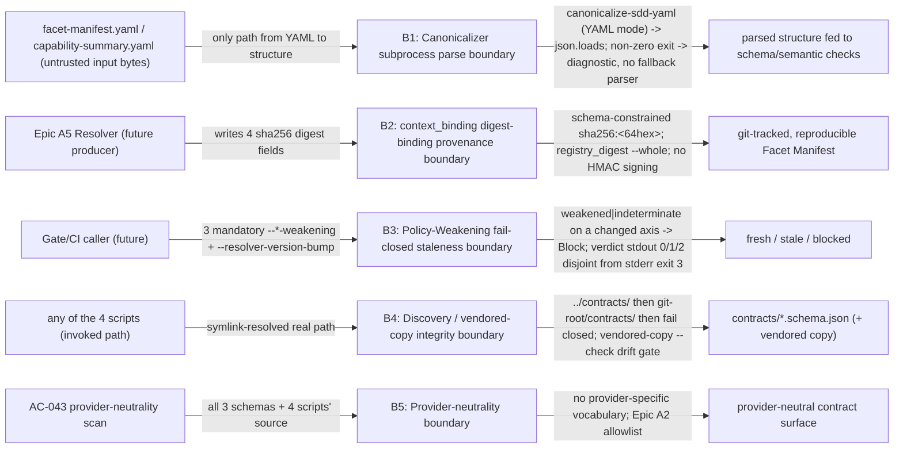

# Security Specification: epic-192-a4-facet-manifest

This document expands design.md's Security Boundaries, Protected-File
Statement, External Integrations ("None"), the `compare-facet-manifest-
staleness` contract, the YAML parse contract, and the Discovery contract,
plus requirements.md's own Security Boundaries section, into the review
harness's canonical layer-file shape. It introduces no new security judgment
beyond what those sections already fix; every boundary, mitigation, and
REQ/AC/TEST reference below traces to design.md or requirements.md/
acceptance-tests.md content approved at Spec-Review-Status: Passed.

Framing (design.md Security Boundaries; requirements.md Security Boundaries
bullet 1: "this feature defines schemas and read-only structural validators
over files already inside the repository's own trust boundary (git-tracked,
review-gated). `validate-*.py` scripts perform no network access, no dynamic
code execution, and no credential handling"): this feature's attack surface
is entirely local — filesystem reads plus one local canonicalizer subprocess.
It writes nothing (design.md Security Boundaries: `compare-facet-manifest-
staleness` "reads only its two `--old-manifest`/`--new-manifest` file
arguments and its CLI flags, performs no subprocess-of-its-own beyond the
same canonicalizer invocation the YAML parse contract already covers, and
writes nothing"). Its security-relevant boundaries are (1) the canonicalizer
subprocess parse boundary, (2) the `context_binding` digest-binding
provenance boundary, (3) the Policy-Weakening fail-closed staleness boundary,
(4) the schema-file discovery / vendored-copy integrity boundary, and (5) the
provider-neutrality boundary — the five boundaries B1-B5 below.

## Trust Boundaries

| Boundary | Source | Destination | Assets | Validation | AuthN/AuthZ | REQ | AC |
|---|---|---|---|---|---|---|---|
| B1 — Canonicalizer subprocess parse boundary | untrusted `facet-manifest.yaml`/`capability-summary.yaml` input bytes | `validate-facet-manifest`/`validate-capability-summary` parsed structure | parse-path integrity; no hand-rolled parser, no dynamic code execution | the only YAML→structure path is the `canonicalize-sdd-yaml` subprocess (YAML input mode) followed by `json.loads`; a non-zero canonicalizer exit is surfaced as the validator's own `canonicalizer-invocation-failed` diagnostic, never silently swallowed or retried with a fallback parser (design.md "YAML parse contract"; requirements.md Security Boundaries bullet 1) | N/A — local subprocess, same OS-user/filesystem boundary as every other script in this plugin | REQ-006 | AC-031 |
| B2 — `context_binding` digest-binding provenance boundary | Epic A5 Resolver (future producer of the four digests) | a Facet Manifest's `context_binding` block | drift/tamper *detection* provenance for `full_context_revision`/`projection_sha256`/`registry_digest`/`ownership_digest` | schema constrains every digest to `^sha256:[0-9a-f]{64}$`; `registry_digest` binds via `--whole` (never a fragment) so no two Resolver implementations disagree on a Manifest's digest for identical Registry state; Manifest integrity is a function of it being a git-tracked, reproducible, reviewer-regenerable artifact, not an HMAC-signed one — a deliberate scope boundary, not an oversight (requirements.md Security Boundaries bullet 2; design.md Design Decisions "`registry_digest` binds via `--whole`"; API / Contract Plan `sha256Digest`) | N/A — no signing key, no credential; this feature performs no HMAC/approval-sidecar protection of its own (requirements.md Security Boundaries bullet 2) | REQ-001/REQ-004 | AC-009 |
| B3 — Policy-Weakening fail-closed staleness boundary | Gate/CI caller invoking `compare-facet-manifest-staleness` | the `fresh`/`stale`/`blocked` verdict | staleness-verdict safety: a weakening must never be laundered into a `fresh`/`stale` verdict | all three `--*-weakening` flags (projection/registry/ownership) and `--resolver-version-bump` are mandatory, three-valued (`weakened`/`not-weakened`/`indeterminate`), never expressed by flag omission; a changed axis reporting `weakened` or `indeterminate` → **`blocked`** (fail-closed), evaluated before any version-tier branch; the verdict channel (stdout, exit 0/1/2) is disjoint from the diagnostic channel (stderr, exit 3) (design.md `compare-facet-manifest-staleness` contract; Design Decisions "Policy-Weakening short-circuit is uniform … fails closed", "The three `--*-weakening` inputs are mandatory"; requirements.md REQ-004) | N/A — deterministic classifier; misrepresenting an axis verdict to obtain a permissive outcome is a caller/detector concern, out of this comparator's own scope | REQ-004 | AC-023, AC-024, AC-040, AC-044 |
| B4 — Discovery / vendored-copy integrity boundary | any of the four scripts (invoked path, possibly installed-plugin layout) | the resolved `contracts/<filename>.schema.json` used for validation | schema-file resolution integrity; no ambiguous or silently-wrong schema source | symlink-resolved real path → script-relative `../contracts/<filename>` → `git rev-parse --show-toplevel`/`.git` walk → fail closed with a diagnostic naming both attempted paths; per-artifact version check requires a present `$schema` keyword and a matching `$id`; the vendoring `--check` mode compares each canonical `contracts/<filename>` sha256 against its vendored `plugins/sdd-quality-loop/contracts/<filename>` counterpart (design.md Discovery contract; Deployment / CI Plan) | N/A — filesystem-only resolution, same OS-user boundary | REQ-006 | AC-032 |
| B5 — Provider-neutrality boundary | this feature's own three schema files + four scripts' source | the committed contract surface | provider-name neutrality (ADR-0018 boundary) | no field name or enum value in `facet-manifest.schema.json`/`capability-summary.schema.json`/`context-projection.schema.json`, nor any string literal in the four scripts' source, names a cloud provider, product, or distribution channel; AC-043's scan asserts this against the same allowlist Epic A2's provider-contamination check uses, with a clean fixture proving no false-positive on this feature's own provider-neutral vocabulary (e.g. `distribution_channels`) (requirements.md Security Boundaries bullet 3; design.md; AC-043) | N/A — static-content scan, not an access-control mechanism | Security Boundaries | AC-043 |

## STRIDE Analysis

| Boundary | Threat | STRIDE | Abuse Case | Mitigation | Verification | REQ | AC |
|---|---|---|---|---|---|---|---|
| B1 | A crafted YAML input triggers a fallback/hand-rolled parser path, or a canonicalizer failure is silently swallowed and a partial/guessed structure is validated as if clean | Tampering / Elevation of Privilege | A malformed `facet-manifest.yaml` that the canonicalizer rejects is instead parsed by a lenient fallback, letting a non-canonical document pass schema conformance | the single YAML→structure path is the canonicalizer subprocess + `json.loads`; a non-zero canonicalizer exit fails closed as a `canonicalizer-invocation-failed` diagnostic, never swallowed or retried with a fallback parser; no dynamic code execution anywhere (design.md "YAML parse contract"; requirements.md Security Boundaries bullet 1) | design.md YAML parse contract; diagnostic output covered by the `facet-manifest-parity` suite's byte-identical diagnostic check | REQ-006 | AC-031 |
| B2 | A digest field is populated with a non-digest value, or `registry_digest` is bound to a fragment, so two Resolvers disagree on a Manifest's own identity for identical Registry state | Spoofing / Tampering | A Resolver writes a truncated or fragment-scoped `registry_digest`, making a stale Manifest appear to bind a different Registry state than it actually consumed | schema rejects any `context_binding` digest not matching `^sha256:[0-9a-f]{64}$`; `registry_digest` is fixed to `--whole` at this feature's level (not left to Epic A5), by the identical soundness argument as Epic A3's `ownership_digest` (design.md Design Decisions; API / Contract Plan) | TEST-009 (digest pattern + minItems) | REQ-001 | AC-009 |
| B3 | A caller under-specifies a weakening axis (typo'd/omitted flag) or a Registry/ownership edit routes through the ordinary comparison because "no detector exists yet", so a real weakening passes as `fresh`/`stale` | Elevation of Privilege / Tampering | An axis whose digest changed is treated as never-weakening (or defaults to `indeterminate` by accident), and a policy weakening is laundered past the staleness gate | the short-circuit is uniform across all three axes and fails closed on `indeterminate`; all three `--*-weakening` flags are mandatory, so omission is an **argument error** (exit 3), never a silent `indeterminate`; the Block branch runs before the version-tier branch, so a Block always wins over a major-tier forced-stale (design.md `compare-facet-manifest-staleness` contract, branch order; Design Decisions "Policy-Weakening short-circuit is uniform … fails closed", "mandatory and three-valued") | TEST-023, TEST-024, TEST-040 | REQ-004 | AC-023, AC-024, AC-040 |
| B3 | A malformed invocation (missing flag, out-of-enum value, tier inconsistent with the two manifests, or schema-invalid manifest) is represented as a fourth pseudo-verdict on stdout, so a caller branching on the verdict cannot tell "blocked" from "the input was malformed" | Tampering / Repudiation | An implementer emits `error` as a stdout status or reuses exit 2 for a malformed argument, letting a broken invocation be mistaken for a genuine `blocked` verdict | the verdict channel (stdout, exit 0/1/2, mandatory `facet-manifest-staleness: <status>:<reason>`) is kept disjoint from the diagnostic channel (stderr, exit 3, `facet-manifest-staleness: <check-id>: <detail>`); no stdout verdict line is produced on an exit-3 invocation, byte-identical across all three runtimes (design.md `compare-facet-manifest-staleness` contract; Diagnostic determinism contract) | TEST-044, TEST-046 | REQ-006 | AC-044, AC-046 |
| B4 | A script resolves a schema file via a symlink or a stale vendored copy that drifted from its canonical `contracts/` original, validating against the wrong shape | Tampering | An installed-plugin layout ships a vendored `plugins/sdd-quality-loop/contracts/*.schema.json` that no longer matches the canonical `contracts/*.schema.json`, so a Manifest passes against a stale schema | Discovery contract resolves the invoking script's symlink-resolved real path first, then `../contracts/`, then git-root `contracts/`, else fails closed naming both attempted paths; the vendored-copy `--check` mode gates drift between canonical and vendored copies (design.md Discovery contract; Deployment / CI Plan) | TEST-032 (installed-layout discovery) | REQ-006 | AC-032 |
| B5 | A provider-specific field name or enum value is introduced into a schema or script, coupling this provider-neutral contract surface to a named cloud provider/product | Tampering / Information Disclosure | A future edit adds an AWS/GCP/Azure-specific enum value to `distribution_channels` or a provider product name to a script diagnostic | AC-043's scan of all three schema files and four scripts' source against Epic A2's provider-neutrality allowlist finds no hit; a clean fixture proves no false-positive on provider-neutral vocabulary such as `distribution_channels` (requirements.md Security Boundaries bullet 3; design.md) | TEST-043 (provider-neutrality scan) | Security Boundaries | AC-043 |

## Authentication Flow

N/A — this feature defines no authentication mechanism. Every actor is bound
by the local OS-user/filesystem boundary: an implementation-phase agent's
proposed edit, a human maintainer's direct `cp` for the `test.yml`
registration, a CI runner (`test.yml`), or a script's own caller within the
same process boundary (design.md External Integrations: "None" — no network
call, no `gh` invocation, no credential anywhere in this feature).

## Authorization

| Actor / Role | Resource | Action | Decision Point | Default | Denial Evidence | REQ | AC |
|---|---|---|---|---|---|---|---|
| Implementation-phase agent | the three schema files, their vendored copies, the four scripts, tests, fixtures, `tests/run-all.sh`/`.ps1` (all unprotected) | write (direct edit, per-PR reviewed) | ordinary PR review + CI green; no protected-file guard applies (design.md Protected-File Statement: "This feature adds no new entry to `guard-invariants.json`") | allow (unprotected, reviewed) | N/A — this is the allow path; integrity is per-PR review + CI, not a write guard | REQ-006 | AC-031, AC-033 |
| Implementation-phase agent | `.github/workflows/test.yml` (protected) | write (direct) | existing repository-wide protected-file guard | deny (agent direct write) | staged human-copy under `specs/epic-192-a4-facet-manifest/human-copy/` + `MANIFEST.sha256`; only a human `cp` may apply it (design.md Deployment / CI Plan; AC-033) | REQ-006 | AC-033 |
| Human maintainer | staged `test.yml` human-copy candidate + `MANIFEST.sha256` | apply via `cp` + SHA-256 verification | Protected-File human-`cp` procedure (matching Epic A2's CI-registration precedent) | allow (human-only action) | N/A — this is the allow path | REQ-006 | AC-033 |
| Future Gate/CI caller | `compare-facet-manifest-staleness` verdict | consume `fresh`/`stale`/`blocked` (exit 0/1/2) | the caller's own enforcement path — no live wiring exists yet (Epic A5, Non-goals) | fail-closed `blocked` on any changed axis with a `weakened`/`indeterminate` verdict | the `blocked` verdict itself (design.md `compare-facet-manifest-staleness` contract) | REQ-004 | AC-023, AC-024 |

## Data Classification and Protection

| Entity | Classification | At Rest | In Transit | Retention | Deletion | Access Log | REQ | AC |
|---|---|---|---|---|---|---|---|---|
| Facet Manifest / Capability Summary / Context Projection instances | internal — carry component ids, facet names, gate ids, and digests only; no PII, no credential, no secret (design.md Resolver-purity constraint forbids any non-reproducible field) | repository working tree (git), per Feature (`specs/<feature>/*.yaml`; `project-context.resolved.json` at Epic A1's reserved path) | filesystem only, no network transmission (design.md External Integrations: "None") | git-versioned; no separate retention policy is defined for a per-Feature artifact beyond ordinary git history | not applicable; no delete operation exists in scope | git commit history | REQ-001/REQ-002/REQ-003 | AC-011, AC-013, AC-016 |
| `context_binding`'s four digest fields (`full_context_revision`, `projection_sha256`, `registry_digest`, `ownership_digest`) | internal, binding/provenance metadata — content-identity digests, not signatures; they detect unintended change but do not authenticate who made it (requirements.md Security Boundaries bullet 2) | same artifact as the Manifest they live in | filesystem only, no network transmission | identical for identical inputs (Resolver purity, ADR-0020 item 6); changes whenever the bound input changes | not applicable | git commit history | REQ-001/REQ-004 | AC-009 |
| `context-projection.schema.json`'s optional `provider_bindings_sha256` | internal, content-identity digest of `provider-bindings.yaml` (a hash of the whole file, never a surfaced credential value) | the Context Projection instance | filesystem only | as above | not applicable | git commit history | REQ-003 | AC-015 |
| `.github/workflows/test.yml` human-copy candidate + `MANIFEST.sha256` | internal, protected-file staging artifact | git-versioned working tree | filesystem only | git-versioned | not applicable | git commit history | REQ-006 | AC-033 |

No Facet Manifest, Capability Summary, or Context Projection field carries a
credential, secret, or PII value; the schemas define none, and Resolver
purity (design.md Global Constraints, ADR-0020 item 6) forbids any
non-reproducible field. REQ: REQ-001/REQ-002/REQ-003.

## OWASP Mapping

| OWASP Risk | Exposure | Control | Verification | Owner |
|---|---|---|---|---|
| Injection | YAML parse path (B1) | the only YAML→structure path is the canonicalizer subprocess + `json.loads`; no hand-rolled parser, no dynamic code execution, no `eval`; canonicalizer failure fails closed with a diagnostic (design.md YAML parse contract; requirements.md Security Boundaries bullet 1) | AC-031 | Implementation task owner |
| Software and Data Integrity Failures | Digest-binding provenance (B2); Policy-Weakening staleness (B3); vendored-copy drift + discovery (B4) | schema-constrained `sha256:<64hex>` digests + `registry_digest --whole`; fail-closed `blocked` on a changed, `weakened`/`indeterminate` axis; discovery fail-closed + vendored-copy `--check` drift gate | AC-009, AC-023, AC-024, AC-032 | Implementation task owner |
| Security Misconfiguration | Under-specified/misclassified staleness inputs (B3) | all three `--*-weakening` flags and `--resolver-version-bump` mandatory and three-valued; omission or a tier inconsistent with the two manifests is an exit-3 argument error, never a silent default (design.md Design Decisions; `compare-facet-manifest-staleness` contract) | AC-044, AC-046 | Implementation task owner |
| Broken Access Control | `.github/workflows/test.yml` protected registration (Authorization) | human-copy staging + `MANIFEST.sha256`; no direct agent write path to the protected CI file (design.md Deployment / CI Plan) | AC-033 | Implementation task owner |
| Cryptographic Failures | N/A — this feature performs content-identity hashing (sha256) for drift/tamper *detection* only, not authenticity or signing; it defines no signing key, no HMAC, and carries no credential (requirements.md Security Boundaries bullet 2) | — | — | — |
| Identification and Authentication Failures | N/A — no authentication mechanism anywhere in this feature (design.md External Integrations: "None"); every actor is bound by the local OS-user/filesystem boundary | design review | — | — |

## Secrets Management

- This feature introduces no secret, credential, or key of any kind. No
  script it ships reads an environment variable, a `.env` file, or any
  key-material-bearing input — none is referenced anywhere in design.md.
- `context_binding`'s four digests, and `context-projection.schema.json`'s
  optional `provider_bindings_sha256`, are content-identity digests computed
  via Epic A1's canonicalizer (in Epic A5's future generation step), not
  signatures or credentials; they detect unintended change, they do not
  authenticate who made it (requirements.md Security Boundaries bullet 2).
- This feature builds no code that reads `provider-bindings.yaml`'s
  credential contents: the Context Projection *generation* procedure (which
  would hash `provider-bindings.yaml` as a whole file) is explicitly Epic
  A5's future scope, not built by this feature (design.md API / Contract
  Plan, "Generation procedure" — "normative for Epic A5's future
  implementation, not built by this feature"); this feature defines only the
  `provider_bindings_sha256` field's shape, never surfacing a credential
  value.
- Facet Manifest / Capability Summary integrity is a function of it being an
  ordinary, git-tracked, human/CI-reviewed, reproducible file — not a
  cryptographically-protected one (unlike `sdd/project-context.approval.
  json`, which Epic A1 protects that way). This is a deliberate scope
  boundary, not an oversight (requirements.md Security Boundaries bullet 2).

## SBOM and Supply Chain

- No new external (npm/pip/etc.) package dependency is introduced. The four
  scripts' Python masters are stdlib-only — no `jsonschema` or other
  third-party dependency (design.md Global Constraints, INV-014); the
  schema-conformance check is a hand-rolled, closed-subset draft-07
  structural validator, matching `validate-capability-registry.py`'s own
  convention.
- No `.js` wrapper is introduced by any of the four scripts (design.md
  Global Constraints; `compare-facet-manifest-staleness` follows the
  validator precedent, `.py`+`.sh`+`.ps1` only, not the digest-generator
  one). See frontend-spec.md's Technology Stack table.
- Epic A1's canonicalizer is invoked as a subprocess (an imported internal
  dependency, same repository), not a vendored or reimplemented one, and not
  an external package (design.md YAML parse contract; frontend-spec.md
  Dependencies).
- The three schema files ship a canonical copy under `contracts/` plus a
  vendored packaged copy under `plugins/sdd-quality-loop/contracts/`, kept in
  sync by the vendored-copy `--check` drift gate reused from Epic A2
  (design.md Deployment / CI Plan; Discovery contract).

## Security Tests

| Test | Boundary | Attack / Control | Expected Result | Evidence | AC |
|---|---|---|---|---|---|
| TEST-009 | B2 | Each `context_binding` digest field fed a non-`sha256:<64-hex>` value; `dependency_pointers: []` | each malformed digest rejected at the schema level; empty `dependency_pointers` rejected (`minItems: 1`) | `tests/facet-manifest-schema.tests.sh`/`.ps1` | AC-009 |
| TEST-023 | B3 | A `weakened` verdict on any one axis (concretely the projection axis, the only axis with a live detector today) with byte-identical semantic output old-vs-new | Blocks unconditionally, comparison never evaluated | `tests/facet-manifest-staleness.tests.sh`/`.ps1` | AC-023 |
| TEST-024 | B3 | An identical `registry_digest`-changing edit, all three `--*-weakening` inputs supplied explicitly: (1) explicit `indeterminate` registry verdict; (2) explicit `not-weakened` verdict | (1) `blocked`/`weakening-verdict-indeterminate:registry` (fail-closed); (2) ordinary comparison path (forward compatibility) | `tests/facet-manifest-staleness.tests.sh`/`.ps1` | AC-024 |
| TEST-040 | B3 | Ownership-axis parity, both sub-cases with all three inputs explicit: (1) explicit `not-weakened`; (2) explicit `indeterminate` | (1) not stale; (2) `blocked`/`weakening-verdict-indeterminate:ownership` — fail-closed applies uniformly, not only to the registry axis | `tests/facet-manifest-staleness.tests.sh`/`.ps1` | AC-040 |
| TEST-044 | B3 | The CLI contract: mandatory `--old-manifest`/`--new-manifest`/all three `--*-weakening`/`--resolver-version-bump`; the `<status>:<reason>` stdout shape; the exit-0/1/2 verdict mapping; a fourth fixture class (missing flag, out-of-enum value, inconsistent tier, schema-invalid manifest) | verdicts on stdout exit 0/1/2; exit-3 error class emits a stderr-only diagnostic, no stdout verdict line, byte-identical across runtimes | `tests/facet-manifest-staleness.tests.sh`/`.ps1` | AC-044 |
| TEST-046 | B3 | A `--resolver-version-bump` value inconsistent with the actual `resolver.version`/`rule_set_revision` diff between the two manifests (patch-against-minor/major, minor-against-unchanged, minor-rule-set misdeclared), plus a consistent positive fixture per tier | inconsistent declaration rejected as an exit-3 argument error; consistent declaration accepted | `tests/facet-manifest-staleness.tests.sh`/`.ps1` | AC-046 |
| TEST-032 | B4 | Three fixtures per script (one per runtime) with only the packaged `plugins/sdd-quality-loop/contracts/*.schema.json` copy present (no monorepo `contracts/`, no reachable `.git`) | each resolves via the script-relative Discovery contract and validates correctly | `tests/facet-manifest-parity.tests.sh`/`.ps1` | AC-032 |
| TEST-043 | B5 | A scan of all three schema files and four scripts' own source against Epic A2's provider-neutrality allowlist; a clean fixture over this feature's own provider-neutral vocabulary (e.g. `distribution_channels`) | no allowlist hit; no false-positive on provider-neutral vocabulary | `tests/facet-manifest-parity.tests.sh`/`.ps1` | AC-043 |
| TEST-031 | B1 | `.py`/`.sh`/`.ps1` invocations of all four scripts against every fixture (including a canonicalizer-failure input and a Windows-style path argument) | byte-identical exit codes and diagnostic output, LF-only UTF-8, per the Diagnostic determinism contract — including the `canonicalizer-invocation-failed` diagnostic and the exit-3 stderr channel | `tests/facet-manifest-parity.tests.sh`/`.ps1` | AC-031 |

## Open Questions

- None — every boundary above traces to design.md's Security Boundaries /
  `compare-facet-manifest-staleness` contract / YAML parse contract /
  Discovery contract or requirements.md's Security Boundaries section already
  fixed at Spec-Review-Status: Passed; no new security judgment is introduced
  by this document.
