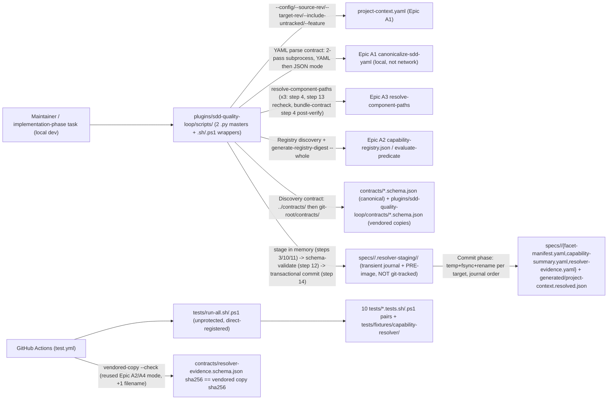

# Infrastructure Specification: epic-193-a5-capability-resolver

No new runtime deployment. This document expands design.md's Deployment /
CI Plan, Architecture, Data Plan (Migration Strategy; "B8" snapshot/
recheck), API / Contract Plan ("Resolver publication transactional bundle
contract" — Prepare/Journal/Commit/Post-publication-verification/
Complete, and its mandatory crash-recovery scan), and Global Constraints
into the review harness's canonical layer-file shape; it introduces no
new infrastructure judgment beyond what those sections already fix.

## Deployment Topology



No cloud, no region, no network boundary — this feature's scripts call
only local Epic A1/A2/A3 subprocesses and local filesystem reads/writes;
no network call, no external service, no `gh` invocation (design.md
External Integrations: "None. Every input and output this feature touches
is repository-local"). Scripts live under the existing `plugins/sdd-
quality-loop/scripts/` tree (design.md Components, two of them already
reserved-protected by Epic A1, security-spec.md B6); the one new schema
file lives under repository-root `contracts/`, with a vendored packaged
copy under `plugins/sdd-quality-loop/contracts/`; new `tests/` fixtures/
suites live under `tests/fixtures/capability-resolver/` (design.md Test
Strategy). Fault domain: a single script invocation (CI job or local
script run) — there is no shared/long-running service to carry a fault
domain of its own, though unlike Epic A2/A4's read-only validators, a
single invocation here spans a multi-target publication transaction whose
own crash-safety is this document's own "Journal Recovery" section,
below.

## CI/CD Sequence

```mermaid
sequenceDiagram
  actor D as Developer / Maintainer
  participant CI as GitHub Actions (test.yml)
  D->>CI: Push / PR (schema file, scripts, fixtures, or vendored-copy change)
  CI->>CI: resolve-project-context-cli.tests.sh/.ps1 (AC-001 required-flag matrix)
  CI->>CI: resolve-project-context-discovery.tests.sh/.ps1 (AC-002, AC-028 installed-layout discovery, 3 fixtures)
  CI->>CI: resolve-project-context-block.tests.sh/.ps1 (AC-010..AC-014, AC-038..AC-041, AC-047..AC-049, AC-055: 16-value diagnostic-id matrix + transactional/TOCTOU/recovery fixtures)
  CI->>CI: resolve-project-context-match.tests.sh/.ps1 (AC-006..AC-008, AC-016, AC-043, AC-052, AC-056: match/aggregation/facet-name fixtures)
  CI->>CI: resolve-project-context-lite.tests.sh/.ps1 (AC-009 track-exclusive Lite path)
  CI->>CI: resolve-project-context-parity.tests.sh/.ps1 (AC-022, AC-023 dual-runtime + determinism)
  CI->>CI: resolver-evidence-schema.tests.sh/.ps1 (AC-017 contract existence + $id convention)
  CI->>CI: validate-resolver-evidence.tests.sh/.ps1 (AC-021, AC-050, AC-051, AC-054: 12-value check-id matrix + provenance binding)
  CI->>CI: resolve-project-context-metamorphic.tests.sh/.ps1 (AC-045 completeness/invariance suite)
  CI->>CI: resolve-project-context-caller-contract.tests.sh/.ps1 (AC-042, AC-046, AC-053: caller-contract + anchor-fingerprint drift) [DEFERRED - not scheduled by this package, tasks.md; not part of AC-026's nine]
  CI->>CI: vendored-copy --check (reused Epic A2/A4 mode, +1 filename: resolver-evidence.schema.json)
  CI-->>D: PASS / FAIL
```

The **nine scheduled** new `.sh`/`.ps1` suite pairs register in `tests/run-all.sh`/`.ps1` — the tenth, `resolve-project-context-caller-contract`, is specified at contract level but deferred, and neither authored nor registered by this package (scoped 2026-08-27, human-approved, ruling D(2), matching AC-026 and `tasks.md`'s "Deferred, not scheduled")
(direct edit, unprotected, AC-026) and stage their CI step additions into
`.github/workflows/test.yml` via human-copy (protected, matching Epic
A1/A2/A4's own precedent for CI-registration edits) alongside the
`resolve-project-context.{py,sh,ps1}` content-population batch
(security-spec.md B6; design.md Protected-File Statement). No new CI job/
matrix dimension is introduced — each suite is "wired the same way Epic
A2's `generate-gate-capabilities.py --check` is wired — a fixture-driven
`tests/run-all.sh`/`.ps1` registration, not a standalone CI job of its
own" (design.md Deployment / CI Plan, verbatim pattern reused). The
vendoring step that refreshes `plugins/sdd-quality-loop/contracts/
resolver-evidence.schema.json` from its canonical `contracts/` original
reuses Epic A2/A4's already-CI-wired vendored-copy `--check` mode,
extended to cover one more filename (design.md Deployment / CI Plan;
Discovery contract).

## Environments

| Environment | URL | Auth | Trigger | Classification | Promotion Rule |
|---|---|---|---|---|---|
| local dev (monorepo checkout) | `plugins/sdd-quality-loop/scripts/` + `contracts/` + `tests/` + `specs/<feature>/` (repo-relative) | OS user (filesystem) | manual script invocation / `tests/run-all.sh`/`.ps1` | internal | PR + CI green |
| installed-plugin layout | `plugins/sdd-quality-loop/contracts/resolver-evidence.schema.json` (vendored copy; no monorepo `contracts/`, no reachable `.git`) | OS user (filesystem) | script invocation via the Discovery contract's script-relative resolution (design.md Discovery contract; AC-028) | internal | vendored-copy `--check` drift gate (reused from Epic A2/A4) |
| CI (GitHub Actions `test.yml`) | N/A — ephemeral runner | GitHub Actions default | push / PR | internal | required check before merge (`test.yml` wiring, human-copy staged, AC-026) |
| staging / production | N/A | — | — | — | N/A — no runtime service, no cloud deployment (design.md External Integrations: "None"; Technical Summary describes no new runtime service, no generator) |

Unlike a runtime service, the installed-plugin layout row above is a
*discovery* environment, not a deployment target: the same static scripts
run against a vendored schema copy when the monorepo `contracts/` tree
and `.git` are both absent (design.md Discovery contract, mirroring Epic
A2/A4's own three-fixture per-runtime discovery proof, AC-028).

## Infrastructure as Code

N/A — no cloud. Every deliverable is a static contract file, script, or
test-fixture file added to the existing `plugins/sdd-quality-loop/` tree
and repository-root `contracts/` tree, plus per-Feature generated
instances under `specs/<feature>/` and `generated/`. No Terraform/IaC
module is introduced by this feature.

## Scaling Strategy

N/A — no runtime service, no concurrency model of its own. Each script
(`resolve-project-context`, `validate-resolver-evidence`) is a single,
deterministic, synchronous CLI invocation (design.md Architecture; API /
Contract Plan). This feature explicitly assumes a **single writer** to a
given `--feature` value's own Resolver-owned output paths across one
invocation's own multi-step sequence (mirroring Epic A3's own single-
writer/snapshot contract) — a concurrent second invocation against the
identical `--feature`, or a concurrent human/tool edit to the same live
output paths outside this Resolver's own transactional commit, is out of
this feature's own scope (a future epic's own file-locking concern,
Non-goals); it is exactly the class of interference the crash-recovery
scan and the `snapshot-generation-mismatch`/`post-publication-generation-
mismatch` Blocks exist to detect and fail closed on, never to serialize
or prevent by themselves (design.md "Resolver publication transactional
bundle contract", "Single-writer assumption").

## Service Level Objectives

N/A — no live service to hold an availability/latency SLO. The closest
analogs are two correctness objectives already fixed as design contracts
rather than measured runtime signals: (1) byte-identical output (staged
artifact set, stdout, stderr, exit code) across `.py`/`.sh`/`.ps1`
invocations of the same script for identical fixture+argv, and repeated-
invocation determinism for the identical `.py` invocation (design.md
API / Contract Plan; REQ-005; AC-022, AC-023); (2) publication atomicity
— every live path this feature's Resolver could write is, after any
crash or failure, either fully absent, fully unchanged from its
pre-invocation state, or (Resolver Evidence only, on a Block at
whichever step it is reached) fully written — never observably torn, and
never mixed-generation **except** in the one unrecoverable-journal state
the recovery contract deliberately preserves for a human operator, which
no invocation proceeds past because `publication-journal-recovery` Blocks
fail-closed (scoped 2026-08-27, human-approved, ruling D(2); the earlier
unqualified wording contradicted that branch's own no-repair obligation,
and its "early Block" qualifier excluded the two transaction-phase Blocks
that also write Evidence) (security-spec.md
B2/B3).

## Data Residency and Retention

| Entity | Residency | Retention | Backup | Deletion Verification | REQ | AC |
|---|---|---|---|---|---|---|
| `contracts/resolver-evidence.schema.json` (canonical) + `plugins/sdd-quality-loop/contracts/resolver-evidence.schema.json` (vendored copy) | repository working tree (git) | git-versioned; content-frozen once design review passes (acceptance-tests.md, Draft-07 metaschema conformance note) | git remote(s) — no separate backup mechanism is designed | not applicable; no delete operation exists in scope | REQ-004 | AC-017 |
| `tests/fixtures/capability-resolver/` hand-authored fixture instances | repository working tree (git) | git-versioned | git remote(s) | not applicable | REQ-006 | AC-026, AC-027 |
| `specs/<feature>/{facet-manifest.yaml,capability-summary.yaml,resolver-evidence.yaml}`, `generated/project-context.resolved.json` (REQ-001/REQ-004 storage-location convention) | repository working tree (git), per-Feature (`generated/project-context.resolved.json` is repository-wide, one live instance, Full-track only) | git-versioned per Feature/repository; no instance is committed by this Phase-1 package itself — the convention applies to every future Feature once this Resolver is implemented (design.md Components) | git remote(s) | not applicable; per-Feature/repository artifact, reviewed via ordinary PR + the guarded atomic publication transaction | REQ-001, REQ-004 | AC-008, AC-009, AC-020 |
| `specs/<feature>/.resolver-staging/<batch-nonce>/{TRANSACTION.json, pre/<target-basename>}` (transaction journal + PRE-image backups) | repository working tree filesystem, **NOT git-tracked** — this feature's own equivalent of Epic A1's `sdd/.staging/` convention | transient — exists only during an in-flight or crash-interrupted publication transaction | none — this is itself the recovery mechanism, not a backed-up artifact | deleted at ordinary Complete, or converged-then-deleted by the next invocation's own mandatory crash-recovery scan; an unrecoverable state leaves it standing pending manual operator intervention (`publication-journal-recovery`) | REQ-001, REQ-002 | AC-047 |

No database, no migration, no runtime storage anywhere in this feature
(design.md Data Plan: "Migration Strategy: none. No database, no runtime
storage, no schema migration anywhere in this feature ... `contracts/
resolver-evidence.schema.json`, `specs/<feature>/resolver-evidence.yaml`,
and the one content-population target ... this feature's own future
implementation stages under human-copy are each a net-new, additive
artifact with no prior version to migrate from").

## Observability

| Logs | Traces | Metrics | Alert | Owner | Runbook |
|---|---|---|---|---|---|
| Each script's `capability-resolver: <check-id>: <detail>` / `resolver-evidence: <check-id>: <detail>` diagnostic lines to stderr, exit codes 0/1/2, and the persisted `diagnostics[]` array inside every Resolver Evidence instance (durable, git-tracked observability record, design.md API / Contract Plan; security-spec.md B5) are the observability signal for this feature | N/A — no distributed request, single-process CLI invocation per resolve; the closest analog is the dependency-invocation-order spy fixture (Test Strategy item 9(g)) that asserts subprocess call order at test time, not at runtime | N/A — no running service to emit a metric; CI pass/fail on `tests/run-all.sh`/`.ps1` and the nine scheduled new suites is the closest observable signal | CI failure on any `test.yml` step (design.md Deployment / CI Plan); at runtime, a live `specs/<feature>/.resolver-staging/*/TRANSACTION.json` naming a target another script is about to read is itself an operational signal a reader must check (`RESOLVER_PUBLICATION_IN_PROGRESS`, "Reader-side generation-consistency check") | Implementation task owner | design.md describes no logging/tracing/runbook infrastructure beyond the diagnostic lines, the Resolver-Evidence `diagnostics[]` record, and the Journal Recovery procedure below; none is invented here |

## Cost Estimate

N/A — no cloud cost. Every deliverable runs inside the repository's
existing CI compute (`test.yml`, already provisioned) and on local
developer/maintainer machines; no new infrastructure spend is introduced
(design.md External Integrations: "None"; Technical Summary describes no
new runtime service).

## Journal Recovery

This is the one infrastructure mechanism this feature introduces that no
prior sibling epic's own `infra-spec.md` needed (Epic A2/A3/A4 ship only
read-only validators or a single-file-emitting generator; this feature's
Resolver is this Epic set's first multi-target *writer*). Full mechanism
(design.md "Resolver publication transactional bundle contract",
"Crash-recovery scan", reusing Epic A1's own already-fixed protocol
shape isomorphically):

- **Mandatory, every invocation.** Immediately after argument validation
  (step 0) succeeds and before any Registry/ownership/Context-Projection
  work begins, every invocation scans `specs/<feature>/.resolver-staging/
  */TRANSACTION.json`, scoped to its own `--feature` value only (a stale
  journal under a *different* Feature's own staging directory is that
  Feature's own concern, never touched).
- **Absent** → proceed directly to step 1, no diagnostic.
- **Present** → re-hash every journal-listed target's CURRENT live bytes
  (or note `"ABSENT"`) and classify into one of four outcomes:
  - Every target's current hash equals its journal-recorded **POST**
    value → the transaction had, in fact, fully committed before an
    earlier crash (the crash landed between the last rename and the
    journal delete, or during post-publication verification after it had
    already passed) → **SAFE completion**: delete the stale journal,
    proceed to step 1.
  - Every target's current hash equals its journal-recorded **PRE** value
    (or both are `"ABSENT"`) → the transaction never began committing, or
    its own rollback had already fully completed before the crash →
    **SAFE abandonment**: delete the stale journal, proceed to step 1.
  - A **MIX** (at least one target already at POST, at least one other
    still at PRE or absent) → the exact partial-publish state this design
    must never leave standing. Roll **every** journal member,
    `resolver-evidence.yaml` included, BACK
    to its PRE-transaction state, using the journal's own `pre/
    <target-basename>` backup via the identical atomic-rename primitive —
    this branch is a **recoverable** MIX that converges and then proceeds
    into its own fresh resolve, so no Block is raised here and no Block
    record is written; the rollback-and-no-write scope rule governs
    Blocks and this branch is not one (corrected 2026-08-27: the
    ruling-D(2) sweep applied that rule here mechanically, inserting a
    Block-record clause into a branch that raises no Block, against
    AC-047's own every-target-back-to-PRE requirement; the direct
    Evidence Block record belongs only to the Unrecoverable branch below)
    (or deleting the live file, if its own PRE state was `"ABSENT"`),
    until every target is confirmed back at PRE — only then delete the
    journal, then proceed to step 1.
  - **Unrecoverable** — a named `pre/<target-basename>` backup is itself
    missing/unreadable, or a target's current live hash matches
    **neither** its journal-recorded PRE nor POST value → do **not**
    proceed to step 1; Block, `publication-journal-recovery`, exit 1,
    pending manual operator intervention. Per target, not globally
    (amended 2026-08-27, human-approved, ruling D(2), propagated here
    from `requirements.md`/`design.md`/`acceptance-tests.md` in the same
    commit): **every interrupted target other than
    `resolver-evidence.yaml` is left exactly as found** — no partial
    rollback and no repair is attempted once the journal is declared
    unconvergeable — **and `resolver-evidence.yaml` itself receives this
    invocation's own Block record**, written directly (`temp file +
    fsync + rename`, no staging area, no second journal) per REQ-001
    step (m) and AC-012's always-emitted rule.
- **Idempotent and re-entrant.** Every comparison is current-vs-journaled,
  never assumes prior recovery progress, so a crash *during* recovery is
  itself safely resumed by the next invocation (mirrors Epic A1's own
  recovery contract verbatim).
- **In-process variant.** An in-process write/fsync/rename failure caught
  during the Commit phase (steps 1-3 of the transactional bundle
  contract, as distinct from a later, uncaught crash) attempts this
  identical journal-based rollback itself, in-process, rather than
  deferring to the next invocation; if that in-process rollback does not
  fully succeed, the next invocation's own crash-recovery scan is the
  durable backstop regardless (design.md "Resolver publication
  transactional bundle contract").
- **Post-publication variant.** A mismatch caught by the post-publication
  verification step (after every rename has succeeded but before the
  journal is deleted) triggers the identical rollback, run in-process
  (the invocation is still alive to do it itself) rather than deferring
  (security-spec.md B3).

## Rollback

- **Trigger.** A CI failure in any of the nine scheduled new suites, a vendored-copy
  drift-check failure, a regression discovered post-merge, or — at
  runtime — a crash mid-transaction or an injected write/rename failure.
- **Unprotected-file changes** (the one schema file, its vendored copy,
  `validate-resolver-evidence.{py,sh,ps1}`, tests, fixtures, `CHANGELOG.
  md` entries, and the `tests/run-all.sh`/`.ps1` registration) revert via
  a standard `git revert` of the offending commit — no special procedure
  beyond that (mirroring design.md's framing of these as direct,
  unprotected edits, matching Epic A2/A4's own identical convention).
- **Protected-path changes** — the two paths inherited from Epic A1
  (`resolve-project-context.{py,sh,ps1}`, security-spec.md B6) can only be
  reverted the same way they were applied: a human re-`cp`ing a corrected
  human-copy candidate + `MANIFEST.sha256`, since no script this feature
  ships writes to either protected path directly. `generated/project-
  context.resolved.json` is never a human-copy target (M7) and therefore
  has no "revert a bad human-copy" case of its own — its only rollback
  path is the runtime mechanism below.
- **Runtime/data-level rollback (the mechanism this feature actually
  introduces — Journal Recovery, above)**: every publication is a single
  journaled transaction; an in-process failure or a hard crash converges,
  via the journal's own PRE-image backups, to a fully-restored-PRE or
  fully-applied-POST terminal state **whenever the journal is
  convergeable**, and when it is not, **every interrupted target other than
  `resolver-evidence.yaml`** is left exactly as found
  for a human operator — that one target still receiving this
  invocation's own Block record (AC-012, AC-047; scoped 2026-08-27,
  ruling D(2)) — behind a fail-closed
  `publication-journal-recovery` Block (scoped 2026-08-27,
  human-approved, ruling D(2)) — never a bare `unlink`-based
  best-effort with no restore path (design.md "Resolver publication
  transactional bundle contract"; security-spec.md B2).
- **No data-compatibility concern.** design.md Data Plan states this
  feature performs no write against any Epic A1/A2/A3 artifact and
  defines no migration; every schema and per-Feature/repository artifact
  is wholly new, so a rollback of this feature's own output never has a
  cross-epic compatibility dimension to reconcile.
- **Verification after rollback.** Re-run the relevant `tests/*.tests.sh`/
  `.tests.ps1` pairs — particularly `resolve-project-context-block`
  (Block/transactional/TOCTOU fixtures) and `validate-resolver-evidence`
  (provenance-binding fixtures) — plus the vendored-copy `--check`, to
  confirm the reverted/recovered state is consistent; `validate-resolver-
  evidence` itself (run against the converged Resolver Evidence instance)
  is the direct check that a rolled-back or recovered state is internally
  self-consistent (security-spec.md B4). `scripts/bump-version.sh`'s
  existing release gate is unaffected by this feature (design.md
  Deployment / CI Plan; REQ-008).

## Open Questions

- OQ-001 (Context Projection regeneration cadence beyond "once per
  Resolver invocation") and OQ-002 (which future epic/caller invokes
  `compare-facet-manifest-staleness` against two of this feature's own
  Facet Manifest outputs, and on what trigger) are both explicitly a
  *future caller's* CI-wiring decision, not a decision this feature's own
  script/schema/publication design makes (requirements.md Open Questions;
  design.md Open Questions; Cross-Layer Dependencies "Downstream
  (anticipated future consumer)"). Neither blocks this Phase 1 package's
  own infrastructure surface, which introduces no CI wiring for either
  question itself.
