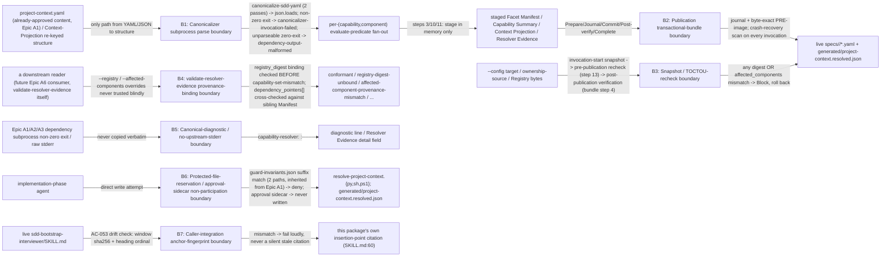

# Security Specification: epic-193-a5-capability-resolver

This document expands design.md's Security Boundaries, Protected-File
Statement, Data Plan ("B8" snapshot/recheck rules, "B9" provenance-
canonicalization rules), API / Contract Plan ("Resolver publication
transactional bundle contract", `validate-resolver-evidence` contract),
Design Decisions ("anchor fingerprint"), and External Integrations
("None"), plus requirements.md's own Security Boundaries section, into
the review harness's canonical layer-file shape. It introduces no new
security judgment beyond what those sections already fix; every boundary,
mitigation, and REQ/AC reference below traces to design.md or
requirements.md/acceptance-tests.md content approved at
Spec-Review-Status: Passed.

Framing (design.md External Integrations: "None — every input and output
this feature touches is repository-local"; requirements.md Security
Boundaries bullet 1: "never invokes a Provider API, reads a credential, or
writes outside" a fixed, named path set): this feature's attack surface is
entirely local — filesystem reads/writes plus local subprocess
invocations of already-fixed sibling-epic scripts (Epic A1's
canonicalizer, Epic A2's `evaluate-predicate`/`generate-registry-digest`,
Epic A3's `resolve-component-paths`). Unlike Epic A4 (three read-only
structural validators that write nothing), this feature's Resolver is the
first script in this Epic set that **writes** live artifacts — a
categorically larger attack surface than any sibling epic's own read-only
validators, which is why this design (design.md ADR Change Log; API /
Contract Plan) introduces a journaled, multi-target transactional
publication mechanism, a triple TOCTOU recheck, and a provenance-binding
validator where Epic A4 needed none of the three. Its security-relevant
boundaries are (1) the canonicalizer subprocess parse boundary, (2) the
publication transactional-bundle boundary, (3) the snapshot/TOCTOU-recheck
boundary, (4) the `validate-resolver-evidence` provenance-binding
boundary, (5) the canonical-diagnostic/no-upstream-stderr-embedding
boundary, (6) the protected-file-reservation/approval-sidecar
non-participation boundary, and (7) the caller-integration
anchor-fingerprint boundary — the seven boundaries B1-B7 below.

## Trust Boundaries

| Boundary | Source | Destination | Assets | Validation | AuthN/AuthZ | REQ | AC |
|---|---|---|---|---|---|---|---|
| B1 — Canonicalizer subprocess parse boundary | `--config` target bytes (pass 1) / Context-Projection re-keyed structure (pass 2) | `source_sha256`/`projection_sha256` and the parsed structure fed to `evaluate-predicate` | parse-path integrity; no hand-rolled parser, no dynamic code execution | the only YAML/JSON→structure path, both passes, is the `canonicalize-sdd-yaml` subprocess followed by `json.loads`; a non-zero exit is `canonicalizer-invocation-failed`; a zero exit with unparseable stdout is `dependency-output-malformed` (B3 taxonomy), never silently swallowed or retried with a fallback parser (design.md Architecture; API / Contract Plan steps 2-3) | N/A — local subprocess, same OS-user/filesystem boundary as every other script in this plugin | REQ-001 | AC-002, AC-003 |
| B2 — Publication transactional-bundle boundary | this invocation's own staged artifact set (steps 3/10/11, schema-validated at step 12) | the live paths `specs/<feature>/facet-manifest.yaml`/`capability-summary.yaml`/`resolver-evidence.yaml`, `generated/project-context.resolved.json` | cross-file publication atomicity; crash-safe recovery; no destroyed pre-existing bytes | Prepare (batch re-hash + byte-exact PRE-image copy) → Journal (`TRANSACTION.json`, atomic itself) → Commit (temp+fsync+rename per target, in journal order) → Post-publication verification → Complete (journal delete); a mandatory crash-recovery scan runs on every invocation, scoped to `--feature`, before any other work, converging a stale journal, **when it is safely convergeable**, to SAFE-completion, SAFE-abandonment, or a journal-based rollback of a MIX state; when it is not — a named PRE-image backup itself missing or unreadable, or a target matching neither PRE nor POST — there is a **fourth, deliberately non-converging outcome**: the interrupted targets other than `resolver-evidence.yaml` are left exactly as found for a human operator, `resolver-evidence.yaml` receives the Block record, and `publication-journal-recovery` fails the invocation closed so nothing proceeds past that state (added 2026-08-27, human-approved, ruling D(2): the three-outcome list read as exhaustive and did not admit the unrecoverable branch the package defines) (design.md "Resolver publication transactional bundle contract") | N/A — single-writer assumption (mirrors Epic A3), not an access-control mechanism; a concurrent second invocation against the identical `--feature` is out of scope, detected (never silently serialized) by the mismatch Blocks below | REQ-001, REQ-002 | AC-011, AC-012, AC-038, AC-039, AC-047 |
| B3 — Snapshot / TOCTOU-recheck boundary | the three externally-sourced byte sequences (`--config` target, ownership-source via `resolve-component-paths`, discovered Registry) plus `affected_components[]` | this invocation's own publish/no-publish decision | generation-consistency: never publish output bound to a source state this invocation did not actually observe throughout | an invocation-start snapshot (step 2/4/5) is compared, element-for-element (three digests **and** the `affected_components` set), against a pre-publication recheck (step 13) and again against a post-publication verification (transactional bundle contract step 4, run before the journal is deleted); any mismatch → `snapshot-generation-mismatch` (pre-publication, nothing live yet) or `post-publication-generation-mismatch` (post-publication, journal-based rollback of already-committed renames) (design.md Data Plan "B8"; API / Contract Plan steps 2/4/13); additionally (ruling C(1), human-approved 2026-08-26) a detection-only mid-pipeline Registry recheck immediately after the step-5/6 dependency invocations — which each independently re-read the Registry with no binding to this invocation's snapshot — Blocks with the same `snapshot-generation-mismatch` id, closing that unbound-reads window before any evaluation result depends on it; and (ruling C(2), human-approved 2026-08-26) the same generation-consistency posture extends to the dependency/Context boundary — an `affected_components[]` entry naming a component id absent from this invocation's own Context Projection Blocks `dependency-output-malformed` before any predicate evaluation of that entry, never a defaulted-empty-properties evaluation | N/A — deterministic re-comparison, not an access-control mechanism | REQ-002 | AC-040, AC-048, AC-049, AC-057, AC-058 |
| B4 — `validate-resolver-evidence` provenance-binding boundary | a Resolver Evidence instance (and, where discoverable, its sibling Facet Manifest) presented for validation, plus optional `--registry`/`--affected-components` overrides | the validator's conformant/non-conformant verdict | ground-truth integrity: an Evidence instance's own exact-set/cardinality claims must be checked against the Registry/affected-component set it is cryptographically bound to, never a caller-substitutable one | `--registry` (self-resolved via ADR-0025 by default, or an explicit override) is digest-bound: this validator always computes `generate-registry-digest --whole` over the Registry it ends up using and requires equality with the Evidence's own `context_binding.registry_digest`, checked **before** `capability-set-mismatch`; the affected-component set defaults to the Evidence's own `context_binding.dependency_pointers[]` derivation, cross-checked against a co-located Facet Manifest's own independently-populated `dependency_pointers[]` when present, and any `--affected-components`/`--context` override must be set-identical to that derivation, never a contradiction of it (design.md `validate-resolver-evidence` contract, "Provenance binding (B6, revised)") | N/A — deterministic structural/provenance check, not an access-control mechanism | REQ-004 | AC-050, AC-051 |
| B5 — Canonical-diagnostic / no-upstream-stderr-embedding boundary | a dependency subprocess's own non-zero exit / raw stderr text (Epic A1/A2/A3) | this feature's own diagnostic line / Resolver Evidence `detail` field | information-disclosure containment (no local-path/environment-specific text in a committed artifact); REQ-005 dual-runtime byte-identity | every `detail` this feature's own scripts construct is a canonical, Resolver-owned sentence built from fixed, repository-relative fields (e.g. `"resolve-component-paths exited <code> resolving <repo-relative --config path>; see resolve-component-paths diagnostics"`) — never the underlying script's own raw stderr text quoted verbatim (M8 correction; design.md API / Contract Plan step 4) | N/A — deterministic string construction, not an access-control mechanism | REQ-002, REQ-005 | AC-014, AC-023 |
| B6 — Protected-file-reservation / approval-sidecar non-participation boundary | an implementation-phase agent's direct write attempt | `resolve-project-context.{py,sh,ps1}` and `generated/project-context.resolved.json` (already-reserved, protected-suffix-shaped paths, Epic A1 via ADR-0019 item 3) | write-boundary integrity for two paths this feature did not itself choose to protect; non-participation in the approval-sidecar workflow | `guard-invariants.json` suffix match denies a direct agent write regardless of whether a file currently exists at that path (Epic A1's own `_validate_repo_path`); this feature's own future implementation stages tested script content under `human-copy/` with a `MANIFEST.sha256` for human `cp`-application (content-population, never a suffix-registration this feature performs itself); `generated/project-context.resolved.json` is deliberately excluded from any human-copy batch (M7) — it is instead governed by B2's own guarded atomic publication, the running Resolver process itself the sole writer; this feature's Resolver never writes `*.approval.json`, `sdd/.approved-context/`, or `guard-invariants.json` itself, and never participates in or bypasses the approval-sidecar workflow (design.md Protected-File Statement; Security Boundaries bullet 2) | Implementation-phase agent: deny (direct write to the two reserved paths); Human maintainer: allow (via `human-copy` + SHA-256-verified `cp`) | REQ-001 | AC-015, AC-032 |
| B7 — Caller-integration anchor-fingerprint boundary | the live `plugins/sdd-bootstrap/skills/sdd-bootstrap-interviewer/SKILL.md` | this package's own recorded citation of the capability-interview-phase insertion point | citation-drift detection: a future, unrelated `SKILL.md` edit must never silently invalidate this package's own "immediately before `SKILL.md:60`" insertion-point claim | two independent, recomputable signals recorded at this package's own design-authoring time — the sha256 of the fixed 11-line window `SKILL.md:54-64` (`sha256:d969fa163169ee5a9b5941600382b86b75929d6cd90d223dbe991e1dc234fb64`) and the `### Full-Profile Layer Interview` heading's own 1-based ordinal position among every `##`/`###` heading (`3`) — recomputed and compared against the live file; a mismatch on either signal fails loudly, never silently (design.md Design Decisions "Anchor fingerprint", M6, AC-053); this package's own commits never touch `plugins/**` (design.md Constraint Compliance) | N/A — a design-time citation check, not an access-control mechanism | REQ-007 | AC-046, AC-053 |

## STRIDE Analysis

| Boundary | Threat | STRIDE | Abuse Case | Mitigation | Verification | REQ | AC |
|---|---|---|---|---|---|---|---|
| B1 | A crafted or malformed Project-Context/Context-Projection input triggers a fallback/hand-rolled parser path, or a canonicalizer failure is silently swallowed and a partial/guessed structure is evaluated as if clean | Tampering / Elevation of Privilege | A `project-context.yaml` the canonicalizer rejects is instead parsed by a lenient fallback, letting a non-canonical document drive `evaluate-predicate` | the single YAML/JSON→structure path is the canonicalizer subprocess + `json.loads`, both passes; a non-zero exit fails closed (`canonicalizer-invocation-failed`), an unparseable-but-zero-exit stdout fails closed separately (`dependency-output-malformed`, B3), never swallowed or retried with a fallback parser; no dynamic code execution anywhere (design.md Architecture; API / Contract Plan steps 2-3) | AC-002, AC-003; `resolve-project-context-block` fixture suite | REQ-001 | AC-002 |
| B2 | A crash between renaming target 1 and target 2 of a multi-target Full-track commit leaves "target 1 advanced, target 2 did not" observable to a reader; an in-process write/rename failure destroys pre-existing live bytes with no restore | Tampering / Denial of Service | A concurrent process reads a mixed-generation Facet Manifest + stale Context Projection pair, or a caught write failure `unlink`s an already-committed rename with no way back to the prior, still-valid Feature state | every commit **that publishes a track's output set** is one journaled, multi-target transaction (Prepare/Journal/Commit/Post-verify/Complete), reusing Epic A1's own already-fixed protocol shape — while a Block whose whole write set is Resolver Evidence takes the direct single-file atomic `temp file + fsync + rename` route the authorization table below allows and REQ-001 step (m)/REQ-004 fix, never opening a second journal (scoped 2026-08-27, human-approved, ruling D(2): the unqualified "every commit" required the Evidence-only Block to journal, which the unrecoverable-journal branch cannot do); a caught in-process failure or a hard crash both converge, via the journal's own PRE-image backups, to a fully-restored-PRE or fully-applied-POST terminal state **whenever the journal is convergeable** — never a bare `unlink`-based best-effort with no restore; when it is not (a named PRE-image backup itself missing or unreadable, or a target matching neither PRE nor POST), the state may remain mixed and **every interrupted target other than `resolver-evidence.yaml`** is deliberately left exactly as found for a human operator — that one target still receives this invocation's own Block record, per AC-012 and AC-047 (scoped 2026-08-27, ruling D(2): the unqualified "the state" contradicted the always-emitted Evidence rule), fenced by the surviving journal, the reader-side refusal AC-054 locks, and the fail-closed `publication-journal-recovery` Block that stops any invocation proceeding past it (scoped 2026-08-27, human-approved, ruling D(2): the unqualified wording promised convergence after *every* crash, contradicting the unrecoverable branch's own no-repair obligation) (design.md "Resolver publication transactional bundle contract"; Security Boundaries bullet 4) | AC-038, AC-039, AC-047; `resolve-project-context-block` fixture suite | REQ-001, REQ-002 | AC-039 |
| B3 | A second concurrent commit or worktree edit shifts the affected-component set (or the Project Context/Registry/ownership-source bytes) between this invocation's own snapshot and its publication, so published output no longer reflects any single, coherent source state — including a window between the pre-publication recheck passing and the last rename actually completing | Tampering | An attacker (or an innocent concurrent process) races a Registry edit between snapshot and publish, or between the pre-publication recheck and the final rename, so a Feature's own published Facet Manifest reflects a Registry state that was never actually, atomically, the one evaluated against | three independent digests **and** the `affected_components` set are compared at invocation-start, again at pre-publication recheck (step 13), and a **third** time at post-publication verification (bundle contract step 4) before the journal is deleted; any mismatch on any of the three comparisons → Block and (post-publication case) a journal-based rollback of every already-completed **publication-artifact** rename, never `resolver-evidence.yaml`, which is not rolled back and instead retains this invocation's own Block record (scoped 2026-08-27, human-approved, ruling D(2), matching REQ-001 step (m)'s rollback-and-no-write scope rule and AC-012) (design.md Data Plan "B8"; API / Contract Plan steps 2/4/13; "Resolver publication transactional bundle contract" step 4) | AC-040, AC-048, AC-049; `resolve-project-context-block` fixture suite | REQ-002 | AC-049 |
| B4 | A caller points `validate-resolver-evidence` at an arbitrary, smaller/different Registry file or an arbitrary affected-component subset via `--registry`/`--affected-components`, making a self-consistent-but-wrong Evidence instance pass by supplying matching, equally-wrong CLI arguments | Spoofing / Tampering | An attacker crafts a Registry file missing an inconvenient Capability and points `--registry` at it, or supplies a truncated `--affected-components` list, so `capability-set-mismatch`/`trigger-evaluation-set-mismatch` never fire against the *real* ground truth | `--registry` and `--affected-components` are optional overrides, never sole ground truth: the Registry actually used (self-resolved or overridden) must produce a `generate-registry-digest --whole` value equal to the Evidence's own `context_binding.registry_digest` (checked first, `registry-digest-unbound`); the affected-component set defaults to the Evidence's own `dependency_pointers[]` derivation, cross-checked against a co-located sibling Manifest's own independently-populated claim, and any override must be set-identical to — never contradict — that derivation (`affected-component-provenance-mismatch`) (design.md `validate-resolver-evidence` contract, "Provenance binding (B6, revised)") | AC-050, AC-051; `validate-resolver-evidence` fixture suite | REQ-004 | AC-050 |
| B5 | A dependency subprocess's own OS-specific stderr text (local path, environment detail) is copied verbatim into a committed diagnostic line or Resolver Evidence `detail` field | Information Disclosure | An upstream script's stderr leaks a local filesystem layout or environment-specific detail into a git-tracked Resolver Evidence instance, and dual-runtime output additionally diverges because that stderr text differs across `.py`/`.sh`/`.ps1` | every `detail` this feature's own scripts construct is a canonical, Resolver-owned sentence from fixed, repository-relative fields — never upstream stderr quoted verbatim; the underlying script's own stderr remains visible on the terminal, simply never copied into this Resolver's own structured field (design.md API / Contract Plan step 4, M8 correction) | AC-014 (fixture confirms `<detail>` is not a verbatim stderr copy); AC-023 (dual-runtime parity, restricted to this feature's own emitted content) | REQ-002, REQ-005 | AC-014 |
| B6 | An implementation-phase agent directly edits `resolve-project-context.{py,sh,ps1}` or `generated/project-context.resolved.json`, bypassing the reservation an upstream epic (not this feature) already registered; or this feature's Resolver is asked to participate in the approval-sidecar workflow it has no business touching | Tampering / Elevation of Privilege | An agent, unaware the two paths are already reserved, commits a direct edit that bypasses PR-level human-copy review; or a future caller mistakenly routes an approval-affecting write through this Resolver | `guard-invariants.json`'s suffix match denies a direct write to either reserved path regardless of whether a file currently exists there (Epic A1's own `_validate_repo_path`, "checks path SHAPE only"); this feature's own implementation task stages tested content under `human-copy/` for human `cp`-application instead; `generated/project-context.resolved.json` is excluded from any human-copy batch (M7), governed instead by B2's own guarded atomic publication; this feature's Resolver never writes `*.approval.json`/`sdd/.approved-context/`/`guard-invariants.json` and never participates in the approval-sidecar workflow (design.md Protected-File Statement; Security Boundaries bullets 2/6) | AC-015 (no premature subprocess invocation before `disabled-legacy-invocation`); AC-032 (`git diff` scope-boundary lock, no path under `plugins/**`) | REQ-001 | AC-032 |
| B7 | A future, unrelated edit to `SKILL.md` relocates the `### Full-Profile Layer Interview` heading to a different document position while leaving its own literal text unchanged, silently invalidating this package's own "immediately before this heading" insertion-point citation without any check noticing | Tampering | A maintainer reorders `SKILL.md`'s sections for an unrelated reason; the capability interview phase, implemented later against this package's own stale citation, is inserted at the wrong point in the file, corrupting REQ-007's own "after track detection, before any Facet-dependent layer is generated" ordering guarantee | two independent, recomputable signals — an 11-line window sha256 (`SKILL.md:54-64`) and the heading's own 1-based ordinal position among every `##`/`###` heading — are recorded at design-authoring time and recomputed against the live file at test time; a mismatch on either signal fails loudly, superseding the earlier revision's weaker, position-blind "heading text still exists" check (design.md Design Decisions "Anchor fingerprint", M6) | AC-046, AC-053; `resolve-project-context-caller-contract` fixture suite, including a heading-relocation regression fixture | REQ-007 | AC-053 |

## Authentication Flow

N/A — this feature defines no authentication mechanism. Every actor is
bound by the local OS-user/filesystem boundary: an implementation-phase
agent's proposed edit, a human maintainer's direct `cp` for the
`human-copy` content-population batch or the `test.yml` registration
candidate, a CI runner (`test.yml`), or a script's own caller within the
same process boundary (design.md External Integrations: "None" — no
network call, no `gh` invocation, no credential anywhere in this
feature).

## Authorization

| Actor / Role | Resource | Action | Decision Point | Default | Denial Evidence | REQ | AC |
|---|---|---|---|---|---|---|---|
| Implementation-phase agent | `contracts/resolver-evidence.schema.json`, `validate-resolver-evidence.{py,sh,ps1}`, tests, fixtures, `tests/run-all.sh`/`.ps1` registration (all unprotected) | write (direct edit, per-PR reviewed) | ordinary PR review + CI green; no protected-file guard applies (design.md Protected-File Statement: "not protected — agent-editable directly, with no human-copy step") | allow (unprotected, reviewed) | N/A — this is the allow path; integrity is per-PR review + CI, not a write guard | REQ-004, REQ-006 | AC-017, AC-026 |
| Implementation-phase agent | `resolve-project-context.{py,sh,ps1}` (protected, inherited from Epic A1) | write (direct) | existing repository-wide protected-file guard (`guard-invariants.json` suffix match) | deny (agent direct write) | staged human-copy under `specs/epic-193-a5-capability-resolver/human-copy/` + `MANIFEST.sha256`; only a human `cp` may apply it (design.md Protected-File Statement) | REQ-001 | AC-032 |
| Human maintainer | staged `resolve-project-context.{py,sh,ps1}` human-copy candidate + `.github/workflows/test.yml` registration candidate, each with a `MANIFEST.sha256` | apply via `cp` + SHA-256 verification | Protected-File human-`cp` procedure (matching Epic A1/A2's own precedent) | allow (human-only action) | N/A — this is the allow path | REQ-001, REQ-006 | AC-026, AC-032 |
| The running Resolver process itself | `generated/project-context.resolved.json`; `specs/<feature>/{facet-manifest.yaml,capability-summary.yaml,resolver-evidence.yaml}` | write (via the guarded atomic publication transaction for a multi-target output set; via a single atomic `temp file + fsync + rename` when Resolver Evidence is the invocation's whole write set) | B2's own transactional bundle contract — never a human-copy target, and never an unguarded write | allow through the journaled Prepare/Journal/Commit/Post-verify/Complete sequence whenever a track's output set is published; **and** allow the direct single-file atomic write REQ-001 step (m)/REQ-004 fix for an Evidence-only Block, performed after any required rollback of the publication artifacts has completed (added 2026-08-27, human-approved, ruling D(2): this row previously said "only" the journaled sequence and "never a bare direct write", which forbade the very path REQ-001, REQ-004 and design.md mandate — and which the unrecoverable-journal Block cannot take, since opening a second journal against the Feature whose journal was just declared unconvergeable is incoherent) | N/A — this is the sole writer's own allow path; an unguarded write outside these two routes is not a supported code path at all (design.md Protected-File Statement "M7 human-copy boundary") | REQ-001, REQ-002 | AC-011, AC-038 |
| Future Gate/CI caller / a future Epic A6 consumer | Facet Manifest / Capability Summary / Context Projection / Resolver Evidence, once published | read + consume | the caller's own enforcement path — no live wiring exists yet (Non-goals) | reader-side generation-consistency check: fail closed on a live `RESOLVER_PUBLICATION_IN_PROGRESS` journal naming a path about to be read | the fail-closed refusal itself (design.md "Resolver publication transactional bundle contract", "Reader-side generation-consistency check") | REQ-001 | AC-054 |

## Data Classification and Protection

| Entity | Classification | At Rest | In Transit | Retention | Deletion | Access Log | REQ | AC |
|---|---|---|---|---|---|---|---|---|
| `contracts/resolver-evidence.schema.json` | internal — machine-readable contract, no PII/credential | repository working tree (git), content-frozen once design review passes | filesystem only, no network transmission | git-versioned | not applicable; no delete operation in scope | git commit history | REQ-004 | AC-017 |
| `specs/<feature>/{facet-manifest.yaml,capability-summary.yaml,resolver-evidence.yaml}` | internal — carries capability/facet/gate ids, digests, and evaluation evidence only; no PII, no credential, no secret | repository working tree (git), per Feature | filesystem only | git-versioned; agent-writable-only-via-the-Resolver, never hand-edited | not applicable | git commit history | REQ-001, REQ-004 | AC-008, AC-009, AC-020 |
| `generated/project-context.resolved.json` | internal — same classification as above, repository-wide (one instance) | repository working tree (git), Full-track only | filesystem only | git-versioned; recomputed on every Full-track resolve (a pure function of the live Project Context, never a durable "initial state") | not applicable | git commit history | REQ-001 | AC-003 |
| `context_binding`'s digest fields (`full_context_revision`, `dependency_pointers[]`, `projection_sha256`, `registry_digest`, `ownership_digest`) plus `resolver.{version,rule_set_revision}` | internal, binding/provenance metadata — content-identity digests, not signatures; detect unintended change, do not authenticate who made it | same artifact as the record they live in | filesystem only | identical for identical inputs (canonicalizer determinism); changes whenever the bound input changes | not applicable | git commit history | REQ-004, REQ-005 | AC-044 |
| `specs/<feature>/.resolver-staging/<batch-nonce>/{TRANSACTION.json, pre/<target-basename>}` (transaction journal + PRE-image backups) | internal, transient publication-integrity artifact — same content classification as the targets it stages/backs up, no PII/credential of its own | unprotected staging area (this feature's own equivalent of Epic A1's `sdd/.staging/`), **not** git-tracked | filesystem only | transient — exists only during an in-flight or crash-interrupted transaction; deleted at Complete, or converged and deleted by the next invocation's own crash-recovery scan | deleted on ordinary Complete, or as the final step of a converged crash-recovery pass; an unrecoverable state (`publication-journal-recovery`) leaves it standing pending manual operator intervention | N/A — no durable log beyond the journal's own current contents | REQ-001, REQ-002 | AC-047 |

No Facet Manifest, Capability Summary, Context Projection, or Resolver
Evidence field carries a credential, secret, or PII value; the schemas
define none (design.md Data Plan; `contracts/resolver-evidence.schema.
json`'s own `additionalProperties: false` at every level). REQ: REQ-001,
REQ-004.

## OWASP Mapping

| OWASP Risk | Exposure | Control | Verification | Owner |
|---|---|---|---|---|
| Injection | Project-Context / Context-Projection parse path (B1) | the only YAML/JSON→structure path, both passes, is the canonicalizer subprocess + `json.loads`; no hand-rolled parser, no dynamic code execution, no `eval`; a non-zero exit or an unparseable-but-zero-exit stdout each fail closed with their own distinct diagnostic (design.md Architecture; API / Contract Plan steps 2-3) | AC-002, AC-003 | Implementation task owner |
| Software and Data Integrity Failures | Publication transactional-bundle atomicity (B2); TOCTOU snapshot/recheck (B3); `validate-resolver-evidence` provenance binding, including the `(capability_id, declaration_index, component_id)`-keyed exact-set/bidirectional checks that give the aggregation rules their own integrity guarantee (B4); caller-integration citation drift (B7) | journaled multi-target commit with PRE-image-backed rollback; triple digest-plus-affected-component-set comparison across invocation-start/pre-publication/post-publication; registry-digest-bound and dependency-pointers-cross-checked provenance validation, checked before any exact-set check; two independent, recomputable anchor-drift signals | AC-039, AC-047, AC-049, AC-050, AC-051, AC-053 | Implementation task owner |
| Security Misconfiguration | `disabled-legacy-invocation`/`workflow-combination-invalid` CLI-misuse guards (Security Boundaries bullet 3; API / Contract Plan step 1) | both Block fail-closed, by construction — no code path reaches track-branch/Facet-Manifest assembly while `disabled-legacy` is derived, or while `workflow.spec_profile`/`artifact_layout` name one of decision document v2 §6's two explicitly-invalid combinations | AC-015, AC-041 | Implementation task owner |
| Broken Access Control | Two already-reserved protected paths inherited from Epic A1 (B6) | `guard-invariants.json` suffix-match denial + human-copy content-population staging; `generated/project-context.resolved.json` excluded from human-copy, governed instead by B2's own sole-writer transactional publication | AC-032 | Implementation task owner |
| Cryptographic Failures | N/A — this feature performs content-identity hashing (sha256) for drift/tamper *detection* and provenance-binding only, not authenticity or signing; it defines no signing key, no HMAC, and carries no credential (requirements.md Security Boundaries) | — | — | — |
| Identification and Authentication Failures | N/A — no authentication mechanism anywhere in this feature (design.md External Integrations: "None"); every actor is bound by the local OS-user/filesystem boundary | design review | — | — |

## Secrets Management

- This feature introduces no secret, credential, or key of any kind. No
  script it ships reads an environment variable, a `.env` file, or any
  key-material-bearing input — none is referenced anywhere in design.md
  (Global Constraints; External Integrations: "None").
- `context_binding`'s digest fields, and `resolver.{version,
  rule_set_revision}`, are content-identity digests/constants computed via
  Epic A1's canonicalizer or fixed at the top of `resolve-project-
  context.py` (Data Plan "B9"); they detect unintended change and bind
  provenance, they do not authenticate who made a change — the identical
  scope disclaimer Epic A4's own `security-spec.md` records for its own
  `context_binding` fields.
- This feature's Resolver never reads or handles `provider-bindings.
  yaml`'s credential contents at all — no code path in this design touches
  that file (design.md carries no reference to it; the closest Epic A4
  analog, `provider_bindings_sha256`, is not a field this feature's own
  `resolver-evidence.schema.json` defines).
- Per-Feature Resolver output integrity is a function of it being an
  ordinary, git-tracked, human/CI-reviewed, reproducible artifact the
  Resolver alone writes via the guarded atomic publication transaction —
  not a cryptographically-signed one (unlike `sdd/project-context.
  approval.json`, which Epic A1 protects that way). This is a deliberate
  scope boundary, not an oversight (requirements.md Security Boundaries).

## SBOM and Supply Chain

- No new external (npm/pip/etc.) package dependency is introduced. Both
  new scripts' Python masters are stdlib-only — no `jsonschema` or other
  third-party dependency (design.md Global Constraints, investigation.md
  INV-011); `validate-resolver-evidence`'s own schema-conformance check is
  a hand-rolled, closed-subset draft-07 structural validator, matching
  Epic A4's own `validate-facet-manifest.py` convention.
- No `.js` wrapper is introduced by either script (frontend-spec.md
  Technology Stack) — design.md's Components table names only `.py`+
  `.sh`+`.ps1` for both `resolve-project-context.*` and
  `validate-resolver-evidence.*`, matching Epic A4's own validator
  precedent, not Epic A2's digest-primitive one.
- Epic A1's canonicalizer, Epic A2's `evaluate-predicate`/
  `generate-registry-digest`, and Epic A3's `resolve-component-paths` are
  each invoked as a subprocess (an imported internal dependency, same
  repository), never vendored, reimplemented, or an external package
  (design.md Architecture; API / Contract Plan).
- `contracts/resolver-evidence.schema.json` ships a canonical copy under
  `contracts/` plus a vendored packaged copy under `plugins/sdd-quality-
  loop/contracts/`, kept in sync by the vendored-copy `--check` drift gate
  reused from Epic A2/A4 (design.md Deployment / CI Plan; Discovery
  contract).

## Security Tests

| Test | Boundary | Attack / Control | Expected Result | Evidence | AC |
|---|---|---|---|---|---|
| TEST-002 | B1 | Every `contracts/*` artifact this feature's scripts locate resolves via the discovery contract with no environment variable consulted | discovery succeeds without reading any env var | `tests/resolve-project-context-discovery.tests.sh`/`.ps1` | AC-002 |
| TEST-003 | B1 | Hand-computed vs. Resolver-computed Context Projection for an identical `project-context.yaml` fixture | byte-identical (`source_sha256`/`projection_sha256` both match) | `tests/resolve-project-context-match.tests.sh`/`.ps1` | AC-003 |
| TEST-011 | B2 | For every Block fixture in TEST-010, including a Block reached only after this invocation had already staged an artifact in memory | none of `facet-manifest.yaml`/`capability-summary.yaml`/`project-context.resolved.json` exists or changes (pre-existing files byte-unchanged) | `tests/resolve-project-context-block.tests.sh`/`.ps1` | AC-011 |
| TEST-038 | B2 | A fixture that reaches a Block only after this invocation has already staged the Context Projection and/or Facet Manifest/Capability Summary in memory | no earlier-staged publication artifact (`facet-manifest.yaml`, `capability-summary.yaml`, `generated/project-context.resolved.json`) ever reached a live path, while `resolver-evidence.yaml` — itself staged earlier — IS written per AC-012, except on `output-schema-validation-failed`'s Evidence-itself-fails sub-case (AC-055(a)), which is one of AC-012's two exceptions and writes nothing at all, so this row's fixture for that id is AC-055(b)'s (scoped 2026-08-27, human-approved, ruling D(2), propagated from AC-038/TEST-038) | `tests/resolve-project-context-block.tests.sh`/`.ps1` | AC-038 |
| TEST-039 | B2 | Injected write/rename failure on one staged output path, after every earlier step succeeded, including a second already-completed rename in the same commit sub-sequence | Blocks `artifact-publication-failed`; the completed rename **of a publication artifact** is rolled back to PRE-transaction bytes via the journal, never a bare `unlink`, while `resolver-evidence.yaml` is not rolled back and carries this Block's own record (scoped 2026-08-27, human-approved, ruling D(2), propagated from AC-039/TEST-039) | `tests/resolve-project-context-block.tests.sh`/`.ps1` | AC-039 |
| TEST-047 | B2 | Simulated hard crash between two renames of a multi-target commit; a companion fixture corrupts the journal's own PRE-image backup | the next invocation's crash-recovery scan converges every target to PRE-transaction bytes before proceeding; the corrupted-backup fixture Blocks `publication-journal-recovery` before any Registry/ownership/Context-Projection work begins, asserting both halves of that Block's live-state obligation — every interrupted target other than `resolver-evidence.yaml` byte-identical to its pre-invocation state with no partial rollback or repair attempted, and `resolver-evidence.yaml` itself carrying this invocation's own schema-valid Block record (mirrored 2026-08-27, human-approved, ruling D(2), from AC-047/TEST-047's amended wording) | `tests/resolve-project-context-block.tests.sh`/`.ps1` | AC-047 |
| TEST-040 | B3 | A fixture mutates the Project Context/ownership-source/Registry between invocation-start snapshot and pre-publication recheck; a second fixture leaves every digest (including `ownership_digest`) identical but mutates only worktree/index/untracked state so the re-derived `affected_components` set differs | both Block `snapshot-generation-mismatch`, no publication artifact (`facet-manifest.yaml`, `capability-summary.yaml`, `generated/project-context.resolved.json`) reaches a live path while `resolver-evidence.yaml` itself is written recording the diagnostic (scoped 2026-08-27, human-approved, ruling D(2), propagated here from AC-040/TEST-040); the second fixture proves the set comparison alone (not digest parity) catches the drift | `tests/resolve-project-context-block.tests.sh`/`.ps1` | AC-040 |
| TEST-048 | B3 | Mutation confined to worktree/index/untracked state (no ownership-config edit) between step-4 snapshot and step-13 recheck | `snapshot-generation-mismatch` fires on the `affected_components` set difference alone | `tests/resolve-project-context-block.tests.sh`/`.ps1` | AC-048 |
| TEST-057 | B3 | A `generate-registry-digest` stub overwrites the discovered Registry file in place as a side effect of the step-(e) digest invocation (ruling C(1)'s unbound-reads window) | the step-6.5 detection recheck Blocks `snapshot-generation-mismatch` with an empty `capability_evaluations` array in the `resolver-evidence.yaml` that Block does write (AC-012), before any step-(f) evaluation, and no publication artifact (`facet-manifest.yaml`, `capability-summary.yaml`, `generated/project-context.resolved.json`) reaches a live path (scoped 2026-08-27, human-approved, ruling D(2), propagated here from AC-057/TEST-057) | `tests/resolve-project-context-block.tests.sh`/`.ps1` | AC-057 |
| TEST-058 | B3 | A `resolve-component-paths` stub returns an `affected_components[]` entry naming a component id absent from the fixture's own Context Projection alongside one present-and-valid id (ruling C(2)'s fail-open) | the Block `dependency-output-malformed` fires BEFORE any predicate evaluation of any entry, with an empty `capability_evaluations` array — never a defaulted-empty-properties evaluation of the absent id | `tests/resolve-project-context-block.tests.sh`/`.ps1` | AC-058 |
| TEST-049 | B3 | Source mutation injected after the pre-publication recheck passes but before the transaction's last rename completes | `post-publication-generation-mismatch` fires only after every rename has already, briefly, succeeded; every rename **of a publication artifact** is rolled back to PRE-transaction state via the journal, never a bare `unlink`, while `resolver-evidence.yaml` is not rolled back and carries this Block's own record at exit — both halves required of the one fixture (scoped 2026-08-27, human-approved, ruling D(2), propagated from AC-049/TEST-049) | `tests/resolve-project-context-block.tests.sh`/`.ps1` | AC-049 |
| TEST-050 | B4 | A `--registry` override whose `generate-registry-digest --whole` value does not equal the Evidence's own `context_binding.registry_digest`; a companion fixture confirms the default self-discovery path performs the identical binding check | `registry-digest-unbound` fires before any `capability-set-mismatch` check runs, for both the override and the self-discovery path | `tests/validate-resolver-evidence.tests.sh`/`.ps1` | AC-050 |
| TEST-051 | B4 | An Evidence instance paired with a co-located Facet Manifest whose own `dependency_pointers[]` names a different component set; a companion fixture supplies an explicit `--affected-components` override contradicting both sibling artifacts | `affected-component-provenance-mismatch` fires without needing any CLI argument at all, and for the contradicting-override case too | `tests/validate-resolver-evidence.tests.sh`/`.ps1` | AC-051 |
| TEST-054 | B4 | A live transaction journal names the `resolver-evidence.yaml` path `validate-resolver-evidence` is about to read | the validator fails closed (reader-side generation-consistency check), never a silent read of possibly-torn cross-file state | `tests/validate-resolver-evidence.tests.sh`/`.ps1` | AC-054 |
| TEST-014 | B5 | Every diagnostic line across the Block fixture matrix, focused on `affected-component-resolution-failed`/`dependency-subprocess-failed`/`dependency-output-malformed` | `<detail>` is not a verbatim copy of the underlying dependency's own stderr text | `tests/resolve-project-context-block.tests.sh`/`.ps1` | AC-014 |
| TEST-023 | B5 | `.py`/`.sh`/`.ps1` invocations of the identical input, including a Windows-style path argument | byte-identical stdout/stderr/exit code, restricted to this feature's own emitted content | `tests/resolve-project-context-parity.tests.sh`/`.ps1` | AC-023 |
| TEST-015 | B6 | `--config` pointing at a nonexistent path | no `resolve-component-paths`/Registry-discovery subprocess is invoked (mock/spy harness) before `disabled-legacy-invocation` fires | `tests/resolve-project-context-block.tests.sh`/`.ps1` | AC-015 |
| TEST-032 | B6 | `git diff --stat` of this package's own two registration commits | no path under `plugins/**` appears in either diff | Spec-Authoring-Time Manual Review Record (registration-commit-bound) | AC-032 |
| TEST-046 / TEST-053 | B7 | A recomputed anchor-window sha256 and heading-ordinal-position pair against the live `SKILL.md`; a heading-relocation regression fixture | both signals match this package's own recorded values; the relocation fixture confirms the drift check fails loudly where the earlier, existence-only check would not | `tests/resolve-project-context-caller-contract.tests.sh`/`.ps1` | AC-046, AC-053 |

## Open Questions

- None — every boundary above traces to design.md's Security Boundaries /
  Protected-File Statement / Data Plan ("B8"/"B9") / API / Contract Plan
  ("Resolver publication transactional bundle contract", `validate-
  resolver-evidence` contract) / Design Decisions ("Anchor fingerprint")
  or requirements.md's own Security Boundaries section, each already
  fixed at Spec-Review-Status: Passed; no new security judgment is
  introduced by this document.
