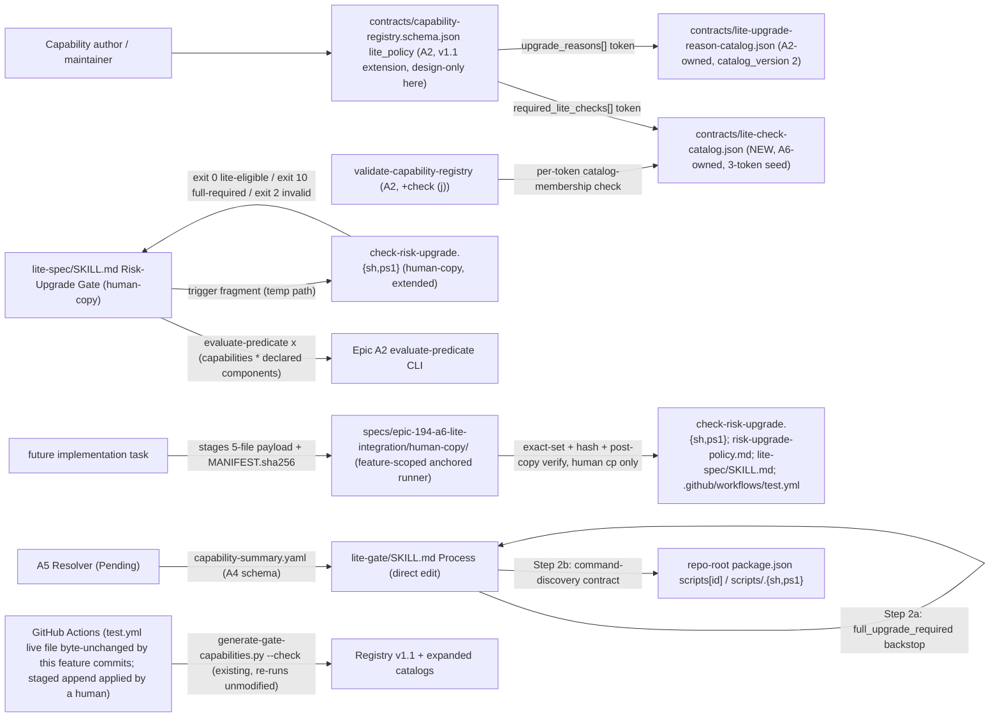
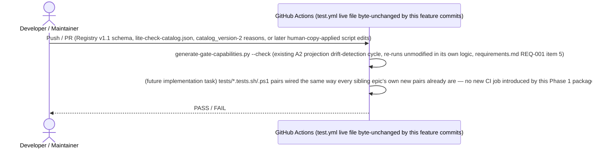

# Infrastructure Specification: epic-194-a6-lite-integration

No new runtime deployment. This document expands design.md's Deployment
/ CI Plan, Architecture, Data Plan (catalog seeds), Protected-File
Statement (the feature-scoped anchored human-copy runner contract), and
Global Constraints into the review harness's canonical layer-file shape;
it introduces no new infrastructure judgment beyond what those sections
already fix.

## Deployment Topology

No cloud, no region, no network boundary — this feature's own edits are
data files (JSON) and Markdown/shell/PowerShell process extensions
already living in `plugins/sdd-lite/`/`plugins/sdd-quality-loop/`
(design.md External Integrations: "None. Every artifact this design
reads or extends is already internal to this repository"). No new
plugin is introduced (design.md Global Constraints). Fault domain: a
single script invocation or skill-process run (CI job or local Lite/
Full workflow) — this feature introduces no shared/long-running service
and no multi-target transactional writer of its own (unlike A5's
Resolver); the closest analog to a "publication" step is the human-copy
application of five already-reviewed files, governed by B5 below.

## CI/CD Sequence

This feature adds no new CI job itself (design.md Deployment / CI Plan:
"this feature adds no new CI job"). A future implementation task's own
`tests/*.tests.sh`/`.tests.ps1` pairs (design.md Test Strategy, 17
design-phase target fixtures) are wired into `.github/workflows/
test.yml` the same way every sibling epic's own new test pairs already
are — this design does not itself edit that file (requirements.md
Non-goals).

**CI workflow, scoped (2026-08-25 ruling).** Every "unmodified"/"byte-
unchanged" reference to `test.yml` in this document means this feature's
own commits leave the live `.github/workflows/test.yml` byte-unchanged —
permanently, not incidentally, because that path is R-10 protected
(`guard-invariants.json` `protected_gate_suffixes`), so no agent can
write it. Separately, the feature's declared deliverables include a
staged append to that same workflow: it is the fifth member of the
five-target declared payload set (requirements.md AC-010/AC-031), staged
under `specs/epic-194-a6-lite-integration/human-copy/.github/workflows/test.yml`
by T-001..T-004 and installed only by a human running the
feature-scoped anchored runner (security-spec.md B5). The two statements
answer different questions — what this feature's commits write, versus
what it declares for human application — and neither is a reversal of the
other. The "no new CI job" statement above is unaffected: the staged
append adds steps to the existing job, not a new job or matrix
dimension. The only CI-visible change this package's own registration
commit introduces is the pre-existing structural/workflow-state
registration check (`scripts/check-sdd-structure.sh`, `plugins/sdd-
quality-loop/scripts/check-workflow-state.sh`), re-verified as
`registration-drift` (Test Strategy item 10, AC-025).

## Environments

| Environment | URL | Auth | Trigger | Classification | Promotion Rule |
|---|---|---|---|---|---|
| local dev (monorepo checkout) | `plugins/sdd-lite/` + `contracts/` + `specs/<feature>/` (repo-relative) | OS user (filesystem) | manual script invocation / Lite workflow run | internal | PR + CI green |
| CI (GitHub Actions `test.yml`, live file byte-unchanged by this feature's own commits; the staged append is applied by a human) | N/A — ephemeral runner | GitHub Actions default | push / PR | internal | required check before merge (existing `--check` drift cycle) |
| staging / production | N/A | — | — | — | N/A — no runtime service, no cloud deployment (design.md External Integrations: "None") |

No installed-plugin-layout discovery row applies — unlike A5's Resolver
scripts, this feature's own new artifacts are data files consumed
in-place by already-existing scripts (`validate-capability-registry`,
`check-risk-upgrade`, `lite-gate`), not a new discoverable script family
of their own.

## Infrastructure as Code

N/A — no cloud. Every deliverable is a JSON/JSON-Schema data file, a
CLI-contract extension to an existing script, or a Markdown skill-process
extension, added to the existing `plugins/sdd-lite/`, `plugins/sdd-
quality-loop/`, and repository-root `contracts/` trees. No Terraform/IaC
module is introduced by this feature.

## Scaling Strategy

N/A — no runtime service, no concurrency model of its own. Each touched
script (`check-risk-upgrade`, `lite-gate`'s own process, `validate-
capability-registry`) is a single, deterministic, synchronous
invocation, unmodified in its own concurrency posture by this feature's
additive extension. The Lite-check command-discovery contract (security-
spec.md B4) resolves at most two fixed locations per check-id, per
invocation — bounded, not an open-ended or concurrent search of its own.

## Service Level Objectives

N/A — no live service to hold an availability/latency SLO. The closest
analogs are two correctness properties already fixed as design
contracts: (1) `check-risk-upgrade`'s own byte-identical output when the
new second argument is omitted (requirements.md AC-007, the legacy
regression baseline); (2) the human-copy anchored runner's own
post-copy re-verification, confirming every installed file's live hash
matches its staged/manifest hash before the application is considered
complete (security-spec.md B5, design.md Protected-File Statement).

## Data Residency and Retention

| Entity | Residency | Retention | Backup | Deletion Verification | REQ | AC |
|---|---|---|---|---|---|---|
| `contracts/lite-check-catalog.json` (new) | repository working tree (git) | git-versioned; content-frozen once design review passes | git remote(s) — no separate backup mechanism | not applicable; no delete operation exists in scope | REQ-001 | — |
| `contracts/lite-upgrade-reason-catalog.json` (`catalog_version` 2) | repository working tree (git) | git-versioned; additive-only growth (no token removal, AC-004) | git remote(s) | not applicable | REQ-001 | AC-004 |
| `specs/epic-194-a6-lite-integration/human-copy/` payload (five files) + `MANIFEST.sha256` + the anchored runner script | repository working tree (git), staged pending human application | git-versioned; superseded once applied to the live protected paths | git remote(s) | not applicable; the runner's own post-copy re-verification is the deletion/application-correctness check, not a separate backup | REQ-002, REQ-005 | AC-031 |
| Capability-derived trigger fragment (in-process/CLI JSON) | local filesystem, transient (a temp path for the duration of one `check-risk-upgrade` invocation) | not persisted beyond the invocation that produced/consumed it | none — transient by design | deleted by the producing process's own temp-file lifecycle | REQ-002, REQ-005 | — |

No database, no migration, no runtime storage anywhere in this feature
(design.md Data Plan carries no `Migration Strategy` entry naming a
schema migration mechanism beyond the additive, non-breaking Registry
`lite_policy` v1.1 extension and catalog `catalog_version` bumps, both
purely additive with documented backward-compatible defaults —
requirements.md REQ-001's own migration rule: an absent
`required_lite_checks` key is treated as `[]`, AC-002).

## Observability

| Logs | Traces | Metrics | Alert | Owner | Runbook |
|---|---|---|---|---|---|
| `check-risk-upgrade`'s own `lite-eligible`/`full-required: <reason>; triggers=...`/exit-`2` stdout+exit-code contract; `lite-gate`'s own `VERDICT: PASS/FAIL` + reason text at Step 2a/2b; `validate-capability-registry` check (j)'s own `unknown-lite-check: <capability-id>: <token>` diagnostic | N/A — no distributed request, single-process CLI/skill-process invocation per gate run | N/A — no running service to emit a metric; CI's existing `--check` drift cycle pass/fail is the closest observable signal, unmodified by this feature | CI failure on the existing `generate-gate-capabilities.py --check` step; at gate-run time, a `VERDICT: FAIL` at `lite-gate` or an exit `2`/`10` at `check-risk-upgrade` is itself the operational signal a caller must act on | Implementation task owner | design.md describes no logging/tracing/runbook infrastructure beyond these diagnostic lines and gate verdicts; none is invented here |

## Cost Estimate

N/A — no cloud cost. Every deliverable is a data-file or process-
extension change reviewed and applied inside the repository's existing
CI compute (`test.yml`, already provisioned; live file byte-unchanged
by this feature's own commits) and on local
developer/maintainer machines; no new infrastructure spend is introduced
(design.md External Integrations: "None").

## Rollback

- **Trigger.** A CI failure on the existing `generate-gate-capabilities.py
  --check` drift cycle, a regression discovered post-merge in a future
  implementation task's own test suites, or a defect found in the staged
  human-copy payload before or after application.
- **Unprotected/data-file changes** (`contracts/lite-check-catalog.json`,
  the `lite-upgrade-reason-catalog.json` `catalog_version` bump, and — once
  a future implementation task lands it — `lite-gate/SKILL.md`'s direct
  edit) revert via a standard `git revert` of the offending commit — no
  special procedure beyond that, mirroring every sibling epic's own
  identical convention for its own unprotected-file changes.
- **Protected-path changes** — the four `sdd-lite`-owned paths
  (`check-risk-upgrade.{sh,ps1}`, `risk-upgrade-policy.md`, `lite-spec/
  SKILL.md`) can only be reverted the same way they were applied: a
  human re-running the feature-scoped anchored runner against a
  corrected staged payload + `MANIFEST.sha256`, since no script this
  feature's own Phase 1 package ships writes to any of the four paths
  directly (security-spec.md B5).
- **No data-compatibility concern.** design.md's own Data Plan describes
  only additive schema/catalog growth (a new optional Registry key
  defaulting to `[]`; two catalogs growing by new, non-removed tokens) —
  a rollback of this feature's own output never has a cross-epic
  compatibility dimension to reconcile, since no existing `lite_policy`
  document or catalog consumer is broken by reverting the v1.1
  extension back to v1 shape (requirements.md REQ-001's own migration
  rule, AC-002).
- **Verification after rollback.** Re-run the existing `generate-gate-
  capabilities.py --check` drift cycle and, once authored, the relevant
  design-phase-target fixture suites (Test Strategy items 1-3 for the
  catalog/Registry surface, items 4-6/13/14 for `check-risk-upgrade`,
  items 7-9/12/15 for `lite-gate`) to confirm the reverted state is
  consistent; for a protected-path rollback, the anchored runner's own
  post-copy re-verification (security-spec.md B5) is the direct check
  that the corrected, re-applied state is internally self-consistent.

## Open Questions

- None — this feature's own three prior open questions (OQ-001, OQ-002,
  OQ-003) are all CLOSED/RESOLVED by orchestrator ruling 2026-07-22
  (design.md Open Questions; requirements.md Open Questions); no
  infrastructure-surface question remains open for this Phase 1
  package's own scope.
