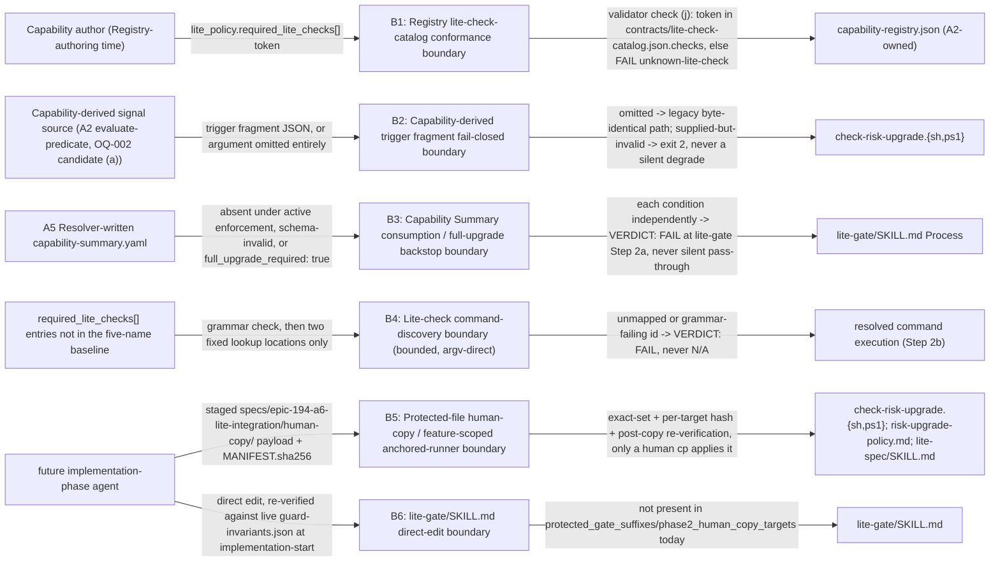

# Security Specification: epic-194-a6-lite-integration

This document expands design.md's Security Boundaries, Protected-File
Statement (including the Payload file set definition), Data Plan (the
`required_lite_checks`/`lite-check-catalog.json` grammar constraint), and
API / Contract Plan (the fail-closed `--capability-reasons` fragment
contract, the `lite-gate` Step 2a/2b backstop, and the Lite-check
command-discovery contract), plus requirements.md's own Security
Boundaries section, into the review harness's canonical layer-file
shape. It introduces no new security judgment beyond what those sections
already fix; every boundary, mitigation, and REQ/AC reference below
traces to design.md or requirements.md/acceptance-tests.md content
approved at Spec-Review-Status: Passed.

Framing (design.md External Integrations: "None. Every artifact this
design reads or extends is already internal to this repository";
requirements.md Security Boundaries bullet 1: "No new write surface...
this feature introduces no new agent-writable approval-like record, and
does not touch `SDD_SUDO`, the Approval Sidecar, or any hook-guard
mechanism"): this feature's attack surface is entirely local and, unlike
every implementation-bearing sibling epic (A2-A5), this Phase 1 package
authors no live script, schema, or test file of its own at all — every
edit is a *design* for a future implementation task, applied either via
the existing ADR-0011 human-copy mechanism (four already-protected
files) or a direct edit (one currently-unprotected file, `lite-gate/
SKILL.md`). Its security-relevant boundaries are therefore concentrated
in (1) the Registry-catalog conformance boundary, (2) the Capability-
derived trigger fragment fail-closed boundary, (3) the Capability
Summary consumption / full-upgrade backstop boundary, (4) the bounded
Lite-check command-discovery boundary, (5) the protected-file human-copy
/ feature-scoped anchored-runner boundary, and (6) the `lite-gate/
SKILL.md` direct-edit boundary — the six boundaries B1-B6 below.

## Trust Boundaries

| Boundary | Source | Destination | Assets | Validation | AuthN/AuthZ | REQ | AC |
|---|---|---|---|---|---|---|---|
| B1 — Registry lite-check-catalog conformance boundary | a Capability author's `lite_policy.required_lite_checks[]` declaration at Registry-authoring time | `validate-capability-registry`'s own conformant/non-conformant verdict (check (j)) | catalog-membership integrity: a Registry may only declare a check-id the versioned catalog already recognizes | for each `required_lite_checks[]` token, membership in `contracts/lite-check-catalog.json.checks` is checked, mirroring check (h)'s own per-token loop and diagnostic-string shape exactly; a non-member token is `FAIL "unknown-lite-check: <capability-id>: <token>"`, never silently accepted (design.md API / Contract Plan, "REQ-001 — `validate-capability-registry` check (j)") | N/A — deterministic structural/catalog-membership check, not an access-control mechanism | REQ-001 | AC-005 |
| B2 — Capability-derived trigger fragment fail-closed boundary | `check-risk-upgrade`'s new optional second argument (`--capability-reasons <fragment-path>` / `-CapabilityReasons`) | `check-risk-upgrade`'s own `lite-eligible`/`full-required: ...`/exit-`2` decision | input-validation integrity: a caller that attempts to supply a Capability-derived signal and fails must never be silently treated as one that never attempted to | the second argument's own **total absence** is the *only* legitimate degrade path (byte-identical to today, requirements.md AC-007); once supplied, an unreadable/not-valid-JSON/missing-`capabilities`-key/malformed-entry fragment is a hard error, exit `2`, no trigger reporting (Blocker [B3], design.md API / Contract Plan step 2b, correcting an earlier revision that degraded silently and mislabeled that degrade "fail-closed," investigation.md INV-014); an `eligible: false` entry with empty `upgrade_reasons` still contributes a non-empty synthetic `ineligible:<id>` token, never silently nothing (Blocker [B4]) | N/A — local CLI input validation, not an access-control mechanism | REQ-002 | AC-007, AC-027, AC-028 |
| B3 — Capability Summary consumption / full-upgrade backstop boundary | A5 Resolver-written `specs/<feature>/capability-summary.yaml` (or its absence), plus Project Context `workflow.capability_enforcement` | `lite-gate`'s own Step 2a `VERDICT: PASS`/`FAIL` decision | ground-truth integrity: an active-enforcement Feature must never silently proceed on an absent, invalid, or full-upgrade-flagged Summary | `lite-gate` Step 2a reads `workflow.capability_enforcement` (a read of an already-derived Epic A1 field, never a re-derivation); under `disabled-legacy` an absent Summary is legitimate (`required_lite_checks = []`); under `advisory`/`required`, an absent Summary is `VERDICT: FAIL` (Blocker [B6]), a schema-invalid Summary (validated via the A4/A5-owned validator, never reimplemented) is `VERDICT: FAIL`, and `full_upgrade_required: true` is `VERDICT: FAIL` at Step 2a before Step 2b ever runs (Blocker [B2], resolves OQ-003) (design.md API / Contract Plan, "REQ-003/REQ-004 — `lite-gate` Process extension") | N/A — deterministic structural/field check, not an access-control mechanism | REQ-003, REQ-004 | AC-011, AC-026, AC-030 |
| B4 — Lite-check command-discovery boundary (bounded, argv-direct) | a `required_lite_checks[]` entry not already one of `{placeholder, lint, typecheck, build, test}` | `lite-gate` Step 2b's own run/no-op/`VERDICT: FAIL` decision for that entry | execution-surface containment: a Registry-sourced string must never reach an interpolated shell command or resolve a file outside the fixed `scripts/` directory | (0) the id must match `^[a-z0-9][a-z0-9-]*$`, enforced fail-closed at three independent points (catalog item schema, Registry item schema, and `lite-gate` itself immediately before discovery) — Blocked *before* discovery is attempted, never passed through as a literal path segment; (1) a repo-root `package.json`'s `scripts[<id>]` key, invoked argv-direct via the package manager's own script-name parameter, never interpolated into a shell string; (2) `scripts/<id>.sh`/`scripts/<id>.ps1`, resolved only after the candidate path is canonicalized (symlinks/`..`/`.` resolved) and proven to still be inside the canonical `scripts/` prefix, must be a regular file (a symlink/reparse-point is rejected even if it itself resolves inside `scripts/`), invoked with its own path as a direct argv element to the interpreter — never an interpolated command string — and mapped only when **both** `.sh` and `.ps1` members exist and pass containment (a partial pair is unmapped, never "resolved for the running runtime only"); (3) neither location resolves → unmapped → `VERDICT: FAIL`, never `N/A` (Blocker [B7], reversed) (design.md API / Contract Plan, "Lite-check command-discovery contract," NEW-01, investigation.md INV-021) | N/A — deterministic, bounded lookup + containment check, not an access-control mechanism | REQ-004 | AC-015, AC-016 |
| B5 — Protected-file human-copy / feature-scoped anchored-runner boundary | a future implementation-phase agent's staged `specs/epic-194-a6-lite-integration/human-copy/` payload (`check-risk-upgrade.sh`, `check-risk-upgrade.ps1`, `risk-upgrade-policy.md`, `lite-spec/SKILL.md`) | the four live, already-protected paths (`protected_gate_suffixes`/`phase2_human_copy_targets`, `guard-invariants.json`) | write-boundary integrity for four paths this feature did not itself choose to protect; payload/control-file separation | `guard-invariants.json` suffix match denies any direct agent write to the four paths regardless of whether a file currently exists there; the Epic-136 fixed-prefix runner cannot apply this feature's own batch (investigation.md INV-019), so this design fixes a feature-scoped anchored runner's required contract instead: (i) reads targets from this feature's own `human-copy/` prefix only, never the Epic-136 prefix; (ii) three-way exact-set equality among the four declared payload targets, `MANIFEST.sha256`'s own target set, and the staged directory's own **payload file set** (control files — `MANIFEST.sha256` itself, the runner script, any target-inventory file — excluded by definition, 2026-07-22 adversarial final verification, investigation.md INV-020); (iii) per-target hash verification against `MANIFEST.sha256` before any copy; (iv) post-copy re-verification of each live, installed file's own hash (design.md Protected-File Statement, Major [M3]) — never a bare `cp` with no confirmation the bytes landed correctly | Implementation-phase agent: deny (direct write to the four reserved paths); Human maintainer: allow (via the anchored runner + SHA-256-verified `cp`), only after the runner itself is security-reviewed | REQ-002, REQ-005 | AC-031 |
| B6 — `lite-gate/SKILL.md` direct-edit boundary | a future implementation-phase agent's direct edit to `lite-gate/SKILL.md` | the live, currently-unprotected `lite-gate/SKILL.md` | citation/inventory-drift detection: this feature's own "direct edit, not human-copy" scoping must never be assumed permanently true | verified directly against the live `guard-invariants.json` at design-authoring time (investigation.md INV-008): `lite-gate/SKILL.md` is present in neither `protected_gate_suffixes` nor `phase2_human_copy_targets`, and named by neither ADR-0022 item 5 nor decision document v2 §6's identical note (OQ-001, now CLOSED); a future implementation task **re-confirms this against the live file at implementation-start time**, the same "live-repository snapshot, re-verified at implementation-start time" discipline every sibling epic's own Protected-File Statement already applies — if `guard-invariants.json` is found, independently of this feature, to already name this path by then, the human-copy path (B5) applies to it instead (design.md Protected-File Statement, item 2) | Implementation-phase agent: allow (direct edit, ordinary PR review) unless the re-verification above finds the path newly protected | REQ-004 | — |

## STRIDE Analysis

| Boundary | Threat | STRIDE | Abuse Case | Mitigation | Verification | REQ | AC |
|---|---|---|---|---|---|---|---|
| B1 | A Capability author declares a `required_lite_checks` token the catalog does not recognize, and it silently passes Registry validation, letting `lite-gate` later encounter an undeclared-vocabulary token with no defined behavior | Tampering | A typo'd or invented check-id (e.g. `"tset"` for `"test"`) is accepted at Registry-authoring time and only surfaces as a confusing failure much later, at `lite-gate` execution time, far from its root cause | check (j) fail-closes at Registry-authoring time, mirroring check (h)'s own per-token loop exactly: any non-member token is `FAIL "unknown-lite-check: <capability-id>: <token>"`, never silently accepted (design.md API / Contract Plan) | AC-005; `lite-check-catalog-conformance` fixture (design.md Test Strategy item 1) | REQ-001 | AC-005 |
| B2 | A caller supplies `--capability-reasons` pointing at a fragment that is unreadable, malformed, or shape-invalid, and the failure is silently degraded to "no Capability-derived trigger" instead of surfaced, letting an ineligible Capability go unflagged | Tampering / Elevation of Privilege | A corrupted or truncated fragment file (accidental or adversarial) causes `check-risk-upgrade` to silently behave as if no Capability-derived signal existed at all, masking a real ineligible-Capability trigger | a supplied-but-invalid fragment is a hard error, exit `2`, no trigger reporting — the *only* legitimate degrade is total argument omission (Blocker [B3], correcting the earlier revision's mislabeled silent degrade, investigation.md INV-014); an `eligible: false` entry with no named reason still contributes a synthetic `ineligible:<id>` token rather than silently nothing (Blocker [B4]) | AC-007 (byte-identical omitted-argument baseline), AC-027 (fragment fail-closed), AC-028 (ineligible-no-reasons synthetic token); Test Strategy items 4, 13, 14 | REQ-002 | AC-027 |
| B3 | An active-`capability_enforcement` Feature reaches `lite-gate` with no `capability-summary.yaml` at all, or one flagged `full_upgrade_required: true`, and the gate proceeds to `VERDICT: PASS` anyway, letting a Feature that should have been forced to the full workflow ship via Lite | Tampering / Elevation of Privilege | A Feature whose Resolver run failed to stage a Summary (or whose Summary correctly names `full_upgrade_required: true`) is nonetheless treated by `lite-gate` as an ordinary, unflagged Lite Feature | Step 2a fail-closes independently on three conditions — absent Summary under active enforcement (Blocker [B6]), schema-invalid Summary, and `full_upgrade_required: true` (Blocker [B2], resolves OQ-003) — each is `VERDICT: FAIL`, checked before Step 2b ever runs, never a silent pass-through (design.md API / Contract Plan) | AC-011, AC-026, AC-030; Test Strategy items 8, 9, 12, 15 | REQ-003, REQ-004 | AC-026 |
| B4 | A Registry-sourced check-id is crafted (or accidentally malformed) to contain `../`, a path separator, or option-like syntax, aiming to make the command-discovery lookup escape `scripts/`, follow a symlink outside it, or otherwise resolve to an unintended executable | Tampering / Elevation of Privilege | A `required_lite_checks` entry such as `"../../malicious"` or a `scripts/<id>` symlink pointing outside `scripts/` is used to make `lite-gate` execute an attacker-influenced binary instead of a legitimate project check | the step-0 grammar (`^[a-z0-9][a-z0-9-]*$`) rejects any such id fail-closed, at three independent enforcement points, *before* discovery is ever attempted; the `scripts/<id>` candidate is additionally canonicalized and its prefix re-proven to still be `scripts/` before the file is touched, and must be a regular file, never a symlink/reparse-point, even one that itself resolves inside `scripts/`; every invocation is argv-direct (`sh scripts/<id>.sh` / `pwsh -File scripts/<id>.ps1`), never an interpolated shell command string, so no character the grammar already excludes could reach a shell parser regardless (design.md API / Contract Plan, "Lite-check command-discovery contract," NEW-01) | AC-015, AC-016; Test Strategy item 7 (paired `bash`+`ps1` negative fixtures for `../`, path-separator, option-like ids, symlink/reparse-point rejection, and single-runtime-only partial pairs) | REQ-004 | AC-016 |
| B5 | An implementation-phase agent edits one of the four protected `sdd-lite` paths directly, bypassing human-copy review; or the feature-scoped runner applies a payload whose staged bytes do not match its own manifest, or whose copy silently fails to land correctly | Tampering / Elevation of Privilege | A direct edit to `check-risk-upgrade.sh` bypasses PR-level human-copy review; or a corrupted staged file, or a `cp` that silently fails partway, installs bytes that do not match the reviewed, hash-verified payload | `guard-invariants.json`'s suffix match denies a direct write to any of the four reserved paths regardless of whether a file currently exists there; the feature-scoped anchored runner this design's Protected-File Statement fixes performs three-way exact-set verification, per-target hash verification before copy, and post-copy re-verification of each installed file's own hash — never a bare `cp` with no confirmation (design.md Protected-File Statement, Major [M3]) | AC-031; Test Strategy item 17 (`human-copy-runner-contract`, design-content review) | REQ-002, REQ-005 | AC-031 |
| B6 | `guard-invariants.json` is independently updated (by an unrelated change) to add `lite-gate/SKILL.md` to the protected inventory between this design's authoring time and a future implementation task's start time, and the implementation task edits it directly anyway, unaware of the change | Tampering | A future maintainer's own, unrelated hardening pass protects `lite-gate/SKILL.md`; an implementation task that still assumes this design's own investigation-time snapshot bypasses that new protection with a direct edit | the Protected-File Statement requires re-confirming, at implementation-start time, that `guard-invariants.json` still does not name this path — the same "live-repository-snapshot, re-verified at implementation-start time" discipline every sibling epic's own Protected-File Statement already applies to its own citations; if found newly protected, the human-copy path (B5) applies instead (design.md Protected-File Statement, item 2, OQ-001 CLOSED) | design-content review only; no dedicated fixture (this is a design-time citation-currency discipline, not a runtime check) | REQ-004 | — |

## Authentication Flow

N/A — this feature defines no authentication mechanism. Every actor is
bound by the local OS-user/filesystem boundary: a Capability author
authoring a Registry entry, an implementation-phase agent's proposed
edit, a human maintainer's direct `cp` via the anchored human-copy
runner, a CI runner (`test.yml`, unmodified by this feature), or a
script's own caller within the same process boundary (design.md
External Integrations: "None").

## Authorization

| Actor / Role | Resource | Action | Decision Point | Default | Denial Evidence | REQ | AC |
|---|---|---|---|---|---|---|---|
| Capability author | `lite_policy.required_lite_checks[]` (Registry entry) | declare a check-id | `validate-capability-registry` check (j) | allow, if catalog-member; deny otherwise | `FAIL "unknown-lite-check: <capability-id>: <token>"` | REQ-001 | AC-005 |
| Implementation-phase agent | `contracts/lite-check-catalog.json`, `lite-upgrade-reason-catalog.json` (`catalog_version` 2), `validate-capability-registry`'s new check (j) | write (direct, per-PR reviewed) — but only by whichever future task also applies A2's own `capability-registry.schema.json` v1.1 edit; not this feature's own build scope (`contracts/**` is outside this feature's own build, requirements.md Non-goals) | ordinary PR review + CI's existing `--check` drift cycle; no protected-file guard applies to these paths today | allow (unprotected, reviewed) | N/A — this is the allow path | REQ-001 | — |
| Implementation-phase agent | `check-risk-upgrade.{sh,ps1}`, `risk-upgrade-policy.md`, `lite-spec/SKILL.md` (protected, existing) | write (direct) | existing repository-wide protected-file guard (`guard-invariants.json` suffix match) | deny (agent direct write) | staged human-copy under `specs/epic-194-a6-lite-integration/human-copy/` + `MANIFEST.sha256`; only a human, via the feature-scoped anchored runner, may apply it | REQ-002, REQ-005 | AC-031 |
| Human maintainer | staged human-copy payload (four files) + `MANIFEST.sha256` | apply via the feature-scoped anchored runner + SHA-256 verification | Protected-File human-`cp` procedure (ADR-0011, matching Epic-136's own precedent, re-parameterized to this feature's own prefix) | allow (human-only action), only after the runner itself is security-reviewed | N/A — this is the allow path | REQ-002, REQ-005 | AC-031 |
| Implementation-phase agent | `lite-gate/SKILL.md` (currently unprotected) | write (direct edit) | live `guard-invariants.json` re-verified at implementation-start time | allow, unless re-verification finds the path newly protected | N/A — this is the allow path, contingent on the re-verification | REQ-004 | — |
| `lite-gate` process (Step 2a/2b) | `specs/<feature>/capability-summary.yaml`, Project Context `workflow.capability_enforcement` | read + consume | B3's own fail-closed decision tree | read-only; `VERDICT: FAIL` on any of the three fail-closed conditions | the `VERDICT: FAIL` reason text itself | REQ-003, REQ-004 | AC-011, AC-026, AC-030 |

## Data Classification and Protection

| Entity | Classification | At Rest | In Transit | Retention | Deletion | Access Log | REQ | AC |
|---|---|---|---|---|---|---|---|---|
| `contracts/lite-check-catalog.json` (new) | internal — machine-readable catalog, no PII/credential | repository working tree (git), content-frozen once design review passes | filesystem only | git-versioned | not applicable; no delete operation in scope | git commit history | REQ-001 | — |
| `contracts/lite-upgrade-reason-catalog.json` (`catalog_version` 2) | internal — machine-readable catalog data, no PII/credential | repository working tree (git) | filesystem only | git-versioned; additive-only (no token removal, AC-004) | not applicable | git commit history | REQ-001 | AC-004 |
| `lite_policy.required_lite_checks[]` (Registry field, once A2 applies the schema) | internal — capability/check-id declarations only, no PII/credential | repository working tree (git), per Registry | filesystem only | git-versioned | not applicable | git commit history | REQ-001 | AC-002 |
| Capability-derived trigger fragment (in-process/CLI JSON, REQ-002) | internal, transient — capability ids/eligibility/reason tokens only, no PII/credential | not persisted; a temp path used only for the duration of one `check-risk-upgrade` invocation (design.md API / Contract Plan step 2, `lite-spec` writes it to "a temp path") | filesystem only, local process boundary | transient — exists only for the invocation that produced/consumed it | deleted by the producing process's own temp-file lifecycle (not specified further by this design; no durable retention is implied) | N/A | REQ-002, REQ-005 | — |
| `specs/epic-194-a6-lite-integration/human-copy/` payload (four staged files) + `MANIFEST.sha256` | internal — staged copies of already-reviewed script/policy/skill content, no PII/credential | repository working tree (git), staged pending human application | filesystem only | git-versioned pending application; superseded once applied to the live protected paths | not applicable | git commit history | REQ-002, REQ-005 | AC-031 |

No artifact this feature designs carries a credential, secret, or PII
value; none of the schemas or CLI contracts defines one (requirements.md
Security Boundaries; design.md External Integrations: "None"). REQ:
REQ-001, REQ-002, REQ-003, REQ-004, REQ-005.

## OWASP Mapping

| OWASP Risk | Exposure | Control | Verification | Owner |
|---|---|---|---|---|
| Injection | Lite-check command-discovery contract (B4) — a Registry-sourced check-id ultimately reaching command execution | step-0 grammar (`^[a-z0-9][a-z0-9-]*$`) enforced fail-closed at three independent points before discovery; canonicalized-path containment proof against `scripts/`; regular-file-only resolution; every invocation argv-direct, never an interpolated shell command string (design.md API / Contract Plan, "Lite-check command-discovery contract," NEW-01) | AC-016; Test Strategy item 7 | Implementation task owner |
| Software and Data Integrity Failures | Registry-catalog conformance (B1); Capability-derived fragment fail-closed contract (B2); Capability Summary consumption / full-upgrade backstop (B3); protected-file human-copy exact-set/hash/post-copy verification (B5) | fail-closed catalog-membership check; hard-error-on-invalid-fragment (never silent degrade); three independent fail-closed conditions at `lite-gate` Step 2a; three-way exact-set equality plus per-target and post-copy hash verification for the human-copy payload | AC-005, AC-026, AC-027, AC-031 | Implementation task owner |
| Security Misconfiguration | Unmapped `required_lite_checks` check-id (B4, Blocker [B7], reversed) | an unmapped or grammar-failing id is `VERDICT: FAIL`, never silently `N/A` — a Registry-sourced declaration is a promise the check runs, and letting an unmapped one silently PASS-by-`N/A` would break that promise (design.md Design Decisions) | AC-015, AC-016 | Implementation task owner |
| Broken Access Control | Four already-protected `sdd-lite` paths (B5); `lite-gate/SKILL.md`'s currently-unprotected status, re-verified at implementation-start (B6) | `guard-invariants.json` suffix-match denial + feature-scoped anchored-runner human-copy staging for the four protected paths; live-repository re-verification discipline before the direct-edit path is used for the fifth | AC-031 | Implementation task owner |
| Cryptographic Failures | N/A — this feature performs no signing or encryption of any kind; `MANIFEST.sha256` entries are content-identity hashes for drift/tamper *detection* during human-copy application only, not authenticity or signing (mirrors A5's own identical scope disclaimer for its own digest fields) | — | — | — |
| Identification and Authentication Failures | N/A — no authentication mechanism anywhere in this feature (design.md External Integrations: "None"); every actor is bound by the local OS-user/filesystem boundary | design review | — | — |

## Secrets Management

- This feature introduces no secret, credential, or key of any kind. No
  script or skill edit this design names reads an environment variable,
  a `.env` file, or any key-material-bearing input (requirements.md
  Security Boundaries; design.md External Integrations: "None").
- `MANIFEST.sha256` entries used by the feature-scoped anchored human-copy
  runner (B5) are content-identity hashes for drift/tamper *detection*
  during a staged-to-live copy, not authentication of who staged the
  content — the identical scope disclaimer A5's own `security-spec.md`
  records for its own digest fields.
- This feature's Capability-derived trigger fragment (Data Plan) carries
  only capability ids, boolean eligibility, and catalog-validated reason
  tokens — no credential-bearing field is defined anywhere in its shape.

## SBOM and Supply Chain

- No new external (npm/pip/etc.) package dependency is introduced. Every
  new artifact is a JSON/JSON-Schema data file or an additive extension
  of existing shell/PowerShell/Markdown content (design.md Global
  Constraints: "No new plugin"; "Cross-runtime parity... this design
  introduces no `.py`/`.js` master for either file").
- No `.py` master and no `.js` wrapper is introduced by this design for
  any script it touches — `check-risk-upgrade.{sh,ps1}` keeps its
  existing native shell/PowerShell implementation, unlike A2's own new
  digest-primitive scripts (frontend-spec.md Technology Stack).
- Epic A2's `evaluate-predicate` is invoked as a subprocess (an existing
  internal dependency, same repository, at `lite-spec`'s own
  pre-generation gate), never vendored, reimplemented, or an external
  package (design.md Architecture; API / Contract Plan "REQ-005").
- No new schema file requires a vendored packaged copy under `plugins/**`
  by this feature's own authority — `contracts/lite-check-catalog.json`'s
  own future protection/vendoring registration is performed by whichever
  future task also applies A2's own Registry schema v1.1 edit, not by
  this feature's own Phase 1/2 (design.md Protected-File Statement).

## Security Tests

| Test | Boundary | Attack / Control | Expected Result | Evidence | AC |
|---|---|---|---|---|---|
| Test Strategy item 1 | B1 | A `required_lite_checks` fixture with an unknown token, independent of `upgrade_reasons` value | `FAIL unknown-lite-check: <capability-id>: <token>` | `lite-check-catalog-conformance` (design-phase target fixture) | AC-005 |
| Test Strategy item 4 | B2 | Existing six-row keyword-scan fixture set invoked with **no** second argument | byte-identical to today's live scripts, regression baseline | `check-risk-upgrade-byte-identical` | AC-007 |
| Test Strategy item 13 | B2 | `--capability-reasons` path to an unreadable/malformed/shape-invalid file | exit `2`, no trigger output, distinct from the omitted-argument case | `check-risk-upgrade-fragment-fail-closed` | AC-027 |
| Test Strategy item 14 | B2 | A fragment entry `{"id": "x", "eligible": false, "upgrade_reasons": []}` | `triggers=ineligible:x`, exit `10` | `check-risk-upgrade-ineligible-no-reasons` | AC-028 |
| Test Strategy item 8, 15 | B3 | No Project Context at all (`disabled-legacy`) vs. `workflow.capability_enforcement: required`/`advisory` with no Summary | item 8: five baseline checks only, unchanged output; item 15: `VERDICT: FAIL`, distinct from item 8 | `lite-gate-summary-absent`, `lite-gate-summary-absent-active-enforcement` | AC-011, AC-030 |
| Test Strategy item 9 | B3 | A `capability-summary.yaml` that fails A4's schema | `VERDICT: FAIL`, `Status` unchanged, reason names the validation failure | `lite-gate-summary-invalid` | — |
| Test Strategy item 12 | B3 | A schema-valid Summary with `full_upgrade_required: true` | `VERDICT: FAIL` at Step 2a, before Step 2b ever runs; `false` continues normally | `lite-gate-full-upgrade-backstop` | AC-026 |
| Test Strategy item 7 | B4 | Paired `bash`+`ps1` negative fixtures: a check-id containing `../` or a path separator, an option-like id (e.g. `--help`), a `scripts/<id>` symlink/reparse point resolving inside `scripts/`, and a fixture staging only one runtime member of a pair | grammar-failing/traversal ids rejected before discovery (`VERDICT: FAIL`, grammar reason, not a discovery attempt); symlink/reparse-point rejected distinctly; a partial pair is unmapped, never "resolved for the running runtime only" | `lite-gate-summary-consumption` | AC-015, AC-016 |
| Test Strategy item 17 | B5 | Design-content review: the feature-scoped anchored runner's own payload-file-set-defined exact-set/hash/post-copy-verification contract, distinct from the Epic-136 fixed-prefix runner it cannot reuse unmodified | design.md states the three-way equality among the declared four-target payload list, the manifest's own target set, and the enumerated payload set (control files excluded) | `human-copy-runner-contract` | AC-031 |
| Test Strategy item 10 | B6 (registration hygiene, Global) | `bash scripts/check-sdd-structure.sh .` and `bash plugins/sdd-quality-loop/scripts/check-workflow-state.sh` both exit `0` after this package's registration commit, re-run as a fixture | both exit `0` | `registration-drift` | AC-025 |

## Open Questions

- None — every boundary above traces to design.md's Security Boundaries /
  Protected-File Statement (including the Payload file set definition) /
  Data Plan / API / Contract Plan (the fail-closed fragment contract, the
  `lite-gate` Step 2a/2b backstop, and the Lite-check command-discovery
  contract) or requirements.md's own Security Boundaries section, each
  already fixed at Spec-Review-Status: Passed; no new security judgment
  is introduced by this document.
