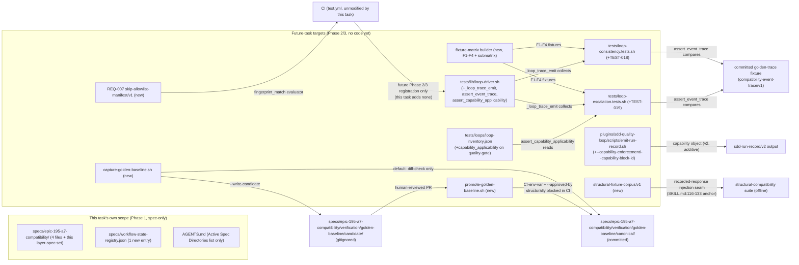

# Infrastructure Specification: epic-195-a7-compatibility

No new runtime deployment and no CI change in this task (design.md
Deployment / CI Plan: "No CI change in this task"). This document
expands design.md's Deployment / CI Plan, Architecture, Components,
Data Plan (golden-baseline manifest, REQ-007 allowlist manifest),
Protected-File Statement, and Global Constraints into the review
harness's canonical layer-file shape for the CI wiring, test execution
environment, and rollback procedure this Phase 1 package specifies for
a future Phase 2/3 implementation task. It introduces no new
infrastructure judgment beyond what those sections already fix.

## Deployment Topology



No cloud, no region, no network boundary — every deliverable this task
specifies is a repository-internal test-infrastructure artifact
(design.md External Integrations: "None. Every target in this package is
internal to the repository"). No new plugin and no new CI job is
introduced by *this* task; the diagram above shows the future-task
wiring design.md's Test Strategy and API / Contract Plan already fix,
not work this task performs. Fault domain: a single script invocation or
test-suite run (CI job or local `tests/run-all.sh`/`.ps1` invocation) —
this task introduces no shared/long-running service of its own.

## CI/CD Sequence

```mermaid
sequenceDiagram
  actor D as Developer / Maintainer
  participant CI as GitHub Actions (test.yml, unmodified by this task)
  participant GBC as capture-golden-baseline.sh (future task)
  participant GBP as promote-golden-baseline.sh (future task)
  D->>CI: Push / PR (Phase 1: spec files only; Phase 2/3: suite/driver/manifest edits)
  CI->>CI: existing structural/workflow-state registration check\n(scripts/check-sdd-structure.sh, check-workflow-state.sh)
  CI->>GBC: (future) default invocation, no flag — diff against committed canonical baseline
  GBC-->>CI: exit 0 (no drift) / non-zero (drift detected, hard fail)
  Note over CI,GBP: CI never invokes promote-golden-baseline.sh or\ncapture-golden-baseline.sh --write-candidate (Security Boundaries B1).\nAC-040 statically scans test.yml for both literal strings.
  D->>GBP: (future, PR-reviewed, human-only) promote-golden-baseline.sh <candidate> --approved-by <id>
  GBP->>GBP: refuse if CI env var set, or --approved-by omitted (fail-closed, before any file I/O)
  GBP-->>D: candidate copied to canonical path (only on success)
  CI-->>D: PASS / FAIL
```

This task adds no CI job itself (design.md Deployment / CI Plan). A
future implementation task's own `tests/*.tests.sh`/`.tests.ps1` pairs
(Test Strategy items 1-8) are registered into `tests/run-all.sh`,
`tests/run-all.ps1`, and `.github/workflows/test.yml` (Test Strategy
item 9) the same way every sibling epic's own new test pairs already are
— following the four-Pillar-A-loop-suite precedent (investigation.md
INV-005). Whether `.github/workflows/test.yml` itself is directly
agent-editable or requires staged/reviewed human-copy application (per
Epic A5's own precedent for that file) is explicitly left for Phase 2/3
to confirm against the live protected-file list at that time (Test
Strategy item 9) — this task makes no claim either way. The AC-031
live-model structural-comparison refresh test is registered as a
separate, non-gating job (or run manually, never inside the gating
`test.yml` entries), so a live-model dependency never blocks the gating
suite (design.md Deployment / CI Plan).

## Environments

| Environment | URL | Auth | Trigger | Classification | Promotion Rule |
|---|---|---|---|---|---|
| local dev (monorepo checkout) | `tests/` + `plugins/sdd-quality-loop/` + `specs/epic-195-a7-compatibility/` (repo-relative) | OS user (filesystem) | manual suite invocation (`tests/run-all.sh`/`.ps1`, or a single suite file) | internal | PR + CI green |
| CI (GitHub Actions `test.yml`, unmodified by this task) | N/A — ephemeral runner | GitHub Actions default | push / PR | internal | required check before merge; `CI` env var structurally blocks `promote-golden-baseline.sh` (Security Boundaries B1) |
| staging / production | N/A | — | — | — | N/A — no runtime service, no cloud deployment (design.md External Integrations: "None") |

The golden-baseline `canonical/` path is git-versioned and promoted only
through a dedicated, human-reviewed pull request (REQ-006c); no
environment other than "local dev, human-run" is ever authorized to
write it (Security Boundaries B1).

## Infrastructure as Code

N/A — no cloud. Every deliverable this task specifies is a Bash/
PowerShell script, a JSON schema/manifest, or an additive extension of
an existing test-infrastructure file, added to the existing `tests/`,
`plugins/sdd-quality-loop/`, and this feature's own
`specs/epic-195-a7-compatibility/verification/` trees. No Terraform/IaC
module is introduced by this task or its future-task deliverables.

## Scaling Strategy

N/A — no runtime service, no concurrency model. Each future-task script
(`capture-golden-baseline.sh`, `promote-golden-baseline.sh`, the fixture-
matrix builder, `_loop_trace_emit`/`assert_event_trace`) is a single,
deterministic, synchronous invocation per suite run — this design fixes
a fixed environment (`TZ`, `LC_ALL`, no ambient `SDD_*`) for the
golden-baseline capture manifest specifically so repeated captures are
reproducible, not merely idempotent (design.md API / Contract Plan,
"Golden-baseline capture/promote contract").

## Service Level Objectives

N/A — no live service to hold an availability/latency SLO. The closest
analogs are three correctness properties design.md already fixes as
contracts: (1) `capture-golden-baseline.sh`'s default invocation must
exit non-zero on any drift from the committed canonical baseline, never
silently pass (REQ-006/AC-001/AC-018); (2)
`promote-golden-baseline.sh`'s own `CI`-env-var/`--approved-by` guards
must refuse to run — before any file I/O — whenever either condition is
unmet, verified directly by AC-041's runtime-refusal fixtures rather
than only inferred from AC-040's static workflow-text scan; (3) the
REQ-007 allowlist manifest's `fingerprint_match` evaluator must hard-fail
(never silently `SKIP`) whenever a cited upstream epic has merged but its
fingerprinted text no longer matches (AC-035c, "fingerprint drift").

## Data Residency and Retention

| Entity | Residency | Retention | Backup | Deletion Verification | REQ | AC |
|---|---|---|---|---|---|---|
| `specs/epic-195-a7-compatibility/verification/golden-baseline/canonical/` (future, committed) | repository working tree (git) | git-versioned; updated only via a reviewed candidate→canonical promotion (REQ-006c) | git remote(s) — no separate backup mechanism | not applicable; no delete operation exists in scope | REQ-006 | AC-001, AC-018 |
| `specs/epic-195-a7-compatibility/verification/golden-baseline/candidate/` (future, gitignored) | local filesystem, transient (per-invocation `--write-candidate` output) | not committed; superseded by the next `--write-candidate` run or discarded after promotion | none — transient by design | deleted/overwritten by the next capture invocation | REQ-006 | — |
| REQ-007 `skip-allowlist-manifest/v1` (future, committed) | repository working tree (git) | git-versioned; additive-growth as new upstream-dependent assertions are added | git remote(s) | not applicable | REQ-007 | AC-034, AC-035 |
| `structural-fixture-corpus/v1` (future, committed) | repository working tree (git) | git-versioned; refreshed only via AC-031's own non-gating live-model refresh test (`refresh_procedure` field), never the gating suite | git remote(s) | not applicable | REQ-002 | AC-030, AC-031 |
| Fixture-matrix builder's own working fixtures (future, transient) | local filesystem, `mktemp -d` outside the real working tree (`loop_fixture_init`'s own pattern) | not persisted beyond the invocation that produced/consumed it | none — transient by design | deleted by the producing process's own temp-directory lifecycle | REQ-005 | AC-014 |

No database, no migration, no runtime storage anywhere in this feature.
The golden-baseline manifest records the exact pre-capability merge-base
commit SHA (AC-018, INV-022) and each captured target's own sha256 plus
the capturing script's own sha256 — an integrity record, not a data
migration.

## Observability

| Logs | Traces | Metrics | Alert | Owner | Runbook |
|---|---|---|---|---|---|
| Suite PASS/FAIL lines; `capture-golden-baseline.sh`'s own drift diagnostic; `promote-golden-baseline.sh`'s own `CI`-env-var/`--approved-by` refusal message; `skip-stop-message` template strings (named-`SKIP` and `PROJECT_CONTEXT_INVALID` stop, design.md Data Plan) | N/A — no distributed request, single-process CLI/test-suite invocation per run | N/A — no running service to emit a metric; CI's existing pass/fail signal on the registered suites is the closest observable signal | CI failure on any registered `.tests.sh`/`.tests.ps1` pair; a golden-baseline diff-check non-zero exit; a `fingerprint_match` drift hard-fail (AC-035c) | Implementation task owner | design.md describes no logging/tracing/runbook infrastructure beyond these suite diagnostics and manifest-driven hard-fails; none is invented here |

## Cost Estimate

N/A — no cloud cost. This task adds no new CI job and no new compute
consumer; every future-task deliverable runs inside the repository's
existing CI compute (`test.yml`, already provisioned, unmodified by this
task) or on local developer/maintainer machines. The one operational
cost this design fixes is process, not compute: golden-baseline
promotion requires a dedicated, human-reviewed pull request (REQ-006c) —
a review-time cost, not an infrastructure spend.

## Rollback

- **Trigger.** A CI failure on a future-registered suite, a
  golden-baseline diff-check false positive/negative discovered
  post-merge, a structural-comparison suite regression, or a
  `fingerprint_match` drift hard-fail whose cited upstream text was
  intentionally, not accidentally, changed (requiring the citation
  itself to be re-pinned, not the drift check disabled).
- **This task's own change set (Phase 1, spec-only).** The four spec
  files (`investigation.md`, `requirements.md`, `design.md`,
  `acceptance-tests.md`), this layer-spec set, the one new
  `specs/workflow-state-registry.json` entry, and the `AGENTS.md` Active
  Spec Directories list edit are all unprotected files (Protected-File
  Statement) and revert via a standard `git revert` of the offending
  commit(s) — no special procedure, since this task authors no live
  script, schema, or test file of its own (Layer Specifications /
  Security Boundaries).
- **Future-task additive extensions (Phase 2/3, not yet built).** Every
  extension point this design fixes is additive-only: a new optional
  field on the existing `quality-gate` loop-inventory entry (never a new
  `id`, AC-008), new functions in the shared driver (existing functions
  themselves unmodified, AC-009), new `TEST-018`/`TEST-019` cases in
  existing suite files (never a new suite file), and a new,
  independently-gated `capability` object in `emit-run-record.sh`'s
  output (no-flag output byte-identical, AC-011). A rollback of any of
  these is therefore a straightforward `git revert` of the additive diff
  — no data-compatibility dimension to reconcile, since no existing
  consumer of the unmodified no-flag/no-field baseline is broken by
  reverting the extension.
- **Golden-baseline canonical path.** Can only be changed via
  `promote-golden-baseline.sh` inside a reviewed PR (REQ-006c); a bad
  promotion is rolled back the same way it was applied — a human
  re-running the promote procedure against a corrected candidate, or a
  `git revert` of the promoting commit, since no script this design
  fixes writes the canonical path outside that reviewed procedure
  (Security Boundaries B1).
- **REQ-007 allowlist manifest.** A manifest entry whose
  `activation_condition` or `fingerprints[]` was edited incorrectly
  reverts via `git revert` like any other repository file; because
  `fingerprint_match` is recomputed against each cited epic's *current*
  HEAD at evaluation time (never cached), no separate manifest-specific
  rollback mechanism is needed beyond restoring the manifest's own prior
  committed content (Data Plan, "REQ-007 SKIP allowlist manifest").
- **Verification after rollback.** Re-run the reverted suite(s) locally
  and re-run `capture-golden-baseline.sh` (should exit 0 against the
  restored canonical baseline, no drift); for a Phase 1 spec-only
  rollback, re-run `scripts/check-sdd-structure.sh .` and
  `plugins/sdd-quality-loop/scripts/check-workflow-state.sh --feature
  epic-195-a7-compatibility` to confirm the reverted state is internally
  consistent with the review-loop evidence already committed.

## Open Questions

- None — OQ-001 (Epic A5 caller-contract suite's home), OQ-002
  (`PROJECT_CONTEXT_INVALID` as a fifth fixture-matrix state), and OQ-003
  (golden-baseline's exact physical path,
  `specs/epic-195-a7-compatibility/verification/golden-baseline/`) are
  all three resolved by design.md's own Design Decisions section; no
  infrastructure-surface question remains open for this Phase 1 package's
  own scope.
