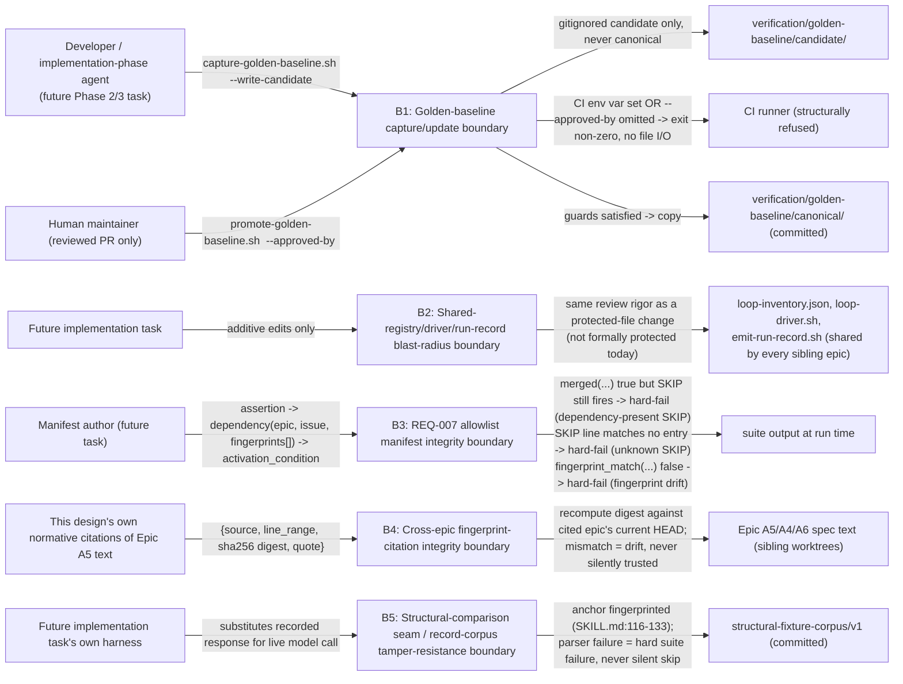

# Security Specification: epic-195-a7-compatibility

This document expands design.md's Security Boundaries (B1-B3), Data Plan
(the REQ-007 SKIP allowlist manifest and its `fingerprint_match`
evaluator), Design Decisions ("Cross-epic fingerprint citations,"
"Structural-comparison seam: anchor, record corpus, parser-failure, and
normalization algorithm"), API / Contract Plan (the golden-baseline
capture/promote contract), and Protected-File Statement into the review
harness's canonical layer-file shape. It introduces no new security
judgment beyond what those sections already fix; every boundary,
mitigation, and REQ/AC reference below traces to design.md content
approved at Spec-Review-Status: Passed.

Framing (design.md External Integrations: "None. Every target in this
package is internal to the repository"; Protected-File Statement: "This
task modifies no protected file and no file outside
`specs/epic-195-a7-compatibility/`, `AGENTS.md` ..., and
`specs/workflow-state-registry.json`"): this feature's attack surface is
entirely local and, like Epic A6, this Phase 1 package authors no live
script, schema, or test file of its own at all — every artifact below is
a *design* for a future implementation task. Its security-relevant
character is therefore not "what can an external attacker do to a
running service" (there is none) but "what can silently corrupt the
integrity of a compatibility oracle a future task and CI both trust
without human re-review" — concentrated in (1) the golden-baseline
capture/update boundary, (2) the shared-registry/driver/run-record
blast-radius boundary, (3) the REQ-007 allowlist manifest integrity
boundary, (4) the cross-epic fingerprint-citation integrity boundary,
and (5) the structural-comparison seam / record-corpus tamper-resistance
boundary — the five boundaries B1-B5 below (design.md itself names B1-B3
under Security Boundaries; B4 and B5 are this document's own expansion
of design.md's Design Decisions content into the same boundary shape,
per this task's own instruction to cover fingerprint verification and
test-harness tamper resistance explicitly).

## Trust Boundaries

| Boundary | Source | Destination | Assets | Validation | AuthN/AuthZ | REQ | AC |
|---|---|---|---|---|---|---|---|
| B1 — Golden-baseline capture/update boundary | a future implementation task's `capture-golden-baseline.sh [--write-candidate]` invocation, or a human maintainer's `promote-golden-baseline.sh` invocation | the canonical golden-baseline path (`specs/epic-195-a7-compatibility/verification/golden-baseline/canonical/`) | byte-for-byte legacy compatibility oracle integrity: the canonical baseline must never be silently regenerated by an automated or CI-driven process | `--write-candidate` produces only a gitignored candidate file, never the canonical path; the canonical file is written exclusively by `promote-golden-baseline.sh`, run only inside a maintainer-reviewed PR (REQ-006c); the script itself exits non-zero, before reading or writing any file, whenever the `CI` env var is set to any non-empty value or `--approved-by <human-identifier>` is omitted, never inferred/defaulted/satisfied by an empty string; AC-040's static check independently scans the committed `.github/workflows/test.yml` text for the literal strings `promote-golden-baseline.sh`/`--write-candidate`, hard-failing if either appears; AC-041 exercises the script's own runtime refusal directly (design.md API / Contract Plan, Security Boundaries B1) | Automated/CI process: deny (structural refusal); Human maintainer: allow, only via the reviewed-PR + `--approved-by` procedure | REQ-006 | AC-001, AC-018, AC-040, AC-041 |
| B2 — Shared-registry/driver/run-record blast-radius boundary | a future implementation task's additive edit to `tests/loops/loop-inventory.json`, `tests/lib/loop-driver.sh`, or `plugins/sdd-quality-loop/scripts/emit-run-record.sh` | every sibling epic's own suite that already depends on these shared, unversioned files | cross-epic regression containment: a capability-aware edit to a file every other loop/suite/run-record consumer also depends on must never silently change behavior for a consumer that supplied no capability flag | future-task edits are reviewed "with the same rigor as a protected-file change... even though not formally protected today" (requirements.md Security Boundaries B2); `assert_terminal`/`assert_artifacts_schema` are themselves unmodified (AC-009); the no-flag `emit-run-record.sh` heredoc stays byte-identical (AC-011); `capability_applicability` is scoped to the single `quality-gate` entry, never applied pre-emptively to every entry (Design Decisions) | Implementation-phase agent: allow (direct edit, ordinary PR review, elevated scrutiny by convention) | REQ-003 | AC-008, AC-009, AC-011, AC-033 |
| B3 — REQ-007 allowlist manifest integrity boundary | a future task's `skip-allowlist-manifest/v1` entry (assertion → dependency(epic, issue, `fingerprints[]`) → `activation_condition`) | every registered suite's own `SKIP` line at run time | fail-open closure: an upstream-dependent assertion must have a named, auditable degradation, never an unexplained or indefinitely-extended `SKIP` | the evaluator hard-fails per AC-035 on any of three conditions: (a) `merged(...)` true but `SKIP` still fires (dependency-present SKIP); (b) a `SKIP`-shaped output line matches no manifest entry (unknown SKIP); (c) `merged(...)` true but `fingerprint_match(...)` false for any cited `fingerprints[]` entry (fingerprint drift) — evaluated independently of, and in addition to, `merged(...)` (design.md Data Plan, "activation_condition grammar and evaluator") | Manifest author (future task): allow (direct edit, reviewed like any other test-infrastructure change); the evaluator itself: read-only, deterministic | REQ-007 | AC-004, AC-007, AC-016, AC-034, AC-035 |
| B4 — Cross-epic fingerprint-citation integrity boundary | this design's own normative citations of Epic A5/A4/A6 spec text (e.g. `FP-A5-CALLER-CONTRACT-10`, `FP-A5-BLOCK-REQ002`, `FP-A5-DISABLED-LEGACY-ROW`) | any downstream reader (this document, a future re-verification pass, or the REQ-007 manifest's own `fingerprint_match` evaluator) relying on those citations | citation-currency integrity: a normative citation of another epic's own spec text must never silently point at content that has since changed underneath it | each citation is `{source file, a fixed line range recorded at this package's own authoring-time read of the sibling worktree's HEAD, the sha256 digest of that range's own literal lines (LF-normalized, UTF-8, joined by `\n`, no trailing newline), a short verbatim quote of the window's own first line}` — never a bare `path:line-range` locator a later, unrelated upstream edit can silently invalidate; a future re-verification pass recomputes each digest against the cited epic's own then-current HEAD before relying on the citation, and a mismatch is fingerprint drift (design.md Design Decisions, "Cross-epic fingerprint citations," correcting NEW-001's own worked-example failure where a bare locator had already drifted to the wrong content undetected) | This design (authoring time): allow (records the fingerprint); a future task/evaluator: read-only recompute-and-compare, never trust-without-recompute | REQ-007 (mechanism reused); design-time citation discipline | AC-035c |
| B5 — Structural-comparison seam / record-corpus tamper-resistance boundary | Phase 2/3's own test harness, substituting a pre-recorded response from the `structural-fixture-corpus/v1` for a fixture under test | the structural-compatibility suite's own assertions (REQ-002) | deterministic-oracle integrity: the gating structural-compatibility suite must never depend on a live, non-reproducible model call, and a malformed recorded artifact must never be silently treated as passing | the injection seam attaches at a fingerprinted anchor (`plugins/sdd-bootstrap/skills/sdd-bootstrap-interviewer/SKILL.md`'s `## Required Outputs` section, `sha256:075a42200327f735bf1e8627adee2736ad34aabd5cbf7f63f0db475f79f93504` at this worktree's own HEAD `68130efd048f`); the record corpus schema (`structural-fixture-corpus/v1`) fixes `artifacts[].content` as the exact text asserted against, never a live-generated value; a canonicalizer parse failure (malformed YAML frontmatter, an unrecognized heading grammar) is itself a hard suite failure, never a silent skip or partial-comparison fallback; a separate, non-gating AC-031 live-model refresh test is the *only* sanctioned path to regenerate the corpus, never the gating suite itself (design.md Design Decisions, "Structural-comparison seam") | Phase 2/3 harness: allow (read-only substitution against the fingerprinted anchor); a live model: never consulted by the gating suite | REQ-002 | AC-030, AC-031 |

## STRIDE Analysis

| Boundary | Threat | STRIDE | Abuse Case | Mitigation | Verification | REQ | AC |
|---|---|---|---|---|---|---|---|
| B1 | An automated process (CI, or a script run unattended) regenerates and silently overwrites the canonical golden baseline, masking a real legacy-output regression as "expected, new baseline" | Tampering / Elevation of Privilege | A CI job or a careless local script invocation runs `promote-golden-baseline.sh` (or an equivalent direct write) outside human review, silently accepting whatever the current, possibly-regressed output happens to be as the new "canonical truth" | `promote-golden-baseline.sh` structurally refuses to run under `CI` or without `--approved-by`, before touching any file; `--write-candidate` never writes the canonical path; AC-040 statically verifies `test.yml` never references either mutation-capable command; AC-041 exercises the runtime refusal directly (design.md API / Contract Plan, Security Boundaries B1) | AC-001, AC-018, AC-040, AC-041; Test Strategy item 9 (registration + static scan), item 2 (initial canonical capture) | REQ-006 | AC-041 |
| B2 | A future capability-aware edit to a shared, cross-epic-consumed file (`loop-inventory.json`, `loop-driver.sh`, `emit-run-record.sh`) changes behavior for a sibling epic's own suite that supplied no capability flag at all | Tampering | An additive-looking field or flag turns out to have a hidden default that changes an existing consumer's output or control flow, breaking a sibling epic's own suite silently (not caught until that epic's own CI run) | every extension point is designed additive-only with an explicit no-flag/no-field byte-identical guarantee (AC-008, AC-009, AC-011); the four-combination flag matrix for `emit-run-record.sh` fixes a hard usage-error (never a silent third schema) for the capability-only case (AC-033); future-task edits reviewed with protected-file rigor even though not formally protected (requirements.md Security Boundaries B2) | AC-008, AC-009, AC-011, AC-033; Test Strategy items 5, 7 | REQ-003 | AC-011 |
| B3 | A `SKIP` line for an upstream-dependent assertion silently keeps firing after its cited epic has merged, permanently masking a coverage gap the assertion was supposed to eventually close | Repudiation / Tampering | An assertion's own `SKIP` outlives its own justification because no mechanism ever re-checks whether the cited dependency has actually landed, or a `SKIP`-shaped line appears in output with no corresponding manifest entry at all (an unauthorized/unaccounted-for skip) | the evaluator hard-fails on dependency-present SKIP (merged but still skipping), unknown SKIP (no manifest entry), and fingerprint drift (merged but cited text has changed) — three independent, mechanically-checked failure modes, never merely documentation (design.md Data Plan, "activation_condition grammar and evaluator"; AC-035) | AC-034, AC-035; Test Strategy item 8 | REQ-007 | AC-035 |
| B4 | A normative citation of another epic's own spec text (used to justify a `SKIP`'s activation condition, or a cross-epic design claim) silently points at content that has since been edited, moved, or removed in the cited epic's own worktree, and the citation is trusted without re-verification | Tampering / Repudiation | A bare `path:line-range` locator for Epic A5's item 10 drifts to the wrong content between this design's authoring time and a later reliance on it (the exact NEW-001 worked failure — an earlier draft's `design.md:1861-1890` locator had already drifted by the time of review) — the drift is invisible because a locator cannot itself be recomputed and compared | every citation is a fingerprint — `{source, line_range, sha256 digest of the LF-normalized literal lines, a verbatim first-line quote}` — recomputed against the cited epic's own current HEAD before reliance; a digest mismatch is drift, hard-failed exactly as B3's fingerprint-drift condition (design.md Design Decisions, "Cross-epic fingerprint citations") | AC-035c (mechanism reuse); design-content review at each re-verification pass | REQ-007 (mechanism) | AC-035c |
| B5 | A malformed or subtly-altered recorded-response fixture in the structural-fixture-corpus is silently treated as a passing structural-compatibility comparison, or the injection seam's own anchor point silently moves without the citing fingerprint being re-verified | Tampering / Elevation of Privilege | A corrupted or hand-edited corpus entry (bad frontmatter, an unrecognized heading) is treated by a lenient canonicalizer as "close enough," or a future edit to `sdd-bootstrap-interviewer/SKILL.md` silently moves the `## Required Outputs` section the seam attaches to, redirecting the injection point without detection | a canonicalizer parse failure is itself a hard suite failure, never a silent skip or partial match; the injection anchor is itself a fingerprint (`sha256:075a42...` at a named worktree HEAD), the same recompute-and-compare discipline as B4; the corpus is refreshed only via the separate, non-gating AC-031 live-model test, never mutated by the gating suite itself (design.md Design Decisions, "Structural-comparison seam") | AC-030, AC-031; Test Strategy item 4 | REQ-002 | AC-030 |

## Authentication Flow

N/A — this feature defines no authentication mechanism. Every actor is
bound by the local OS-user/filesystem/git boundary: a future
implementation-phase agent authoring an additive edit, a human maintainer
reviewing and merging a golden-baseline promotion PR, a CI runner
(`test.yml`, unmodified by this task), or a script's own caller within
the same process boundary (design.md External Integrations: "None").

## Authorization

| Actor / Role | Resource | Action | Decision Point | Default | Denial Evidence | REQ | AC |
|---|---|---|---|---|---|---|---|
| Future implementation-phase agent | `capture-golden-baseline.sh --write-candidate` output | write (gitignored candidate only) | script's own default/`--write-candidate` branch | allow — this is the routine, non-privileged path | N/A — this is the allow path | REQ-006 | AC-001 |
| Future implementation-phase agent / any automated CI process | canonical golden-baseline path | write (direct) | `promote-golden-baseline.sh`'s own `CI`-env-var/`--approved-by` guard | deny — structurally refused before any file I/O | non-zero exit, refusal diagnostic, no file touched | REQ-006 | AC-040, AC-041 |
| Human maintainer | candidate file + a reviewed PR | promote to canonical via `promote-golden-baseline.sh <candidate> --approved-by <id>` | reviewed-PR procedure, `--approved-by` explicit and non-empty | allow (human-only action) | N/A — this is the allow path | REQ-006 | AC-018 |
| Future implementation-phase agent | `tests/loops/loop-inventory.json`, `tests/lib/loop-driver.sh`, `plugins/sdd-quality-loop/scripts/emit-run-record.sh` (shared, unprotected today) | write (direct, additive-only per design.md contracts) | ordinary PR review, elevated scrutiny by convention (requirements.md Security Boundaries B2); no protected-file guard applies to these paths today | allow (unprotected, reviewed) | N/A — this is the allow path | REQ-003 | — |
| Manifest author (future task) | `skip-allowlist-manifest/v1` entries | write (direct, reviewed) | ordinary PR review; the `fingerprint_match`/`merged(...)` evaluator is the runtime enforcement, not an access-control gate | allow (unprotected, reviewed) | the evaluator's own hard-fail diagnostics (AC-035a/b/c) are the denial evidence for a *stale* entry, not for the authoring act itself | REQ-007 | AC-034, AC-035 |
| Phase 2/3 test harness | `structural-fixture-corpus/v1` | write (direct, additive; refresh only via the non-gating AC-031 test) | design-content review; the gating suite itself never mutates the corpus | allow, restricted to the AC-031 refresh path | a corpus mutation from any other path is out of design scope, not separately enforced at runtime — a design-time discipline (design.md Design Decisions) | REQ-002 | AC-031 |

## Data Classification and Protection

| Entity | Classification | At Rest | In Transit | Retention | Deletion | Access Log | REQ | AC |
|---|---|---|---|---|---|---|---|---|
| Golden-baseline canonical path (future, committed) | internal — repository fixture/script output only, no secrets (Security Boundaries B1) | repository working tree (git), content-frozen except via reviewed promotion | filesystem only | git-versioned; updated only via REQ-006c's two-stage procedure | not applicable; no delete operation in scope | git commit history + the reviewed PR itself | REQ-006 | AC-001, AC-018 |
| Golden-baseline candidate path (future, gitignored) | internal, transient — same content class as canonical, pre-review | local filesystem only, never committed | filesystem only | not persisted beyond the invocation/review cycle that produced it | overwritten by the next capture, or discarded after promotion | none — transient, local only | REQ-006 | — |
| REQ-007 `skip-allowlist-manifest/v1` (future, committed) | internal — assertion/dependency/fingerprint metadata only, no PII/credential | repository working tree (git) | filesystem only | git-versioned; additive growth | not applicable | git commit history | REQ-007 | AC-034, AC-035 |
| Cross-epic fingerprint citations (this design's own text, and the REQ-007 manifest's own `fingerprints[]`) | internal — sha256 digests and short verbatim quotes of already-public sibling-repo spec text, no PII/credential | repository working tree (git) | filesystem only | git-versioned; superseded only by an explicit re-verification/update of the citing paragraph | not applicable | git commit history | REQ-007 | AC-035c |
| `structural-fixture-corpus/v1` (future, committed) | internal — recorded Markdown/frontmatter fixture content, no PII/credential | repository working tree (git) | filesystem only | git-versioned; refreshed only via the AC-031 non-gating path | not applicable | git commit history | REQ-002 | AC-030, AC-031 |
| Canonical orchestration-event-trace output (`compatibility-event-trace/v1`, per-run) | internal, transient — event kind/producer/seq/value only, no PII/credential | in-process accumulator (`_LOOP_EVENT_TRACE`), reset once per fixture drive | filesystem only, local process boundary | transient — exists only for the round drive that produced it, compared against a committed golden-trace fixture | deleted by the producing process's own lifecycle | N/A | REQ-003 | AC-022–AC-027, AC-032 |

No artifact this feature designs carries a credential, secret, or PII
value; none of the schemas or CLI contracts defines one (design.md
External Integrations: "None"). REQ: REQ-002, REQ-003, REQ-006, REQ-007.

## OWASP Mapping

| OWASP Risk | Exposure | Control | Verification | Owner |
|---|---|---|---|---|
| Software and Data Integrity Failures | Golden-baseline capture/update (B1); REQ-007 allowlist manifest integrity (B3); cross-epic fingerprint-citation integrity (B4); structural-comparison record-corpus integrity (B5) | candidate/canonical separation with structural CI refusal; three independent hard-fail conditions for the allowlist manifest; sha256 fingerprint recompute-and-compare for every cross-epic citation; parser-failure-is-a-hard-fail discipline for the record corpus | AC-001, AC-018, AC-040, AC-041, AC-034, AC-035, AC-035c, AC-030, AC-031 | Implementation task owner |
| Broken Access Control | Golden-baseline canonical-path write authority restricted to a human-reviewed PR (B1) | `CI`-env-var/`--approved-by` structural refusal in `promote-golden-baseline.sh`, verified by both a static workflow-text scan (AC-040) and a runtime-refusal fixture pair (AC-041) | AC-040, AC-041 | Implementation task owner |
| Security Misconfiguration | A future CI job step accidentally wiring `promote-golden-baseline.sh` or `capture-golden-baseline.sh --write-candidate` into `.github/workflows/test.yml` | AC-040's static scan hard-fails if either literal string appears anywhere in the committed workflow file, catching the misconfiguration at review time rather than at first malicious/accidental invocation | AC-040 | Implementation task owner |
| Injection | N/A within this task's own scope — this Phase 1 package specifies no script that interpolates external input into a shell command; the closest analog (Epic A6's Lite-check command-discovery contract) is out of this epic's own scope | — | — | — |
| Cryptographic Failures | N/A — every sha256 digest in this design (golden-baseline manifest, cross-epic fingerprints, REQ-007 `fingerprints[]`) is a content-identity hash for drift/tamper *detection* only, never authentication or signing (mirrors Epic A5's own identical scope disclaimer for its own digest fields) | — | — | — |
| Identification and Authentication Failures | N/A — no authentication mechanism anywhere in this feature (design.md External Integrations: "None"); every actor is bound by the local OS-user/filesystem/git boundary | design review | — | — |

## Secrets Management

- This feature introduces no secret, credential, or key of any kind. No
  script or manifest this design specifies reads an environment variable
  carrying key material, a `.env` file, or any credential-bearing input
  (design.md External Integrations: "None"). The one environment variable
  this design does read, `CI`, is consulted only as an ambient boolean
  presence signal to *refuse* an operation, never as a source of secret
  material.
- The sha256 digests used throughout this design (golden-baseline
  manifest entries, cross-epic fingerprint citations, REQ-007
  `fingerprints[]`) are content-identity hashes for drift/tamper
  *detection*, not authentication of who authored or staged the content —
  the identical scope disclaimer Epic A5's own `security-spec.md` records
  for its own digest fields.
- No fixture, manifest, or trace schema this design fixes carries a
  credential-bearing field anywhere in its shape.

## SBOM and Supply Chain

- No new external (npm/pip/etc.) package dependency is introduced. Every
  future-task artifact is a Bash/PowerShell script or a JSON/JSON-Schema
  data file, added to the existing `tests/` and `plugins/sdd-quality-
  loop/` trees, or to this feature's own `specs/epic-195-a7-
  compatibility/verification/` tree (design.md Global Constraints: no
  edits to `plugins/**`, `scripts/**`, `.github/**`, `tests/**`,
  `contracts/**`, or `docs/**` in *this* task; future-task scope is
  additive-only within those same trees).
- `jq`, `bash`, and PowerShell remain the only runtimes this design
  assumes (design.md Assumptions) — no new interpreter or toolchain
  dependency is introduced.
- Every cross-epic dependency this design cites (Epic A1/A2/A4/A5/A6) is
  an internal, same-repository sibling worktree, never a vendored or
  external package; the REQ-007 allowlist manifest and the cross-epic
  fingerprint citations exist precisely to keep those internal
  dependencies' own drift auditable rather than silently trusted.
- No new schema file this design specifies requires a vendored packaged
  copy under `plugins/**` by this task's own authority — schema
  registration/protection decisions for any future `contracts/**`
  addition remain out of this task's own scope (Protected-File
  Statement).

## Security Tests

| Test | Boundary | Attack / Control | Expected Result | Evidence | AC |
|---|---|---|---|---|---|
| Test Strategy item 9 (AC-040) | B1 | Static scan of the committed `.github/workflows/test.yml` text for the literal strings `promote-golden-baseline.sh` and `--write-candidate` | hard-fail if either string appears anywhere in the file | design-phase target fixture (future task) | AC-040 |
| Test Strategy item 9 (AC-041) | B1 | Direct invocation of `promote-golden-baseline.sh`: once with `CI` set to a non-empty value, once with `--approved-by` omitted | non-zero exit, no write to the canonical path, in both cases | design-phase target fixture (future task) | AC-041 |
| Test Strategy item 2 | B1 | Initial canonical capture against the fixed pre-capability merge-base commit (INV-022) | committed canonical baseline matches the pinned commit's own byte-for-byte output | design-phase target fixture (future task) | AC-018 |
| Test Strategy item 3 | B2 | New fixture cases in `tests/install.tests.sh`/`tests/uninstall.tests.sh` asserting output is unaffected by `project-context.yaml` presence/absence | byte-identical output regardless of Context presence | design-phase target fixture (future task) | AC-038 |
| Test Strategy items 5, 7 | B2 | Full flag-combination matrix for `emit-run-record.sh` (no-flag / effort-only / capability-only / both); `assert_capability_applicability` against `quality-gate`'s own field | no-flag byte-identical (AC-011); capability-only is a golden negative usage-error test (AC-033); `assert_terminal`/`assert_artifacts_schema` unmodified (AC-009) | design-phase target fixtures (future task) | AC-009, AC-011, AC-033 |
| Test Strategy item 8 | B3 | Suite run against a manifest entry whose dependency has merged but still emits `SKIP`; a `SKIP`-shaped line with no manifest entry; a merged dependency whose fingerprint no longer matches | hard-fail for each of the three conditions independently | design-phase target fixture (future task) | AC-034, AC-035 |
| design-content review (this document, "Cross-epic fingerprint citations") | B4 | Recompute each of the three recorded fingerprints (`FP-A5-CALLER-CONTRACT-10`, `FP-A5-BLOCK-REQ002`, `FP-A5-DISABLED-LEGACY-ROW`) against the cited sibling worktree's HEAD at re-verification time | digest match confirms currency; a mismatch is fingerprint drift, hard-failed the same way as B3 | design-content review; mechanically reusable via the REQ-007 manifest's own `fingerprint_match` evaluator | AC-035c |
| Test Strategy item 4 | B5 | Structural-compatibility suite run against `structural-fixture-corpus/v1`, including a deliberately malformed recorded artifact (bad frontmatter / unrecognized heading) | the malformed artifact causes a hard suite failure, never a silent skip or partial-comparison pass | design-phase target fixture (future task) | AC-030 |
| Test Strategy item 4 (AC-031) | B5 | The separate, non-gating live-model refresh test that regenerates the corpus | corpus regeneration only ever occurs via this path, never the gating suite itself | design-phase target fixture (future task), registered as non-gating | AC-031 |

## Open Questions

- None — every boundary above traces to design.md's Security Boundaries
  (B1-B3), Data Plan (REQ-007 allowlist manifest and `fingerprint_match`
  evaluator), Design Decisions ("Cross-epic fingerprint citations,"
  "Structural-comparison seam"), API / Contract Plan (golden-baseline
  capture/promote contract), or Protected-File Statement, each already
  fixed at Spec-Review-Status: Passed; no new security judgment is
  introduced by this document.
