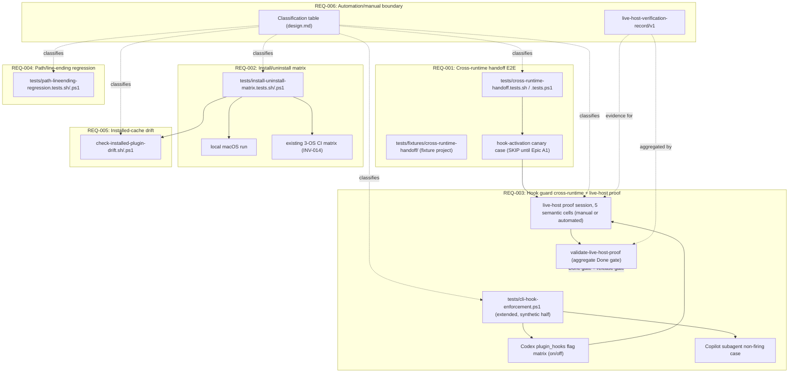

# Design: epic-196-a8-integration

Impl-Review-Status: Pending
Feature Type: test-infrastructure specification (Phase 1 — no code)

## Technical Summary

Epic A8 adds five verification surfaces over artifacts other Foundation
Epics already build (or will build): a cross-runtime handoff fixture
(REQ-001), an install/uninstall matrix (REQ-002), a hook-guard cross-runtime
test including the live-host hook-activation-handshake proof (REQ-003), a
path/line-ending regression matrix (REQ-004), and an installed-cache-vs-repo
drift check (REQ-005). REQ-006 is not a sixth surface but a classification
discipline applied to the other five: every check named below is tagged
`automated`, `automated-pending-confirmation`, or `manual-required`, and
every `manual-required` item has a fixed evidence-record schema
(`live-host-verification-record/v1`). REQ-007 is likewise not a
verification surface but a process-integrity discipline: this package's
own AC-029/AC-030 map to REQ-007, never to an undefined "REQ (process)"
placeholder, and design.md's own Classification Table (AC-025) is the
single normative source acceptance-tests.md's `Test Type` column must
cite directly rather than carry an independent, possibly-stale `TBD`.
No new CI topology is introduced —
every automated check registers into the existing `tests/run-all.{sh,ps1}`
and `.github/workflows/test.yml` 3-OS matrix (INV-014), extending
`tests/cli-hook-enforcement.ps1` and `tests/install.tests.{sh,ps1}` rather
than duplicating their fixture machinery.

## Architecture



Every box above is Phase 2/3 work this package fixes the contract for; this
Phase-1 package builds none of them.

## Components

| Component | Responsibility | Language | New/Existing | Protected |
|---|---|---|---|---|
| `tests/fixtures/cross-runtime-handoff/` | Fixture project: a minimal repo tree carrying the artifact each CLI-pair handoff step produces/consumes (Data Plan) | Markdown/YAML fixtures, no executable logic | new | No |
| `tests/cross-runtime-handoff.tests.sh` / `tests/cross-runtime-handoff.tests.ps1` | Drives the REQ-001 fixture through each CLI's own confirmed-or-manual invocation contract; emits `cross-runtime-handoff-trace/v1` | sh/PowerShell | new | No |
| `tests/install-uninstall-matrix.tests.sh` / `.ps1` | Drives REQ-002's install→verify→uninstall→verify cycle across the four `--target` values; calls `install.sh`/`uninstall.sh` (POSIX) or `install.ps1`/`uninstall.ps1` (Windows) unmodified | sh/PowerShell | new | No |
| `tests/cli-hook-enforcement.ps1` (extended) | Existing synthetic/regression hook-guard check (INV-013); this epic adds the Codex `plugin_hooks` flag-state matrix and the Copilot subagent non-firing case as new assertions in the SAME file, preserving its existing assertions unmodified | PowerShell | existing, extended | No |
| `tests/hook-activation-live-proof/` | Per-semantic-cell live-host proof records (fortified `live-host-verification-record/v1`), one file per one of the five REQ-003 semantic matrix cells (`Claude-active`, `Codex-enabled-active`, `Codex-disabled-expected-unavailable`, `Copilot-primary-active`, `Copilot-subagent-expected-unavailable`), produced by an automated capture script where confirmed available, else by an operator + independent reviewer following REQ-006's fortified record format | JSON | new | No |
| `plugins/sdd-quality-loop/scripts/validate-live-host-proof.{sh,ps1}` | Aggregate REQ-003/AC-028 Done-gate check: loads all five semantic-cell `live-host-verification-record/v1` files, re-verifies each record's nonce uniqueness, hash bindings, and two-party attestation signatures, and exits non-zero on any missing, post-A1-merge `SKIP`, `FAIL`, stale (expired/mismatched nonce or session), config-digest-mismatch, or duplicate-nonce record | sh/PowerShell (thin wrappers over a shared aggregation routine) | new | No (read-only validator; never writes a record itself) |
| `tests/path-lineending-regression.tests.sh` / `.ps1` | Drives the REQ-004 pairwise covering Windows-path × CRLF-LF × NFC-NFD combination matrix against this epic's own Unicode-normalization contract | sh/PowerShell | new | No |
| `plugins/sdd-quality-loop/scripts/check-installed-plugin-drift.{sh,ps1}` | REQ-005 drift check: compares an installed plugin cache (platform-correct default) against the repository's own install/uninstall-touched source surface (`plugins/**` plus copied/generated scripts, manifests, agent-role, and hook-config files) by content hash, in both a standalone preflight mode and a stricter post-install verify mode | sh/PowerShell (thin wrappers over a shared comparison routine, matching the repository's own `sdd-hook-guard` multi-runtime-wrapper precedent) | new | No (read-only comparison tool; never a guard-invariants target itself since it has no write path) |
| `plugins/sdd-review-loop/references/a8-skip-allowlist.json` | REQ-003/A7-precedent SKIP-governance manifest: this epic's own exact allowlisted-SKIP records (AC-006/AC-015/AC-016), each bound to an Epic A1 canonical-artifact activation predicate (SKIP Allowlist Activation Gate, below) | JSON | new | No |
| `tests/hook-activation-live-proof/nonce-ledger.json` | Append-only nonce issuance/consumption ledger Epic A1's own handshake script writes to; `validate-live-host-proof`'s own replay/unknown-nonce ground truth | JSON | new | No (append-only; never rewrites a prior entry except to set `consumed_by_record` once) |
| `tests/hook-activation-live-proof/raw/<matrix_cell>-{request,result}.json` | Committed, unedited raw tool-request/tool-result capture files each `live-host-verification-record/v1`'s own hash fields are recomputed against | JSON | new | No |
| `plugins/sdd-review-loop/references/a8-expected-hook-config-digests.json` | Maintainer-committed expected `installed_hook_config_digest` per semantic cell — the validator's own ground truth, never the record's self-reported value alone | JSON | new | No |
| `plugins/sdd-review-loop/references/a8-trusted-signers.json` | Maintainer-committed key-ID → identity/public-key registry the two-party attestation signatures resolve against | JSON | new | No |

## Protected-File Statement

This epic adds no `PROTECTED_GATE_SUFFIXES`/guard-invariants entries. Every
component above is a read-only verification tool (comparison, observation,
or fixture-driving); none of them writes to an approval field, a sidecar, or
any other file this repository's existing guard machinery protects. The
REQ-005 drift check (`check-installed-plugin-drift`) is explicitly read-only
by design (Security Boundaries B2, requirements.md) — it never remediates a
detected divergence, only reports it.

## Layer Specifications

Not applicable. This package is explicitly Phase 1, four-file only
(investigation.md/requirements.md/design.md/acceptance-tests.md); no
`ux-spec.md`/`frontend-spec.md`/`infra-spec.md`/`security-spec.md` is
produced (Risks, requirements.md — matching Epic A7's own established
precedent, INV-018).

## Design System Compliance

Not applicable. This is internal test-infrastructure specification work
with no UI surface.

## Cross-Layer Dependencies

- REQ-002's install/uninstall matrix (`tests/install-uninstall-matrix.
  tests.sh`/`.ps1`) depends on `install.sh`/`install.ps1`/`uninstall.sh`/
  `uninstall.ps1` staying behaviorally unchanged in their own `--target`
  contract (INV-010); a future change to that contract requires
  re-verifying this epic's own matrix cells.
- REQ-003's cross-runtime fixture depends on the three hook config files
  (`claude-hooks.json`/`hooks.json`/`copilot-hooks.json`, INV-011) and
  `sdd-hook-guard.{js,sh,ps1,py}` staying byte-compatible with
  `tests/cli-hook-enforcement.ps1`'s own existing drift-detection regexes
  (INV-013) — this epic's own extension re-uses, never replaces, that
  drift check.
- REQ-003's live-host proof (AC-015/AC-028) is blocked on Epic A1's own
  `check-hook-activation-handshake.{py,sh,ps1}` existing (INV-005) and
  further depends on that same script being the sole issuer of the
  `live-host-verification-record/v1.nonce` field (Data Plan) — this
  package never invents its own competing nonce-issuance mechanism; until
  Epic A1 merges, AC-006/AC-015/AC-016 stay `SKIP` per the
  `a8-skip-allowlist.json` manifest (SKIP Allowlist Activation Gate,
  above), which this package's own instance of the Epic A7-established
  SKIP-governance precedent registers against.
- `validate-live-host-proof` (AC-028; API/Contract Plan) depends on all
  five `tests/hook-activation-live-proof/<matrix_cell>.json` records
  existing in the fortified schema shape before it can report a
  discharged delegation; it is never invoked as a substitute for the
  individual session records themselves, only as their aggregate
  re-validator.
- REQ-005's drift check depends on each wrapper's own platform-correct
  install-root default (Platform Install-Root Defaults, Data Plan —
  `${XDG_DATA_HOME:-$HOME/.local/share}/sdd-plugins` for `.sh`,
  `%LOCALAPPDATA%\sdd-plugins` for `.ps1`, matching `install.sh`/
  `install.ps1` respectively, INV-016) staying the authoritative
  install-root convention per platform; an `--install-root` override is
  read from the same environment/flag the installer itself accepts, never
  a separately-invented path.
- Phase 2/3's own re-use of `FP-A8-A5-CALLER-CONTRACT-10` (INV-008)
  depends on the A5 caller-contract fingerprint precheck (Test Strategy
  item 11) re-confirming the digest against Epic A5's own current HEAD
  before that citation is relied on; a stale-HEAD mismatch hard-fails
  rather than silently reusing investigation.md's own recorded digest.

## ADR Change Log

None. This package cites ADR-0019 (Approval Sidecar Protection) and
decision doc §7/§9/§19 as read-only authoritative sources; it proposes no
ADR revision.

## Data Plan

### `cross-runtime-handoff-trace/v1` (REQ-001)

```json
{
  "schema": "cross-runtime-handoff-trace/v1",
  "fixture_id": "string",
  "result": "PASS|FAIL|SKIP",
  "coverage_complete": true,
  "skip_allowlist_version": "string|null (a8-skip-allowlist.json version, required when any step/canary result is SKIP)",
  "upstream_commit": "string|null (Epic A1 commit SHA the canary/consumer-entry-point cases were exercised against, required once not SKIP)",
  "steps": [
    {
      "producer_runtime": "claude|codex|copilot",
      "consumer_runtime": "claude|codex|copilot",
      "artifact_path": "string (repo-relative, fixed by the Fixture Contract table below)",
      "artifact_initial_sha256": "sha256:<hex> (fixed initial bytes, before producer mutation)",
      "artifact_final_sha256": "sha256:<hex> (fixed expected bytes, after producer's nonce-bearing mutation)",
      "mutation_nonce": "string (unique per fixture run; embedded in the producer's mutation and checked in the consumer_observable)",
      "consumer_observable": {
        "kind": "stdout_substring|exit_code|generated_file_hash",
        "expected": "string (machine-comparable value; never free text)"
      },
      "invocation_mode": "automated|manual",
      "result": "PASS|FAIL|SKIP",
      "evidence_refs": ["string (path to the raw session log/artifact this step's result was computed from)"]
    }
  ],
  "canary_case": {
    "present": true,
    "result": "PASS|FAIL|SKIP",
    "skip_reason": "string|null (cites Epic A1 tracking issue when SKIP)"
  }
}
```

Two `steps[]` entries cover the two adjacent handoffs (Claude→Codex,
Codex→Copilot); the fixture run's own top-level `result` is a required
field this schema computes explicitly (not left to prose alone) and is
`PASS` only when both step results and the canary case are each `PASS` or
an allowlisted `SKIP` recorded against `skip_allowlist_version` — never a
`PASS` computed by ignoring a `FAIL` step. `coverage_complete` is `true`
only once neither the canary case nor either step carries a `SKIP` that
has become stale under the SKIP Allowlist Activation Gate (below); a
`SKIP` step whose `upstream_commit` no longer matches the allowlist's own
recorded Epic A1 fingerprint sets `coverage_complete: false` and the
top-level `result` to `FAIL`, so a stale SKIP can never keep this trace
green after Epic A1 merges (closing the "missing validator/CI entry
point" gap the Blocker-level live-host finding also names for the
adjacent live-host proof surface).

#### Fixture Contract (AC-001; resolves the "generic Markdown/YAML fixture" gap)

| Handoff | Artifact path | Initial content | Producer mutation | Final oracle | `consumer_observable` |
|---|---|---|---|---|---|
| Claude→Codex | `tests/fixtures/cross-runtime-handoff/handoff-01-claude-to-codex.yaml` | Fixed YAML stub committed with this fixture, containing a `token: "<PLACEHOLDER>"` field and no other variable content | Claude session replaces `<PLACEHOLDER>` with `mutation_nonce` and rewrites the file in place | `artifact_final_sha256` = sha256 of the file with `token: "<mutation_nonce>"` substituted, byte-for-byte, into the fixed template | Codex session's own stdout must contain the exact substring `HANDOFF-01:<mutation_nonce>` (emitted only when Codex's own invocation reads and parses `token` from the artifact) |
| Codex→Copilot | `tests/fixtures/cross-runtime-handoff/handoff-02-codex-to-copilot.md` | Fixed Markdown stub committed with this fixture, containing a `<!-- nonce: PLACEHOLDER -->` HTML comment and no other variable content | Codex session replaces `PLACEHOLDER` with a second, independently-generated `mutation_nonce` and rewrites the file in place | `artifact_final_sha256` = sha256 of the file with `<!-- nonce: <mutation_nonce> -->` substituted, byte-for-byte, into the fixed template | Copilot session generates `tests/fixtures/cross-runtime-handoff/handoff-02-output.txt` whose own sha256 the driver script computes deterministically from `mutation_nonce` (`sha256("COPILOT-CONSUMED:" + mutation_nonce)`) — a generated-file-hash oracle, never a free-text description |

The full three-hop chain (AC-004) reuses `handoff-02`'s own
`mutation_nonce` as the input to `handoff-02-output.txt`'s hash, so the
chain's own final state is verifiably derived from both upstream steps'
own contributions, not merely their both having run.

### `install-uninstall-matrix-result/v1` (REQ-002)

```json
{
  "schema": "install-uninstall-matrix-result/v1",
  "target": "All|Codex|Claude|Copilot",
  "os": "string",
  "install_root": "string",
  "resolved_repository_root": "string",
  "resolved_install_root": "string (must equal this platform's default from Platform Install-Root Defaults, or the explicit --install-root override actually passed)",
  "phases": {
    "install_1": { "result": "PASS|FAIL", "registered": ["..."] },
    "verify_1":  { "result": "PASS|FAIL" },
    "install_2_idempotency": { "result": "PASS|FAIL", "diff_from_install_1": [] },
    "uninstall":  { "result": "PASS|FAIL" },
    "verify_residue": { "result": "PASS|FAIL", "residual_paths": [] }
  },
  "drift_check": { "mode": "verify", "result": "PASS|FAIL|NOT_APPLICABLE", "diverged_paths": [] }
}
```

`install_2_idempotency`'s `diff_from_install_1` is an empty array on PASS —
any non-empty diff is itself the AC-008 failure evidence. `verify_residue`'s
`residual_paths` is likewise empty on PASS; a non-empty array is the AC-009
failure evidence, scoped to paths this project's own installer created
(never a user's own pre-existing, unrelated CLI configuration —
Edge Cases, requirements.md). `drift_check.mode` is always `"verify"`
inside this matrix record (the standalone `"preflight"` mode is used only
outside a matrix cell — Installed-plugin-drift-report `mode` field,
above), so `drift_check.result` follows the stricter verify-mode
semantics: `NOT_APPLICABLE` never silently substitutes for a `FAIL` when
`install_1` itself claimed success.

#### Target × Phase × Surface Registration Table (AC-007–AC-009; resolves the missing per-cell oracle gap)

The sole oracle TEST-007/008/009 evaluate against — every cell below is
`present`, `absent`, or `unchanged` (relative to the pre-install
baseline), never left to a generic pass/fail schema alone to encode. The
MCP-registration surface is per-target distinct, not a single Codex-only
block: `install.sh:519-533`'s own `install_mcp_servers` gates
`register_claude_mcp` on `All|Claude`, `register_codex_mcp` (the
`~/.codex/config.toml` delimited block) on `All|Codex`, and
`register_vscode_mcp` (the VS Code `mcp.json` upsert, which is how the
Copilot target's own MCP surface is consumed, per that function's own
comment) on `All|Copilot` — an earlier draft of this table incorrectly
marked Claude's and Copilot's own MCP surface `absent`, which would have
made TEST-007/TEST-009's own sole oracle assert the opposite of the
installer's real, already-shipped behavior:

| Target | Phase | Marketplace entry | Plugin registration | MCP registration surface | Codex agent TOML |
|---|---|---|---|---|---|
| All | post-install | present | present (Claude+Codex+Copilot) | present (Claude `claude mcp add` list + Codex `config.toml` block + VS Code `mcp.json`; Cursor's own `mcp.json` also registers under `All` but is outside this epic's four-value matrix) | present |
| All | post-uninstall | absent | absent | absent | absent |
| Codex | post-install | present | present (Codex only) | present (Codex `~/.codex/config.toml` delimited block only) | present |
| Codex | post-uninstall | absent | absent | absent | absent |
| Claude | post-install | present | present (Claude only) | present (Claude's own `claude mcp add`-registered server list only) | absent |
| Claude | post-uninstall | absent | absent | absent | unchanged (was already absent) |
| Copilot | post-install | present | present (Copilot only) | present (VS Code `mcp.json` upsert only — the surface Copilot's own MCP support consumes) | absent |
| Copilot | post-uninstall | absent | absent | absent | unchanged (was already absent) |

A cell whose own installer/uninstaller behavior does not produce a given
surface at all (e.g. `Claude`'s/`Copilot`'s own Codex agent TOML) is
fixed `absent`/`unchanged` rather than omitted from the table, so no
target×phase×surface combination is left for a Phase 2/3 implementer to
guess. Claude's own MCP registration surface is the CLI's own `claude mcp
list` server-registration state (not necessarily a single repository- or
home-directory file this epic's own fixture can hash directly); a Phase
2/3 implementer's own `verify_1`/`verify_residue` check for that cell
uses `claude mcp list`'s own output/exit contract as its oracle, parallel
to but structurally distinct from the file-hash oracle Codex's and VS
Code's own MCP surfaces use.

### `live-host-verification-record/v1` (REQ-003, REQ-006; AC-026, AC-028; fortified per Blocker-level finding on captured-JSON forgeability)

```json
{
  "schema": "live-host-verification-record/v1",
  "matrix_cell": "Claude-active|Codex-enabled-active|Codex-disabled-expected-unavailable|Copilot-primary-active|Copilot-subagent-expected-unavailable",
  "runtime": "claude|codex|copilot",
  "check": "string (e.g. hook-activation-handshake)",
  "invocation_mode": "automated|manual",
  "nonce": "string (single-use, issued by Epic A1's own hook-activation handshake script; never operator-chosen)",
  "host_session_id": "string (host-issued CLI session identifier)",
  "host_event_id": "string (host-issued event/turn identifier for the specific intercepted tool call)",
  "raw_tool_request_ref": "string (repo-relative path to the committed, unedited raw tool-request capture file this session produced)",
  "raw_tool_request_sha256": "sha256:<hex> (sha256 of the exact bytes at raw_tool_request_ref; recomputed and compared by the validator, never trusted as a bare claim)",
  "raw_tool_result_ref": "string (repo-relative path to the committed, unedited raw tool-result/denial capture file)",
  "raw_tool_result_sha256": "sha256:<hex> (sha256 of the exact bytes at raw_tool_result_ref; recomputed and compared by the validator)",
  "installed_hook_config_digest": "sha256:<hex> (digest of the installed hook/config file(s) actually exercised in this session)",
  "session_date": "YYYY-MM-DD (UTC calendar date derived from session_start; present as its own field because AC-026 lists it as an independently required field, not merely derivable)",
  "session_start": "ISO8601",
  "session_end": "ISO8601",
  "operator": "string (required in all cases; the session's own attending party, distinct from reviewer)",
  "operator_key_id": "string (key ID, resolved against the trusted-signer registry below)",
  "reviewer": "string (required in all cases; independent of operator, countersigns after verifying nonce/hashes/timestamps)",
  "reviewer_key_id": "string (key ID, resolved against the trusted-signer registry below; must differ from operator_key_id)",
  "cli_name": "string",
  "cli_version": "string",
  "host_os": "string",
  "plugin_hooks_flag": "enabled|disabled|not_applicable",
  "tool_call_evidence": "string (human-readable summary only; never the sole evidence — raw_tool_request_ref/raw_tool_result_ref are the machine-checked evidence)",
  "verdict": "PASS|FAIL",
  "operator_signature": "string (signature over the canonicalized record, per Signing Contract below, keyed to operator_key_id)",
  "reviewer_signature": "string (signature over the identical canonicalized record, keyed to reviewer_key_id)",
  "notes": "string|null"
}
```

#### Schema Validation Rules (machine-checkable; resolves the "JSON example, not a verifiable contract" Blocker)

`additionalProperties: false` — the object contains exactly the keys
listed above, no more, no fewer. `required`: every key above except
`notes` (nullable) and `plugin_hooks_flag` (required, but its own value
is `not_applicable` for non-Codex cells). Type/format constraints:

| Field | Constraint |
|---|---|
| `matrix_cell` | enum, exactly one of the 5 Live-Host Semantic Matrix cell names |
| `nonce` | `^[A-Za-z0-9_-]{16,}$`; must appear, unconsumed, in the Nonce Issuance Ledger (below) |
| `host_session_id`, `host_event_id` | non-empty string, `\S+` |
| `raw_tool_request_ref`, `raw_tool_result_ref` | canonical repo-relative path under `tests/hook-activation-live-proof/raw/`, no symlink, no `..` traversal (matching `is_canonical_path`, `plugins/sdd-quality-loop/scripts/validate-review-context-set.sh`'s own existing convention) |
| `raw_tool_request_sha256`, `raw_tool_result_sha256`, `installed_hook_config_digest` | `^[0-9a-f]{64}$`; the validator independently recomputes each from the referenced file/expected-digest manifest and rejects on mismatch (`ERR_HASH_MISMATCH`) |
| `session_date` | `^\d{4}-\d{2}-\d{2}$`; must equal `session_start`'s own UTC calendar date |
| `session_start`, `session_end` | ISO 8601 UTC; `session_end` strictly after `session_start` |
| `operator`, `reviewer` | non-empty string; `operator != reviewer` |
| `operator_key_id`, `reviewer_key_id` | must each resolve to a distinct entry in the Trusted-Signer Registry (below); `operator_key_id != reviewer_key_id` |
| `verdict` | enum `PASS`/`FAIL`; for `-active` cells `PASS` means denial observed, for `-expected-unavailable` cells `PASS` means correctly-detected unavailability observed |
| `operator_signature`, `reviewer_signature` | verify against the canonicalized record (Signing Contract, below) under the corresponding `*_key_id`'s registered public key |

#### Raw Capture, Nonce Ledger, and Expected-Digest Manifest (resolves the "hash of nothing stored" and "validator has no ground truth" Blocker sub-findings)

- **Raw capture files**: `raw_tool_request_ref`/`raw_tool_result_ref` name
  committed files under `tests/hook-activation-live-proof/raw/
  <matrix_cell>-request.json` / `-result.json` — the actual, unedited
  payload the runtime's own dispatcher/hook subsystem produced (for an
  `automated` capture, written directly by the capturing script; for a
  `manual` session, the operator's own copy-pasted raw CLI/session output,
  saved verbatim before any transcription into `tool_call_evidence`).
  `tool_call_evidence` is downgraded to a human-readable summary field
  only — it is never itself hashed or treated as evidence a validator can
  recompute against, closing the "single string" gap.
- **Nonce Issuance Ledger** (`tests/hook-activation-live-proof/
  nonce-ledger.json`, schema `live-host-nonce-ledger/v1`): an
  append-only array Epic A1's own `check-hook-activation-handshake.
  {py,sh,ps1}` writes to at issuance time — `{"nonce": "...",
  "matrix_cell": "...", "issued_at": "ISO8601", "consumed_by_record":
  "string|null"}`. `validate-live-host-proof` looks up each record's own
  `nonce` in this ledger, rejects a `nonce` absent from the ledger
  (`ERR_NONCE_UNKNOWN`) or whose `consumed_by_record` is already set to a
  different record (`ERR_NONCE_REUSED`), and on a clean pass marks that
  ledger entry's own `consumed_by_record` with the accepted record's own
  path.
- **Expected-Digest Manifest** (`plugins/sdd-review-loop/references/
  a8-expected-hook-config-digests.json`): a maintainer-committed mapping
  `{"<matrix_cell>": {"config_path": "<installed-relative path>",
  "expected_sha256": "sha256:<hex>"}}`, one entry per semantic cell,
  updated whenever the corresponding hook config file's own repository
  source changes. `installed_hook_config_digest` is valid only when it
  equals this manifest's own `expected_sha256` for that `matrix_cell` —
  giving the validator an independent ground truth rather than trusting
  the record's self-reported digest.

#### Signing Contract (resolves the "canonicalization/signing target/algorithm/key source undefined" Blocker sub-finding)

- **Canonicalization**: RFC 8785 JSON Canonicalization Scheme (JCS)
  applied to the record with `operator_signature`, `reviewer_signature`,
  `operator_key_id`, and `reviewer_key_id` removed (the four
  signature-carrying fields are excluded from what is signed; every other
  field, including `notes`, is included).
- **Signing target**: the SHA-256 digest of the JCS-canonicalized,
  signature-fields-excluded record.
- **Algorithm**: Ed25519 (`raw_signature` bytes, base64-encoded in the
  `*_signature` field).
- **Trusted-Signer Registry** (`plugins/sdd-review-loop/references/
  a8-trusted-signers.json`, schema `a8-trusted-signers/v1`): a
  maintainer-committed, append-only mapping `{"<key_id>": {"identity":
  "<maintainer/contributor name>", "public_key": "<base64
  Ed25519 public key>", "added_at": "ISO8601"}}`. `validate-live-host-
  proof` resolves `operator_key_id`/`reviewer_key_id` against this
  registry, verifies each signature against the resolved public key, and
  rejects a `key_id` absent from the registry (`ERR_SIGNER_UNTRUSTED`) or
  a signature that fails to verify (`ERR_SIGNATURE_INVALID`).

`operator` and `reviewer` are both required and must name distinct
identities in every record, regardless of `invocation_mode` (AC-026); an
`automated` record additionally names the capturing script/CI job in
`notes`, but still carries a human reviewer's countersignature over the
automated capture's own raw output before `validate-live-host-proof`
accepts it. A record is invalid per this schema, and is rejected by
`validate-live-host-proof` with the named error code, when any Schema
Validation Rules constraint fails, or when: `nonce` is unknown or reused
(`ERR_NONCE_UNKNOWN`/`ERR_NONCE_REUSED`); either raw-capture hash does
not match its own referenced file's recomputed digest
(`ERR_HASH_MISMATCH`); `installed_hook_config_digest` does not match the
Expected-Digest Manifest's own entry for that `matrix_cell`
(`ERR_DIGEST_MISMATCH`); `session_end` does not strictly follow
`session_start`, or `session_date` does not match `session_start`'s own
UTC date; either signature fails to verify or resolves to an untrusted
key (`ERR_SIGNATURE_INVALID`/`ERR_SIGNER_UNTRUSTED`); `operator_key_id`
equals `reviewer_key_id`; or `verdict` was computed from a
`sdd-hook-guard` script invocation rather than from a real CLI-mediated
tool call (`ERR_SYNTHETIC_SUBSTITUTION`, cross-checked against the raw
capture's own content shape, Test Strategy item 8). This is the exact
structural distinction AC-027's classification-mismatch rule checks
mechanically, not merely by convention — closing the "editable JSON with
a self-attested verdict is sufficient" gap the adversarial review
identified against ADR-0019's own conditioned defense claim.

### `path-lineending-fixture-result/v1` (REQ-004)

```json
{
  "schema": "path-lineending-fixture-result/v1",
  "cells": [
    {
      "os": "windows|linux|macos",
      "separator": "backslash|forward-slash",
      "eol": "LF|CRLF",
      "normalization": "NFC|NFD",
      "runtime_script": "sh|ps1",
      "phase": "install|uninstall",
      "case": "windows-path-separator|crlf-lf-gitattributes-layer|nfc-nfd-filename",
      "result": "PASS|FAIL|N/A",
      "oracle": {
        "source_bytes_sha256": "sha256:<hex>",
        "source_name": "string",
        "resolved_path": "string (native, OS-actual separator)",
        "copied_bytes_sha256": "sha256:<hex>",
        "stdout_substring": "string",
        "uninstall_residue": []
      }
    }
  ]
}
```

`cells[]` enumerates the REQ-004 pairwise covering combination matrix
(pairwise-or-better coverage over OS × separator × LF/CRLF × NFC/NFD ×
sh/ps1 × install/uninstall, below) rather than the three independent
single-case checks an earlier draft of this schema implied; a `case` not
applicable to a given OS/script combination (e.g. `windows-path-separator`
on a `sh` runtime) is recorded `N/A`, never silently omitted from
`cells[]`.

#### REQ-004 Pairwise Covering Combination Matrix (AC-018–AC-021; resolves both the "three independent spot checks" gap and the "not a genuine cross-product" Major finding)

An earlier draft of this section claimed a "cross-product"/"every cell"
combination matrix while actually enumerating only six hand-picked rows
with collapsed multi-value cells (`linux/macos`, `NFC/NFD`, `sh/ps1`) —
neither a real cross-product nor a defined pairwise design, and
inconsistent with its own "every cell" claim. This package instead fixes
an explicit **pairwise (2-wise) covering design**, not a full
cross-product, over four axes, plus two axes that are OS-*derived*
attributes rather than independent dimensions:

- **Independent axes**: `os` ∈ {windows, linux, macos}; `eol` ∈ {LF,
  CRLF}; `normalization` ∈ {NFC, NFD}; `phase` ∈ {install, uninstall}.
- **OS-derived attributes** (never independently varied — a `sh` script
  and forward-slash separator are not meaningful on `windows`, and a
  `.ps1` script and backslash separator are not meaningful on
  `linux`/`macos` in this repository's own existing runtime convention,
  Constraint Compliance): `separator` = `backslash` iff `os == windows`,
  else `forward-slash`; `script` = `ps1` iff `os == windows`, else `sh`.

**Generation algorithm**: enumerate all 8 combinations of the three
binary axes (`eol` × `normalization` × `phase`) exactly once each, and
assign `os` to each of those 8 rows by cycling `windows, linux, macos`
(row `i`'s `os` = the cycle's `(i mod 3)`th value). This is a concrete,
reproducible generation rule (not an ad hoc selection), and its own
coverage is verifiable directly from the table below: every one of the
6 possible (`os`, `eol`) pairs, all 6 (`os`, `normalization`) pairs, and
all 6 (`os`, `phase`) pairs each appear in at least one row, and — because
the 8 rows already enumerate every (`eol`, `normalization`, `phase`)
triple exactly once — every pair among those three axes is trivially
fully (not merely pairwise) covered.

| Row | OS | Separator (derived) | EOL | Normalization | Script (derived) | Phase | `windows-path-separator` | `crlf-lf-gitattributes-layer` | `nfc-nfd-filename` |
|---|---|---|---|---|---|---|---|---|---|
| 1 | windows | backslash | LF | NFC | ps1 | install | ASSERT: `resolved_path` uses `\`; `install-uninstall-matrix-result/v1.phases.install_1.registered[]` paths match native separator | ASSERT (identity): `copied_bytes_sha256` equals the LF repository blob hash unchanged | ASSERT: NFC-authored bytes pass through unchanged (Unicode-Normalization Contract) |
| 2 | linux | forward-slash | LF | NFC | sh | uninstall | N/A (no backslash separator on linux) | ASSERT (identity): `uninstall_residue` empty under the unchanged LF bytes | ASSERT: `uninstall_residue` empty under the NFC byte form |
| 3 | macos | forward-slash | LF | NFD | sh | install | N/A | ASSERT (identity) | ASSERT: NFD-authored source bytes are consumed on their own authoring OS without cross-OS normalization pressure (baseline case) |
| 4 | windows | backslash | LF | NFD | ps1 | uninstall | ASSERT: `uninstall_residue` empty; no leftover backslash-separated path | ASSERT (identity) | ASSERT: `uninstall_residue` empty under both NFC and NFD byte forms (collision-policy check, Unicode-Normalization Contract) |
| 5 | linux | forward-slash | CRLF | NFC | sh | install | N/A | ASSERT (correction): `copied_bytes_sha256` equals the LF-normalized repository blob hash, not the CRLF checkout bytes | ASSERT: NFC-authored bytes pass through unchanged |
| 6 | macos | forward-slash | CRLF | NFC | sh | uninstall | N/A | ASSERT (correction) | ASSERT: `uninstall_residue` empty under the NFC byte form |
| 7 | windows | backslash | CRLF | NFD | ps1 | install | ASSERT: `resolved_path` uses `\` | ASSERT (correction) | ASSERT: `resolved_path`/`copied_bytes_sha256` match the Contract's own fixed NFC bytes, never the NFD-authored bytes verbatim (cross-OS consumption case) |
| 8 | linux | forward-slash | CRLF | NFD | sh | uninstall | N/A | ASSERT (correction) | ASSERT: `uninstall_residue` empty under both NFC and NFD byte forms |

Every one of the three REQ-004 cases (`windows-path-separator`,
`crlf-lf-gitattributes-layer`, `nfc-nfd-filename`) is evaluated in every
row — `N/A` for `windows-path-separator` on non-`windows` rows is itself
the cell's own recorded disposition (per the `path-lineending-fixture-
result/v1` schema's own `N/A` state, Data Plan, above), never an omitted
cell; the other two cases are `ASSERT` in all 8 rows. This is a fully
enumerated 8-row × 3-case = 24-cell table, not a "some cells collapsed"
draft, and its own coverage claim (pairwise across the 4 independent
axes, full coverage of `separator`/`script` as OS-derived attributes) is
verifiable by inspection of the table rather than asserted in prose
alone.

#### Unicode-Normalization Contract (AC-020; resolves the ".gitattributes has no NFC/NFD rule" gap)

`.gitattributes:1-9` fixes `text=auto eol=lf` and per-extension `eol=lf`
rules only; it defines no Unicode-normalization behavior (no `.gitattributes`
directive governs NFC/NFD form). This epic therefore owns its own,
separate normalization contract for AC-020's fixture, rather than
asserting against a `.gitattributes` rule that does not exist:

- **Owner**: this epic's own `tests/path-lineending-regression.tests.sh`/
  `.ps1` fixture, not `.gitattributes` and not Epic A1's own
  canonicalizer (Non-goals).
- **Algorithm**: Unicode Normalization Form C (NFC), applied to both
  filenames and file content strings this epic's own fixture touches.
- **Raw-byte preservation**: the fixture's committed source file is
  authored in NFD form (macOS-default decomposed form for the accented
  characters it uses) and is never rewritten to NFC in the repository
  itself; NFC conversion is asserted only at the *consuming* checkout/
  install step, never applied to the repository's own source bytes.
- **Collision policy**: if an install/uninstall step ever produces both
  an NFC- and an NFD-named copy of the same logical file (a collision),
  that state is a `FAIL`, never a silently-kept duplicate — the fixture's
  own uninstall-residue oracle (schema above) asserts zero residue under
  both byte forms of the name.
- **Per-OS expected bytes**: Windows and Linux checkouts are expected to
  observe the NFC form (their own filesystems' typical normalization
  behavior); the fixture's `resolved_path`/`copied_bytes_sha256` oracle
  fields are fixed to the NFC byte sequence on both OSes — this package
  does not assert this is guaranteed by Git or the OS itself, only that
  it is this fixture's own expected, asserted outcome, distinct from the
  authored NFD source bytes.

### `installed-plugin-drift-report/v1` (REQ-005)

```json
{
  "schema": "installed-plugin-drift-report/v1",
  "mode": "preflight|verify",
  "install_root": "string (platform-resolved default or --install-root override; see Platform Install-Root Defaults below)",
  "state": "not_installed|installed_synced|installed_drifted",
  "diverged": [
    {
      "path": "string (repo-relative; plugins/<name>/... or a script/manifest/agent-role/hook-config path the installer copies or generates)",
      "change_type": "added|removed|modified|type-changed",
      "installed_sha256": "sha256:<hex>|null (null when change_type=added, i.e. present only in repo source)",
      "repo_sha256": "sha256:<hex>|null (null when change_type=removed, i.e. present only in installed cache)"
    }
  ]
}
```

`state: "not_installed"` is a distinct, non-failing result only in
`mode: "preflight"` (AC-023) — a standalone check run before any install
has happened. In `mode: "verify"` (the REQ-002 post-install verify
sub-step, AC-024), `not_installed` is instead a `FAIL`: a verify step by
definition runs after an `install` phase claimed success, so a
`not_installed` result there means path resolution or the copy itself
silently failed, and only `installed_synced` is an acceptable `PASS`
(closing the "fail-open on unresolved paths" gap the adversarial review
identified in the original single-state schema). `diverged` is only ever
populated when `state == "installed_drifted"`, and now represents
`added`/`removed`/`modified`/`type-changed` (e.g. a symlink replaced by a
regular file) divergence, not only content-hash mismatches on files
present on both sides — a repo-only `path` is `change_type: "added"`
with `installed_sha256: null`; an installed-only `path` is
`change_type: "removed"` with `repo_sha256: null`.

#### Platform Install-Root Defaults (resolves the sh/ps1 default mismatch)

| Wrapper | Default install root | Matches |
|---|---|---|
| `check-installed-plugin-drift.sh` | `${XDG_DATA_HOME:-$HOME/.local/share}/sdd-plugins` | `install.sh:11` `INSTALL_ROOT` default |
| `check-installed-plugin-drift.ps1` | `Join-Path ([Environment]::GetFolderPath("LocalApplicationData")) "sdd-plugins"` (i.e. `%LOCALAPPDATA%\sdd-plugins`) | `install.ps1:5` `$InstallRoot` default; `uninstall.ps1:3` |

Each wrapper's own default is the identical platform default its own
matching installer/uninstaller actually uses — never a single
XDG-style path applied uniformly across both platforms (the original
draft's Windows default silently diverged from `install.ps1`/
`uninstall.ps1`'s own real `%LOCALAPPDATA%\sdd-plugins` default, which
would make a Windows default-path drift check report `not_installed`
against a real installed cache). Every `install-uninstall-matrix-
result/v1.drift_check` record additionally persists its own cell's
`resolved_repository_root`/`resolved_install_root` so a matrix run can
assert the two agree with the platform default above.

#### Coverage Scope (OQ-002, resolved to match requirements.md's own drift definition)

REQ-005's drift check covers every install/uninstall-touched surface
requirements.md's own Installed-cache-drift Field Definition already
names — not `plugins/**` alone:

| Surface | Coverage disposition |
|---|---|
| `plugins/**` repository-sourced files copied into the install root | ASSERT (content-hash + change-type comparison) |
| Codex agent role TOML (`~/.codex/agents/sdd-*.toml`, generated from `plugins/**` source, INV-016) | ASSERT (content-hash + change-type comparison against its own generating source) |
| `~/.codex/config.toml` MCP registration block (delimited-block pattern, INV-016) | ASSERT (block-content comparison against the installer's own generated block, not a whole-file hash — the block's own delimited-region convention differs structurally from a file-for-file comparison) |
| Hook config files (`claude-hooks.json`/`hooks.json`/`copilot-hooks.json`) copied into the install root | ASSERT (content-hash + change-type comparison, shared with REQ-003's own drift-detection regex dependency, Cross-Layer Dependencies) |
| A user's own pre-existing, unrelated CLI configuration | N/A (never asserted; Edge Cases, requirements.md) |

## API / Contract Plan

- `tests/cross-runtime-handoff.tests.sh [--fixture <path>]` /
  `tests/cross-runtime-handoff.tests.ps1 [-Fixture <path>]` — the single,
  unified name registered as both the Phase 2/3 acceptance-test target and
  the CI job step (resolving the two-name inconsistency an earlier draft
  carried between Components and this section) — drives the REQ-001
  fixture, emits `cross-runtime-handoff-trace/v1` to stdout/a named file,
  non-zero exit on any step `FAIL` or on `coverage_complete: false` (a
  fresh, allowlisted `SKIP` step never contributes to a non-zero exit; a
  stale post-A1-merge `SKIP` does, per the schema above — matching the
  existing `loop-inventory` SKIP-governance precedent Epic A7 established,
  INV-005 of that package, extended with the staleness check this
  package's own SKIP Allowlist Activation Gate, below, adds).
- `tests/install-uninstall-matrix.tests.sh [--target <All|Codex|Claude|Copilot>]`
  / `.ps1 [-Target <...>]` — with no `--target`, runs all four matrix cells
  sequentially; with `--target`, runs exactly one cell (Test Strategy item
  3, below, for the local-macOS/CI split). Emits one
  `install-uninstall-matrix-result/v1` object per cell, always invoking
  `check-installed-plugin-drift` in `mode: "verify"`.
- `check-installed-plugin-drift.sh [--install-root <path>] [--mode preflight|verify]`
  / `.ps1 [-InstallRoot <path>] [-Mode preflight|verify]` — `--mode`
  defaults to `preflight` when run standalone; `--install-root` defaults
  to each wrapper's own platform-correct default (Platform Install-Root
  Defaults, above) rather than one shared default, and is never accepted
  from an unvalidated environment-inherited value alone. In `preflight`
  mode, exit 0 with `state: not_installed` or `installed_synced`, exit 1
  with `state: installed_drifted`. In `verify` mode, exit 0 only with
  `state: installed_synced`; exit 1 with `state: installed_drifted` or
  `state: not_installed` (Data Plan, above). Read-only: never writes to
  either the install root or the repository (Protected-File Statement).
- `plugins/sdd-quality-loop/scripts/validate-live-host-proof.sh
  [--records-dir <path>] [--nonce-ledger <path>]
  [--expected-digest-manifest <path>] [--trusted-signers <path>]
  [--skip-allowlist <path>]` / the equivalent `.ps1` named parameters —
  every flag defaults to this epic's own canonical path
  (`tests/hook-activation-live-proof/`,
  `tests/hook-activation-live-proof/nonce-ledger.json`,
  `plugins/sdd-review-loop/references/a8-expected-hook-config-digests.json`,
  `plugins/sdd-review-loop/references/a8-trusted-signers.json`,
  `plugins/sdd-review-loop/references/a8-skip-allowlist.json`
  respectively) so a bare invocation is always well-defined, while a
  Phase 2/3 test harness may override any path for fixture isolation.
  Reads all five `tests/hook-activation-live-proof/<matrix_cell>.json`
  records against the Schema Validation Rules, Nonce Issuance Ledger,
  Expected-Digest Manifest, and Signing Contract (Data Plan, above);
  exits 0 only when every one of the five semantic cells has a present,
  schema-valid, hash-recomputed, nonce-ledger-confirmed,
  digest-manifest-matched, two-party-signature-verified record whose
  `verdict` matches that cell's own expected Done condition (denial
  `PASS` for the three "-active" cells, correctly-detected unavailability
  for the two "-expected-unavailable" cells). Exits non-zero with one of
  the named error codes (`ERR_MISSING_CELL`, `ERR_SCHEMA_INVALID`,
  `ERR_NONCE_UNKNOWN`, `ERR_NONCE_REUSED`, `ERR_HASH_MISMATCH`,
  `ERR_DIGEST_MISMATCH`, `ERR_SIGNATURE_INVALID`, `ERR_SIGNER_UNTRUSTED`,
  `ERR_SYNTHETIC_SUBSTITUTION`, `ERR_STALE_SKIP`) printed to stderr per
  failing cell — never a bare non-zero exit with no diagnostic. Wired as
  this epic's own Done gate and as a release gate (Deployment/CI Plan,
  below); read-only, never writes a record itself (the nonce ledger's own
  `consumed_by_record` update on a clean pass is the sole state mutation,
  scoped to marking consumption, never rewriting an issued nonce's other
  fields).
- `tests/path-lineending-regression.tests.sh` / `.ps1` — no flags; runs
  every cell of the REQ-004 pairwise covering combination matrix (Data Plan),
  emits `path-lineending-fixture-result/v1`.
- Live-host proof capture: where REQ-006's classification finds a
  runtime's headless contract confirmed, a Phase 2/3-named automated
  script emits `live-host-verification-record/v1` with
  `invocation_mode: "automated"` and still requires a human reviewer's
  countersignature; where not, an operator and an independent reviewer
  fill the identical schema by hand (`invocation_mode: "manual"`) and
  commit it under
  `tests/hook-activation-live-proof/<matrix_cell>.json` (e.g.
  `codex-enabled-active.json`), matching the Components table's own
  path — never the free-form `<runtime>-<flag-state>.json` naming an
  earlier draft used, which cannot represent the Copilot
  primary/subagent dimension.

## Test Strategy

1. **REQ-001 fixture drive** — `tests/cross-runtime-handoff.tests.sh`/
   `.tests.ps1` exercises AC-001–AC-004 against the Fixture Contract table
   (Data Plan) — fixed artifact paths, fixed initial bytes, per-run
   `mutation_nonce`, and a machine-checkable `consumer_observable` oracle,
   never a free-text description a Phase 2/3 implementer must interpret;
   the canary case (AC-006) is a distinct step inside the same trace,
   `SKIP`ped, against the SKIP Allowlist Activation Gate (below), until
   Epic A1 merges.
2. **REQ-002 matrix drive, local** — a single local macOS invocation of
   `tests/install-uninstall-matrix.tests.sh` with no `--target` runs all
   four cells sequentially (AC-007–AC-009) against the Target × Phase ×
   Surface Registration Table (Data Plan); fast-iteration, pre-CI signal
   only (AC-010) — never a substitute for the 3-OS CI run in item 3.
3. **REQ-002 matrix drive, CI** — the existing 3-OS CI matrix
   (`.github/workflows/test.yml`, INV-014) registers
   `install-uninstall-matrix.tests.{sh,ps1}` as a new step inside (or
   alongside) the existing `cli-hook-enforcement`/main test jobs, one
   `--target` cell per matrix-parallel invocation or all four sequentially
   per OS — Phase 2/3's own choice, recorded in its own implementation
   report, provided every OS × every target cell is covered at least once.
4. **REQ-003 synthetic extension** — new assertions are added directly
   inside `tests/cli-hook-enforcement.ps1` (INV-013), preserving every
   existing assertion; this covers only the direct-invocation
   config/guard-contract check AC-012 asserts (`automated`, legitimately
   synthetic). The Codex `plugin_hooks` flag matrix (AC-013) and Copilot
   subagent case (AC-014) are **not** satisfied by this same
   direct-invocation pattern — a config toggle plus a direct
   `sdd-hook-guard` call never sets the Codex CLI's own flag state nor
   dispatches a real Copilot subagent (investigation.md:50-52); both stay
   `manual-required`/`automated-pending-confirmation` in the
   Classification Table below (Direct-Invocation De-Spoofing) until a
   genuine, native-dispatcher-engaging session contract for each is
   confirmed, and both feed their own results into the semantic live-host
   matrix's `Codex-enabled-active`/`Codex-disabled-expected-unavailable`
   and `Copilot-primary-active`/`Copilot-subagent-expected-unavailable`
   cells (item 5) rather than terminating at a synthetic result.
5. **REQ-003 live-host proof, semantic 5-cell matrix** — run once per cell
   of the Live-Host Semantic Matrix (below): `Claude-active`,
   `Codex-enabled-active`, `Codex-disabled-expected-unavailable`,
   `Copilot-primary-active`, `Copilot-subagent-expected-unavailable`
   (AC-015, AC-028) — each either by an automated capture script (if
   REQ-006 confirms feasibility) plus a required reviewer countersignature,
   or by an operator + independent reviewer (REQ-006 record format,
   fortified per the Data Plan's `live-host-verification-record/v1`);
   results land under `tests/hook-activation-live-proof/<matrix_cell>.json`.
   `SKIP` (citing Epic A1's tracking issue) is valid only until Epic A1
   merges (AC-015); a `SKIP` surviving after Epic A1 merges, or any
   missing/stale/`FAIL`/digest-mismatched/duplicate-nonce record, is a
   hard failure the aggregate `validate-live-host-proof` check (item 10)
   reports non-zero on — matching Epic A7's own AC-035(a) SKIP-governance
   precedent this package adopts by reference rather than re-inventing.
6. **REQ-004 path/line-ending drive** — `tests/path-lineending-
   regression.tests.sh`/`.ps1` runs every cell of the Pairwise Covering
   Combination Matrix (Data Plan) on the existing 3-OS CI matrix (Windows
   runner covers the path-separator and CRLF cases natively; macOS runner
   covers the NFC/NFD case natively via its own filesystem), asserting
   each cell's own `source bytes/name`, `resolved path`, `copied bytes`,
   `stdout`, and `uninstall residue` oracle.
7. **REQ-005 drift check** — `check-installed-plugin-drift.{sh,ps1}` runs
   in `mode: "verify"` as a sub-step inside REQ-002's own matrix cells
   (AC-024), immediately after each `install` phase, against that same
   cell's own resolved `--install-root` (Platform Install-Root Defaults).
   In addition, an independent negative-lifecycle case (AC-022) runs
   outside the matrix cells: a prior-version install of the fixture
   plugin tree followed by a source-tree revision (or, equivalently, a
   direct mutate/delete/add against the installed cache), asserting the
   drift check reports the exact expected `diverged[]` entries (with their
   own `change_type`) and non-zero exit — closing the "install-then-
   immediate-compare only proves the happy path" gap a same-source-only
   drive cannot rule out.
8. **Classification-mismatch guard (AC-027)** — a static check (design.md's
   own Data Plan, `live-host-verification-record/v1`) rejects any record
   whose `invocation_mode`/`tool_call_evidence`/nonce/hash/signature shape
   does not match its own check's AC-025 classification and this schema's
   own validity rules — e.g. a record claiming `invocation_mode:
   "automated"` for a check AC-025 marks `manual-required`, a record whose
   `tool_call_evidence` reads like a direct `sdd-hook-guard` script
   invocation (matching `tests/cli-hook-enforcement.ps1`'s own known
   synthetic pattern, INV-013) presented as AC-015's live-host proof, or a
   record with a reused `nonce`, a missing `reviewer_signature`, or an
   `installed_hook_config_digest` that does not match the cell's expected
   installed config.
9. **Citation compliance (AC-030)** — `spec-review` checks every factual
   claim in this package's own investigation.md/requirements.md/design.md
   carries a file:line citation (WFI-011, INV-020).
10. **Aggregate live-host Done gate (AC-028; Blocker-level finding
    remediation)** — `validate-live-host-proof.{sh,ps1}` (API/Contract
    Plan) runs as this epic's own Done-condition check and as a release
    gate (Deployment/CI Plan), never merely as an informational report:
    it is invoked once all five semantic cells' proof sessions (item 5)
    have run, and its own non-zero exit blocks the ADR-0019/Epic A1
    delegation from being recorded as discharged. This closes the
    "live-host proof can stay unverified while the suite stays green"
    Blocker-level gap — no missing, `SKIP`-after-merge, `FAIL`, stale,
    config-digest-mismatched, or duplicate-nonce record among the five
    cells can produce a green aggregate result.
11. **A5 caller-contract fingerprint precheck (Minor-level finding
    remediation)** — before this epic's own Phase 2/3 tasks re-use
    `FP-A8-A5-CALLER-CONTRACT-10` (investigation.md INV-008), a precheck
    step recomputes the digest against Epic A5's own *current* HEAD and
    the exact file:line window investigation.md cites, and hard-fails
    (non-zero exit, not `SKIP`/`PASS`) on any mismatch — never silently
    reusing a recorded digest whose upstream provenance HEAD has advanced,
    the exact drift class investigation.md's own INV-008 already observed
    once between Epic A5 and Epic A7's recorded citations.

## Live-Host Semantic Matrix (REQ-003; AC-013–AC-015, AC-028; resolves the "6-cell direct-product" Blocker)

An earlier draft of this design took the direct product of "3 runtimes ×
2 Codex `plugin_hooks` flag states" to get "6 cells," then marked
non-Codex runtimes `not_applicable` for the flag dimension inside the
schema itself — a self-contradiction (a 6-cell frame whose own schema
refuses two of the six cells) that also left Copilot's real semantic
dimension (primary context vs. subagent context) unrepresented entirely.
This package instead fixes exactly five semantic cells, one per
meaningfully distinct runtime/dispatch-mode combination:

| Cell | Runtime | Dispatch mode | Expected Done-condition result |
|---|---|---|---|
| `Claude-active` | claude | N/A (Claude has no feature-flag dimension) | Denial `PASS` — the guard fires and denies the canary tool call |
| `Codex-enabled-active` | codex | `plugin_hooks` flag enabled | Denial `PASS` |
| `Codex-disabled-expected-unavailable` | codex | `plugin_hooks` flag disabled | Correctly-detected fail-closed/unavailable result (`CAPABILITY_RUNTIME_UNAVAILABLE` or equivalent) — never a guard failure |
| `Copilot-primary-active` | copilot | primary (non-subagent) session context | Denial `PASS` |
| `Copilot-subagent-expected-unavailable` | copilot | subagent session context | Correctly-detected, already-documented non-firing state (INV-012) — never a guard failure |

The three `-active` cells share one Done condition (a genuine denial);
the two `-expected-unavailable` cells share a different Done condition
(a genuine, correctly-detected non-firing/unavailable result) — AC-013
and AC-014 must never collapse these two distinct positive/negative
oracles into one generic "hook did or did not fire" outcome (Edge Cases,
requirements.md). Every one of the five cells requires its own
`live-host-verification-record/v1` (Data Plan) for `validate-live-host-
proof` (AC-028) to report a discharged delegation.

## Direct-Invocation De-Spoofing (REQ-003; AC-012–AC-014; resolves the "editable proxy for host dispatch" Blocker)

`tests/cli-hook-enforcement.ps1`'s existing pattern — a config-file
toggle plus a direct `node sdd-hook-guard.js --emit exit` /
`sh sdd-hook-guard.sh --emit copilot` invocation — proves only that the
guard script's own command-line/JSON contract is correct on a given OS
(INV-013). It never sets the Codex CLI's own `plugin_hooks` flag inside a
real Codex session, and never dispatches an actual Copilot subagent
context (investigation.md:50-52, confirmed against
`plugins/sdd-quality-loop/hooks/hooks.json:2`'s own flag-gated
`description` field). Presenting that direct-invocation result as
evidence for the `Codex-enabled-active`/`Codex-disabled-expected-
unavailable` or `Copilot-primary-active`/`Copilot-subagent-expected-
unavailable` cells above would be exactly the "standalone script proves
nothing about host hook installation" substitution A1's own
investigation.md already names for its local canary (INV-006) — a
spoofed proxy for the real host dispatcher this epic exists to verify.

This package therefore keeps AC-012 (the direct-invocation synthetic
check itself, `tests/cli-hook-enforcement.ps1`'s own extension) as a
legitimate `automated` regression check — it never claims to be a
live-host proof, only a config/guard-contract regression (AC-017's own
structural-separation decision, below) — while AC-013/AC-014 require a
genuine session dispatch through each runtime's own real invocation
mode:

- **Codex**: an actual `codex` CLI session with `plugin_hooks` set in
  the CLI's own persisted config (not a same-process environment
  override) issuing the canary tool call, observed once with the flag
  enabled and once with it disabled — two distinct session runs, never
  one process toggling an in-memory flag around a single guard call.
- **Copilot**: an actual `copilot` CLI session issuing the canary tool
  call from its own primary context, and a second actual session issuing
  it from within a real subagent dispatch — two distinct session runs,
  never a single guard invocation carrying a `--emit copilot` argument
  standing in for either.

Until a scripted, native-dispatcher-engaging session contract is
confirmed for a given runtime (OQ-001), both of that runtime's own
AC-013/AC-014 cells stay `manual-required`/`automated-pending-
confirmation` in the Classification Table below — never `automated` on
the strength of a direct guard invocation alone.

## SKIP Allowlist Activation Gate (REQ-003; AC-006, AC-015, AC-016; resolves the "cites A7 governance without defining a gate" Major finding)

This package's own future suites register every Epic-A1-dependent `SKIP`
(AC-006, AC-015, AC-016) in a dedicated, exact allowlist manifest —
`plugins/sdd-review-loop/references/a8-skip-allowlist.json` (Components,
above) — rather than citing Epic A7's own allowlist-discipline pattern by
reference without an A8-specific instance of it:

- **Allowlist record shape**: one entry per allowlisted case (`case_id`:
  `AC-006`|`AC-015`|`AC-016`; `reason`: free text citing Epic A1's
  tracking issue `#189`/`#187`; `upstream_epic_a1_commit`: the exact Epic
  A1 commit SHA this allowlist entry was authored against;
  `upstream_epic_a1_path_blob_ids`: the blob IDs of
  `check-hook-activation-handshake.{py,sh,ps1}` and the five consumer
  entry points, at that commit).
- **Activation predicate**: a case is "activated" (i.e. its own `SKIP`
  becomes a hard failure if still present) exactly when every canonical
  artifact that case depends on exists at its own fixed repo-relative
  path on `main` — `check-hook-activation-handshake.{py,sh,ps1}` for
  AC-015, the five consumer entry-point files (INV-007) for AC-016 —
  machine-detected by a plain file-existence check against `main`'s
  current tree, never by commit-ancestry alone. A squash-merge or rebase
  merge of Epic A1's own branch never makes the pre-merge
  `upstream_epic_a1_commit` this allowlist entry recorded an ancestor of
  `main` even though its own content did land, so `git merge-base
  --is-ancestor <upstream_epic_a1_commit> HEAD` is used only as an
  optional, best-effort corroborating diagnostic in the validator's own
  output when it happens to hold (informational only) — it is never the
  activation condition itself, and its own failure never suppresses
  activation when the canonical artifacts are actually present.
- **Stale/unknown/drift handling**: once activated (by existence), each
  activated case's own content-level check re-resolves
  `upstream_epic_a1_path_blob_ids` against the *current* blob ID of each
  now-existing canonical artifact on `main`; `validate-live-host-
  proof`/`tests/cross-runtime-handoff.tests.sh` treat a blob-ID mismatch
  (Epic A1's handshake script or a consumer entry point changed shape
  after this allowlist entry was authored) as a non-zero-exit hard
  failure requiring the allowlist entry to be re-authored against the
  current blob before the case may pass — this is the substance-level
  drift check, distinct from and downstream of the existence-based
  activation predicate above, so a squash/rebase merge that changes blob
  IDs is still correctly caught here even though it does not affect
  activation itself. An allowlist entry absent from the manifest for an
  activated case, or an unknown `case_id` not present in the manifest, is
  likewise a non-zero-exit hard failure — matching Epic A7's own
  stale/unknown/drifted-SKIP hard-fail requirement
  (`specs/epic-195-a7-compatibility/requirements.md:210-227`) rather than
  merely citing it.

## Automated / Manual Classification Table (REQ-006; AC-025)

Exhaustive over every check REQ-001 through REQ-005 name — every AC from
AC-001 through AC-024 that REQ-001–REQ-005 name appears in exactly one
row below (bundled with sibling ACs only where they share one
classification and gating fact verbatim), including the static/doc-review
checks (AC-001, AC-005, AC-017, AC-021) an earlier draft of this table
omitted while still claiming exhaustiveness. `Current Classification` is
always exactly one of `automated` / `automated-pending-confirmation` /
`manual-required` — never two values in the same cell. `Upgrade
Condition` is non-null only for a row whose classification can later
change without a schema change; it is never itself a second live
classification value. `Gating fact / reason` names the exact unconfirmed
capability an `automated-pending-confirmation` row depends on (OQ-001), or
why no automated path exists at all for a `manual-required` row.

| Check (AC) | Current Classification | Upgrade Condition | Gating fact / reason |
|---|---|---|---|
| Fixture Contract table definition (AC-001) | automated | — | Static structural check: design.md's own Fixture Contract table (Data Plan) is grep/parse-checkable; no CLI session required |
| Claude→Codex handoff step (AC-002) | automated-pending-confirmation | Upgrades to `automated` once Claude Code CLI's own headless/non-interactive contract is confirmed (OQ-001) | Claude Code CLI headless/non-interactive contract unconfirmed in this repo (INV-021, OQ-001) |
| Codex→Copilot handoff step (AC-003) | automated-pending-confirmation | Upgrades to `automated` once both Codex CLI's and Copilot CLI's own headless contracts are confirmed (OQ-001) | Codex CLI and Copilot CLI headless contracts both unconfirmed (INV-021, OQ-001) |
| Full 3-hop chain (AC-004) | automated-pending-confirmation | Upgrades to `automated` once all three CLIs' headless contracts are confirmed (OQ-001) | Inherits both gating facts above; automatable only once all three are confirmed |
| Per-CLI headless-contract confirmed-or-unconfirmed marker (AC-005) | automated | — | Static structural check: design.md's own classification table (this table) is itself the marker AC-005 requires; no CLI session required to verify the marker's own presence |
| Hook-activation canary presence in handoff fixture (AC-006) | automated | — | Presence-only check (the case exists in the fixture trace); does not itself require a live-host session — the live-host proof is AC-015's own, separate check |
| Install/uninstall matrix, all 4 cells (AC-007–AC-011) | automated | — | `install.sh`/`.ps1`/`uninstall.sh`/`.ps1` already run non-interactively (existing `tests/install.tests.sh` precedent, INV-016); no CLI session required |
| Cross-runtime guard fixture, synthetic half only (AC-012) | automated | — | Direct script invocation, matching `tests/cli-hook-enforcement.ps1`'s existing pattern (INV-013); a legitimate config/guard-contract regression check, never presented as a live-host proof (Direct-Invocation De-Spoofing, above); no live CLI session required |
| Codex `plugin_hooks` flag matrix, real-session dispatch (AC-013 → `Codex-enabled-active`/`Codex-disabled-expected-unavailable` cells) | manual-required | Upgrades to `automated` per cell once a scripted, native-Codex-dispatcher-engaging session contract is confirmed (INV-021) | No confirmed scripted contract exists today for toggling Codex's own persisted `plugin_hooks` config and dispatching a real Codex session per state (Direct-Invocation De-Spoofing); a config-toggle-plus-direct-guard-invocation result never substitutes for this row |
| Copilot subagent/primary non-firing contrast, real-session dispatch (AC-014 → `Copilot-primary-active`/`Copilot-subagent-expected-unavailable` cells) | manual-required | Upgrades to `automated` per cell once a scripted, real-Copilot-subagent-dispatching session contract is confirmed (INV-021) | No confirmed scripted contract exists today for dispatching a real Copilot primary session and a real Copilot subagent session per cell (Direct-Invocation De-Spoofing); reproducing INV-012's documented config state via direct guard invocation never substitutes for this row |
| Live-host hook-activation-handshake proof, 5 semantic matrix cells (AC-015, AC-028) | manual-required | Each of the 5 cells upgrades to `automated` independently, without a schema change, once Phase 2/3 confirms an automatable path for that cell | No confirmed scripted contract exists today for driving a genuine, unscripted, host-intercepted tool call inside any of the three CLIs (INV-021); defaults to `manual-required` under the fortified `live-host-verification-record/v1` (nonce, raw hashes, session/event IDs, hook/config digest, two-party attestation) |
| Regression continuity: `cli-hook-enforcement.ps1` existing assertions stay green (AC-017) | automated | — | Runs unattended on the existing 3-OS CI matrix (INV-014), independent of AC-015's own live-host proof (AC-017's own structural-separation guarantee, Design Decisions) |
| Aggregate live-host proof validation (`validate-live-host-proof`, AC-028) | automated | — | Deterministic, read-only validation of committed JSON records against the fortified schema and the SKIP Allowlist Activation Gate; no CLI session required — this is the Done-gate/release-gate check itself, distinct from the manual-required sessions whose records it validates |
| A1 consumer entry-point live exercise, all 5 consumers (AC-016) | manual-required | Same upgrade path as AC-015, per runtime | Same gating fact as AC-015; inherits its classification; requires the full fingerprinted 5-consumer inventory, never a single sampled entry point |
| Path/line-ending regression, pairwise covering matrix cells (AC-018–AC-020) | automated | — | Filesystem/fixture-only; runs unattended on the existing 3-OS CI matrix (INV-014) across the pairwise-covering OS × EOL × normalization × phase design, with separator/script as OS-derived attributes (Data Plan) |
| Regression-matrix cell disposition table (AC-021) | automated | — | Static structural check: design.md's own Path/Line-Ending Regression Matrix table is grep/parse-checkable; no CLI session required |
| Installed-cache drift check, positive divergence class (AC-022–AC-024) | automated | — | Filesystem-only content-hash/change-type comparison; no CLI session required |
| Installed-cache drift check, negative-lifecycle case (AC-022 negative case, Test Strategy item 7) | automated | — | Filesystem-only content-hash/change-type comparison against a deliberately staged prior-version or mutated cache; no CLI session required |

No check above is left unclassified; a Phase 2/3 task introducing a new
check under any REQ-001–REQ-005 heading extends this table in the same
commit, never leaving a new row implicitly `automated` by omission.

## Path/Line-Ending Regression Matrix (REQ-004; AC-021)

This table is the layer-level disposition summary (Epic A7's own
`ASSERT`/`SKIP-with-activation`/`N/A` vocabulary); the Data Plan's own
Pairwise Covering Combination Matrix and Unicode-Normalization Contract
(above) are the concrete per-cell oracle each `ASSERT` row below resolves
to — the two are complementary, not duplicative.

| Case | Layer under test | Disposition | Evidence basis |
|---|---|---|---|
| Windows path-separator (AC-018) | This epic's own install/uninstall/generated-path output | ASSERT (automated, AC-018) | `install.sh`/`.ps1` existing behavior; no upstream Epic dependency; resolved by the Pairwise Covering Combination Matrix's own `windows-path-separator` rows |
| CRLF-vs-LF, `.gitattributes` layer (AC-019) | Git-attribute normalization only (`.gitattributes:1-9`, INV-022) | ASSERT (automated, AC-019) | Existing, already-committed `.gitattributes` contract; no upstream Epic dependency; resolved by the Pairwise Covering Combination Matrix's own `crlf-lf-gitattributes-layer` rows |
| CRLF-vs-LF, canonicalizer layer | Epic A1's own `canonicalize-sdd-yaml.py` NFC/JCS re-serialization (INV-022) | N/A for this package | Epic A1's own AC-007/canonicalizer test owns this layer (requirements.md Non-goals); re-asserting it here would duplicate, not extend, Epic A1's own coverage |
| NFC-vs-NFD filename/content (AC-020) | This epic's own fixture files, authored on an NFD-tending filesystem (macOS), consumed on NFC-only checkouts (Windows/Linux) | ASSERT (automated, AC-020) | This epic's own dedicated Unicode-Normalization Contract (Data Plan, above) — never `.gitattributes` (INV-022), which fixes text/EOL rules only and defines no Unicode-normalization rule; resolved by the Pairwise Covering Combination Matrix's own `nfc-nfd-filename` rows |

Every cell carries exactly one disposition; the canonicalizer-layer row is
recorded `N/A for this package` (never silently omitted) precisely because
it is a real, adjacent concern this epic's own REQ-004 does not duplicate
(Non-goals).

## Design Decisions (resolving requirements.md's Open Questions where possible)

- **OQ-001 (partially resolved — deferred to Phase 2/3 by design, not
  silently dropped)**: this package does not claim any of the three CLIs'
  headless contracts are confirmed (INV-021). The classification table
  above and the Test Strategy (item 5) fix the record schema and lifecycle
  either way, so Phase 2/3's own confirmation work — for whichever CLIs
  turn out to support a scripted invocation — slots directly into the
  `automated`-classified path with no further design change; a CLI that
  turns out not to support one stays `manual-required` under the identical
  schema. This is a deliberate "leave the empirical fact for Phase 2/3, fix
  the contract now" decision, matching the pattern investigation.md's own
  Safety constraints require (never assert an unconfirmed capability as
  true).
- **OQ-002 (resolved, revised — broadened per adversarial review)**: the
  REQ-005 drift check's own scope covers every install/uninstall-touched
  surface (Coverage Scope table, Data Plan, above): `plugins/**`-sourced
  files, the Codex agent role TOML files, and the `~/.codex/config.toml`
  MCP registration block, each with its own comparison disposition (the
  MCP block compared as its own delimited region, not a whole-file hash,
  because its own drift-detection shape structurally differs from a
  `plugins/**` file-for-file comparison). This supersedes an earlier
  `plugins/**`-only draft scope, which would have left the exact drift
  class this REQ-005 exists to catch (INV-017's own precedent, which is
  itself a role-definition/validator-schema divergence, not necessarily a
  `plugins/**`-path file) uncovered.
- **New decision — SKIP-governance reuse, not reinvention**: every `SKIP`
  this package's own future suites emit (AC-006, AC-015, AC-016) follows
  Epic A7's own already-established named-SKIP/allowlist convention
  (`specs/epic-195-a7-compatibility/design.md` Design Decisions,
  `tests/lib/loop-driver.sh:460-519`'s `LOOP_VALIDATOR_CAPABILITY`
  pattern) rather than defining a second, competing SKIP mechanism — this
  package's own Phase 2/3 task registers its Epic-A1-dependent assertions
  in the concrete `plugins/sdd-review-loop/references/a8-skip-
  allowlist.json` manifest (SKIP Allowlist Activation Gate, above; citing
  this epic's own tracking issue #196 and Epic A1's #189/#187), giving
  this epic's own instance of that convention an exact record shape,
  activation predicate, and staleness check, rather than citing Epic A7's
  governance discipline without an A8-specific gate.
- **New decision — live-host proof-bundle fortification**: the
  `live-host-verification-record/v1` schema (Data Plan, above) requires a
  nonce, raw tool-request/result hashes, host session/event IDs, an
  installed hook/config digest, start/end timestamps, and a two-party
  operator + independent-reviewer attestation, because an editable,
  self-attested JSON record with only a freeform transcript excerpt and a
  self-reported verdict cannot, by construction, discharge ADR-0019's own
  "conditioned on the hook-activation handshake" defense claim
  (`docs/adr/0019-approval-sidecar-protection.md:70-79`) — anyone could
  author a plausible-looking PASS record after the fact without this
  fortification.
- **New decision — synthetic/live-host structural separation (AC-017)**:
  `tests/cli-hook-enforcement.ps1`'s existing assertions and this epic's
  own live-host proof records are two structurally independent artifacts
  (a CI-runnable `.ps1` exit code vs. a JSON record under `verification/
  live-host-proof/`) precisely so that a `SKIP`/pending live-host proof
  never fails the pre-existing, already-passing synthetic suite — closing
  the regression risk investigation.md's own Risks section names.
- **New decision — FilesOnly exclusion (AC-011)**: `--target FilesOnly`
  stays outside REQ-002's four-value matrix because its own behavior
  (skip all CLI registration) has no cross-runtime dimension to verify —
  including it would test file-copy correctness alone, already covered by
  `install.tests.sh`'s/`.ps1`'s existing assertions (INV-007 of Epic A7's
  own investigation.md), not this epic's own cross-runtime concern.

## Global Constraints

- No new CI topology: every automated check registers into the existing
  `tests/run-all.{sh,ps1}` and `.github/workflows/test.yml` 3-OS matrix
  (INV-014) — a Phase 2/3 task that instead provisions a new workflow file
  deviates from this package's own design.
- No new guard-invariants/`PROTECTED_GATE_SUFFIXES` registrations
  (Protected-File Statement) — every component this epic adds is
  read-only/observational.
- `sh`, `bash`, and PowerShell remain the deterministic runtimes this
  repository's existing suites already assume (matching Epic A7's own
  Assumptions); this epic introduces no new runtime dependency for its
  automated checks. Where a live-host proof requires a real `claude`/
  `codex`/`copilot` CLI installation, that installation is scoped to the
  runner/session actually producing that specific proof, never assumed
  present for every other check in this package.
- No ADR-0019/Epic A1 delegation discharge without `validate-live-host-
  proof` reporting a clean aggregate result across all five semantic
  live-host matrix cells (AC-028) — a Phase 2/3 report, PR description, or
  release note asserting the delegation is discharged without citing that
  check's own passing exit code deviates from this package's own design.

## Security Boundaries

See requirements.md's own Security Boundaries table (B1: live-host session
authenticity; B2: read-only drift check). No additional boundary is
introduced at design time beyond restating each as a concrete mechanism:
B1 is enforced by the fortified `live-host-verification-record/v1`
schema's own required fields — nonce, raw tool-request/result hashes,
session/event IDs, installed hook/config digest, timestamps, two-party
operator + independent-reviewer attestation (Data Plan) — plus the AC-027
classification-mismatch/replay static check (Test Strategy item 8) and
the aggregate `validate-live-host-proof` Done/release gate (Test Strategy
item 10), which together mean no single self-attested JSON record, and no
direct-invocation shim standing in for a real host dispatch
(Direct-Invocation De-Spoofing, above), can discharge B1 alone; B2 is
enforced by `check-installed-plugin-drift`'s own read-only API contract
(API / Contract Plan — no write flag exists in its own interface) across
its full, broadened coverage surface (Coverage Scope, Data Plan).

## External Integrations

- Claude Code CLI, Codex CLI, and GitHub Copilot CLI — each consumed
  read-only (a CLI session is launched and observed; this epic's own
  scripts never modify any of the three CLIs' own configuration beyond
  what `install.sh`/`install.ps1` already do for REQ-002's matrix).
- No network calls beyond what `install.sh`'s own `--source-directory`-free
  (remote) path already makes (`gh`-authenticated GitHub API access,
  existing installer behavior, unchanged by this epic).

## Deployment / CI Plan

- REQ-001/REQ-003 (synthetic half)/REQ-004/REQ-005 checks register as new
  steps in the existing `.github/workflows/test.yml` 3-OS matrix (INV-014),
  reusing the `cli-hook-enforcement`/main test job pattern.
- REQ-002's matrix registers similarly, with the local-macOS-run/CI-3-OS
  split fixed above (Test Strategy items 2–3) documented in the job's own
  step name so a future maintainer never confuses the fast local pass with
  full cross-OS coverage.
- Before Epic A1 merges, REQ-003's live-host proof is NOT a required CI
  gate blocking merges of this epic's own future PRs — an allowlisted
  `SKIP` (SKIP Allowlist Activation Gate, above) is valid until then
  (Design Decisions). Once Epic A1 merges (machine-detected by the
  allowlist's own activation predicate), `validate-live-host-proof`
  (API/Contract Plan; Test Strategy item 10) becomes both this epic's own
  Done gate and a required release gate — un-skipping and actually
  producing all five semantic-cell live-host records (AC-028) is no
  longer an open-ended, best-effort follow-up but a wired, non-zero-exit
  CI check, closing the "live-host proof can stay unverified while the
  suite stays green" Blocker-level gap the adversarial review identified
  against an earlier draft that defined no validator/CI entry point at
  all for this transition.

## Constraint Compliance

- CI resilience (bash 3.2 array safety, macOS `$TMPDIR`, Windows `jq.exe`
  CRLF, no real-validator probing) — carried verbatim from this
  repository's own established Constraint Compliance convention (Epic A7's
  own precedent, `specs/epic-189-a1-project-context/design.md:1554`); this
  package's own future Test Strategy items reuse the identical fixture
  patterns (`tests/install.tests.sh`'s `git archive`-based fixture clone,
  INV-016 of Epic A7's own investigation.md) rather than inventing new ones.

## Assumptions

See requirements.md's own Assumptions section (Epic A1/A5/A7 unmerged
status; decision doc/ADR-0019 as unrevised authoritative source;
`.gitattributes`/installer/hook-config files as this epic's own stable
cross-runtime surfaces).

## Open Questions

Carried forward from requirements.md: OQ-001 (headless-contract
confirmation, deferred to Phase 2/3 by design — Design Decisions, above),
OQ-002 (drift-check scope beyond `plugins/**` — resolved to
`plugins/**`-only for this package, with the broader scope named as a
future extension, Design Decisions above).

## Risks

See requirements.md's own Risks section (live-host proof's potential
permanent `manual-required` status; regression risk to
`tests/cli-hook-enforcement.ps1`'s existing assertions; the deliberate
Phase-1 `check-sdd-structure.sh` six-`missing:` deviation). Design-time
mitigation for the first two: the schema-level `automated`/`manual`
distinction (Data Plan) and the structural synthetic/live-host separation
(Design Decisions, AC-017) respectively.
