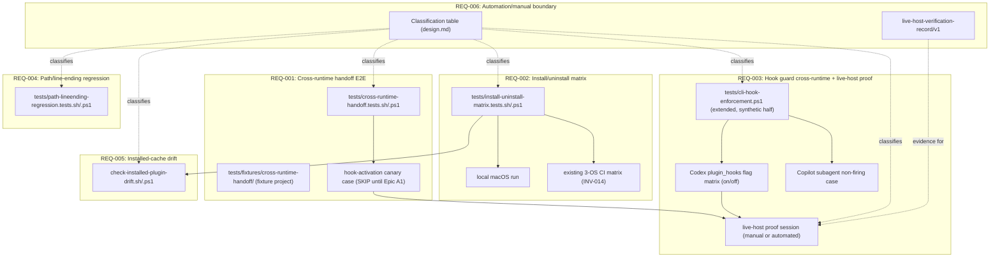

# Design: epic-196-a8-integration

Impl-Review-Status: Pending
Feature Type: test-infrastructure specification (Phase 1 — no code)

## Technical Summary

Epic A8 adds five verification surfaces over artifacts other Foundation
Epics already build (or will build): a cross-runtime handoff fixture
(REQ-001), an install/uninstall matrix (REQ-002), a hook-guard cross-runtime
test including the live-host hook-activation-handshake proof (REQ-003), a
path/line-ending regression matrix (REQ-004), and an installed-cache-vs-repo
drift check (REQ-005). REQ-006 is not a sixth surface but a classification
discipline applied to the other five: every check named below is tagged
`automated`, `automated-pending-confirmation`, or `manual-required`, and
every `manual-required` item has a fixed evidence-record schema
(`live-host-verification-record/v1`). No new CI topology is introduced —
every automated check registers into the existing `tests/run-all.{sh,ps1}`
and `.github/workflows/test.yml` 3-OS matrix (INV-014), extending
`tests/cli-hook-enforcement.ps1` and `tests/install.tests.{sh,ps1}` rather
than duplicating their fixture machinery.

## Architecture



Every box above is Phase 2/3 work this package fixes the contract for; this
Phase-1 package builds none of them.

## Components

| Component | Responsibility | Language | New/Existing | Protected |
|---|---|---|---|---|
| `tests/fixtures/cross-runtime-handoff/` | Fixture project: a minimal repo tree carrying the artifact each CLI-pair handoff step produces/consumes (Data Plan) | Markdown/YAML fixtures, no executable logic | new | No |
| `tests/cross-runtime-handoff.tests.sh` / `.ps1` | Drives the REQ-001 fixture through each CLI's own confirmed-or-manual invocation contract; emits `cross-runtime-handoff-trace/v1` | sh/PowerShell | new | No |
| `tests/install-uninstall-matrix.tests.sh` / `.ps1` | Drives REQ-002's install→verify→uninstall→verify cycle across the four `--target` values; calls `install.sh`/`uninstall.sh` (POSIX) or `install.ps1`/`uninstall.ps1` (Windows) unmodified | sh/PowerShell | new | No |
| `tests/cli-hook-enforcement.ps1` (extended) | Existing synthetic/regression hook-guard check (INV-013); this epic adds the Codex `plugin_hooks` flag-state matrix and the Copilot subagent non-firing case as new assertions in the SAME file, preserving its existing assertions unmodified | PowerShell | existing, extended | No |
| `tests/hook-activation-live-proof/` | Per-runtime live-host proof records (`live-host-verification-record/v1`), one file per runtime × flag-state cell, produced by an automated capture script where confirmed available, else by a human operator following REQ-006's record format | JSON | new | No |
| `tests/path-lineending-regression.tests.sh` / `.ps1` | Drives the REQ-004 Windows-path / CRLF-LF / NFC-NFD fixture matrix | sh/PowerShell | new | No |
| `plugins/sdd-quality-loop/scripts/check-installed-plugin-drift.{sh,ps1}` | REQ-005 drift check: compares an installed plugin cache against `plugins/**` repository source by content hash | sh/PowerShell (thin wrappers over a shared comparison routine, matching the repository's own `sdd-hook-guard` multi-runtime-wrapper precedent) | new | No (read-only comparison tool; never a guard-invariants target itself since it has no write path) |

## Protected-File Statement

This epic adds no `PROTECTED_GATE_SUFFIXES`/guard-invariants entries. Every
component above is a read-only verification tool (comparison, observation,
or fixture-driving); none of them writes to an approval field, a sidecar, or
any other file this repository's existing guard machinery protects. The
REQ-005 drift check (`check-installed-plugin-drift`) is explicitly read-only
by design (Security Boundaries B2, requirements.md) — it never remediates a
detected divergence, only reports it.

## Layer Specifications

Not applicable. This package is explicitly Phase 1, four-file only
(investigation.md/requirements.md/design.md/acceptance-tests.md); no
`ux-spec.md`/`frontend-spec.md`/`infra-spec.md`/`security-spec.md` is
produced (Risks, requirements.md — matching Epic A7's own established
precedent, INV-018).

## Design System Compliance

Not applicable. This is internal test-infrastructure specification work
with no UI surface.

## Cross-Layer Dependencies

- REQ-002's install/uninstall matrix (`tests/install-uninstall-matrix.
  tests.sh`/`.ps1`) depends on `install.sh`/`install.ps1`/`uninstall.sh`/
  `uninstall.ps1` staying behaviorally unchanged in their own `--target`
  contract (INV-010); a future change to that contract requires
  re-verifying this epic's own matrix cells.
- REQ-003's cross-runtime fixture depends on the three hook config files
  (`claude-hooks.json`/`hooks.json`/`copilot-hooks.json`, INV-011) and
  `sdd-hook-guard.{js,sh,ps1,py}` staying byte-compatible with
  `tests/cli-hook-enforcement.ps1`'s own existing drift-detection regexes
  (INV-013) — this epic's own extension re-uses, never replaces, that
  drift check.
- REQ-003's live-host proof (AC-015/AC-028) is blocked on Epic A1's own
  `check-hook-activation-handshake.{py,sh,ps1}` existing (INV-005); until
  Epic A1 merges, AC-006/AC-015/AC-016 stay `SKIP` per the Epic A7-
  established SKIP-governance precedent this package adopts (Design
  Decisions, below).
- REQ-005's drift check depends on `install.sh`'s `INSTALL_ROOT` default
  (`${XDG_DATA_HOME:-$HOME/.local/share}/sdd-plugins`, INV-016) staying the
  authoritative install-root convention; an `--install-root` override is
  read from the same environment/flag the installer itself accepts, never
  a separately-invented path.

## ADR Change Log

None. This package cites ADR-0019 (Approval Sidecar Protection) and
decision doc §7/§9/§19 as read-only authoritative sources; it proposes no
ADR revision.

## Data Plan

### `cross-runtime-handoff-trace/v1` (REQ-001)

```json
{
  "schema": "cross-runtime-handoff-trace/v1",
  "fixture_id": "string",
  "steps": [
    {
      "producer_runtime": "claude|codex|copilot",
      "consumer_runtime": "claude|codex|copilot",
      "artifact_path": "string (repo-relative)",
      "artifact_sha256": "sha256:<hex>",
      "consumer_observable": "string (what the consuming session's own output shows it used the artifact)",
      "invocation_mode": "automated|manual",
      "result": "PASS|FAIL|SKIP"
    }
  ],
  "canary_case": {
    "present": true,
    "result": "PASS|FAIL|SKIP",
    "skip_reason": "string|null (cites Epic A1 tracking issue when SKIP)"
  }
}
```

Two `steps[]` entries cover the two adjacent handoffs (Claude→Codex,
Codex→Copilot); a fixture run's own top-level `result` (design.md's own
driver script) is `PASS` only when both step results and the canary case
are each `PASS` or an allowlisted `SKIP` — never a `PASS` computed by
ignoring a `FAIL` step.

### `install-uninstall-matrix-result/v1` (REQ-002)

```json
{
  "schema": "install-uninstall-matrix-result/v1",
  "target": "All|Codex|Claude|Copilot",
  "os": "string",
  "install_root": "string",
  "phases": {
    "install_1": { "result": "PASS|FAIL", "registered": ["..."] },
    "verify_1":  { "result": "PASS|FAIL" },
    "install_2_idempotency": { "result": "PASS|FAIL", "diff_from_install_1": [] },
    "uninstall":  { "result": "PASS|FAIL" },
    "verify_residue": { "result": "PASS|FAIL", "residual_paths": [] }
  },
  "drift_check": { "result": "PASS|FAIL|NOT_APPLICABLE", "diverged_paths": [] }
}
```

`install_2_idempotency`'s `diff_from_install_1` is an empty array on PASS —
any non-empty diff is itself the AC-008 failure evidence. `verify_residue`'s
`residual_paths` is likewise empty on PASS; a non-empty array is the AC-009
failure evidence, scoped to paths this project's own installer created
(never a user's own pre-existing, unrelated CLI configuration —
Edge Cases, requirements.md).

### `live-host-verification-record/v1` (REQ-003, REQ-006; AC-026)

```json
{
  "schema": "live-host-verification-record/v1",
  "runtime": "claude|codex|copilot",
  "check": "string (e.g. hook-activation-handshake)",
  "invocation_mode": "automated|manual",
  "session_date": "ISO8601",
  "operator": "string (required when invocation_mode=manual)",
  "cli_name": "string",
  "cli_version": "string",
  "host_os": "string",
  "plugin_hooks_flag": "enabled|disabled|not_applicable",
  "tool_call_evidence": "string (the real, observed tool-call attempt and its result — transcript excerpt or structured capture, never a synthetic invocation)",
  "verdict": "PASS|FAIL",
  "notes": "string|null"
}
```

`operator` is required (non-null) whenever `invocation_mode` is `manual`
(AC-026); an `automated` record instead names the capturing script/CI job
in `notes`. A record whose `tool_call_evidence` field is empty, or whose
`verdict` was computed from a `sdd-hook-guard` script invocation rather than
from a real CLI-mediated tool call, is invalid per this schema — the exact
structural distinction AC-027's classification-mismatch rule checks
mechanically (Test Strategy, below), not merely by convention.

### `path-lineending-fixture-result/v1` (REQ-004)

```json
{
  "schema": "path-lineending-fixture-result/v1",
  "cases": [
    { "case": "windows-path-separator", "result": "PASS|FAIL", "evidence": "string" },
    { "case": "crlf-lf-gitattributes-layer", "result": "PASS|FAIL", "evidence": "string" },
    { "case": "nfc-nfd-filename", "result": "PASS|FAIL", "evidence": "string" }
  ]
}
```

### `installed-plugin-drift-report/v1` (REQ-005)

```json
{
  "schema": "installed-plugin-drift-report/v1",
  "install_root": "string",
  "state": "not_installed|installed_synced|installed_drifted",
  "diverged": [
    { "path": "plugins/<name>/...", "installed_sha256": "sha256:<hex>", "repo_sha256": "sha256:<hex>" }
  ]
}
```

`state: "not_installed"` is a distinct, non-failing result (AC-023) —
`diverged` is only ever populated when `state == "installed_drifted"`.

## API / Contract Plan

- `tests/cross-runtime-handoff.tests.sh [--fixture <path>]` /
  `tests/cross-runtime-handoff.ps1 [-Fixture <path>]` — drives the REQ-001
  fixture, emits `cross-runtime-handoff-trace/v1` to stdout/a named file,
  non-zero exit on any step `FAIL` (a `SKIP` step never contributes to a
  non-zero exit, matching the existing `loop-inventory` SKIP-governance
  precedent Epic A7 established, INV-005 of that package).
- `tests/install-uninstall-matrix.tests.sh [--target <All|Codex|Claude|Copilot>]`
  / `.ps1 [-Target <...>]` — with no `--target`, runs all four matrix cells
  sequentially; with `--target`, runs exactly one cell (Test Strategy item
  3, below, for the local-macOS/CI split). Emits one
  `install-uninstall-matrix-result/v1` object per cell.
- `check-installed-plugin-drift.sh [--install-root <path>]` /
  `.ps1 [-InstallRoot <path>]` — defaults `--install-root` to
  `${XDG_DATA_HOME:-$HOME/.local/share}/sdd-plugins` (INV-016, the
  installer's own default); exit 0 with `state: not_installed` or
  `installed_synced`, exit 1 with `state: installed_drifted`. Read-only:
  never writes to either the install root or the repository (Protected-File
  Statement).
- `tests/path-lineending-regression.tests.sh` / `.ps1` — no flags; runs all
  three REQ-004 cases (Data Plan), emits `path-lineending-fixture-result/v1`.
- Live-host proof capture: where REQ-006's classification finds a runtime's
  headless contract confirmed, a Phase 2/3-named automated script emits
  `live-host-verification-record/v1` with `invocation_mode: "automated"`;
  where not, a human operator fills the identical schema by hand
  (`invocation_mode: "manual"`) and commits it under
  `specs/epic-196-a8-integration/verification/live-host-proof/<runtime>-<flag-state>.json`.

## Test Strategy

1. **REQ-001 fixture drive** — `tests/cross-runtime-handoff.tests.sh`/`.ps1`
   exercises AC-001–AC-004 against the fixture project; the canary case
   (AC-006) is a distinct step inside the same trace, `SKIP`ped until Epic
   A1 merges.
2. **REQ-002 matrix drive, local** — a single local macOS invocation of
   `tests/install-uninstall-matrix.tests.sh` with no `--target` runs all
   four cells sequentially (AC-007–AC-009); fast-iteration, pre-CI signal
   only (AC-010) — never a substitute for the 3-OS CI run in item 3.
3. **REQ-002 matrix drive, CI** — the existing 3-OS CI matrix
   (`.github/workflows/test.yml`, INV-014) registers
   `install-uninstall-matrix.tests.{sh,ps1}` as a new step inside (or
   alongside) the existing `cli-hook-enforcement`/main test jobs, one
   `--target` cell per matrix-parallel invocation or all four sequentially
   per OS — Phase 2/3's own choice, recorded in its own implementation
   report, provided every OS × every target cell is covered at least once.
4. **REQ-003 synthetic extension** — new assertions are added directly
   inside `tests/cli-hook-enforcement.ps1` (INV-013), preserving every
   existing assertion; the Codex `plugin_hooks` flag matrix (AC-013) and
   Copilot subagent case (AC-014) run on the existing 3-OS CI job.
5. **REQ-003 live-host proof** — run once per runtime × flag-state cell
   (six cells, AC-028) either by an automated capture script (if REQ-006
   confirms feasibility) or by a human operator (REQ-006 record format);
   results land under `specs/epic-196-a8-integration/verification/
   live-host-proof/`. `SKIP` (citing Epic A1's tracking issue) is valid
   only until Epic A1 merges (AC-015); a `SKIP` surviving after Epic A1
   merges is a hard failure, matching Epic A7's own AC-035(a) SKIP-
   governance precedent this package adopts by reference rather than
   re-inventing.
6. **REQ-004 path/line-ending drive** — `tests/path-lineending-
   regression.tests.sh`/`.ps1` runs on the existing 3-OS CI matrix (Windows
   runner covers the path-separator and CRLF cases natively; macOS runner
   covers the NFC/NFD case natively via its own filesystem).
7. **REQ-005 drift check** — `check-installed-plugin-drift.{sh,ps1}` runs
   as a `verify` sub-step inside REQ-002's own matrix cells (AC-024),
   immediately after each `install` phase, against that same cell's own
   `--install-root`.
8. **Classification-mismatch guard (AC-027)** — a static check (design.md's
   own Data Plan, `live-host-verification-record/v1`) rejects any record
   whose `invocation_mode`/`tool_call_evidence` shape does not match its
   own check's AC-025 classification — e.g. a record claiming
   `invocation_mode: "automated"` for a check AC-025 marks
   `manual-required`, or a record whose `tool_call_evidence` reads like a
   direct `sdd-hook-guard` script invocation (matching
   `tests/cli-hook-enforcement.ps1`'s own known synthetic pattern, INV-013)
   presented as AC-015's live-host proof.
9. **Citation compliance (AC-030)** — `spec-review` checks every factual
   claim in this package's own investigation.md/requirements.md/design.md
   carries a file:line citation (WFI-011, INV-020).

## Automated / Manual Classification Table (REQ-006; AC-025)

Exhaustive over every check REQ-001 through REQ-005 name. `Gating fact`
names the exact unconfirmed capability an `automated-pending-confirmation`
row depends on (OQ-001); a `manual-required` row names why no automated
path exists at all.

| Check (AC) | Classification | Gating fact / reason |
|---|---|---|
| Claude→Codex handoff step (AC-002) | automated-pending-confirmation | Claude Code CLI headless/non-interactive contract unconfirmed in this repo (INV-021, OQ-001) |
| Codex→Copilot handoff step (AC-003) | automated-pending-confirmation | Codex CLI and Copilot CLI headless contracts both unconfirmed (INV-021, OQ-001) |
| Full 3-hop chain (AC-004) | automated-pending-confirmation | Inherits both gating facts above; automatable only once all three are confirmed |
| Hook-activation canary presence in handoff fixture (AC-006) | automated | Presence-only check (the case exists in the fixture trace); does not itself require a live-host session — the live-host proof is AC-015's own, separate check |
| Install/uninstall matrix, all 4 cells (AC-007–AC-011) | automated | `install.sh`/`.ps1`/`uninstall.sh`/`.ps1` already run non-interactively (existing `tests/install.tests.sh` precedent, INV-016); no CLI session required |
| Installed-cache drift check (AC-022–AC-024) | automated | Filesystem-only content-hash comparison; no CLI session required |
| Cross-runtime guard fixture, synthetic half (AC-012) | automated | Direct script invocation, matching `tests/cli-hook-enforcement.ps1`'s existing pattern (INV-013); no live CLI session required |
| Codex `plugin_hooks` flag matrix (AC-013) | automated | Config-flag toggle + direct guard invocation; does not require an interactive Codex session |
| Copilot subagent non-firing case (AC-014) | automated | Reproduces a documented, already-known non-firing config state (INV-012) without requiring a live interactive session |
| Live-host hook-activation-handshake proof, 3 runtimes × 2 flag states (AC-015, AC-028) | manual-required (default) / automated-pending-confirmation (upgrade path) | No confirmed scripted contract exists today for driving a genuine, unscripted, host-intercepted tool call inside any of the three CLIs (INV-021); defaults to `manual-required` under `live-host-verification-record/v1` until Phase 2/3 confirms an automatable path for a given runtime, at which point that runtime's own cell individually upgrades to `automated` without a schema change |
| A1 consumer entry-point live exercise (AC-016) | manual-required (default), same upgrade path as AC-015 | Same gating fact as AC-015; inherits its classification |
| Path/line-ending regression, all 3 cases (AC-018–AC-020) | automated | Filesystem/fixture-only; runs unattended on the existing 3-OS CI matrix (INV-014) |

No check above is left unclassified; a Phase 2/3 task introducing a new
check under any REQ-001–REQ-005 heading extends this table in the same
commit, never leaving a new row implicitly `automated` by omission.

## Path/Line-Ending Regression Matrix (REQ-004; AC-021)

| Case | Layer under test | Disposition | Evidence basis |
|---|---|---|---|
| Windows path-separator (AC-018) | This epic's own install/uninstall/generated-path output | ASSERT (automated, AC-018) | `install.sh`/`.ps1` existing behavior; no upstream Epic dependency |
| CRLF-vs-LF, `.gitattributes` layer (AC-019) | Git-attribute normalization only (`.gitattributes:1-9`, INV-022) | ASSERT (automated, AC-019) | Existing, already-committed `.gitattributes` contract; no upstream Epic dependency |
| CRLF-vs-LF, canonicalizer layer | Epic A1's own `canonicalize-sdd-yaml.py` NFC/JCS re-serialization (INV-022) | N/A for this package | Epic A1's own AC-007/canonicalizer test owns this layer (requirements.md Non-goals); re-asserting it here would duplicate, not extend, Epic A1's own coverage |
| NFC-vs-NFD filename/content (AC-020) | This epic's own fixture files, authored on an NFD-tending filesystem (macOS), consumed on NFC-only checkouts (Windows/Linux) | ASSERT (automated, AC-020) | Existing `.gitattributes` contract (INV-022); no upstream Epic dependency |

Every cell carries exactly one disposition; the canonicalizer-layer row is
recorded `N/A for this package` (never silently omitted) precisely because
it is a real, adjacent concern this epic's own REQ-004 does not duplicate
(Non-goals).

## Design Decisions (resolving requirements.md's Open Questions where possible)

- **OQ-001 (partially resolved — deferred to Phase 2/3 by design, not
  silently dropped)**: this package does not claim any of the three CLIs'
  headless contracts are confirmed (INV-021). The classification table
  above and the Test Strategy (item 5) fix the record schema and lifecycle
  either way, so Phase 2/3's own confirmation work — for whichever CLIs
  turn out to support a scripted invocation — slots directly into the
  `automated`-classified path with no further design change; a CLI that
  turns out not to support one stays `manual-required` under the identical
  schema. This is a deliberate "leave the empirical fact for Phase 2/3, fix
  the contract now" decision, matching the pattern investigation.md's own
  Safety constraints require (never assert an unconfirmed capability as
  true).
- **OQ-002 (resolved)**: the REQ-005 drift check's own default scope is
  `plugins/**`-sourced files only (Data Plan, `installed-plugin-drift-
  report/v1`'s `diverged[].path` pattern `plugins/<name>/...`) — the
  `~/.codex/config.toml` MCP blocks and `~/.codex/agents/sdd-*.toml` role
  files INV-016 also names are recorded as a named, explicit future
  extension (Open Questions carried forward below) rather than folded into
  this package's own AC-022/AC-023, because their own drift-detection
  shape (a delimited block inside a shared file, not a whole-file hash
  comparison) is structurally different from a `plugins/**` file-for-file
  comparison and would need its own AC pair to specify correctly, which
  this Phase-1 package defers rather than under-specifies.
- **New decision — SKIP-governance reuse, not reinvention**: every `SKIP`
  this package's own future suites emit (AC-006, AC-015, AC-016) follows
  Epic A7's own already-established named-SKIP/allowlist convention
  (`specs/epic-195-a7-compatibility/design.md` Design Decisions,
  `tests/lib/loop-driver.sh:460-519`'s `LOOP_VALIDATOR_CAPABILITY`
  pattern) rather than defining a second, competing SKIP mechanism — this
  package's own Phase 2/3 task registers its Epic-A1-dependent assertions
  in that same allowlist discipline (citing this epic's own tracking
  issue #196 and Epic A1's #189/#187) instead of authoring a parallel one.
- **New decision — synthetic/live-host structural separation (AC-017)**:
  `tests/cli-hook-enforcement.ps1`'s existing assertions and this epic's
  own live-host proof records are two structurally independent artifacts
  (a CI-runnable `.ps1` exit code vs. a JSON record under `verification/
  live-host-proof/`) precisely so that a `SKIP`/pending live-host proof
  never fails the pre-existing, already-passing synthetic suite — closing
  the regression risk investigation.md's own Risks section names.
- **New decision — FilesOnly exclusion (AC-011)**: `--target FilesOnly`
  stays outside REQ-002's four-value matrix because its own behavior
  (skip all CLI registration) has no cross-runtime dimension to verify —
  including it would test file-copy correctness alone, already covered by
  `install.tests.sh`'s/`.ps1`'s existing assertions (INV-007 of Epic A7's
  own investigation.md), not this epic's own cross-runtime concern.

## Global Constraints

- No new CI topology: every automated check registers into the existing
  `tests/run-all.{sh,ps1}` and `.github/workflows/test.yml` 3-OS matrix
  (INV-014) — a Phase 2/3 task that instead provisions a new workflow file
  deviates from this package's own design.
- No new guard-invariants/`PROTECTED_GATE_SUFFIXES` registrations
  (Protected-File Statement) — every component this epic adds is
  read-only/observational.
- `sh`, `bash`, and PowerShell remain the deterministic runtimes this
  repository's existing suites already assume (matching Epic A7's own
  Assumptions); this epic introduces no new runtime dependency for its
  automated checks. Where a live-host proof requires a real `claude`/
  `codex`/`copilot` CLI installation, that installation is scoped to the
  runner/session actually producing that specific proof, never assumed
  present for every other check in this package.

## Security Boundaries

See requirements.md's own Security Boundaries table (B1: live-host session
authenticity; B2: read-only drift check). No additional boundary is
introduced at design time beyond restating each as a concrete mechanism:
B1 is enforced by the `live-host-verification-record/v1` schema's own
required fields (Data Plan) plus the AC-027 classification-mismatch static
check (Test Strategy item 8); B2 is enforced by
`check-installed-plugin-drift`'s own read-only API contract (API / Contract
Plan — no write flag exists in its own interface).

## External Integrations

- Claude Code CLI, Codex CLI, and GitHub Copilot CLI — each consumed
  read-only (a CLI session is launched and observed; this epic's own
  scripts never modify any of the three CLIs' own configuration beyond
  what `install.sh`/`install.ps1` already do for REQ-002's matrix).
- No network calls beyond what `install.sh`'s own `--source-directory`-free
  (remote) path already makes (`gh`-authenticated GitHub API access,
  existing installer behavior, unchanged by this epic).

## Deployment / CI Plan

- REQ-001/REQ-003 (synthetic half)/REQ-004/REQ-005 checks register as new
  steps in the existing `.github/workflows/test.yml` 3-OS matrix (INV-014),
  reusing the `cli-hook-enforcement`/main test job pattern.
- REQ-002's matrix registers similarly, with the local-macOS-run/CI-3-OS
  split fixed above (Test Strategy items 2–3) documented in the job's own
  step name so a future maintainer never confuses the fast local pass with
  full cross-OS coverage.
- REQ-003's live-host proof is explicitly NOT a required CI gate blocking
  merges of this epic's own future PRs by default — `SKIP` is valid until
  Epic A1 merges (Design Decisions); once Epic A1 merges, un-skipping and
  actually producing all six live-host records (AC-028) becomes this
  epic's own Done-condition-closing task, tracked in its own
  implementation report rather than silently left open-ended.

## Constraint Compliance

- CI resilience (bash 3.2 array safety, macOS `$TMPDIR`, Windows `jq.exe`
  CRLF, no real-validator probing) — carried verbatim from this
  repository's own established Constraint Compliance convention (Epic A7's
  own precedent, `specs/epic-189-a1-project-context/design.md:1554`); this
  package's own future Test Strategy items reuse the identical fixture
  patterns (`tests/install.tests.sh`'s `git archive`-based fixture clone,
  INV-016 of Epic A7's own investigation.md) rather than inventing new ones.

## Assumptions

See requirements.md's own Assumptions section (Epic A1/A5/A7 unmerged
status; decision doc/ADR-0019 as unrevised authoritative source;
`.gitattributes`/installer/hook-config files as this epic's own stable
cross-runtime surfaces).

## Open Questions

Carried forward from requirements.md: OQ-001 (headless-contract
confirmation, deferred to Phase 2/3 by design — Design Decisions, above),
OQ-002 (drift-check scope beyond `plugins/**` — resolved to
`plugins/**`-only for this package, with the broader scope named as a
future extension, Design Decisions above).

## Risks

See requirements.md's own Risks section (live-host proof's potential
permanent `manual-required` status; regression risk to
`tests/cli-hook-enforcement.ps1`'s existing assertions; the deliberate
Phase-1 `check-sdd-structure.sh` six-`missing:` deviation). Design-time
mitigation for the first two: the schema-level `automated`/`manual`
distinction (Data Plan) and the structural synthetic/live-host separation
(Design Decisions, AC-017) respectively.
