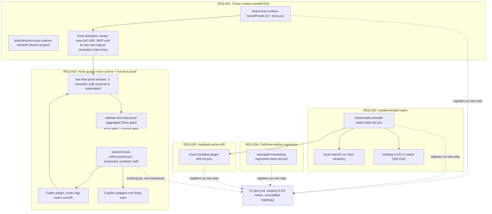

# Infrastructure Specification: epic-196-a8-integration

No new CI topology in this task (design.md Global Constraints: "every
automated check registers into the existing `tests/run-all.{sh,ps1}`
and `.github/workflows/test.yml` 3-OS matrix"). This document expands
design.md's Deployment / CI Plan, Architecture, Components, Data Plan
(the six new schemas and the three new governance manifests), Protected-
File Statement, and Global Constraints into the review harness's
canonical layer-file shape for the CI wiring, test execution
environment, and rollback procedure this Phase 1 package specifies for
a future Phase 2/3 implementation task. It introduces no new
infrastructure judgment beyond what those sections already fix.

## Deployment Topology



No cloud, no region, no network boundary beyond the three CLI installs
REQ-002's matrix already exercises — every deliverable this task
specifies is a repository-internal test-infrastructure artifact
(design.md External Integrations: "No network calls beyond what
`install.sh`'s own ... remote path already makes"). No new plugin and no
new CI job topology is introduced by *this* Phase 1 task; the diagram
above shows the future-task wiring design.md's Architecture, Test
Strategy, and API / Contract Plan already fix, not work this task
performs. Fault domain: a single script invocation, test-suite run, or
human-attended live-host session — this task introduces no shared/
long-running service of its own; `validate-live-host-proof`'s own single
write (the Nonce Issuance Ledger's `consumed_by_record` field) is a
lock-guarded, atomic, idempotent update, not a running service.

## CI/CD Sequence

```mermaid
sequenceDiagram
  actor D as Developer / Maintainer / Operator
  participant CI as GitHub Actions (test.yml, existing 3-OS matrix)
  participant SYN as tests/cli-hook-enforcement.ps1 (extended)
  participant DRIFT as check-installed-plugin-drift (future task)
  participant LIVE as Live-host proof session (manual or automated, future task)
  participant AGG as validate-live-host-proof (future task)

  D->>CI: Push / PR (Phase 1: 4 spec files + 4 layer specs; Phase 2/3: suite/script/manifest edits)
  CI->>CI: existing structural/workflow-state registration check (check-sdd-structure.sh, check-workflow-state.sh)
  CI->>SYN: (future) run extended synthetic/regression assertions (AC-012, AC-017)
  SYN-->>CI: PASS/FAIL, independent of AC-015's own live-host status (AC-017 structural separation)
  CI->>DRIFT: (future) run in mode=verify, wired inside REQ-002's own matrix cells (AC-024)
  DRIFT-->>CI: PASS (installed_synced) / FAIL (installed_drifted or not_installed)
  Note over D,LIVE: AC-015/AC-016's own single-clause Activation Gate already fired (Epic A1 merged 2026-08-08): a surviving SKIP for either is a non-zero-exit hard failure now, not a deferred one.\nAC-006 alone stays a valid, allowlisted SKIP until its own separate, two-clause predicate (T-005 starting AND the artifact existing) additionally holds (design.md SKIP Allowlist Activation Gate).
  D->>LIVE: operator + independent reviewer attend a real CLI session per semantic cell, or an automated capture script runs plus a required reviewer countersignature — now required (future task T-008) to discharge the already-activated AC-015/AC-016 gate
  LIVE-->>AGG: commits tests/hook-activation-live-proof/<matrix_cell>.json (live-host-verification-record/v1)
  CI->>AGG: validate-live-host-proof — Done gate + release gate, already required today (AC-015/AC-016 activated)
  AGG-->>CI: discharged (exit 0) / pending (exit 0, only before AC-015/AC-016's own gate activates — already elapsed) / named error code (non-zero, the current state until T-008)
  CI-->>D: PASS / FAIL
```

This task adds no CI job itself (design.md Deployment / CI Plan). A
future implementation task's own new/extended suite and check pairs —
`tests/cross-runtime-handoff.tests.{sh,ps1}` (REQ-001),
`tests/install-uninstall-matrix.tests.{sh,ps1}` (REQ-002),
`tests/cli-hook-enforcement.ps1`'s own extension (REQ-003),
`check-installed-plugin-drift.{sh,ps1}` (REQ-005),
`validate-live-host-proof.{sh,ps1}` (REQ-003/REQ-006), and
`tests/path-lineending-regression.tests.{sh,ps1}` (REQ-004) — register
into `tests/run-all.sh`, `tests/run-all.ps1`, and
`.github/workflows/test.yml`, reusing the existing
`cli-hook-enforcement`/main test job pattern (design.md Deployment / CI
Plan) — never provisioning a new workflow file (Global Constraints).
REQ-007's own two process-integrity ACs are not a seventh CI-registered
artifact this file wires in: design.md assigns AC-030 (citation
compliance) to the existing `spec-review` tool, which already rejects
any uncited factual claim in this package's own investigation.md/
requirements.md/design.md (design.md Test Strategy item 9), and fixes
AC-029 (scope-boundary self-check) as a property checkable directly
against this package's own Non-goals text (requirements.md AC-029) —
neither names a new `.sh`/`.ps1`/`.py` check of its own. AC-025 is
design.md's own Automated / Manual Classification Table itself (design.md
Automated / Manual Classification Table section, REQ-006), not a script
that runs against it. This matches traceability.md's own Infrastructure
Layer Coverage row, which satisfies AC-029/AC-030 with a reasoned
cross-layer N/A rather than an infra-spec.md anchor, "since they are a
citation/scope-boundary discipline over this package's own text, not an
infrastructure surface." Every one of these registrations follows the
identical `.github/workflows/test.yml` human-copy staging convention this
repository's own protected-file rule already requires for that file
(traceability.md's own Infrastructure Layer Coverage row: "stage their
`.github/workflows/test.yml` CI steps via human-copy"), never a direct
agent edit to the live workflow file. AC-015/AC-016's own single-clause
Activation Gate predicate — Epic A1's canonical artifacts existing on
`main` alone, with no task-start clause (design.md SKIP Allowlist
Activation Gate; requirements.md:389, :536) — already activated both
cases on 2026-08-08, the date Epic A1 merged: REQ-003's live-host proof
is a required CI gate blocking merges of this epic's own future PRs
*today*, not upon some future event, and `validate-live-host-proof` is
already this epic's own Done gate and a required release gate (design.md
Deployment / CI Plan) — closing the "live-host proof can stay unverified
while the suite stays green" gap an earlier draft of this design left
open. AC-006's own case is the one exception: its `SKIP` stays a valid,
non-failing state, and is not a required CI gate, until AC-006's own
second, task-start clause additionally holds (T-005 starting, design.md
SKIP Allowlist Activation Gate; design.md Risks).

## Environments

| Environment | URL | Auth | Trigger | Classification | Promotion Rule |
|---|---|---|---|---|---|
| local dev (monorepo checkout, macOS) | `tests/` + `plugins/sdd-quality-loop/scripts/` + `plugins/sdd-review-loop/references/` + `specs/epic-196-a8-integration/` (repo-relative) | OS user (filesystem) | manual suite invocation (`tests/run-all.sh`/`.ps1`, `tests/install-uninstall-matrix.tests.sh` with no `--target`, or a single suite file) — the fast-iteration REQ-002 local-macOS pass (design.md Test Strategy item 2) | internal | PR + CI green |
| CI (GitHub Actions `test.yml`, existing 3-OS matrix, unmodified topology) | N/A — ephemeral runner | GitHub Actions default | push / PR | internal | required check before merge; REQ-003's live-host proof (AC-015/AC-016) is a required gate now — its own single-clause Activation Gate already fired when Epic A1 merged on 2026-08-08 (Deployment / CI Plan, above); AC-006 alone stays a non-required, valid `SKIP` until its separate two-clause predicate's task-start clause (T-005) additionally holds |
| Live-host session (human-attended, or an automated capture script once confirmed, real installed `claude`/`codex`/`copilot` toolchain) | N/A — a real, human-operated or scripted CLI session, not a CI runner | operator identity + independent-reviewer identity, resolved against the Trusted-Signer Registry (`a8-trusted-signers.json`) | manual, scheduled per REQ-003's own five semantic matrix cells (Live-Host Semantic Matrix, design.md) | internal | committed only as a fortified `live-host-verification-record/v1`, countersigned by an independent reviewer distinct from the operator (design.md Data Plan Signing Contract) |
| staging / production | N/A | — | — | — | N/A — no runtime service, no cloud deployment (design.md External Integrations: no target beyond the three CLIs and the repository's own existing installer network path) |

## Infrastructure as Code

N/A — no cloud, no Terraform/IaC module. Every deliverable this task
specifies is a Bash/PowerShell/Python script, a JSON schema/manifest, or
an additive extension of an existing test-infrastructure file, added to
the existing `tests/`, `plugins/sdd-quality-loop/scripts/`, and
`plugins/sdd-review-loop/references/` trees (design.md Components). No
new deployment target, region, or provisioned resource is introduced by
this task or its future-task deliverables.

## Scaling Strategy

N/A — no runtime service, no concurrency model. Each future-task script
(`tests/cross-runtime-handoff.tests.{sh,ps1}`,
`tests/install-uninstall-matrix.tests.{sh,ps1}`,
`check-installed-plugin-drift.{sh,ps1}`,
`validate-live-host-proof.{sh,ps1}`,
`tests/path-lineending-regression.tests.{sh,ps1}`) is a single,
deterministic, synchronous invocation per suite run or per matrix cell.
The one exception to pure statelessness is `validate-live-host-proof`'s
own Nonce Issuance Ledger write, which this design fixes as a
lock-directory + temp-file + atomic-rename pattern — "the identical
lock-directory + temp-file + atomic-rename pattern this repository's own
`validate-review-context-set.sh` already uses for its identity-ledger
reservation" (design.md Data Plan) — specifically so repeated or
concurrent validator invocations against the same ledger stay correct,
not merely idempotent by convention.

## Service Level Objectives

N/A — no live service to hold an availability/latency SLO. The closest
analogs are the correctness properties design.md already fixes as
contracts: (1) `tests/install-uninstall-matrix.tests.{sh,ps1}`'s own
`install_2_idempotency`/`verify_residue` sub-checks must report an empty
`diff_from_install_1`/`residual_paths` array on PASS, never a silent
non-empty array (AC-008, AC-009); (2) `check-installed-plugin-drift`'s
own `mode: verify` sub-step must treat a `not_installed` result as a
`FAIL`, never a non-failing state, once an `install` phase already
claimed success (AC-023, AC-024); (3) `validate-live-host-proof` must
never report `discharged` on a missing, post-merge `SKIP`, `FAIL`,
stale, config-digest-mismatched, or duplicate-nonce record among the
five semantic cells (AC-028) — the aggregate Done-gate/release-gate
contract this epic's own Deployment / CI Plan section fixes.

## Data Residency and Retention

| Entity | Residency | Retention | Backup | Deletion Verification | REQ | AC |
|---|---|---|---|---|---|---|
| `tests/fixtures/cross-runtime-handoff/` (future, committed) | repository working tree (git) | git-versioned; fixed initial bytes per the Fixture Contract table (design.md Data Plan) | git remote(s) | not applicable; no delete operation in scope | REQ-001 | AC-001 |
| `tests/hook-activation-live-proof/<matrix_cell>.json` records (future, committed) | repository working tree (git) | git-versioned; one record per semantic cell, updated only by a fresh operator+reviewer session or a `SKIP` re-authored against the current allowlist (design.md Data Plan) | git remote(s) | not applicable | REQ-003, REQ-006 | AC-015, AC-026 |
| `tests/hook-activation-live-proof/nonce-ledger.json` (future, committed) | repository working tree (git) | append-only; entries are never deleted, only marked `consumed_by_record` via `validate-live-host-proof`'s own one lock-guarded write (design.md Data Plan) | git remote(s) | not applicable — append-only structure | REQ-003 | AC-015, AC-028 |
| `tests/hook-activation-live-proof/raw/<matrix_cell>-{request,result,installed-config}.json` (future, committed) | repository working tree (git) | git-versioned; committed once per session, never edited after capture (design.md Data Plan "Raw capture files") | git remote(s) | not applicable | REQ-003 | AC-015, AC-026 |
| `plugins/sdd-review-loop/references/a8-skip-allowlist.json`, `a8-expected-hook-config-digests.json`, `a8-trusted-signers.json` (future, committed) | repository working tree (git) | git-versioned; maintainer-committed, additive growth (design.md Components, Signing Contract) | git remote(s) | not applicable | REQ-003, REQ-006 | AC-006, AC-015, AC-016, AC-025, AC-026 |
| `install-uninstall-matrix-result/v1`, `path-lineending-fixture-result/v1`, `installed-plugin-drift-report/v1` records (future, per-run) | local filesystem / CI job artifact, transient unless a Phase 2/3 implementer chooses to persist as a CI artifact | not committed by this design; exists for the run that produced it (design.md Data Plan) | CI's own artifact retention, if configured by a future task (not fixed by this Phase 1 package) | deleted by the producing process's own lifecycle unless a future task adds explicit CI artifact retention | REQ-002, REQ-004, REQ-005 | AC-007–AC-011, AC-018–AC-024 |
| `cross-runtime-handoff-trace/v1` (future, per-run) | in-process / stdout / a named file per invocation | transient — exists for the fixture run that produced it (design.md API / Contract Plan) | none — transient by design unless a future task persists it | deleted by the producing process's own lifecycle | REQ-001 | AC-001–AC-006 |

No database, no migration, no runtime storage anywhere in this feature.
design.md's own Migration Strategy states plainly: "No migration
required. Every data entity named above is a net-new file with no prior
version to migrate from; the one write this package performs against
existing data (marking `consumed_by_record` on an existing nonce-ledger
entry) is additive metadata on an already-append-only structure Epic A1
itself defines, not a schema migration."

## Observability

| Logs | Traces | Metrics | Alert | Owner | Runbook |
|---|---|---|---|---|---|
| Suite `PASS`/`FAIL`/`SKIP` lines per suite; `check-installed-plugin-drift`'s own `state` diagnostic (`not_installed`/`installed_synced`/`installed_drifted`); `validate-live-host-proof`'s own named error-code diagnostics (`ERR_MISSING_CELL`, `ERR_STALE_SKIP`, `ERR_NONCE_REUSED`, etc. — API / Contract Plan, design.md) | N/A — no distributed request; single-process CLI/test-suite invocation per run, except the live-host session itself, whose own `host_session_id`/`host_event_id` fields (design.md Data Plan) are the closest analog to a trace ID | N/A — no running service to emit a metric; CI's existing pass/fail signal on the registered suites, plus `validate-live-host-proof`'s own `discharged`/`pending`/error-code aggregate, is the closest observable signal | CI failure on any registered `.tests.sh`/`.tests.ps1` pair; a non-zero `check-installed-plugin-drift` exit in `mode: verify`; any non-zero `validate-live-host-proof` exit — already the current state for AC-015/AC-016 now that their own single-clause Activation Gate has activated (Epic A1 merged 2026-08-08; Deployment / CI Plan, above) | Implementation task owner | design.md describes no logging/tracing/runbook infrastructure beyond these suite diagnostics and the named validator error codes; `docs/troubleshooting.md`'s own existing "フックが発火しない" entry (INV-012) remains the operator-facing runbook for a non-firing hook this epic's own fixtures reproduce and observe, not a new runbook this package authors |

## Cost Estimate

N/A — no cloud cost. This task adds no new CI job topology and no new
compute consumer beyond what the existing `test.yml` 3-OS matrix already
provisions; every future-task deliverable runs inside that existing CI
compute or on a local developer/maintainer/operator machine (Deployment
Topology, above). The one operational cost this design fixes is process,
not compute: a live-host proof session requires a maintainer/contributor
operator plus an independent reviewer to attend or countersign each of
the five semantic-cell sessions (Live-Host Semantic Matrix, design.md) —
a review-time and calendar-time cost, not an infrastructure spend.

## Rollback

- **Trigger.** A CI failure on a future-registered suite, a live-host
  proof session that observes an unexpected result (a negative finding
  is itself load-bearing evidence, never silently re-run until it
  passes — Edge Cases, requirements.md), an `ERR_DIGEST_MISMATCH`/
  `ERR_STALE_SKIP`/other `validate-live-host-proof` hard failure, or an
  installed-cache drift check reporting an unexpected `installed_
  drifted` state.
- **This task's own change set (Phase 1, spec-only).** The four Phase 1
  spec files (`investigation.md`, `requirements.md`, `design.md`,
  `acceptance-tests.md`), the four layer-spec files this task adds
  (`ux-spec.md`, `frontend-spec.md`, this file, `security-spec.md`),
  and `traceability.md`'s own Layer Spec column update are all
  unprotected files (Protected-File Statement, design.md) and revert via
  a standard `git revert` of the offending commit(s) — no special
  procedure, since this task authors no live script, schema, or test
  file of its own (Layer Specifications / Security Boundaries, design.md).
- **Future-task additive extensions (Phase 2/3, not yet built).** Every
  extension point this design fixes is additive-only: new suite/script
  files under `tests/` and `plugins/sdd-quality-loop/scripts/`, new
  assertions added directly inside the existing
  `tests/cli-hook-enforcement.ps1` (preserving every existing assertion
  unmodified, design.md Test Strategy item 4), and new, maintainer-
  committed governance manifests under `plugins/sdd-review-loop/
  references/`. A rollback of any of these is a straightforward `git
  revert` of the additive diff — no data-compatibility dimension to
  reconcile, since no existing consumer of the unmodified baseline is
  broken by reverting the extension.
- **Live-host verification records.** A `live-host-verification-record/
  v1` found to be invalid, stale, or superseded reverts via `git revert`
  like any other repository file; because `validate-live-host-proof`
  recomputes every hash/signature/nonce binding at validation time
  (never caching a prior "trusted" result), no separate record-specific
  rollback mechanism is needed beyond restoring the record's own prior
  committed content or replacing it with a fresh, correctly-attested
  session record.
- **Nonce Issuance Ledger.** Because `validate-live-host-proof` performs
  exactly one lock-guarded, atomic, idempotent write per accepted record
  (marking `consumed_by_record`), a rollback that reverts a bad record
  also requires reverting that same ledger-entry consumption marker in
  the same commit, so the ledger and the record it describes stay
  consistent — never reverting one without the other.
- **Verification after rollback.** Re-run the reverted suite(s) locally
  and re-run `scripts/check-sdd-structure.sh .` and
  `plugins/sdd-review-loop/scripts/validate-layer-traceability.py
  specs/epic-196-a8-integration/traceability.md
  specs/epic-196-a8-integration/requirements.md` (for a Phase 1
  spec-only rollback) to confirm the reverted state is internally
  consistent with the review-loop evidence already committed; for a
  Phase 2/3 rollback, additionally re-run
  `plugins/sdd-quality-loop/scripts/validate-live-host-proof.{sh,ps1}`
  against the restored record/ledger state.

## Open Questions

- None — OQ-001 (per-CLI headless-contract confirmation, deferred to
  Phase 2/3 by design) and OQ-002 (drift-check coverage scope, resolved
  to the broadened Coverage Scope table) are both resolved by design.md's
  own Design Decisions section; no infrastructure-surface question
  remains open for this Phase 1 package's own scope.
