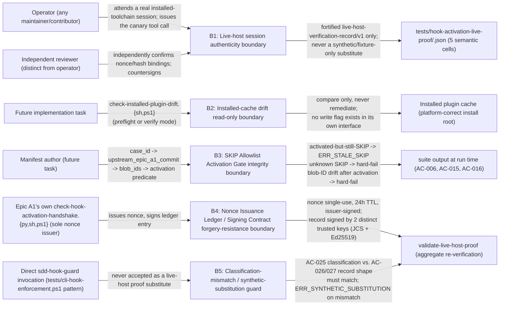

# Security Specification: epic-196-a8-integration

This document expands design.md's Security Boundaries (B1-B2, restating
requirements.md's own B1-B2 table), Live-Host Semantic Matrix,
Direct-Invocation De-Spoofing, SKIP Allowlist Activation Gate, Data Plan
(the `live-host-verification-record/v1` schema, Nonce Issuance Ledger,
Expected-Digest Manifest, and Signing Contract), API / Contract Plan
(`validate-live-host-proof`'s own error codes), and Protected-File
Statement into the review harness's canonical layer-file shape. It
introduces no new security judgment beyond what those sections already
fix; every boundary, mitigation, and REQ/AC reference below traces to
design.md content approved at Impl-Review-Status: Passed.

Framing (design.md External Integrations: "Claude Code CLI, Codex CLI,
and GitHub Copilot CLI — each consumed read-only ... No network calls
beyond what `install.sh`'s own ... remote path already makes";
Protected-File Statement: "This epic adds no `PROTECTED_GATE_SUFFIXES`/
guard-invariants entries ... every component above is a read-only
verification tool ... with one narrow, named exception"): this feature's
attack surface is entirely local, and this Phase 1 package authors no
live script, schema, or test file of its own at all — every artifact
below is a *design* for a future implementation task. Its security-
relevant character is therefore not "what can an external attacker do to
a running service" (there is none) but "what can silently corrupt the
integrity of a delegation-discharge claim (ADR-0019/Epic A1's own
hook-activation-handshake Done condition) or an installed-cache-drift
signal a future task, CI, and a human maintainer all trust without
independent re-verification" — concentrated in (1) the live-host
session authenticity boundary, (2) the installed-cache drift read-only
boundary, (3) the SKIP Allowlist Activation Gate integrity boundary, (4)
the Nonce Issuance Ledger / Signing Contract forgery-resistance
boundary, and (5) the classification-mismatch / synthetic-substitution
guard boundary — the five boundaries B1-B5 below (requirements.md itself
names B1-B2 under Security Boundaries; B3-B5 are this document's own
expansion of design.md's Live-Host Semantic Matrix, Direct-Invocation
De-Spoofing, SKIP Allowlist Activation Gate, and Data Plan content into
the same boundary shape).

## Trust Boundaries

| Boundary | Source | Destination | Assets | Validation | AuthN/AuthZ | REQ | AC |
|---|---|---|---|---|---|---|---|
| B1 — Live-host session authenticity boundary | an operator's real, installed-toolchain CLI session (Claude Code / Codex CLI / Copilot CLI), and an independent reviewer's own countersignature | `tests/hook-activation-live-proof/<matrix_cell>.json`, one of the five semantic live-host matrix cells | ADR-0019/Epic A1 hook-activation-handshake delegation-discharge integrity: the claim that a real, natively-installed hook subsystem intercepted and denied a real tool call must never be satisfied by a synthetic/fixture-only result | a genuine, real installed-toolchain session is required (requirements.md Security Boundaries B1: "a synthetic/fixture-only result is never accepted as discharging the ADR-0019/Epic A1 delegation"); the fortified `live-host-verification-record/v1` schema's required fields (nonce, raw tool-request/result hashes, host session/event IDs, installed hook/config digest, start/end timestamps, two-party Ed25519 attestation — design.md Data Plan) make the record independently re-verifiable rather than self-attested; manual-required sessions are attributable to a named operator and reviewed before being treated as authoritative (requirements.md Roles and Permissions) | Operator: allow (attends/reproduces the session, signs as `operator`); Independent reviewer: allow (countersigns as `reviewer`, distinct identity and key from operator); CI / any automated process: deny (never itself produces or claims to produce a `manual-required` live-host proof record, requirements.md Roles and Permissions) | REQ-003 | AC-015, AC-026, AC-028 |
| B2 — Installed-cache drift read-only boundary | a future implementation task's `check-installed-plugin-drift.{sh,ps1}` invocation (standalone `preflight` or REQ-002-embedded `verify` mode) | a CLI-registered install root's own copy of `plugins/**`, Codex agent role TOML, the `~/.codex/config.toml` MCP block, and the three hook config files (Coverage Scope, design.md Data Plan) | Read-only comparison of a local install root against repository source; the check never writes to either side (requirements.md Security Boundaries B2: "no auto-remediation, no silent re-install") | the check's own API contract exposes no write flag (design.md API / Contract Plan); divergence is reported (`diverged[]`, `change_type`) via its own `installed-plugin-drift-report/v1` output, never corrected; `mode: verify`'s own stricter semantics (`not_installed` is a `FAIL`) close the "fail-open on unresolved paths" gap a same-source-only drive cannot rule out (design.md Data Plan) | Future implementation task / CI: allow (read-only invocation); the check itself: never write (no interface exists to request one) | REQ-005 | AC-022, AC-023, AC-024 |
| B3 — SKIP Allowlist Activation Gate integrity boundary | a future task's `a8-skip-allowlist.json` entry (`case_id` → `reason` → `upstream_epic_a1_commit` → `upstream_epic_a1_path_blob_ids` → activation predicate, design.md SKIP Allowlist Activation Gate) | every registered suite's own `SKIP`-shaped output line for AC-006/AC-015/AC-016 at run time | fail-open closure: an Epic-A1-dependent assertion must have a named, auditable degradation — never an *unexplained* `SKIP`. For AC-015/AC-016, this design restores requirements.md's own stronger guarantee in full: neither case's `SKIP` is ever valid after Epic A1's own canonical artifacts land on `main` (requirements.md:389, :536) — no residual "stays valid a while longer" case exists for either, and Epic A1 merged on 2026-08-08, so both are hard failures now. AC-006 alone carries an explained, narrower trade-off: its own `SKIP` MAY remain valid (non-failing) for an unbounded period after Epic A1's own canonical artifacts actually land on `main`, for as long as AC-006's own owning task (T-005) has not yet started; this is a deliberate, explained trade-off, not the unconditional "never indefinitely-extended" guarantee an earlier draft of this boundary claimed for all three cases — accepted because T-005 is already `Approval: Approved` (tasks.md) and sits on this package's own critical serialized/blocked-on task chain, so an indefinitely-delayed activation would require an already-approved, critical-path task to never be started; no automated "approved but never started" staleness alarm exists for that residual case (design.md Risks) | AC-015/AC-016 activation is single-clause: plain file-existence of Epic A1's own canonical artifacts on `main` alone (`check-hook-activation-handshake.{py,sh,ps1}` for AC-015, the five consumer entry points for AC-016) — never satisfied by commit-ancestry alone (a squash/rebase merge never breaks it) — and both are already activated as of Epic A1's 2026-08-08 merge. AC-006's own activation is two-clause: BOTH (a) T-005 having started and (b) the same existence-based artifact check for `check-hook-activation-handshake.{py,sh,ps1}` — clause (a) exists precisely so AC-006's own activation can never precede the start of the task (T-005) whose own Done When requires AC-006 to stay a non-failing `SKIP`. Once activated (either predicate), a content-level blob-ID re-resolution against the *current* `main` tree catches post-activation drift as `ERR_STALE_SKIP`-class hard failure — an allowlist entry absent for an activated case, or an unknown `case_id`, is likewise a hard failure (design.md SKIP Allowlist Activation Gate) | Manifest author (future task): allow (direct edit, reviewed like any other test-infrastructure change); the evaluator itself: read-only, deterministic | REQ-003 | AC-006, AC-015, AC-016 |
| B4 — Nonce Issuance Ledger / Signing Contract forgery-resistance boundary | Epic A1's own `check-hook-activation-handshake.{py,sh,ps1}` (sole nonce issuer, keyed to a registered `issuer`-role key), and each `live-host-verification-record/v1`'s own `operator_signature`/`reviewer_signature` | `tests/hook-activation-live-proof/nonce-ledger.json` (`live-host-nonce-ledger/v1`) and the Trusted-Signer Registry (`a8-trusted-signers.json`) `validate-live-host-proof` resolves against | record-forgery resistance: a plausible-looking, self-attested JSON record must never be accepted as live-host evidence without an independently-issued, single-use nonce and two distinct, registered, domain-separated Ed25519 signatures | every nonce is issued once, resolves to exactly one `matrix_cell`, has a 24-hour TTL from `issued_at`, and is marked consumed by exactly one accepted record (`ERR_NONCE_UNKNOWN`/`ERR_NONCE_REUSED`/`ERR_NONCE_CELL_MISMATCH`/`ERR_NONCE_ISSUED_AFTER_SESSION`/`ERR_NONCE_EXPIRED`/`ERR_NONCE_DUPLICATE_LEDGER_ENTRY`); each ledger entry's own `issuer_signature` and each record's own `operator_signature`/`reviewer_signature` verify against RFC 8785 JCS-canonicalized, role-domain-separated signing targets (`":nonce-issuer"`/`":operator"`/`":reviewer"`) under Ed25519 keys resolved from the Trusted-Signer Registry, with `operator_key_id != reviewer_key_id` and a public-key-collision check independent of the key-ID string comparison (design.md Signing Contract, Raw Capture/Nonce Ledger/Expected-Digest Manifest) | Epic A1's handshake script: allow (the sole authorized `issuer`-role signer); operator/reviewer: allow (sign only their own role's domain-separated target); `validate-live-host-proof`: read-only over every input except one lock-guarded, atomic, idempotent write marking a consumed nonce's own `consumed_by_record` field (Protected-File Statement) | REQ-003, REQ-006 | AC-026, AC-028 |
| B5 — Classification-mismatch / synthetic-substitution guard | a committed `live-host-verification-record/v1`, and `tests/cli-hook-enforcement.ps1`'s own existing direct-invocation synthetic pattern (INV-013) | design.md's own Automated / Manual Classification Table (AC-025) and the aggregate `validate-live-host-proof` check | classification integrity: no check AC-025 classifies `automated` may be satisfied by a `manual-required`-format record, and no `manual-required` check may be satisfied by a direct-invocation/synthetic artifact presented as a live-host proof (requirements.md AC-027) | the validator applies a best-effort structural tripwire (rejecting a raw capture byte-identical to a committed `cli-hook-enforcement.ps1` fixture or the standalone `sdd-hook-guard` CLI's own help/usage output, `ERR_SYNTHETIC_SUBSTITUTION`) as a secondary, mechanical check; the primary trust boundary is the reviewer's own independent countersignature attesting they witnessed or independently reproduced the real session (design.md Direct-Invocation De-Spoofing, Raw Capture section) — this design states that trust boundary honestly rather than claiming a fully mechanical detection the schema cannot actually deliver | Reviewer: allow, and is the primary enforcement mechanism (attests under a registered identity); an automated structural check: allow, secondary/best-effort only | REQ-003 | AC-012–AC-017, AC-027 |

## STRIDE Analysis

| Boundary | Threat | STRIDE | Abuse Case | Mitigation | Verification | REQ | AC |
|---|---|---|---|---|---|---|---|
| B1 | A `live-host-verification-record/v1` is authored describing a session that never actually occurred, or describing a denial the hook subsystem did not actually produce | Spoofing / Repudiation | An operator (or a compromised/careless future automation) fabricates a plausible-looking `PASS` record after the fact, discharging ADR-0019's own two-tier defense claim without a real observation ever having happened | Required raw-capture files (`raw_tool_request_ref`/`raw_tool_result_ref`) whose hashes the validator independently recomputes; a required, independently-issued single-use nonce bound to session timing; a required, distinct-identity two-party attestation (operator + independent reviewer) over a JCS-canonicalized, role-domain-separated signing target (design.md Data Plan, Signing Contract) | AC-015, AC-026, AC-028; Test Strategy items 5, 10 | REQ-003 | AC-026 |
| B2 | A future task's drift check silently "fixes" a detected divergence instead of only reporting it, masking a real drift event from a human reviewer | Tampering | A convenience feature quietly auto-remediates a divergent installed cache, so a maintainer never sees that the installed cache and repository source disagreed at all | The check's own API contract exposes no write flag at all (design.md API / Contract Plan); Security Boundaries B2 fixes read-only as a structural, not merely documented, property | AC-022, AC-023; Test Strategy item 7 | REQ-005 | AC-022 |
| B3 | An Epic-A1-dependent `SKIP` (AC-006/AC-015/AC-016) keeps firing after Epic A1's own canonical artifacts have actually landed on `main`, permanently masking a coverage gap this epic exists to close | Repudiation / Tampering | A `SKIP` line survives unnoticed after Epic A1 merges because nothing ever re-checks whether the cited dependency has actually landed, or a `SKIP`-shaped line with no manifest entry appears (an unauthorized/unaccounted-for skip) | Two distinct activation predicates: AC-015/AC-016 use a single clause — existence-based artifact-landing detection alone (never commit-ancestry alone, so a squash/rebase merge cannot silently suppress it) — matching requirements.md's own AC-015/AC-028 hard-failure language exactly (requirements.md:389, :536); AC-006 alone uses a second, additional clause — its own owning task (T-005) having started. Once either predicate's own clause(s) hold, post-activation blob-ID re-resolution catches content drift as a hard failure, and an allowlist entry absent for an activated case, or an unknown `case_id`, is a hard failure (design.md SKIP Allowlist Activation Gate). Residual, explained risk, scoped to AC-006 only: because its own clause (a) gates on task start rather than on merge alone, AC-006's `SKIP` can remain valid for an unbounded period after Epic A1 actually merges, contingent on when T-005 starts; the compensating control is that T-005 is already `Approval: Approved` (tasks.md) and sits on this package's own critical task chain — this trade-off is stated honestly in design.md's own Risks section rather than the unconditional "never indefinitely-extended" guarantee this row previously claimed for all three cases; no automated alarm exists for an approved-but-never-started owning task. AC-015/AC-016 carry no such residual risk: both activated the moment Epic A1 merged (2026-08-08), with no task-start clause to delay them, so `validate-live-host-proof` is already reporting the designed-red hard failure for both (design.md Risks) | AC-006, AC-015, AC-016; Test Strategy items 1, 5, 10 | REQ-003 | AC-015 |
| B4 | A captured nonce is replayed against a second, fabricated record, or a signature is forged/misattributed to a different signer or a different role | Spoofing / Tampering | An attacker (or a careless re-use of a prior session's own artifacts) submits a second record reusing an already-consumed nonce, or swaps `operator_key_id`/`reviewer_key_id` to make a single-signer record appear two-party-attested | Single-use nonce enforcement (`ERR_NONCE_REUSED`, `ERR_NONCE_DUPLICATE_LEDGER_ENTRY`) with a 24-hour TTL from issuance; role-domain-separated signing targets (`":operator"`/`":reviewer"`/`":nonce-issuer"`) so a signature cannot be replayed across roles; `operator_key_id != reviewer_key_id` plus an independent public-key-collision check (`ERR_SIGNER_KEY_COLLISION`); every `key_id` must resolve to the Trusted-Signer Registry with a matching `identity` (`ERR_SIGNER_UNTRUSTED`, `ERR_SIGNER_IDENTITY_MISMATCH`) (design.md Signing Contract, Schema Validation Rules) | AC-026, AC-028; Test Strategy item 10 | REQ-003, REQ-006 | AC-026 |
| B5 | A record whose evidence actually came from a direct `sdd-hook-guard` invocation (the `tests/cli-hook-enforcement.ps1` pattern) is presented as AC-013/AC-014/AC-015's own live-host proof, or a check AC-025 classifies `automated` is satisfied by a weaker `manual-required`-format artifact | Tampering / Elevation of Privilege | A Phase 2/3 implementer, under time pressure, substitutes the cheaper direct-invocation synthetic check for the genuine session dispatch AC-013/AC-014 require, silently weakening the live-host proof's own evidentiary value | AC-027's classification-mismatch rule is structurally enforced (never merely documented): a record's `invocation_mode`/evidence shape must match its own check's AC-025 classification; the `ERR_SYNTHETIC_SUBSTITUTION` structural tripwire plus the reviewer's own independent countersignature as the primary trust boundary (design.md Direct-Invocation De-Spoofing, Raw Capture section) | AC-012–AC-017, AC-027; Test Strategy item 8 | REQ-003 | AC-027 |

## Authentication Flow

N/A — this feature defines no application-level authentication
mechanism. Every actor is bound by (a) the local OS-user/filesystem/git
boundary for read-only test-infrastructure work, and (b) the Ed25519
key-pair / Trusted-Signer Registry identity binding for the one
authenticated artifact this design defines — a
`live-host-verification-record/v1`'s own operator/reviewer/issuer
signatures (design.md Signing Contract). No password, session token, or
OAuth flow of any kind is introduced anywhere in this feature (design.md
External Integrations: each of the three CLIs is "consumed read-only").

## Authorization

| Actor / Role | Resource | Action | Decision Point | Default | Denial Evidence | REQ | AC |
|---|---|---|---|---|---|---|---|
| Operator (any maintainer/contributor) | a real installed-toolchain CLI session (Claude/Codex/Copilot) | attend/reproduce the session; issue the canary tool call; sign as `operator` | the session itself; `operator_key_id` must resolve to a registered `operator`-role key whose `identity` matches (requirements.md Roles and Permissions) | allow (this is the designed manual-required path) | `ERR_SIGNER_UNTRUSTED` / `ERR_SIGNER_IDENTITY_MISMATCH` on an unregistered or misattributed key | REQ-003 | AC-015, AC-026 |
| Independent reviewer (distinct from operator) | the operator's own raw capture + record draft | independently verify nonce/hash bindings; countersign as `reviewer` | `reviewer_key_id` must resolve to a registered `reviewer`-role key, `reviewer != operator`, distinct key from `operator_key_id` (design.md Schema Validation Rules) | allow (required second signatory; AC-027: "a record signed only by its own operator is invalid") | `ERR_SIGNER_KEY_COLLISION` / a record rejected for a missing `reviewer_signature` | REQ-003 | AC-026, AC-027 |
| CI / any automated process | `promote`-style write to a live-host proof record, or any write beyond the one lock-guarded ledger-consumption update | write | `validate-live-host-proof`'s own read-only API contract (no write path exists beyond the one narrow exception) | deny — structurally absent from the interface, never merely conventionally discouraged | non-zero exit with a named error code; the validator never itself produces a `manual-required` record (requirements.md Roles and Permissions) | REQ-003 | AC-028 |
| Future implementation task | `check-installed-plugin-drift.{sh,ps1}` invocation | read-only comparison (`preflight` or `verify` mode) | the check's own API contract (no write flag exists) | allow (read-only, unprivileged) | N/A — this is the allow path; the check itself has no write path to deny | REQ-005 | AC-022, AC-023, AC-024 |
| Manifest author (future task) | `a8-skip-allowlist.json`, `a8-expected-hook-config-digests.json`, `a8-trusted-signers.json` entries | write (direct, reviewed) | ordinary PR review; the activation predicate / `validate-live-host-proof` is the runtime enforcement, not an access-control gate | allow (unprotected, reviewed; design.md Protected-File Statement: "This epic adds no ... guard-invariants entries") | the validator's own hard-fail diagnostics (`ERR_STALE_SKIP`, `ERR_DIGEST_MISMATCH`, `ERR_SIGNER_UNTRUSTED`) are the denial evidence for a *stale or malformed* entry, not for the authoring act itself | REQ-003, REQ-006 | AC-006, AC-015, AC-016, AC-025 |
| Epic A1's own `check-hook-activation-handshake.{py,sh,ps1}` | Nonce Issuance Ledger (`nonce-ledger.json`) | write (append a new signed entry) | this script is the ledger's sole authorized issuer; `issuer_key_id` must resolve to a registered `issuer`-role key (design.md Raw Capture/Nonce Ledger section) | allow (the one authorized issuance path) | `ERR_ISSUER_SIGNATURE_INVALID` / `ERR_SIGNER_UNTRUSTED` on a mis-signed or unregistered issuer | REQ-003 | AC-015 |

## Data Classification and Protection

| Entity | Classification | At Rest | In Transit | Retention | Deletion | Access Log | REQ | AC |
|---|---|---|---|---|---|---|---|---|
| `live-host-verification-record/v1` (future, committed) | internal — session metadata, content-identity hashes, Ed25519 signatures; no credential, no PII beyond an operator/reviewer's own registered maintainer/contributor name (already-public git-authorship-equivalent identity) | repository working tree (git), content-frozen except via a fresh session or a re-authored `SKIP` | filesystem only | git-versioned; one record per semantic cell, superseded only by a fresh session or allowlist re-authoring | not applicable; no delete operation in scope | git commit history + the record's own two-party signature | REQ-003, REQ-006 | AC-015, AC-026 |
| Raw tool-request/tool-result/installed-config capture files (future, committed) | internal — the actual, unedited payload a runtime's own dispatcher/hook subsystem produced or a config snapshot; no credential expected, but committed verbatim (see Secrets Management) | repository working tree (git), never edited after capture | filesystem only | git-versioned; superseded only by a fresh session's own new capture | not applicable | git commit history | REQ-003 | AC-015, AC-026 |
| Nonce Issuance Ledger (`live-host-nonce-ledger/v1`, future, committed) | internal — nonce values, timestamps, issuer signature; no PII/credential | repository working tree (git), append-only | filesystem only | git-versioned; append-only, entries never deleted | not applicable — append-only structure | git commit history | REQ-003 | AC-015, AC-028 |
| Trusted-Signer Registry (`a8-trusted-signers.json`, future, committed) | internal — maintainer/contributor identity + Ed25519 public key (no private key ever committed) + role; identity is already-public, git-authorship-equivalent | repository working tree (git), maintainer-committed, append-only | filesystem only | git-versioned; additive growth | not applicable | git commit history | REQ-003, REQ-006 | AC-026 |
| `a8-skip-allowlist.json`, `a8-expected-hook-config-digests.json` (future, committed) | internal — case/dependency/fingerprint metadata and expected content-hash manifest; no PII/credential | repository working tree (git) | filesystem only | git-versioned; additive growth | not applicable | git commit history | REQ-003 | AC-006, AC-015, AC-016 |
| `install-uninstall-matrix-result/v1`, `path-lineending-fixture-result/v1`, `installed-plugin-drift-report/v1` records (future, per-run) | internal, transient — fixture/matrix-cell result metadata only, no PII/credential | local filesystem or CI job artifact | filesystem only | transient unless a future task adds explicit CI artifact retention | deleted by the producing process's own lifecycle | N/A | REQ-002, REQ-004, REQ-005 | AC-007–AC-011, AC-018–AC-024 |

No artifact this feature designs carries a payment credential, API key,
or long-lived secret by design (see Secrets Management, below, for the
one narrow, honestly-stated caveat around raw session captures). REQ:
REQ-002, REQ-003, REQ-004, REQ-005, REQ-006.

## OWASP Mapping

| OWASP Risk | Exposure | Control | Verification | Owner |
|---|---|---|---|---|
| Software and Data Integrity Failures | Live-host session authenticity (B1); Nonce Issuance Ledger / Signing Contract forgery-resistance (B4); classification-mismatch / synthetic-substitution (B5) | fortified `live-host-verification-record/v1` schema (nonce, raw hashes, session/event IDs, hook/config digest, two-party Ed25519 attestation); single-use, TTL-bound, issuer-signed nonces; role-domain-separated signing targets; `ERR_SYNTHETIC_SUBSTITUTION` structural tripwire plus reviewer-attestation primary boundary | AC-015, AC-026, AC-027, AC-028 | Implementation task owner |
| Broken Access Control | Nonce Issuance Ledger write authority restricted to Epic A1's own handshake script; live-host record write authority restricted to a named operator + independent reviewer pair | `issuer_key_id` must resolve to a registered `issuer`-role key (never `operator`/`reviewer`); `operator_key_id != reviewer_key_id` with an independent public-key-collision check | AC-026 | Implementation task owner |
| Security Misconfiguration | A future task accidentally allowing `check-installed-plugin-drift` a write path, or wiring an unattended process to author a `live-host-verification-record/v1` | `check-installed-plugin-drift`'s own API contract structurally exposes no write flag (design.md API / Contract Plan); `validate-live-host-proof`'s own Roles and Permissions statement that CI "never itself produces or claims to produce a `manual-required` live-host proof record" is enforced by the record's own required two-party human attestation fields, which no unattended CI process can supply | AC-022, AC-026 | Implementation task owner |
| Injection | N/A within this task's own scope — this Phase 1 package specifies no script that interpolates external input into a shell command; every future-task script's own inputs are fixed CLI flags, committed JSON files, and a fixed set of enumerated field values (design.md Data Plan Schema Validation Rules) | — | — | — |
| Cryptographic Failures | Ed25519 signature scheme (Signing Contract, design.md) — algorithm and canonicalization choices merit an explicit design record | ADR-0028 (Ed25519 signing and a maintainer-committed Trusted-Signer Registry, design.md ADR Change Log) fixes the algorithm, RFC 8785 JCS canonicalization, and domain-separated signing targets; every sha256 digest elsewhere in this design (raw-capture hashes, installed-config digests, drift-report hashes) is a content-identity hash for drift/tamper *detection* only, never authentication or signing (mirrors Epic A5's/Epic A7's own identical scope disclaimer for their own digest fields) | AC-026 | Implementation task owner |
| Identification and Authentication Failures | Operator/reviewer/issuer identity resolution against the Trusted-Signer Registry | `ERR_SIGNER_UNTRUSTED` on an unregistered key; `ERR_SIGNER_IDENTITY_MISMATCH` on an `operator`/`reviewer` field that does not match the registry's own `identity` for the corresponding `*_key_id` (design.md Schema Validation Rules) | AC-026 | Implementation task owner |

## Secrets Management

- This feature introduces no application secret, API key, or long-lived
  credential of any kind. No script or manifest this design specifies
  reads an environment variable carrying key material, a `.env` file, or
  any credential-bearing input (design.md External Integrations lists
  only the three CLI installations and the installer's own existing,
  unchanged network path).
- The one credential-*adjacent* material this design introduces is the
  Ed25519 key-pair each registered operator/reviewer/issuer holds for
  the Signing Contract; only the **public** half is ever committed, in
  `a8-trusted-signers.json` (design.md Signing Contract: "`public_key`:
  `<base64 Ed25519 public key>`"). The corresponding private signing key
  is never committed, transmitted through this design's own schemas, or
  read by any script this package specifies — key custody and signing
  execution are a Phase 2/3 operational procedure this Phase 1 package
  does not design.
- The sha256 digests used throughout this design (raw-capture hashes,
  installed hook/feature-config digests, drift-report hashes) are
  content-identity hashes for drift/tamper *detection* only, not
  authentication of who authored or staged the content — the identical
  scope disclaimer Epic A5's own and Epic A7's own `security-spec.md`
  each record for their own digest fields.
- One honest, narrow caveat this design states rather than hides: a raw
  tool-request/tool-result capture file (design.md Data Plan "Raw
  capture files") is, by construction, an unedited copy of whatever a
  real CLI session actually emitted. If a future operator's own canary
  tool call happens to be constructed so its request/response payload
  incidentally contains sensitive repository content, that content is
  committed verbatim along with the capture. This design does not
  invent a redaction mechanism for that case (out of this Phase 1
  package's own scope); a Phase 2/3 implementer fixing the canary tool
  call's own exact shape (Data Plan, Fixture Contract table analog for
  REQ-003) is expected to choose a canary payload that carries no
  sensitive content by construction, the same discipline
  `tests/cli-hook-enforcement.ps1`'s own existing synthetic fixtures
  already follow (INV-013).

## SBOM and Supply Chain

- No new external (npm/pip/etc.) package dependency is introduced by
  this Phase 1 package's own designed contracts. Every future-task
  artifact is a Bash/PowerShell/Python script or a JSON data/manifest
  file, added to the existing `tests/`, `plugins/sdd-quality-loop/
  scripts/`, and `plugins/sdd-review-loop/references/` trees (design.md
  Global Constraints: no edits to `plugins/**`, `scripts/**`,
  `.github/**`, `tests/**`, `contracts/**`, or `docs/**` in *this* task;
  future-task scope is additive-only within those same trees).
- Ed25519 signing (Signing Contract) is the one new cryptographic
  primitive this design introduces; a Phase 2/3 implementer's own choice
  of library to implement it (e.g. an existing, already-vetted Ed25519
  implementation in the runtime each wrapper script targets) is left to
  that task, not fixed by this Phase 1 package, but ADR-0028 records the
  algorithm-level decision itself as this package's own ADR-level
  commitment (design.md ADR Change Log).
- `sh`, `bash`, `PowerShell`, and `jq` remain the runtimes this
  repository's existing suites already assume (design.md Global
  Constraints, matching Epic A7's own Assumptions); a Python (`.py`)
  wrapper is named in several of this package's own component paths
  (design.md Components: `check-installed-plugin-drift.{sh,ps1}`,
  `validate-live-host-proof.{sh,ps1}`) — design.md itself specifies only
  `sh`/`PowerShell` thin wrappers for these two, so any `.py`
  implementation choice is a Phase 2/3 implementation detail this
  Phase 1 package neither requires nor forecloses.
- Every cross-runtime dependency this design cites (the three CLI
  installations, Epic A1's own handshake script) is either an
  externally-installed developer toolchain already required by this
  repository's own README, or an internal, same-repository sibling
  package — never a vendored or externally-fetched package this design
  introduces.

## Security Tests

| Test | Boundary | Attack / Control | Expected Result | Evidence | AC |
|---|---|---|---|---|---|
| Test Strategy item 5 (AC-015) | B1 | Live-host proof session run once per semantic matrix cell, with a deliberately negative (unexpected non-denial) observation recorded rather than discarded | A negative result is recorded as `FAIL` and is itself load-bearing evidence (Edge Cases, requirements.md), never silently re-run until it passes | design-phase target fixture/record (future task) | AC-015 |
| Test Strategy item 10 (AC-028) | B1, B3, B4, B5 | `validate-live-host-proof` run against a deliberately missing, stale, `FAIL`, digest-mismatched, or duplicate-nonce record for one of the five cells | Non-zero exit with the named error code; the aggregate never reports `discharged` on any such input | design-phase target fixture (future task) | AC-028 |
| Test Strategy item 7 (AC-022, AC-023) | B2 | `check-installed-plugin-drift` run in both `preflight` (against a never-installed root) and `verify` (against a claimed-successful install with no actual installed root) modes | `preflight` reports `not_installed` as a non-failing state (exit 0); `verify` reports the identical `not_installed` state as a hard `FAIL` (exit 1) | design-phase target fixture (future task) | AC-023 |
| Test Strategy item 5 (AC-006, AC-015, AC-016) | B3 | Suite run against an `a8-skip-allowlist.json` entry whose cited Epic A1 artifacts now exist on `main` (activated) but whose suite output still emits `SKIP` | Hard failure (`ERR_STALE_SKIP`-class), never a silently-passing stale skip | design-phase target fixture (future task) | AC-015 |
| Test Strategy item 10 (AC-026) | B4 | `validate-live-host-proof` run against a record whose `nonce` is reused across two records, or whose `operator_signature`/`reviewer_signature` fails to verify against the resolved Trusted-Signer Registry key | `ERR_NONCE_REUSED` / `ERR_SIGNATURE_INVALID` — hard failure, never a silent pass | design-phase target fixture (future task) | AC-026 |
| Test Strategy item 8 (AC-027) | B5 | A record whose `invocation_mode`/evidence shape does not match its own check's AC-025 classification (e.g. a record built from `tests/cli-hook-enforcement.ps1`'s own known synthetic pattern, presented as AC-015's live-host proof) | Classification-mismatch rejection, matching the `ERR_SYNTHETIC_SUBSTITUTION` structural tripwire and, primarily, the reviewer's own refusal to countersign a fabricated record | design-phase target fixture (future task); design-content review (Direct-Invocation De-Spoofing) | AC-027 |
| Test Strategy item 4 (AC-012, AC-017) | B5 (negative control) | `tests/cli-hook-enforcement.ps1`'s own existing direct-invocation assertions continue to pass, structurally independent of AC-015's own live-host proof status | Green, unattended, on the existing 3-OS CI matrix, regardless of whether the live-host proof for the same runtime is `SKIP`/`pending` | design-phase target fixture (future task) | AC-017 |

## Open Questions

- None — every boundary above traces to design.md's Live-Host Semantic
  Matrix, Direct-Invocation De-Spoofing, SKIP Allowlist Activation Gate,
  Data Plan (`live-host-verification-record/v1`, Nonce Issuance Ledger,
  Expected-Digest Manifest, Signing Contract), API / Contract Plan
  (`validate-live-host-proof`'s own named error codes), Security
  Boundaries, or requirements.md's own Security Boundaries table (B1,
  B2), each already fixed at Impl-Review-Status: Passed; no new security
  judgment is introduced by this document.
