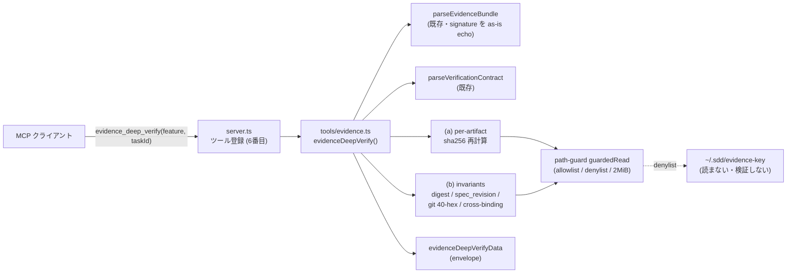

# Design: evidence-deep-verify

Impl-Review-Status: Passed
Feature Type: api-only (read-only MCP tool addition; no frontend/UI)

## Technical Summary

sdd-forge-mcp の既存 evidence モジュール(`mcp/sdd-forge-mcp/src/tools/evidence.ts`、
抽出専用 5 ツール)に 6 番目の read-only ツール `evidence_deep_verify` を新設する。
本ツールは証拠バンドルを**再検証**する: (a) 各 `artifacts[]` を path-guard 経由で
ディスクから読み SHA-256 を再計算して記録値と突合(per-artifact match/mismatch)、
(b) バンドル内部の不変条件 — 正準 artifacts ダイジェスト・`spec_revision`・
`git_commit` 40-hex 形状・contract/report クロスバインド — を host スクリプトと同一式で
再計算・突合する。**署名鍵素材は一切読まず、HMAC/sigstore 署名の暗号検証も行わない**
(`signature` は echo のみ)。git の HEAD/祖先検証は no-exec 境界のため host-deferred とし、
40-hex 形状のみ in-process 検証する(ADR-0008)。実装は `parseEvidenceBundle` /
`parseVerificationContract` / path-guard / envelope を再利用し、応答形状
`evidenceDeepVerifyData` を `contracts/sdd-forge-mcp-tools.v1.schema.json` に加算的に追加する。

## Architecture



- 起動時に副作用なし。ツール呼び出し時にのみバンドルと成果物を読む(既存 5 ツールと同型)。
- git サブプロセス起動なし・ネットワークなし・fs 書込みなし・署名鍵読取なし。全読取は
  path-guard チョークポイント経由(security-spec.md B2)。

## Components

| Component | Responsibility | Technology | New/Existing |
|---|---|---|---|
| `mcp/sdd-forge-mcp/src/tools/evidence.ts` | `evidenceDeepVerify()` 純関数 + `EvidenceDeepVerifyData` interface を追加 | TypeScript | Existing(拡張) |
| `mcp/sdd-forge-mcp/src/server.ts` | `evidence_deep_verify` ツール登録(feature/taskId zod、`toCallToolResult`) | TypeScript + @modelcontextprotocol/sdk | Existing(拡張) |
| `mcp/sdd-forge-mcp/src/parsers/evidence.ts` | `parseEvidenceBundle` / `parseVerificationContract` を再利用(変更なし) | TypeScript | Existing(再利用) |
| `mcp/sdd-forge-mcp/src/parsers/evidence-bundle.ts` | `EvidenceBundle` / `EvidenceArtifact` 型を再利用(変更なし) | TypeScript | Existing(再利用) |
| `mcp/sdd-forge-mcp/src/path-guard.ts` | `guardedRead` / `resolveGuarded`(鍵 denylist 含む、変更なし) | TypeScript | Existing(再利用) |
| `mcp/sdd-forge-mcp/src/envelope.ts` | `ok` / `err` / `Result`(変更なし) | TypeScript | Existing(再利用) |
| `contracts/sdd-forge-mcp-tools.v1.schema.json` | `evidenceDeepVerifyData` を `okEnvelope.data.oneOf` に加算的追加 | JSON Schema | Existing(拡張) |
| `mcp/sdd-forge-mcp/tests/tools/` ほか | ゴールデン/改竄/no-key/静的検査テスト | node:test | New |

## Layer Specifications

| Layer | Summary | Canonical Detail | Owner | Status |
|---|---|---|---|---|
| UX | N/A — no change: GUI なし。消費者は AI クライアントのみ(MCP ツール I/O) | [UX specification](ux-spec.md) | — | N/A |
| Frontend | N/A — no change: フロントエンド UI なし。ランタイム要件のみ記録 | [Frontend specification](frontend-spec.md) | — | N/A |
| Infrastructure | monorepo-nested package(mcp/sdd-forge-mcp)。dist 再ビルド + dist-parity CI・ロールバック | [Infrastructure specification](infra-spec.md#deployment-topology) | 実装タスク担当 | Planned |
| Security | 署名鍵非読取・署名非検証の中心統制(B3)・path-guard チョークポイント(B2)・no-exec/no-write/no-net | [Security specification](security-spec.md#trust-boundaries) | 実装タスク担当 | Planned |

## Cross-Layer Dependencies

| From | To | Contract / Decision | REQ | AC | Verification |
|---|---|---|---|---|---|
| requirements.md | security-spec.md | 署名鍵非読取・署名非検証の硬境界 | REQ-008 | AC-011, AC-014 | TEST-011, TEST-014 |
| requirements.md | design.md(本書「API / Contract Plan」) | 正準 artifacts digest / spec_revision / git 40-hex 式の逐語一致 | REQ-004, REQ-005, REQ-006, REQ-009 | AC-001, AC-006, AC-007, AC-012 | TEST-001, TEST-006, TEST-007, TEST-012 |
| requirements.md | contracts/sdd-forge-mcp-tools.v1.schema.json | `evidenceDeepVerifyData` 加算的追加 | REQ-012 | AC-015 | TEST-015 |
| requirements.md | security-spec.md | path-guard 再利用・例外安全(欠落/巨大) | REQ-011 | AC-004, AC-005 | TEST-004, TEST-005 |

## ADR Change Log

| ADR | Decision | Status | Layer Impact | Supersedes | Date |
|---|---|---|---|---|---|
| ADR-0008 | evidence_deep_verify は署名鍵素材を読まず HMAC/sigstore 署名の暗号検証を行わない。git HEAD/祖先検証も no-exec 境界のため in-process では行わず host-deferred とする(40-hex 形状のみ検証) | Proposed | Security, Infra | none | 2026-07-08 |
| ADR-0009 | deep-verify は host スクリプト(generate/check-evidence-bundle.sh)の正準式(evidence_canonical / compute_spec_revision / git 40-hex ルール)を再発明せず逐語一致で再実装し、ゴールデンで agreement を担保する | Proposed | Security, Infra | none | 2026-07-08 |

## Data Plan

Data Entities: なし(永続データを持たない)。読取対象は
`specs/<feature>/verification/<taskId>.evidence.json`(バンドル)、その `artifacts[].path` /
`quality_report` / `verification_contract` が指す既存ファイル、および
`specs/<feature>/{requirements,design,acceptance-tests}.md`(spec_revision 用)。すべて
path-guard allowlist 配下・read-only。

Existing Data Affected: なし(書込みなし)。

Migration Strategy: 不要(read-only ツール追加)。契約は v1 を維持し `evidenceDeepVerifyData`
を加算的に追加(既存応答形状に影響しない後方互換変更、破壊的変更でない)。

## API / Contract Plan

### ツール: `evidence_deep_verify`(read-only、破壊的操作なし)

- 入力: `{ feature: string, taskId: string }`(既存 5 ツールと同一 zod スキーマ。
  コマンド/パス/引数系フィールドなし)。
- 出力(`evidenceDeepVerifyData`):

```
{
  kind: "evidence-deep-verify",
  feature, taskId,
  verdict: "pass" | "fail",
  artifacts: [
    { path, recordedSha256, computedSha256?, status, reason? }
    // status: "match" | "mismatch" | "missing" | "too-large"
    //       | "path-denied" | "invalid-recorded-sha"
  ],
  invariants: {
    artifactsDigest: { recorded, onDisk, status: "match" | "mismatch" },
    specRevision:   { recorded, computed, status: "match" | "mismatch", filesHashed: string[] },
    gitCommit:      { value, shapeValid: boolean, ancestryVerified: false, reason: string },
    crossBindings:  [ { subject, status: "match" | "mismatch", detail } ]
  },
  signature: { present: boolean, alg?: string, verified: false, note: string },
  failures: string[]
}
```

- verdict は「全 artifacts が `match` かつ artifactsDigest/specRevision が `match` かつ
  gitCommit.shapeValid かつ 全 crossBindings が `match`」のとき `pass`、それ以外 `fail`。
  `gitCommit.ancestryVerified` と `signature.verified` は常に false で **verdict に寄与しない**。
- エラーは既存エンベロープ: 不正 feature/taskId → `invalid-input`、バンドル欠落 →
  `not-found`、JSON 不正 → `cannot-parse`(`parseEvidenceBundle` から伝播)。

### 正準式(host スクリプトから逐語引用 — ADR-0009 の agreement 対象)

**(1) per-artifact sha256**(generate/check の `sha256_file` 等価): 対象ファイルのバイト列を
SHA-256 し 64-hex(小文字)を得る。deep-verify は path-guard `guardedRead` の UTF-8 内容から
`createHash("sha256")` で算出する(既存 `evidence-bundle.ts` の `sha256OfGuardedFile` と同方式)。
記録値は `String(artifact.sha256).trim().toLowerCase()` に正規化して突合する。

**(2) 正準 artifacts ダイジェスト**(`generate-evidence-bundle.sh` / `check-evidence-bundle.sh`
の `evidence_canonical` より逐語):

```python
artifacts = bundle.get("artifacts") or []
pairs = []
for a in artifacts:
    p = str((a or {}).get("path", "")).strip()
    sh = str((a or {}).get("sha256", "")).strip().lower()
    pairs.append(p + "\x00" + sh)
pairs.sort()
artifacts_digest = hashlib.sha256("\n".join(pairs).encode("utf-8")).hexdigest()
```

deep-verify は同式で `artifactsDigest.recorded`(記録 sha256 を使用)と
`artifactsDigest.onDisk`(ディスク再計算 sha256 を使用)を算出し突合する。全成果物一致 ⇔
両ダイジェスト一致。参考: 正準ブロック `evidence_canonical` は次の行連結でもある(署名は
host のみが HMAC する — 本ツールは生成も検証もしない):

```
lines = [ "sdd-evidence-v1", task_id, feature, risk, required_workflow,
          spec_revision, git_commit, dirty_str("true"/"false"),
          review_verdict.verdict, artifacts_digest ]
canonical = "\n".join(lines)
```

**(3) spec_revision**(`generate-evidence-bundle.sh` の `compute_spec_revision` より逐語):

```python
spec_files = [
    abs_root/"specs"/feature/"requirements.md",
    abs_root/"specs"/feature/"design.md",
    abs_root/"specs"/feature/"acceptance-tests.md",
]
hasher = hashlib.sha256(); found_any = False
for spec_file in spec_files:
    if spec_file.exists() and spec_file.is_file():
        hasher.update(open(spec_file, "rb").read()); found_any = True
return hasher.hexdigest() if found_any else ""
```

deep-verify は path-guard 経由でこの順に(存在するもののみ)連結して SHA-256 し、
`bundle.spec_revision` と突合する。`filesHashed[]` に実際に連結したファイルを記録する。

**(4) git_commit 40-hex ルール**(`check-evidence-bundle.sh` より): `git_commit` は
`^[0-9a-f]{40}$` を満たす必要がある。host はさらに `git cat-file -e <c>^{commit}` と
`git merge-base --is-ancestor <c> HEAD`(祖先でなくとも全 artifact ハッシュ一致なら WARNING
許容)を行うが、これらは git サブプロセスを要する。**deep-verify は 40-hex 形状のみを
in-process 検証し、祖先検証は host-deferred**(`ancestryVerified: false`)とする(ADR-0008)。

**(5) クロスバインド**(`check-evidence-bundle.sh` の task_id/feature 整合より): contract の
`task_id == bundle.task_id` / `feature == bundle.feature`、quality_report の `Task ID:` /
`Feature:` が bundle と一致することを突合する。check-contract.sh 等価の contract 内部再検証は
行わない(evidence-bundle.ts simplification #1 と同一の割り切り)。

### 署名の扱い(REQ-008 の中心統制)

`parseEvidenceBundle` は `signature` を as-is で echo する(既存挙動、変更なし)。deep-verify は
その `signature.alg` と存在有無のみを `{ present, alg?, verified: false, note }` として報告し、
**鍵(SDD_EVIDENCE_KEY / SDD_EVIDENCE_KEY_FILE / ~/.sdd/evidence-key)を読まず、HMAC を
一切計算・比較しない**。path-guard は鍵ファイルを denylist 済み(`isDenylisted` /
`evidenceKeyPath`)であり、本ツールはそれ以外の鍵取得経路も持たない。

## Test Strategy

- ゴールデン parity(high リスク・REQ-009): リポジトリ内コミット済みの実バンドル群に対し、
  deep-verify の per-artifact match/mismatch・artifactsDigest・spec_revision・git 40-hex 形状・
  クロスバインド判定が host スクリプトの対応判定と一致することを検証(署名検証・git 祖先を除く)。
- 改竄系(integration): (a) 成果物 1 バイト改竄 → 当該 mismatch + digest 不一致 + fail、
  (b) 記録 `sha256` 改竄 → mismatch、(c) spec ファイル改竄 → specRevision mismatch。
  一時ディレクトリに合成バンドル + 成果物を配置(path-guard allowlist 配下)。
- 例外安全(error-path): 欠落成果物 → `missing`、2 MiB 超過フィクスチャ → `too-large`、
  記録 sha が非 64-hex → `invalid-recorded-sha`。throw せず status 化。
- no-key(security): canary の鍵(`SDD_EVIDENCE_KEY=canary` / ダミー ~/.sdd/evidence-key)を
  設定して deep-verify を呼び、応答・stderr に canary 値が現れず、鍵ファイルが読まれない
  (open 監視 / path-guard denylist)ことをアサート。署名付きバンドルで `verified: false`。
- 静的 read-only / no-exec(既存踏襲): 追加コードに fs 書込み API・`child_process` /
  `exec` / `spawn` / `eval` が無いことを既存 `tests/readonly` の静的検査で確認。
- 契約(ajv): 応答が `evidenceDeepVerifyData` に適合、既存 5 応答形状の適合が不変であることを検証。
- 決定論: 同一入力で 2 回呼び出し `data` がバイト等価。
- スモーク: MCP Inspector CLI `tools/list` に `evidence_deep_verify` が現れる(evidence 6 番目)。

## Deployment / CI Plan

- 対象は **monorepo-nested package** `mcp/sdd-forge-mcp`。配布は ADR-0003(esbuild 単一
  バンドル + dist コミット + dist-parity CI)を踏襲。src 変更後 `dist/index.js` を再ビルドして
  コミットし、CI の dist-parity(再ビルド → diff)で改竄検知する。
- 実行要件は Node.js >= 20 のみ(追加依存なし。crypto は node 標準、git 呼び出しなし)。
- CI: 既存 `.github/workflows/test.yml` の sdd-forge-mcp ジョブに新規テストが相乗り
  (typecheck / node:test / dist-parity)。新規ジョブ追加は不要。
- ロールバック: 契約は加算的追加のため、当該 PR を単一 revert すれば dist ごと旧状態へ戻る
  (ADR-0003 の利点)。既存 5 ツール・既存応答形状は不変で影響を受けない。

## Constraint Compliance

| Requirement Constraint | Design Response |
|---|---|
| 署名鍵非読取・署名非検証(REQ-008) | 鍵取得経路を持たず HMAC を計算しない。path-guard denylist 再利用。静的検査 + no-key テスト(AC-011/014) |
| without external tools / no new exec | git・python 等サブプロセス不使用。git 祖先は host-deferred(ADR-0008)。crypto は node 標準のみ |
| read-only(書込みなし) | fs 書込み API 不使用(静的検査)。全読取 path-guard 経由 |
| host スクリプトとの一致(REQ-009) | evidence_canonical / compute_spec_revision / 40-hex ルールを逐語再実装 + ゴールデン(ADR-0009) |
| 決定論(REQ-010) | 時刻/乱数/ネットワーク/プロセス起動に非依存。同一入力 → 同一出力 |
| 契約後方互換(REQ-012) | `evidenceDeepVerifyData` を oneOf に加算追加、v1 維持 |

## Assumptions

- requirements.md の Assumptions を参照(host スクリプトを正準とする、path-guard allowlist
  前提、「without external tools」= git 祖先は in-process 対象外 = ADR-0008)。
- `parseEvidenceBundle` は `signature` を含むバンドル全体を as-is で返し、鍵を読まない
  (evidence.ts モジュール doc・path-guard denylist で確認済み)。

## Open Questions

### OQ-001: git_commit の HEAD/祖先検証を in-process で行うか

requirements.md OQ-001 と同一。Default = 40-hex 形状のみ in-process 検証、祖先は host-deferred
(`ancestryVerified: false`)。ADR-0008 で決定を記録。

Owner: 実装タスク担当
Blocks Implementation: no(default で解消済み)
Resolution Path: ADR-0008 承認 → 本書「API / Contract Plan」gitCommit 節に反映済み

## Risks

- 正準式のわずかな乖離(空白正規化・改行・ソート順・小文字化)で host と判定が食い違う。
  → 逐語引用 + ゴールデン一致テスト(AC-012)。
- 署名鍵読取経路の誤混入。→ path-guard denylist 再利用 + no-key テスト + 静的検査(三重統制)。
- 巨大/欠落成果物での例外。→ 全経路を per-artifact status に落とす例外安全テスト(AC-004/005)。
