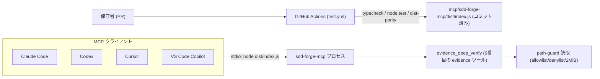
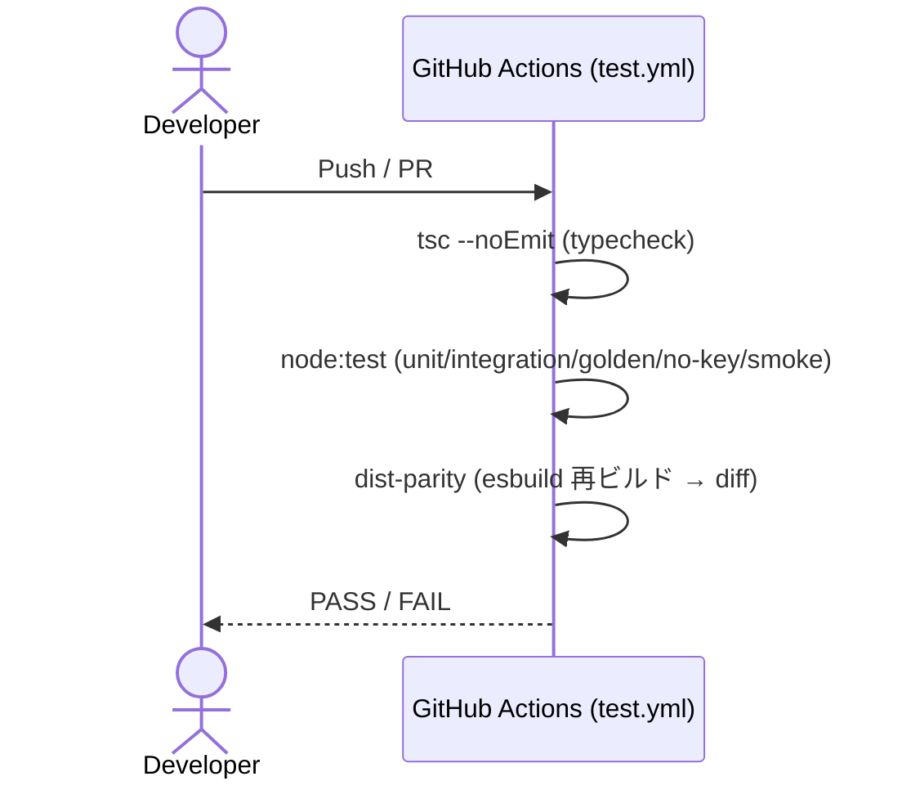

# Infrastructure Specification: evidence-deep-verify

ローカル専用の実行環境(クラウド配備なし)。既存 sdd-forge-mcp
(**monorepo-nested package** `mcp/sdd-forge-mcp/`)の infra 前提を踏襲し、本 feature の
差分(read-only ツール 1 個の追加 + 契約の加算的拡張)を明示する。

## Deployment Topology

- 地域・ネットワーク: なし(全てローカル、ネットワーク通信なし)。git サブプロセスなし。
- 障害ドメイン: MCP プロセス単体。クライアントごとに独立プロセス。
- パッケージ配置: monorepo 内 `mcp/sdd-forge-mcp/`。installer は既存の同 package 配置経路を
  そのまま用いる(本 feature で installer 変更なし)。

## CI/CD Sequence

- 新規 CI ジョブ追加は不要: 既存 sdd-forge-mcp ジョブに新規テストが相乗りする。
- リリースは既存 release.yml のリポジトリ配布に相乗り(dist コミット済み)。

## Environments

| Environment | URL | Auth | Trigger | Classification | Promotion Rule |
|---|---|---|---|---|---|
| local dev | mcp/sdd-forge-mcp/(repo 内) | OS ユーザー | npm run build / test | internal | PR + CI green |
| local usage | <install-root>/mcp/sdd-forge-mcp/ | OS ユーザー | installer 実行(既存経路) | internal | main マージ済みのみ配布 |
| staging / production | N/A | — | — | — | N/A(ローカル専用) |

## Infrastructure as Code

N/A — no cloud: 既存 installer(install.sh / install.ps1)が配置の正準定義。本 feature は
installer を変更しない(ツール追加は同一 dist バンドル内で完結)。Terraform 等は使用しない。

## Scaling Strategy

N/A — 単一ユーザー・ステートレス・read-only。deep-verify はツール呼び出しごとにバンドルと
成果物を path-guard 経由で読むのみ。成果物読取は path-guard の 2 MiB 上限で個々に上限化され、
git/network/subprocess を用いないため外部律速はない。

## Service Level Objectives

| Signal | Numeric Target | Window | Measurement | Error-Budget Action | AC |
|---|---:|---|---|---|---|
| ツール応答 p95(典型バンドル、数〜十数成果物) | <= 300 ms | テスト実行 | unit/integration 計測 | 回帰調査 | AC-001 |
| 決定論(同一入力の再現性) | 100% バイト等価 | 毎回 | unit(2 回呼び出し比較) | 回帰調査 | AC-013 |
| dist-parity | 一致 | PR ごと | CI | ビルド差分調査 | — |

## Data Residency and Retention

| Entity | Residency | Retention | Backup | Deletion Verification | REQ | AC |
|---|---|---|---|---|---|---|
| 再計算 sha256 / ダイジェスト / 応答 | プロセスメモリのみ | 応答限り(保持しない) | なし | プロセス終了 | REQ-010 | AC-013 |
| バンドル・成果物・spec・contract・report | リポジトリ内(ユーザー所有) | ユーザー管理 | 変更しない(read-only) | — | REQ-011 | AC-001 |
| 署名鍵素材 | ユーザーホーム | 読まない | — | — | REQ-008 | AC-011 |

## Observability

| Logs | Traces | Metrics | Alert | Owner | Runbook |
|---|---|---|---|---|---|
| stderr JSON 診断(起動時 + 致命エラーのみ)。鍵値・環境変数値・パス全文を含めない(REQ-008 / AC-011) | N/A | N/A | N/A | 利用者 | USERGUIDE の evidence ツール節 |

## Cost Estimate

N/A — ローカル実行のみ(クラウドコストなし)。

## Rollback

- トリガー: dist-parity 失敗、deep-verify の誤判定報告(host との乖離)、契約適合違反。
- 手順: 契約は加算的追加(`evidenceDeepVerifyData` を oneOf に追加)のため、当該 PR を
  単一 revert すれば dist ごと旧状態へ戻る(ADR-0003 方式)。既存 5 ツール・既存応答形状は
  不変で影響を受けない。
- 最大ロールバック時間: revert + 再インストールで 10 分以内。
- 検証: golden parity(AC-012)と契約適合(AC-015)を再実行して green を確認。

## Open Questions

- なし(OQ-001 は design.md / ADR-0008 管理。infra への影響は「git サブプロセスを用いない」
  = 外部依存が増えない、という形でむしろ簡素化に寄与)。
