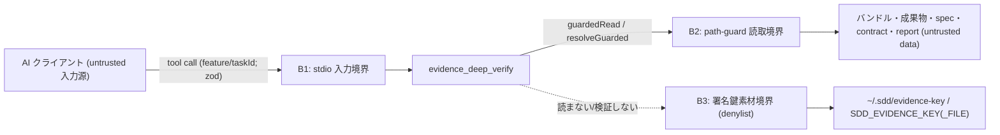

# Security Specification: evidence-deep-verify

read-only な証拠バンドル再検証ツールのセキュリティ仕様。中心的統制は
**署名鍵素材の非読取・署名の非検証(NO-KEY / NO-SIGNATURE-VERIFY)** であり、
path-guard チョークポイント再利用・no-exec/no-write/no-network 境界がこれを支える。
REQ-NNN / AC-NNN は requirements.md / acceptance-tests.md の正準 ID を参照する。

## Trust Boundaries

| Boundary | Source | Destination | Assets | Validation | AuthN/AuthZ | REQ | AC |
|---|---|---|---|---|---|---|---|
| B1 | MCP クライアント | evidence_deep_verify | ツール入力(feature/taskId) | zod(既存 5 ツールと同一。コマンド/パス/引数フィールドなし) | なし(OS ユーザー境界) | REQ-001 | AC-015 |
| B2 | evidence_deep_verify | ファイルシステム | バンドル・成果物・spec・contract・report | path-guard allowlist / denylist / 2 MiB / realpath。読取内容は untrusted data として扱い実行・評価しない | OS ユーザー権限 | REQ-002, REQ-011 | AC-004, AC-005 |
| B3 | evidence_deep_verify | 署名鍵素材 | HMAC/sigstore 鍵 | **読取禁止**(path-guard denylist + 鍵取得経路を実装しない)・署名は検証しない | — | REQ-008 | AC-011, AC-014 |

## STRIDE Analysis

| Boundary | Threat | STRIDE | Abuse Case | Mitigation | Verification | REQ-NNN | AC-NNN |
|---|---|---|---|---|---|---|---|
| B1 | 入力経由の path traversal / 絶対パス | Tampering | feature/taskId に `../` や絶対パスを混入し allowlist 外を読ませる | 入力は feature/taskId のみ・path-guard の shape 検査(絶対/`..`/バックスラッシュ拒否) | TEST-015 | REQ-001, REQ-011 | AC-015 |
| B2 | 成果物差替え / 記録ハッシュ改竄の看過 | Tampering | 差し替えた成果物や改竄ハッシュを pass と誤判定させる | ディスク再計算 sha256 突合 + 正準 artifacts ダイジェスト突合(host 式と逐語一致) | TEST-002, TEST-003, TEST-012 | REQ-002, REQ-004, REQ-009 | AC-002, AC-003, AC-012 |
| B2 | 巨大/欠落成果物による例外・DoS | Denial of Service | 2 MiB 超・欠落ファイルで応答を壊す/読取を暴走 | path-guard の 2 MiB 上限・存在検査、per-artifact status 化(throw しない) | TEST-004, TEST-005 | REQ-011 | AC-004, AC-005 |
| B2 | 制御文字/巨大内容による情報汚染 | Tampering | バンドル JSON / report に制御文字・巨大値を仕込む | 読取内容は data として扱い eval しない。sha256 化・JSON エンコード。2 MiB 上限 | TEST-005 | REQ-010, REQ-011 | AC-005 |
| B3 | 署名鍵素材の読取・漏えい | Information Disclosure | deep-verify に鍵を読ませ応答/ログへ漏らす | 鍵取得経路を実装しない + path-guard denylist(`isDenylisted` / `evidenceKeyPath`)+ no-key テスト + 静的検査 | TEST-011, TEST-014 | REQ-008 | AC-011, AC-014 |
| B3 | 署名の偽検証(false verified) | Spoofing / Repudiation | 未検証なのに verified を主張し不正バンドルを通す | `verified: false` 固定・署名の有無/妥当性は verdict に非寄与・HMAC を計算しない | TEST-011 | REQ-008 | AC-011 |
| B2 | git 祖先の誤主張 | Repudiation | in-process で祖先検証したかのように偽装 | `ancestryVerified: false` 固定・host-deferred を reason で明示・git サブプロセス不起動(静的 no-exec) | TEST-008, TEST-014 | REQ-006, REQ-008 | AC-008, AC-014 |

## Authentication Flow

N/A — 認証機構なし。stdio 接続はクライアントプロセスの子プロセスとして OS ユーザー境界内で
完結する(既存 sdd-forge-mcp と同一前提)。ネットワーク待受なし。

## Authorization

| Actor / Role | Resource | Action | Decision Point | Default | Denial Evidence | REQ | AC |
|---|---|---|---|---|---|---|---|
| MCP クライアント | 証拠バンドル・成果物・spec・contract・report | read | path-guard allowlist | deny(allowlist 外) | path-denied エラー / per-artifact `path-denied` | REQ-011 | AC-005 |
| MCP クライアント | 署名鍵素材 | read | path-guard denylist + 経路不在 | deny | 静的検査 + no-key テスト | REQ-008 | AC-011, AC-014 |
| MCP クライアント | 署名の暗号検証 | verify | 提供しない(host 責務) | deny(`verified: false`) | no-key テスト | REQ-008 | AC-011 |
| MCP クライアント | コマンド実行 / git / fs 書込み | execute/write | 提供しない | deny | 静的検査(no-exec/no-write) | REQ-011 | AC-014 |

## Data Classification and Protection

| Entity | Classification | At Rest | In Transit | Retention | Deletion | Access Log | REQ | AC |
|---|---|---|---|---|---|---|---|---|
| バンドル・成果物・spec・contract・report | internal(ユーザー所有・untrusted data) | リポジトリ内 | stdio(ローカル IPC) | 保持しない | プロセス終了 | なし | REQ-002 | AC-001 |
| 署名鍵素材 | restricted(**扱わない**) | ユーザーホーム | 応答・ログに含めない | — | — | — | REQ-008 | AC-011 |
| 再計算 sha256 / ダイジェスト | internal | 保持しない(応答のみ) | stdio | 応答限り | プロセス終了 | なし | REQ-004 | AC-002 |

## OWASP Mapping

| OWASP Risk | Exposure | Control | Verification | Owner |
|---|---|---|---|---|
| Cryptographic Failures | 署名検証の誤実装・鍵漏えい | 署名検証を行わない・鍵を読まない(host 責務)・`verified: false` | TEST-011, TEST-014 | 実装タスク担当 |
| Broken Access Control | allowlist 外 / 鍵 / fs 書込みの誤露出 | path-guard allowlist/denylist・書込み/exec API 静的禁止 | TEST-005, TEST-014 | 実装タスク担当 |
| Injection | 入力 → パス/コマンド | feature/taskId のみ・path-guard shape 検査・サブプロセス不使用 | TEST-015, TEST-014 | 実装タスク担当 |
| Software & Data Integrity Failures | 成果物差替え/ハッシュ改竄/spec ドリフトの看過 | ディスク突合 + 正準式再計算(host 逐語一致 + ゴールデン) | TEST-002, TEST-003, TEST-006, TEST-012 | 実装タスク担当 |
| Security Logging & Monitoring | ログへの秘密混入 | stderr 診断のみ・canary grep(no-secrets) | TEST-011 | 実装タスク担当 |

## Secrets Management

- 本ツールは秘密情報(署名鍵)を**保持・読取・出力しない**。鍵取得経路
  (`SDD_EVIDENCE_KEY` / `SDD_EVIDENCE_KEY_FILE` / `~/.sdd/evidence-key`)を実装せず、
  path-guard は既に鍵ファイルを denylist 済み(`DENYLISTED_BASENAMES` / `evidenceKeyPath` /
  realpath 比較)であり、これを再利用する。
- `signature` はバンドル JSON に含まれる alg / value を `parseEvidenceBundle` が as-is で
  echo するが、deep-verify は **alg と存在有無のみ**を報告し value を検証に使わない。
- ログ(stderr)は起動診断・致命エラーのみで、鍵値・環境変数値・パス全文を含めない
  (no-secrets canary 検査対象、AC-011)。

## SBOM and Supply Chain

- 追加依存なし(SHA-256 は node 標準 `node:crypto`。git/python 呼び出しなし)。
  package-lock.json は sdd-forge-mcp の既存運用を維持。
- dist-parity CI により、コミット済みバンドルが宣言された src から再現可能であることを
  保証(改竄検知。ADR-0003)。

## Security Tests

| Test | Boundary | Attack / Control | Expected Result | Evidence | AC |
|---|---|---|---|---|---|
| TEST-011 | B3 | canary 鍵設定下で署名付きバンドルを deep-verify | `verified: false`・鍵ファイル未読取・応答/stderr に canary 不在 | mcp/sdd-forge-mcp/tests/no-secrets/ | AC-011 |
| TEST-014 | B2/B3 | 追加コードの静的検査 | fs 書込み・child_process/exec/spawn/eval・鍵読取経路が 0 件、読取は path-guard 経由のみ | mcp/sdd-forge-mcp/tests/readonly/ | AC-014 |
| TEST-002/003 | B2 | 成果物改竄 / 記録ハッシュ改竄 | mismatch + fail、host 判定と一致 | mcp/sdd-forge-mcp/tests/tools/ | AC-002, AC-003 |
| TEST-005 | B2 | 2 MiB 超 / allowlist 外成果物 | `too-large` / `path-denied` status、throw しない | mcp/sdd-forge-mcp/tests/error-paths/ | AC-005 |
| TEST-008 | B2 | 外部 40-hex コミット | `ancestryVerified: false` + git 不起動 | mcp/sdd-forge-mcp/tests/tools/, tests/readonly/ | AC-008 |
| TEST-012 | B2 | host スクリプトとの一致 | 署名・git 祖先を除き判定一致 | mcp/sdd-forge-mcp/tests/golden/ | AC-012 |

## Open Questions

- なし(OQ-001 = git 祖先検証の in-process 可否は design.md / ADR-0008 管理。セキュリティ上は
  「祖先を in-process 検証しない・偽 verified を主張しない」原則で境界が閉じている)。
