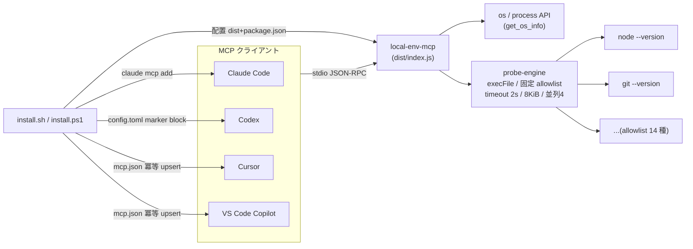

# Design: local-env-mcp

Impl-Review-Status: Pending
Feature Type: api-only (read-only MCP server + installer 拡張; no frontend/UI)

## Technical Summary

`mcp/local-env-mcp/` に sdd-forge-mcp と同型の TypeScript + MCP SDK(stdio)
サーバーを新設する。環境情報は (a) `os` / `process` 標準 API、(b) コンパイル時
固定 allowlist に対する `execFile` バージョンプローブ、の 2 経路のみから取得し、
ファイルシステム読み書き・shell 起動・ユーザー指定コマンドの実行は行わない。
配布は ADR-0003(esbuild 単一バンドル + dist コミット + dist-parity CI)を踏襲。
installer(sh/ps1)は `VALID_MCPS` を複数 MCP 対応に拡張し、新たに Cursor
(`~/.cursor/mcp.json`)と VS Code(ユーザープロファイル `mcp.json`)への
冪等 JSON upsert 登録を追加する。

## Architecture

- サーバーは起動時に一切の環境スキャンを行わず、ツール呼び出し時にのみ
  プローブを実行する(起動 <= 1 s SLO 維持)。
- プローブ結果はプロセス内 TTL キャッシュ(60 秒)で再利用し、連続呼び出しでの
  多重プロセス起動を抑制する(キャッシュは per-entry、無効化 API なし)。

## Components

| Component | Responsibility | Technology | New/Existing |
|---|---|---|---|
| `mcp/local-env-mcp/src/index.ts` | エントリポイント・stdio transport 起動 | TypeScript + @modelcontextprotocol/sdk | New |
| `mcp/local-env-mcp/src/server.ts` | McpServer 構築・3 ツール登録 | 同上 | New |
| `mcp/local-env-mcp/src/envelope.ts` | Result エンベロープ(sdd-forge-mcp と同一構造) | TypeScript | New(sdd-forge-mcp から複製) |
| `mcp/local-env-mcp/src/allowlist.ts` | プローブ対象のコンパイル時定数テーブル(名前・コマンド・引数・出力 stream) | TypeScript(`as const`) | New |
| `mcp/local-env-mcp/src/probe-engine.ts` | execFile プローブ実行(timeout / 出力上限 / 並列上限 / kill / 正規化 / TTL キャッシュ) | node:child_process execFile | New |
| `mcp/local-env-mcp/src/tools/env.ts` | `get_os_info` / `get_toolchain_versions` / `list_available_clis` | TypeScript + zod | New |
| `contracts/local-env-mcp-tools.v1.schema.json` | 全ツール応答の JSON Schema 契約 | JSON Schema | New |
| `install.sh` / `install.ps1` | VALID_MCPS 拡張 + Cursor / VS Code 登録関数 | bash 3.2 / PowerShell | Existing(拡張) |
| `uninstall.sh` / `uninstall.ps1` | Cursor / VS Code 登録解除 + 配置削除 | bash 3.2 / PowerShell | Existing(拡張) |
| `.github/workflows/test.yml` | local-env-mcp のテスト + dist-parity 追加 | GitHub Actions | Existing(拡張) |

## Layer Specifications

| Layer | Summary | Canonical Detail | Owner | Status |
|---|---|---|---|---|
| UX | N/A — no change: GUI なし。消費者は AI クライアントと installer CLI のみ | [UX specification](ux-spec.md) | — | N/A |
| Frontend | N/A — no change: フロントエンド UI なし。ランタイム要件のみ記録 | [Frontend specification](frontend-spec.md) | — | N/A |
| Infrastructure | ローカル実行のみ。esbuild バンドル配布・CI dist-parity・installer 配置/登録 | [Infrastructure specification](infra-spec.md#deployment-topology) | 実装タスク担当 | Planned |
| Security | 実行機能非提供境界(B2)・秘密情報非漏えい・IDE 設定ファイル保全(B3) | [Security specification](security-spec.md#trust-boundaries) | 実装タスク担当 | Planned |

## Cross-Layer Dependencies

| From | To | Contract / Decision | REQ | AC | Verification |
|---|---|---|---|---|---|
| requirements.md | security-spec.md | 固定 allowlist プローブのみ・入力からコマンドへの経路なし | REQ-003 | AC-003, AC-006 | TEST-003, TEST-006 |
| requirements.md | infra-spec.md | ADR-0003 準拠の dist 配布 + dist-parity CI | REQ-006 | AC-008 | TEST-008 |
| security-spec.md | infra-spec.md | installer は IDE 設定の他エントリを破壊しない(冪等 upsert) | REQ-008, REQ-009 | AC-010, AC-011, AC-015 | TEST-010, TEST-011, TEST-015 |
| requirements.md | contracts/local-env-mcp-tools.v1.schema.json | 全応答のエンベロープ契約 | REQ-004 | AC-001, AC-002, AC-004 | TEST-001, TEST-002, TEST-004 |

## ADR Change Log

| ADR | Decision | Status | Layer Impact | Supersedes | Date |
|---|---|---|---|---|---|
| ADR-0004 | local-env-mcp は実行機能を提供せず、コンパイル時固定 allowlist への execFile プローブのみで環境情報を取得する | Proposed | Security, Infra | none | 2026-07-05 |
| ADR-0005 | Cursor / VS Code への MCP 登録は installer による設定ファイルへの冪等 JSON upsert(Node 実行)で行う | Proposed | Infra, Security | none | 2026-07-05 |

## Data Plan

Data Entities: なし(永続データを持たない)。プローブ結果のプロセス内 TTL
キャッシュ(60 秒)のみで、プロセス終了で消滅する。

Existing Data Affected: `~/.cursor/mcp.json`、VS Code ユーザープロファイル
`mcp.json`、`~/.codex/config.toml`(installer が管理キーのみ upsert / 削除)。

Migration Strategy: 不要(新規 feature)。IDE 設定ファイルは変更前の他エントリを
保持することをテストで保証(AC-010 / AC-011 / AC-012)。壊れた JSON は上書き
しない(AC-015、フェイルセーフ)。

## API / Contract Plan

- MCP ツール 3 種(いずれも read-only、破壊的操作なし):
  - `get_os_info`(入力なし)→ `{ kind: "os-info", platform, arch, osType,
    osRelease, cpuCount, totalMemBytes, nodeRuntime }`
  - `get_toolchain_versions`(入力: `names?: string[]`、allowlist 名 enum)→
    `{ kind: "toolchain-versions", entries: [{ name, available, version?,
    probeError? }] }`
  - `list_available_clis`(入力: なし)→ `{ kind: "cli-availability",
    entries: [{ name, available }] }`
- エラーエンベロープは sdd-forge-mcp と同一構造(`ok`/`data` | `ok`/`error`)。
  error code enum も同一の 7 種を用いる(local-env-mcp で主に使うのは
  `invalid-input` / `cannot-determine`。`path-denied` 等は契約互換のため enum に
  残すが発行しない)。
- 契約は `contracts/local-env-mcp-tools.v1.schema.json`(v1)。破壊的変更は
  v2 + 新 ADR を要する(sdd-forge-mcp と同じ規約)。
- プローブ allowlist(コンパイル時定数、v1 で固定):
  node / npm / pnpm / yarn / bun / deno / git / gh / python3 / go / rustc /
  cargo / java / docker。各エントリは `{ name, command, args, versionStream }`
  を持つ(例: java は `-version` + stderr)。追加は契約のマイナー互換変更として
  扱う(enum 拡張)。
- installer 登録形式:
  - Cursor: `~/.cursor/mcp.json` → `{ "mcpServers": { "<name>": { "command":
    "node", "args": ["<install-root>/mcp/<name>/dist/index.js"] } } }`
  - VS Code: ユーザープロファイル `mcp.json`(macOS:
    `~/Library/Application Support/Code/User/mcp.json`、Linux:
    `~/.config/Code/User/mcp.json`、Windows: `%APPDATA%\Code\User\mcp.json`)→
    `{ "servers": { "<name>": { "type": "stdio", "command": "node", "args":
    [...] } } }`
  - 正確なパス・スキーマは OQ-001 として実装タスク冒頭で公式ドキュメントと
    突合し、差異があれば本節を更新する。

## Test Strategy

- TDD(high リスクタスク): probe-engine と入力スキーマ境界は Red→Green
  evidence を記録する。
- 単体/スナップショット: ツール応答の契約準拠(ajv で schema 検証)。
- error-path: フェイク CLI フィクスチャ(sleep する偽コマンド・大量出力の
  偽コマンドを PATH 先頭の一時ディレクトリに置く)で timeout / 出力上限 / kill
  を検証。テストフィクスチャ自体が「実行」を伴うのはテストコード側のみで、
  src 側は execFile 固定テーブルのまま。
- no-secrets: canary 環境変数 + 応答/`stderr` の grep(AC-005)。
- 静的 read-only 検査: sdd-forge-mcp の `tests/readonly/static-check` を踏襲し、
  さらに `child_process` の `exec` / shell オプション使用を禁止パターンに追加。
- installer: `tests/install.tests.sh` / `.ps1` の既存ハーネス(HOME 隔離)に
  Cursor / VS Code 登録・冪等性・壊れ JSON・uninstall ケースを追加。
- スモーク: MCP Inspector CLI で `tools/list`(AC-007)。
- CI: `.github/workflows/test.yml` に local-env-mcp の typecheck / test /
  dist-parity ジョブを追加(sdd-forge-mcp と同型)。

## Security Boundaries

| Trust Boundary | Auth/Authz Mechanism | Data Classification | OWASP Concerns |
|---|---|---|---|
| B1: MCP クライアント ↔ サーバー(stdio) | なし(OS ユーザー境界) | internal | Injection(入力スキーマで遮断) |
| B2: サーバー ↔ OS プロセス起動 | コンパイル時 allowlist + execFile(shell なし) | internal(出力は untrusted) | Command Injection / DoS |
| B3: installer ↔ IDE 設定ファイル | ユーザー権限・管理キーのみ upsert | internal | データ破壊(フェイルセーフで防止) |

Detailed controls: [Security specification](security-spec.md#trust-boundaries)。

## Deployment / CI Plan

- 配布: ADR-0003 と同一。`mcp/local-env-mcp/dist/index.js` をコミットし、
  installer が `dist/*` + `package.json` の最小ペイロードを配置。
- installer は `place_mcp_servers()` / `Install-McpServerPayloads` の既存ループを
  複数 MCP 対応のまま利用(ディレクトリ名で汎化済みか確認し、ハードコードが
  あれば汎化する)。
- CI: test.yml に local-env-mcp ジョブ追加。dist-parity は sdd-forge-mcp と同じ
  「再ビルド → diff」方式。
- ロールバック: 単一 revert で dist ごと戻る(ADR-0003 の利点)。installer 変更も
  同一 PR に含め、revert 単位を揃える。

## Constraint Compliance

| Requirement Constraint | Design Response |
|---|---|
| 実行機能を持たない(Issue #64 承認済み決定) | ツール入力にコマンド・引数・パス系フィールドなし(zod スキーマ + 静的検査 AC-003/AC-006)。プローブはコンパイル時定数テーブルのみ |
| read-only(書込みなし) | fs 書込み API 不使用を静的検査。ツール経路では fs 読み取りも不使用 |
| ADR-0003 踏襲 | esbuild 単一バンドル + dist コミット + dist-parity CI + Node >= 20 |
| install 時選択可・デフォルト同梱 | 既存 `--mcp` / `--skip-mcp` 機構に `local-env-mcp` を追加、`MCP_LIST` 既定に含める |
| 秘密情報非漏えい | 環境変数値・ユーザー名・ホスト名・ホームパス・PATH 全文を応答/ログに含めない(AC-005) |

## Assumptions

- requirements.md の Assumptions を参照(Cursor / VS Code 設定パス、
  「実行機能なし」の解釈 = ADR-0004)。
- installer の既存 MCP 機構(VALID_MCPS / MCP_LIST / mcp_selected /
  place_mcp_servers)は名前追加で複数 MCP に対応できる設計になっている
  (install.sh:18-21, 288-296, 320-339 で確認済み)。

## Open Questions

### OQ-001: Cursor / VS Code の MCP 設定ファイルの正確なパスとスキーマ

requirements.md OQ-001 と同一。実装タスク(installer 拡張タスク)冒頭で公式
ドキュメントを確認し、本書「API / Contract Plan」の登録形式を確定させる。

Owner: installer 拡張タスク担当
Blocks Implementation: no(該当タスク冒頭で解消。サーバー実装タスクには影響しない)
Resolution Path: Cursor / VS Code 公式ドキュメント確認 → 本節更新 → 実装

## Risks

- probe-engine の欠陥(kill 漏れ・出力無制限)はリソース枯渇(DoS)に繋がる。
  → error-path テスト(AC-004)と並列上限で緩和。
- installer の JSON 操作ミスはユーザーの IDE 設定を破壊する。→ 冪等 upsert +
  他エントリ保持 + 壊れ JSON フェイルセーフをテスト必須(AC-010/011/015)。
- VS Code の mcp.json 仕様変更(比較的新しい機能)。→ OQ-001 の確認手順で吸収。
  手動登録手順もドキュメント化して自動登録失敗時の代替を用意(REQ-011)。
