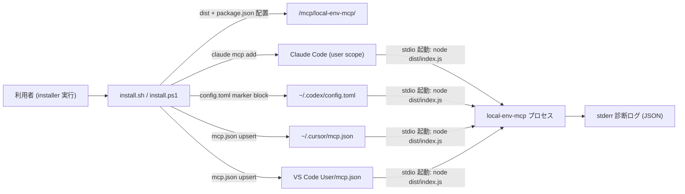
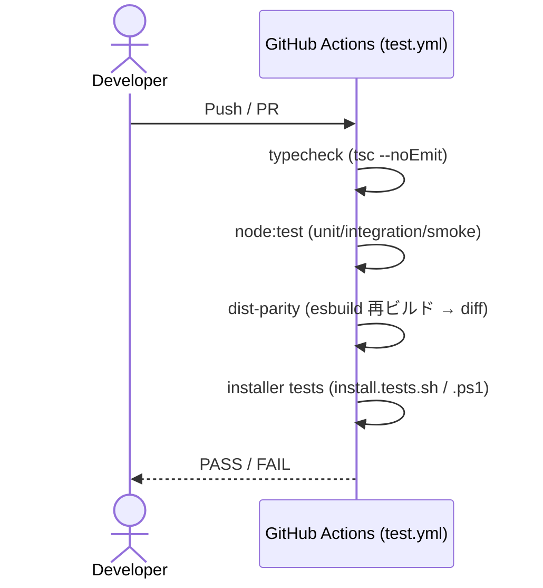

# Infrastructure Specification: local-env-mcp

ローカル専用の実行環境(クラウド配備なし)。sdd-forge-mcp の infra-spec と同じ
前提を踏襲し、差分(installer の Cursor / VS Code 登録)を明示する。

## Deployment Topology

- 地域・ネットワーク: なし(全てローカル、ネットワーク通信なし)。
- 障害ドメイン: MCP プロセス単体。クライアントごとに独立プロセス。

## CI/CD Sequence

リリースは既存 release.yml のリポジトリ配布に相乗り(dist コミット済みのため
追加ビルド工程なし)。

## Environments

| Environment | URL | Auth | Trigger | Classification | Promotion Rule |
|---|---|---|---|---|---|
| local dev | mcp/local-env-mcp/(repo 内) | OS ユーザー | npm run build / test | internal | PR + CI green |
| local usage | <install-root>/mcp/local-env-mcp/ | OS ユーザー | installer 実行 | internal | main マージ済みのみ配布 |
| staging / production | N/A | — | — | — | N/A(ローカル専用) |

## Infrastructure as Code

N/A — no cloud: installer スクリプト(install.sh / install.ps1 / uninstall.*)
が配置・登録の正準定義(REQ-007〜REQ-010)。Terraform 等は使用しない。

## Scaling Strategy

N/A — 単一ユーザー・ステートレス。プローブの並列上限 4・タイムアウト 2 秒・
TTL キャッシュ 60 秒でプロセス起動数を抑制(REQ-003、DoS 緩和)。

## Service Level Objectives

| Signal | Numeric Target | Window | Measurement | Error-Budget Action | AC |
|---|---:|---|---|---|---|
| サーバー起動時間 | <= 1 s | 毎回 | smoke テスト | 回帰調査 | AC-007 |
| ツール応答 p95(キャッシュ有効時) | <= 100 ms | テスト実行 | unit テスト計測 | 回帰調査 | AC-001 |
| ツール応答上限(全プローブ cold) | <= 10 s(2s × 並列制約) | テスト実行 | integration | timeout 見直し | AC-002, AC-004 |

## Data Residency and Retention

| Entity | Residency | Retention | Backup | Deletion Verification | REQ | AC |
|---|---|---|---|---|---|---|
| プローブ結果キャッシュ | プロセスメモリのみ | TTL 60 秒 / プロセス終了で消滅 | なし | プロセス終了 | REQ-003 | AC-002 |
| IDE 設定ファイル(mcp.json 等) | ユーザーホーム | ユーザー管理 | installer は変更前に他エントリ保持を保証 | uninstall テスト | REQ-008〜010 | AC-010〜012, AC-015 |

## Observability

| Logs | Traces | Metrics | Alert | Owner | Runbook |
|---|---|---|---|---|---|
| stderr JSON 診断(起動時 1 行 + 致命エラー)。環境変数値・ユーザー名・ホスト名・ホームパスを含めない(REQ-005) | N/A | N/A | N/A | 利用者 | USERGUIDE の troubleshooting 節(REQ-011) |

installer の通知メッセージ(登録成功 / クライアント未導入スキップ / 壊れ JSON
エラー)は AC-010 / AC-011 / AC-015 の検証対象。

## Cost Estimate

N/A — ローカル実行のみ(クラウドコストなし)。

## Rollback

- トリガー: dist-parity 失敗、installer による IDE 設定破壊の報告、
  プローブ暴走(kill 漏れ)。
- 手順: 該当 PR を単一 revert(dist 含む、ADR-0003 方式)→ installer 再実行で
  旧構成を再登録。uninstall.sh / .ps1 で登録エントリの手動除去も可能(REQ-010)。
- 最大ロールバック時間: revert + 再インストールで 10 分以内。
- 検証: `tests/install.tests.sh` の冪等ケース + AC-012 の uninstall ケースを
  再実行して green を確認。

## Open Questions

- なし(OQ-001 は design.md 管理。installer 実装タスク冒頭で解消)
