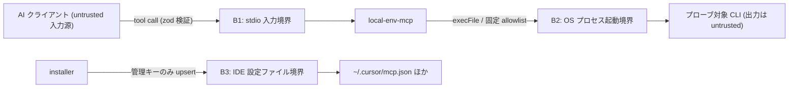

# Security Specification: local-env-mcp

実行機能を提供しない read-only 環境情報サーバー、および installer の IDE 設定
ファイル操作のセキュリティ仕様。REQ-NNN / AC-NNN は requirements.md /
acceptance-tests.md の正準 ID を参照する。

## Trust Boundaries

| Boundary | Source | Destination | Assets | Validation | AuthN/AuthZ | REQ | AC |
|---|---|---|---|---|---|---|---|
| B1 | MCP クライアント | local-env-mcp | ツール入力 | zod スキーマ(enum のみ、コマンド/引数/パス系フィールドなし) | なし(OS ユーザー境界) | REQ-003 | AC-003 |
| B2 | local-env-mcp | OS プロセス | プローブ実行・出力 | コンパイル時 allowlist / execFile(shell なし)/ timeout / 出力上限 | OS ユーザー権限 | REQ-003 | AC-004, AC-006 |
| B3 | installer | IDE 設定ファイル | mcp.json / config.toml | JSON parse 検証・管理キーのみ upsert・壊れ JSON は不変更 | ユーザー権限 | REQ-008〜010 | AC-010, AC-011, AC-015 |

## STRIDE Analysis

| Boundary | Threat | STRIDE | Abuse Case | Mitigation | Verification | REQ-NNN | AC-NNN |
|---|---|---|---|---|---|---|---|
| B1 | 入力経由のコマンド注入 | Tampering | `names` に `"; rm -rf ~"` 等を渡しプローブへ流し込む | 入力は allowlist 名 enum のみ。コマンド・引数へ到達する経路が型レベルで存在しない | TEST-003 | REQ-003 | AC-003 |
| B1 | 過大リクエストによる資源枯渇 | Denial of Service | 連続 tool call で probe プロセスを大量起動 | 並列上限 4 + TTL キャッシュ 60 秒 + per-probe timeout | TEST-004 | REQ-003 | AC-004 |
| B2 | PATH 上の偽装バイナリ | Spoofing / Elevation | 攻撃者が PATH 先頭に偽 `node` を置きプローブに実行させる | プローブはクライアントと同一権限で、出力を untrusted data として扱い実行・評価しない。出力上限・timeout で暴走を抑止。境界はクライアント環境の信頼に帰着(残余リスクとして文書化) | TEST-004, TEST-006 | REQ-003 | AC-004, AC-006 |
| B2 | プローブ出力による情報汚染 | Tampering | 偽 CLI が巨大出力・制御文字を返す | 8 KiB 上限・先頭行のみ・200 文字正規化・JSON エンコード | TEST-004 | REQ-003, REQ-005 | AC-002, AC-004 |
| B2 | 環境変数・PII の漏えい | Information Disclosure | 応答/ログに PATH 全文・HOME・ユーザー名・canary env が混入 | 応答スキーマに該当フィールドなし + no-secrets テスト(canary grep) | TEST-005 | REQ-005 | AC-005 |
| B3 | IDE 設定の破壊 | Tampering | upsert 失敗で他 MCP エントリが消える | 管理キーのみ更新・他エントリ保持・壊れ JSON は不変更でエラー通知 | TEST-010, TEST-011, TEST-015 | REQ-008〜010 | AC-010, AC-011, AC-015 |
| B3 | 悪意ある登録エントリの混入 | Repudiation / Tampering | installer 以外が書いたエントリを uninstall が誤削除 | uninstall は installer 管理名(sdd-forge-mcp / local-env-mcp)のみ削除 | TEST-012 | REQ-010 | AC-012 |

## Authentication Flow

N/A — 認証機構なし。stdio 接続はクライアントプロセスの子プロセスとして OS
ユーザー境界内で完結する(sdd-forge-mcp と同一の前提)。ネットワーク待受なし。

## Authorization

| Actor / Role | Resource | Action | Decision Point | Default | Denial Evidence | REQ | AC |
|---|---|---|---|---|---|---|---|
| MCP クライアント | 環境情報(OS/バージョン) | read | ツール定義(3 種のみ公開) | deny(未定義ツールなし) | tools/list スモーク | REQ-002 | AC-007 |
| MCP クライアント | コマンド実行 | execute | 提供しない(ツール自体が存在しない) | deny | 静的検査 + 入力スキーマ検査 | REQ-003 | AC-003, AC-006 |
| MCP クライアント | ファイルシステム | read/write | 提供しない | deny | 静的検査 | REQ-001 | AC-006 |

## Data Classification and Protection

| Entity | Classification | At Rest | In Transit | Retention | Deletion | Access Log | REQ | AC |
|---|---|---|---|---|---|---|---|---|
| OS 情報・バージョン文字列 | internal | 保存しない(メモリ TTL 60 秒) | stdio(ローカル IPC) | 60 秒 | プロセス終了 | なし | REQ-002 | AC-001 |
| 環境変数値・ユーザー名・ホスト名・ホームパス | restricted(扱わない) | — | 応答・ログに含めない | — | — | — | REQ-005 | AC-005 |
| IDE 設定ファイル | internal(ユーザー所有) | ユーザーホーム | — | ユーザー管理 | uninstall で管理エントリのみ除去 | installer 出力 | REQ-008〜010 | AC-010〜012 |

## OWASP Mapping

| OWASP Risk | Exposure | Control | Verification | Owner |
|---|---|---|---|---|
| Injection | ツール入力 → プローブ | enum 入力のみ・execFile(shell なし)・固定テーブル | TEST-003, TEST-006 | 実装タスク担当 |
| Broken Access Control | 実行/FS ツールの誤公開 | ツール 3 種のみ・静的検査で書込み/exec API 禁止 | TEST-006, TEST-007 | 実装タスク担当 |
| Security Misconfiguration | IDE 設定の破壊・重複登録 | 冪等 upsert・壊れ JSON フェイルセーフ | TEST-010, TEST-011, TEST-015 | 実装タスク担当 |
| Vulnerable Components | 依存 3 パッケージ | package-lock.json 固定・npm audit(CI) | CI | 実装タスク担当 |
| Identification & Authentication Failures | N/A(認証なし・OS 境界) | 設計上ネットワーク待受なし | 設計レビュー | — |

## Secrets Management

- サーバーは秘密情報を保持・読取・出力しない。環境変数値を返すツールを提供
  しない(Non-goal)。SDD_SUDO・署名鍵・.env には一切アクセスしない
  (ファイルシステム読取り自体を行わない設計のため、sdd-forge-mcp の denylist
  より強い保証)。
- ログ(stderr)は起動診断と致命エラーのみで、環境変数値・パス・ユーザー名を
  含めない(REQ-005 / AC-005 の canary 検査対象)。
- installer は資格情報を扱わない(IDE 設定ファイルにはコマンドパスのみ書く)。

## SBOM and Supply Chain

- package-lock.json をコミットし依存を固定(sdd-forge-mcp と同一運用)。
- dist-parity CI により、コミット済みバンドルが宣言された src / lockfile から
  再現可能であることを保証(改竄検知。REQ-006 / AC-008)。
- 依存は MIT ライセンスの 3 パッケージ(frontend-spec.md 参照)。npm audit を
  CI で実行。

## Security Tests

| Test | Boundary | Attack / Control | Expected Result | Evidence | AC |
|---|---|---|---|---|---|
| TEST-003 | B1 | allowlist 外の name / 追加プロパティ / パス文字列を入力 | `invalid-input`、プローブ不実行 | mcp/local-env-mcp/tests/no-exec/ | AC-003 |
| TEST-004 | B2 | ハング CLI / 8 KiB 超出力のフェイク CLI | kill + per-entry 失敗、契約準拠応答 | mcp/local-env-mcp/tests/error-paths/ | AC-004 |
| TEST-005 | B1/B2 | canary env 設定下で全ツール実行 | 応答・stderr に canary/HOME/ユーザー名/ホスト名/PATH 全文が不在 | mcp/local-env-mcp/tests/no-secrets/ | AC-005 |
| TEST-006 | B2 | src の静的検査 | fs 書込み API・exec・spawn(shell)・eval が 0 件 | mcp/local-env-mcp/tests/readonly/ | AC-006 |
| TEST-010/011 | B3 | 既存エントリありの mcp.json へ登録・再実行 | 他エントリ保持・冪等 | tests/install.tests.sh | AC-010, AC-011 |
| TEST-015 | B3 | 壊れ JSON の設定ファイル | 不変更 + エラー通知 + 他クライアント継続 | tests/install.tests.sh | AC-015 |

## Open Questions

- なし(OQ-001 = IDE 設定パス確認は design.md 管理。セキュリティ影響は
  「管理キーのみ upsert」の原則がパスに依存しないため限定的)
