# Design: quality-loop-fixes

Impl-Review-Status: Passed

Feature Type: 4 independent deterministic-script/skill-prose bugfixes
inside `plugins/sdd-quality-loop/` (+ one `plugins/sdd-ship/skills/ship/SKILL.md`
prose reference), no in-spec or external dependency between streams
(requirements.md Main Workflows)

## Technical Summary

Four narrow, evidence-quoted defect fixes sharing one investigation but no
runtime coupling. Stream 1 (#167) rewrites
`check-quality-gate-cycle-limit.{sh,ps1}`'s counting logic to a new
2-required-arg, feature-scoped CLI contract, and updates the one protected
reference to its old contract (`ship/SKILL.md` Step 4). Stream 2 (#176)
replaces `emit-run-record.{sh,ps1}`'s unanchored whole-file `BLOCKED` scan
with a read of each report's own anchored `VERDICT:` line. Stream 3 (#166)
makes `prepare-panelist-input.{sh,ps1}`'s collector recurse and adds a
declared-outputs completeness check reusing an EXISTING parser shape
(`validate-review-context-set.sh:63-74`), plus a new pre-panel readiness
step in `cross-model-verify/SKILL.md`. Stream 4 (#179) appends
`| tr -d '\r'` to every `jq -r` consumption site in
`validate-review-context-set.sh`'s record-hash recomputation path,
following the proven pattern from commit `c756a5a`.

The guiding principle carried from epic-159-pillar-d: no safety property is
asserted by reimplementation. Stream 3's declared-outputs parser reuses
`validate-review-context-set.sh`'s existing `## Outputs` table shape rather
than inventing a new one; Stream 4's fix reuses a proven, already-landed
pattern from `tests/lib/loop-driver.sh` rather than a novel CRLF-handling
approach. Each stream's RED-demonstrable proof (design.md Test Strategy)
runs the REAL, unmodified target script against a fixture that reproduces
the exact defect evidence.md quotes, before proving the fix resolves it.

## Architecture

```mermaid
flowchart TB
  subgraph S1["Stream 1 (#167)"]
    QGCL_SH["check-quality-gate-cycle-limit.sh (edited)"]
    QGCL_PS["check-quality-gate-cycle-limit.ps1 (edited)"]
    QGCL_TEST["quality-gate-cycle-limit.tests.sh (edited, combined suite)"]
    SHIP_HC["human-copy/plugins/sdd-ship/skills/ship/SKILL.md (staged)"]
    SHIP_LIVE["ship/SKILL.md (PROTECTED, human-applied)"]
    TESTYML_HC["human-copy/.github/workflows/test.yml (staged)"]
    TESTYML_LIVE[".github/workflows/test.yml (PROTECTED, human-applied)"]
    QGCL_TEST -->|drives real| QGCL_SH
    QGCL_TEST -->|drives real via pwsh subprocess| QGCL_PS
    SHIP_HC -.->|human copies, SHA-256 verified| SHIP_LIVE
    TESTYML_HC -.->|human copies, SHA-256 verified| TESTYML_LIVE
    RUNALL_SH["tests/run-all.sh (unedited, already lists suite)"] --> QGCL_TEST
  end

  subgraph S2["Stream 2 (#176)"]
    ERR_SH["emit-run-record.sh (edited)"]
    ERR_PS["emit-run-record.ps1 (edited)"]
    ERR_TEST["emit-run-record-feature-scope.tests.sh / .ps1 (edited, +1 fixture)"]
    ERR_TEST -->|drives real| ERR_SH
    ERR_TEST -->|drives real| ERR_PS
  end

  subgraph S3["Stream 3 (#166)"]
    PPI_SH["prepare-panelist-input.sh (edited)"]
    PPI_PS["prepare-panelist-input.ps1 (edited)"]
    PPI_TEST["prepare-panelist.tests.sh / .ps1 (edited, +declared-outputs cases)"]
    CMV["cross-model-verify/SKILL.md (edited, +readiness step)"]
    IMPL_RPT["implementation report ## Outputs table (real format, reused)"]
    PPI_TEST -->|drives real| PPI_SH
    PPI_TEST -->|drives real| PPI_PS
    PPI_SH -->|reads for completeness check| IMPL_RPT
  end

  subgraph S4["Stream 4 (#179)"]
    VRC_SH["validate-review-context-set.sh (edited, +tr -d '\\r' x4 sites)"]
    VRC_PS["validate-review-context-set.ps1 (UNCHANGED, INV-019)"]
    VRC_TEST["CRLF-shim fixture suite (new cases)"]
    JQSHIM["jq PATH-shim (test-only, appends \\r to -r output)"]
    VRC_TEST -->|drives real, via shim| VRC_SH
    JQSHIM -.-> VRC_TEST
    PROBE["loop_validator_capability_probe (tests/lib/loop-driver.sh, real, corroborating evidence only)"] -.->|degraded to ok on real Windows CI| VRC_SH
  end
```



## Components

| Component | Responsibility | Technology | New/Existing | Protected? |
|---|---|---|---|---|
| `check-quality-gate-cycle-limit.sh` / `.ps1` | feature-scoped cycle-limit count | Bash / PowerShell twins | existing, edited (Stream 1) | no (verified, INV-021) |
| `tests/quality-gate-cycle-limit.tests.sh` | combined `.sh`+`.ps1` lock; cross-feature regression | Bash (drives both scripts) | existing, edited (Stream 1) | no |
| `plugins/sdd-ship/skills/ship/SKILL.md` | Step 4 prose + invocation examples | Markdown | existing, edited via human-copy (Stream 1) | YES — `PROTECTED_GATE_SUFFIXES`/`PHASE2_HUMAN_COPY_TARGETS` |
| `.github/workflows/test.yml` | CI step registration for the cycle-limit suite | GitHub Actions YAML | existing, edited via human-copy (Stream 1) | YES — `PROTECTED_GATE_SUFFIXES` |
| `emit-run-record.sh` / `.ps1` | anchored `VERDICT:` blocked-count | Bash / PowerShell twins | existing, edited (Stream 2) | no (verified) |
| `tests/emit-run-record-feature-scope.tests.sh` / `.ps1` | +1 same-feature body-text-BLOCKED fixture | Bash / PowerShell twins | existing, edited (Stream 2) | no |
| `prepare-panelist-input.sh` / `.ps1` | recursive collection + declared-outputs completeness | Bash / PowerShell twins | existing, edited (Stream 3) | no (verified) |
| `tests/prepare-panelist.tests.sh` / `.ps1` | +recursion/missing/mismatch/subdirectory cases | Bash / PowerShell twins | existing, edited (Stream 3) | no |
| `cross-model-verify/SKILL.md` | +pre-panel readiness step | Markdown (skill prose) | existing, edited (Stream 3) | no (verified) |
| `validate-review-context-set.sh` | `tr -d '\r'` on every `jq -r` consumption site | Bash | existing, edited (Stream 4) | no (verified — OQ-1) |
| `validate-review-context-set.ps1` | (unchanged) | PowerShell | existing, NOT touched (Stream 4, INV-019) | n/a |
| `CHANGELOG.md` | four independent `## Unreleased` entries (#167, #176, #166, #179) | Markdown | existing, edited (all 4 streams) | no (verified) |

Real surfaces exercised READ-ONLY (never modified in place):
`tests/lib/loop-driver.sh`'s `loop_validator_capability_probe` (Stream 4's
corroborating-evidence check reads its behavior, never edits the probe
itself — no test-file edits are needed for its dependent suites to
recover, per investigation.md Recommended Next Steps item 5).

## Protected-File Statement

Verified directly against `_PROTECTED_GATE_SUFFIXES` and
`PHASE2_HUMAN_COPY_TARGETS`
(`plugins/sdd-quality-loop/scripts/generated/guard_invariants.py:4,18`,
INV-020): of the 8 target script/skill files this feature touches, ONLY
`plugins/sdd-ship/skills/ship/SKILL.md` — a Stream-1 reference target, not
one of the 8 — is genuinely protected (INV-021). This feature additionally
touches `.github/workflows/test.yml` (Stream 1's CI-registration line,
also protected, same mechanism as epic-159-pillar-d's own single carve-out)
— a NINTH file, not named among the "8 target files" the investigation
brief enumerated, discovered by this design's own direct verification of
the CI-registration state (INV-005, INV-025).

`validate-review-context-set.sh` (Stream 4) is explicitly NOT protected
(OQ-1, INV-022) — the issue text's "protected gate script" framing is an
inaccuracy this spec's investigation corrects. Stream 4 proceeds as a
normal, direct edit.

For BOTH carve-outs (`ship/SKILL.md`, `.github/workflows/test.yml`): the
agent stages the exact candidate under
`specs/quality-loop-fixes/human-copy/<repository-relative-target>` and
prepares ONE shared `MANIFEST.sha256` covering both files
(`epic-136-phase2-gates/tasks.md:16-25`'s established Human-Copy Procedure,
cited verbatim at INV-023: "The agent stages the exact candidate under
`specs/<feature>/human-copy/<repository-relative-target>` and prepares
`MANIFEST.sha256`; it never writes the live protected target... the human
validates target identity and SHA-256, then copies only the listed
candidates and runs the named suites"). Every OTHER deliverable across all
4 streams is agent-editable, verified absent from both lists (INV-021).

## Layer Specifications

| Layer | Summary | Canonical Detail | Owner | Status |
|---|---|---|---|---|
| UX | N/A — no change: no GUI or user-facing surface | [UX specification](ux-spec.md#scope-and-user-journeys) | maintainers | N/A |
| Frontend | N/A — no change: Bash/PowerShell/Markdown/YAML only | [Frontend specification](frontend-spec.md#technology-stack) | maintainers | N/A |
| Infrastructure | CI-registration human-copy staging (Stream 1 only); no new workflow, schedule, or deployment | [Infrastructure specification](infra-spec.md#cicd-sequence) | maintainers | Planned |
| Security | declared-outputs path-containment boundary (Stream 3); identity-chain tamper non-regression (Stream 4); two protected-file carve-outs | [Security specification](security-spec.md#trust-boundaries) | maintainers | Planned |

## Design System Compliance

N/A — ds_profile: none. Not a UI application; no mockup provided; optional
visualization skipped.

## Cross-Layer Dependencies

| From | To | Contract / Decision | REQ | AC | Verification |
|---|---|---|---|---|---|
| requirements.md | design.md | feature-scoped cycle-limit CLI contract + ship/SKILL.md + CI registration | REQ-001 | AC-001..007 | TEST-001..007 |
| requirements.md | design.md | anchored VERDICT blocked-count + coverage-gap closure | REQ-002 | AC-008..012 | TEST-008..012 |
| requirements.md | design.md | recursive collection + declared-outputs completeness | REQ-003 | AC-013..018 | TEST-013..018 |
| requirements.md | design.md | cross-model-verify pre-panel readiness step | REQ-004 | AC-019..021, AC-031 | TEST-019..021, TEST-031 |
| requirements.md | design.md | unconditional `tr -d '\r'` on every jq -r site | REQ-005 | AC-022..026 | TEST-022..026 |
| requirements.md | design.md | baseline preservation + cross-host parity | REQ-006 | AC-027..028 | TEST-027..028 |
| requirements.md | design.md | doc-follow + CHANGELOG (four independent entries) | REQ-007 | AC-029..030 | TEST-029..030 |
| requirements.md | security-spec.md | declared-outputs path containment; identity-chain tamper non-regression; protected-file carve-outs (x2) | REQ-003, REQ-005, REQ-001 | AC-014..017, AC-032, AC-026, AC-006..007 | TEST-014..017, TEST-032, TEST-026, TEST-006..007; [security-spec.md#trust-boundaries](security-spec.md#trust-boundaries) |
| requirements.md | infra-spec.md | human-copy staging for `.github/workflows/test.yml`; combined-suite `run-all.ps1` exclusion convention | REQ-001 | AC-007 | TEST-007; [infra-spec.md#cicd-sequence](infra-spec.md#cicd-sequence) |

## ADR Change Log

No new ADR. This feature introduces no new vocabulary, schema, or
architectural pattern: it reuses the epic-136 human-copy procedure
verbatim (already established), the `## Outputs` table parser shape
`validate-review-context-set.sh` already defines (Stream 3 reuses it,
does not redefine it), and the `tr -d '\r'` CRLF-stripping pattern already
proven in commit `c756a5a` (Stream 4 reuses it verbatim).

## Data Plan

**Data Entities:** none new. This feature changes READ logic over existing
data shapes — gate-report files under `reports/quality-gate/` (Streams 1,
2), implementation-report `## Outputs` tables under
`reports/implementation/<feature>/` (Stream 3, read-only), and the
identity ledger under `reports/review-context/` (Stream 4, read-only
except via the EXISTING `--reserve` path, unchanged by this feature) — it
does not add a field, a file format, or a schema version to any of them.

**Existing Data Affected:** none of the 4 streams writes a new field into
any existing report or ledger schema. `check-quality-gate-cycle-limit`'s
OWN invocation contract changes (Stream 1, a CLI shape change, not a data
shape change) — see API/Contract Plan.

**Migration Strategy:** none. No schema changes; the identity ledger's
own append-only, sequence-chained shape (`reports/review-context/identity-ledger.json`,
schema `review-identity-ledger/v1`) is untouched by Stream 4 — the fix
changes how bytes are READ from `jq -r` output, never what is WRITTEN to
the ledger.

## API / Contract Plan

### `check-quality-gate-cycle-limit.{sh,ps1}` (Stream 1)

New contract:

```
check-quality-gate-cycle-limit.sh <task-id> <feature> [reports-dir]
check-quality-gate-cycle-limit.ps1 <task-id> <feature> [reports-dir]
```

`feature` is a REQUIRED second positional, grammar `^[a-z0-9][a-z0-9-]*$`
(requirements.md Field Definitions). A missing or malformed feature is a
usage error, exit 2, alongside the existing malformed-task-id error path
(`check-quality-gate-cycle-limit.sh:29-32`, BL-004, unchanged shape).

Counting logic change (replaces `check-quality-gate-cycle-limit.sh:39-52`):

```
count=0
if [ -d "$reports_dir" ]; then
    feature_re="$(printf '%s\n' "$feature" | sed 's/[][\\.^$*+?(){}|]/\\&/g')"
    set +e
    matches="$(grep -rlwF -e "$task_id" "$reports_dir" 2>/dev/null | \
                xargs -I{} sh -c \
                  'grep -qE "^Feature:[[:space:]]*'"$feature_re"'[[:space:]]*\$" "{}" && printf "%s\n" "{}"' \
              2>/dev/null)"
    rc=$?
    set -e
    ...
    if [ -n "$matches" ]; then
        count="$(printf '%s\n' "$matches" | wc -l | tr -d '[:space:]')"
    fi
fi
```

(exact shell idiom is an implementation-time decision; the CONTRACT this
design commits to is: count = files matching BOTH the existing
`grep -rlwF -e "$task_id"` word-boundary test AND an anchored
`grep -qE "^Feature:[[:space:]]*${feature_re}[[:space:]]*$"` test on the
SAME file — the identical two-predicate shape `emit-run-record.sh:125,129`
already establishes, reused here rather than invented fresh). ERE-escaping
the feature slug (`feature_re`) mirrors `emit-run-record.sh:123`'s own
`sed` escape, applied here for parity even though the stricter
`[a-z0-9][a-z0-9-]*` grammar (AC-001) contains no ERE metacharacters today
— defense in depth if the grammar is ever loosened later.

The `.ps1` twin applies the identical two-predicate shape using
`[regex]::Escape($Feature)` and a `(?m)^Feature:\s*...\s*$` pattern,
mirroring `emit-run-record.ps1:139`'s own already-landed anchor.

### `plugins/sdd-ship/skills/ship/SKILL.md` Step 4 (Stream 1, human-copy)

Staged edit to `SKILL.md:196,202,205-207` — both invocation examples gain
the feature argument (`check-quality-gate-cycle-limit.sh T-NNN <feature>`)
and the prose at lines 205-207 is extended: "...counts THIS FEATURE's
existing gate reports under `reports/quality-gate/` (word-boundary match
on the task id so `T-001` does not match `T-0010`, AND an anchored match
on this feature's own `Feature:` header line, so a different feature's
report sharing the same bare task id is never counted; an absent directory
counts zero)".

### `.github/workflows/test.yml` CI-registration line (Stream 1, human-copy)

Staged edit adds one bash-only CI step (matching the combined-suite
convention, requirements.md Field Definitions — NOT a `(bash)`/`(pwsh)`
pair, since the suite already drives both target scripts internally):

```yaml
      - name: Test quality-gate cycle-limit suite (bash)
        shell: bash
        run: bash ./tests/quality-gate-cycle-limit.tests.sh
```

Placement mirrors the existing step-ordering convention (adjacent to
other `tests/run-all.sh`-registered, alphabetically-nearby suites) —
exact insertion point is a task-time decision once the staged candidate is
diffed against the live file's current step order.

### `emit-run-record.{sh,ps1}` (Stream 2)

Replaces `emit-run-record.sh:137-139`:

```
for gf in $feature_gate_files; do
  grep -q 'BLOCKED' "$gf" 2>/dev/null && gate_blocked=$((gate_blocked + 1))
done
```

with:

```
for gf in $feature_gate_files; do
  grep -qE '^VERDICT:[[:space:]]*BLOCKED[[:space:]]*$' "$gf" 2>/dev/null && \
    gate_blocked=$((gate_blocked + 1))
done
```

A report with no `VERDICT:` line at all simply never matches this
anchored pattern — `gate_blocked` is not incremented (OQ-4, AC-009, no
separate branch needed; the anchored regex itself IS the fail-open
behavior for that case, requiring no additional conditional).

The `.ps1` twin replaces `emit-run-record.ps1:149-151`'s
`-match "BLOCKED"` with `-match "(?m)^VERDICT:\s*BLOCKED\s*$"`, the same
`(?m)^...\s*$` anchor shape `emit-run-record.ps1:139` already establishes
for the `Feature:` line.

### `prepare-panelist-input.{sh,ps1}` (Stream 3a)

Recursion (replaces `prepare-panelist-input.sh:269-276`'s
`for f in "$input_path"/*` glob with a `find`-based traversal that visits
regular files at any depth, sorted for determinism):

```
if [ -d "$input_path" ]; then
    raw_content=""
    while IFS= read -r f; do
        raw_content="${raw_content}$(cat "$f")
"
    done < <(find "$input_path" -type f | sort)
else
    raw_content="$(cat "$input_path")"
fi
```

Declared-outputs completeness check (new, inserted after the consent gate
and before sanitization — so a completeness failure never reaches the
sanitization/digest step at all): a new function reusing the EXACT
`## Outputs` heading + `| \`path\` | \`hash\` |` row parser shape
`validate-review-context-set.sh:63-74`'s `evaluator_output_is_declared`
already establishes (AC-014), applied in the OPPOSITE direction — instead
of checking one caller-supplied path against the table (as the validator
does), this check iterates every row of the table and verifies each
declared path resolves INSIDE the bundle's own input root (security-spec.md
B1, path-containment) and its SHA-256 matches. Any missing path or hash
mismatch appends to a `gaps` list; if `gaps` is non-empty after the scan,
the script prints the gap list to stderr and exits nonzero BEFORE the
sanitization/digest step ever runs (AC-015/AC-016 — this is why no digest
line can ever leak on a completeness failure, by construction, not by a
conditional guard around the print statement).

The `.ps1` twin applies the same two-phase structure (recurse via
`Get-ChildItem -Recurse -File`, sorted; then a completeness scan reusing a
native re-implementation of the same table-row regex) before its own
sanitization block.

### `cross-model-verify/SKILL.md` pre-panel readiness step (Stream 3b)

Planned shape (implementation detail, authored at task time), inserted as
a new "Step 1.5 — Pre-Panel Readiness" between the existing Step 1
(`SKILL.md:42-66`) and Step 2 (`SKILL.md:68-78`):

```markdown
### Step 1.5 — Pre-Panel Readiness (deterministic, fail-closed)

If the task's specification flags an enumerable coverage requirement
(e.g. "every jq -r site", "every protected-suffix entry", "every declared
output" — a REQ/AC that enumerates or quantifies), the sanitized bundle
MUST include a machine-checkable coverage manifest mapping each required
element to the fixture/artifact that exercises it. Before invoking ANY
panelist:

- If no such flag exists on this task, skip this step — proceed to Step 2
  unchanged (no-op for ordinary tasks).
- If the flag exists and the manifest is present with every element
  mapped, proceed to Step 2.
- If the flag exists and any element is unmapped (or the manifest is
  absent), STOP. Do not invoke any panelist. Report the unmapped elements
  to the user and require the bundle to be corrected before retrying this
  skill.
```

This closes the exact gap the `epic-136-phase1-guards` retrospective
recorded (INV-011: "a parity corpus exercised only ~7 of 30+3 required
protected-suffix entries with no deterministic coverage check").

### `validate-review-context-set.sh` (Stream 4)

Every `jq -r` invocation in the file gains `| tr -d '\r'` unconditionally,
following commit `c756a5a`'s exact pattern (INV-017, no `uname`/OS
branching):

```
- stage=$(jq -r '.stage' "$manifest")
+ stage=$(jq -r '.stage' "$manifest" | tr -d '\r')
```

applied identically to all 8 sibling reads at lines 179-185, to the
conditional `task_id=$(jq -r '.task_id' "$manifest")` at line 187 (the
site beyond INV-016's own enumeration, found directly during this spec's
authoring), to the `@tsv` batch read feeding the `while IFS=$'\t' read`
loop at lines 250-258 (`| tr -d '\r'` appended after the closing
`"$ledger")` on the process-substitution line), and to lines 275 and 305.
No other line in the file changes — `validate-review-context-set.ps1` is
not touched (INV-019).

## Test Strategy

1. Stream 1's RED-demonstrable proof (TEST-004) runs the UNMODIFIED,
   pre-fix `check-quality-gate-cycle-limit.sh` against a cross-feature
   fixture first (proving `Escalate-Human` is wrongly returned), then the
   fixed script (proving `continue`). Stream 2's RED-demonstrable proof
   (TEST-010) does the same for the body-text-"BLOCKED" fixture. Stream
   4's RED-demonstrable proof (TEST-023) does the same under the CRLF
   `jq` shim. All three mirror epic-159-pillar-d's AC-002/AC-003 pairing
   convention, adapted to bugfix mode (a real historical false-positive
   reproduced, not merely a hypothetical).
2. Stream 3's four declared-outputs cases (TEST-014..017) each get their
   own fixture and assertion per WFI-014 discipline — no combined
   "coverage" test that could pass by accident on one case while silently
   missing another.
3. Stream 4's `jq -r` site enumeration (TEST-022..024) is deliberately
   portable: a `PATH`-prepended `jq` shim script appends `\r` to every
   `-r` invocation's stdout, letting macOS/Linux/Windows CI all exercise
   the exact defect mechanism (INV-016/INV-018), rather than relying on
   `windows-latest`'s real `jq.exe` alone. TEST-025 records the real
   Windows-CI capability-probe flip as ADDITIONAL corroborating evidence,
   not the primary proof.
4. No runtime-budget assertion is added to any of the 4 streams' suites:
   each is pure fixture-driven function/script testing, comparable in
   cost to the suites they extend (`tests/quality-gate-cycle-limit.tests.sh`,
   `tests/emit-run-record-feature-scope.tests.sh`,
   `tests/prepare-panelist.tests.sh`) — no new subprocess-loop-driving or
   live network call is introduced by any stream.
5. Full suite: `bash tests/run-all.sh` and `pwsh tests/run-all.ps1`
   locally; the 3-OS CI matrix is authoritative once the
   `.github/workflows/test.yml` human-copy candidate is applied
   (Deployment / CI Plan).
6. Self-registration (Stream 1 only, TEST-007): grep-based self-check
   confirms `tests/quality-gate-cycle-limit.tests.sh`'s basename in
   `tests/run-all.sh` (already present) and its DELIBERATE ABSENCE from
   `tests/run-all.ps1` (combined-suite convention) — the
   `.github/workflows/test.yml` half of this self-check greps the LIVE
   file only, expected red until the human-copy commit lands (Protected-
   File Statement; mirrors epic-159-pillar-d's own TEST-009 precedent).

## Design Decisions (resolving open questions)

- OQ-1 → direct edit: `validate-review-context-set.sh` is absent from
  BOTH `PROTECTED_GATE_SUFFIXES` and `PHASE2_HUMAN_COPY_TARGETS`
  (INV-020/021/022, verified directly against `guard_invariants.py:4,18`)
  — Stream 4 proceeds as a normal, direct edit. Non-goal: extending guard
  protection to this file is out of scope; may be proposed later as its
  own WFI (requirements.md Non-goals).
- OQ-2 → yes: Stream 1 updates `ship/SKILL.md`'s Step 4 prose and both
  invocation examples via human-copy staging (API/Contract Plan above),
  because this file IS protected (Protected-File Statement) and the
  script's CLI contract change (AC-001) would otherwise leave the live
  documentation describing a stale, no-longer-accurate invocation shape.
- OQ-3 → grep-both: the directory-move remedy is rejected (blast radius
  ~121 existing report files plus every `reports/quality-gate/`-globbing
  consumer, requirements.md Non-goals); the two-predicate
  word-bounded-task-id AND anchored-Feature-line remedy is adopted,
  reusing `emit-run-record.sh:125`'s already-landed anchor shape rather
  than inventing a new one (API/Contract Plan).
- OQ-4 → anchored VERDICT only, missing VERDICT → not counted: the
  anchored regex itself produces this behavior by construction (API/
  Contract Plan) — no separate "has no VERDICT line" branch is needed,
  because a report with no such line simply never matches the pattern.
- OQ-5 → in scope, with a convention correction: the suite's
  `tests/run-all.sh` registration is unchanged (already present,
  INV-005); it is explicitly NOT added to `tests/run-all.ps1`, because
  this design's own direct enumeration of `tests/*.tests.sh` files that
  internally invoke `pwsh` (the "combined suite" pattern,
  requirements.md Field Definitions) found `tests/second-approval-mask.tests.sh`,
  `tests/review-agent-isolation.tests.sh`, and
  `tests/review-contract-foundation-parity.tests.sh` are ALL likewise
  absent from `run-all.ps1` — confirming this is an established
  convention this design follows, not a gap this design introduces. A CI
  step IS added (human-copy staged, Protected-File Statement) as a
  single bash-only step, matching the same convention (never a
  `(bash)`/`(pwsh)` pair for a combined suite).
- OQ-6 → cite issue #179 directly: no new WFI/RT is filed
  (requirements.md Open Questions).
- New decision (not carried from an investigation OQ): WHERE Stream 3's
  declared-outputs completeness check is inserted relative to the
  existing consent gate and sanitization steps. Decided: immediately
  after the consent gate (`prepare-panelist-input.sh:256-260`, unchanged)
  and BEFORE sanitization/digest computation begins. Rationale: this
  makes AC-015/AC-016's "no digest line on a completeness gap" behavior a
  structural property (the digest-printing code is simply never reached
  on a gap), not a conditional a future edit could accidentally bypass.
- New decision: WHETHER Stream 3's `.ps1` re-implements recursion via
  `find`-equivalent PowerShell (`Get-ChildItem -Recurse`) or shells out to
  the `.sh` script. Decided: native re-implementation
  (`Get-ChildItem -Recurse -File`), matching this repository's own
  established full-parity-port idiom (design.md precedent at
  epic-159-pillar-d's `tests/release-loop-gate.tests.ps1` citation) — no
  script in this plugin shells `.ps1` out to `.sh` or vice versa.

## Global Constraints

- `tests/run-all.sh` — Stream 1's suite entry already exists (INV-005);
  no edit needed. `tests/run-all.ps1` — deliberately NOT edited for
  Stream 1 (Design Decisions, OQ-5); no other stream adds a suite entry
  to either array (Streams 2/3/4 extend EXISTING registered suites).
- `.github/workflows/test.yml` — Stream 1's ONE CI-registration line,
  staged via human-copy (Protected-File Statement); no other stream
  touches this file (Streams 2/3/4's suites are already registered in CI
  today, per INV-025's step-list — extending an existing suite's
  assertions does not require a new CI step).
- `CHANGELOG.md`'s `## Unreleased` section — each of the 4 streams cites
  a DIFFERENT issue number (#167/#176/#166/#179), so each creates its OWN
  entry — no create-then-append serialization across streams is needed.
- No stream is blocked, in-spec or externally, on another
  (requirements.md Main Workflows) — unlike epic-159-pillar-d's T-002/
  T-003 external Blocker, all 4 streams' target files and data already
  exist on this branch today.

## Security Boundaries

| Trust Boundary | Auth/Authz Mechanism | Data Classification | OWASP Concerns |
|---|---|---|---|
| B1: declared-outputs table (`## Outputs`, implementation-report prose) vs. panelist-input bundle root | Stream 3's completeness scan resolves each declared path relative to the bundle's OWN `--input` root and rejects (as a gap, fail-closed) any path that would resolve outside it — reusing `validate-review-context-set.sh`'s existing canonical-path validation posture rather than a new, unvetted resolver | internal repository content only | Path Traversal |
| B2: identity-ledger record-hash recomputation vs. `jq` runtime CRLF behavior | `tr -d '\r'` is applied to `jq -r` OUTPUT only, at the point each value is READ into a shell variable — never to the ledger JSON file's own persisted bytes, so a genuinely tampered record's hash mismatch is unaffected by the fix (AC-026) | internal repository content only | Tampering (non-regression) |
| B3: protected `ship/SKILL.md` / `.github/workflows/test.yml` vs. agent-direct edits | both staged under `specs/quality-loop-fixes/human-copy/` with ONE shared `MANIFEST.sha256`; only a human applies either (Protected-File Statement) | internal source only | Security Misconfiguration (prevented by process) |
| B4: fixture world vs. real repository/identity-ledger state | every new fixture (cross-feature reports, body-text-BLOCKED report, declared-outputs gap cases, CRLF `jq` shim + ledger) is mktemp-scoped; Stream-4 fixtures use a FIXTURE COPY of the ledger, never `--reserve` against the real `reports/review-context/identity-ledger.json` | synthetic fixtures only | Test Isolation |

Detailed controls: [Security specification](security-spec.md#trust-boundaries).

## External Integrations

None. All 4 streams operate entirely on repository-local files (gate
reports, run records, panelist-input bundles, the identity ledger) — no
new network call, external API, or credential is introduced by any
stream (unlike epic-159-pillar-d's T-003, which added one outbound HTTP
dependency).

## Deployment / CI Plan

No runtime deployment. Streams 2, 3, and 4 extend suites already
registered on the existing 3-OS CI matrix — no new CI wiring is needed
for them. Stream 1 is the exception: its suite (`tests/quality-gate-cycle-limit.tests.sh`)
is registered in `tests/run-all.sh` today but absent from the live
`.github/workflows/test.yml` (INV-005, INV-025) — this feature closes
that gap via the human-copy procedure (Protected-File Statement). Until
the human maintainer applies BOTH staged candidates (`ship/SKILL.md` and
`.github/workflows/test.yml`) as pre-merge commits on the feature PR
branch, the PR's own CI stays red on TEST-007's live-file self-check —
the designed fail-closed state, matching epic-159-pillar-d's own
Deployment / CI Plan precedent, with no staged-candidate fallback.
Rollback for each stream is a reviewed revert of its own commits;
Stream 1's rollback additionally requires a second human-copy application
reverting BOTH `ship/SKILL.md`'s prose and `.github/workflows/test.yml`'s
registration line, the same human-in-the-loop mechanism that added them.

## Constraint Compliance

| Requirement Constraint | Design Response |
|---|---|
| baseline preservation (REQ-006, BL-001..BL-012 Must-Preserve) | every stream's fix is additive to or a narrow replacement of the exact defective lines investigation.md quotes — no adjacent, unrelated logic in any of the 5 touched scripts is altered; TEST-027 re-runs the full existing suite set after all 4 streams land |
| CI resilience: bash 3.2 `set -u` empty-array safety (INV-026) | no stream introduces a `declare -A` or an unguarded array expansion; Stream 1's `feature_re` variable is a scalar string, not an array, matching `emit-run-record.sh:123`'s own existing idiom |
| CI resilience: explicit `.ps1` exit | every `.ps1` file any stream touches (`check-quality-gate-cycle-limit.ps1`, `emit-run-record.ps1`, `prepare-panelist-input.ps1`) already ends with an explicit `exit N` (verified by direct read) and keeps doing so after the edit |
| declared-outputs path containment (Security Boundaries B1) | Stream 3's completeness check reuses the existing canonical-path validation posture (`validate-review-context-set.sh`'s `is_canonical_path`-style resolution), never a bespoke resolver; STRIDE-verified in security-spec.md |
| identity-chain tamper non-regression (Security Boundaries B2) | `tr -d '\r'` touches only the in-memory shell-variable assignment path, never the ledger file's own bytes or the tamper-detection comparisons themselves; TEST-026 re-runs BL-010's exact tampered-ledger cases after the fix |
| protected files — TWO carve-outs (Protected-File Statement) | both staged under one `specs/quality-loop-fixes/human-copy/` tree with one shared `MANIFEST.sha256`; every other deliverable across all 4 streams is agent-editable and verified absent from `_PROTECTED_GATE_SUFFIXES` |
| `.sh`/`.ps1` twin pairs mandatory (Streams 1-3) | all three streams ship as twin pairs, matching the scripts' own existing shape; Stream 4 is the recorded, explicit non-twin (INV-019) |
| cross-host (Claude Code / Codex) | none of the 4 streams introduces a host-specific runtime branch; every fix is read/parse-logic internal to an existing deterministic script or skill-prose file, exercised identically regardless of host |
| doc-following in same PR/commit-set | REQ-007's per-stream doc-surface verification; four independent `CHANGELOG.md` entries (#167/#176/#166/#179), never merged into one |
| version bump via `scripts/bump-version.sh` only | this feature makes no version-literal edit anywhere; carries forward `specs/epic-159-pillar-a/requirements.md:164-173` REQ-006's rule unmodified |

## Assumptions

Carried from requirements.md Assumptions (WFI-013 discipline; re-verified
at each stream's actual implementation start, not assumed permanently
true from this design's authoring-time snapshot): OQ-1's protected-file
finding; the `run-all.ps1` combined-suite exclusion convention; the
`tests/run-all.sh`-present/`test.yml`-absent registration state for
Stream 1's suite; the identity-ledger tail (`sequence: 319`); and
`emit-run-record.sh:125`'s exact anchor form, which Streams 1 and 2 both
reuse verbatim.

## Open Questions

None blocking. All investigation.md OQ-1..OQ-6 are resolved above with
design decisions; the two additional decisions this design makes
(declared-outputs check insertion point relative to sanitization; native
`.ps1` re-implementation of recursion rather than a shell-out) are stated
as resolved decisions, not left open, because both are reversible,
low-risk, additive choices scoped entirely within Stream 3's own files.

## Risks

Principal risk is Stream 1's breaking CLI-contract change landing without
its one documented caller (`ship/SKILL.md`) being updated in the same
commit set — mitigated by the human-copy staging making both the script
change and the prose change visible to the same reviewer in one pass
(requirements.md Risks). Secondary risk is Stream 3's declared-outputs
check introducing a path-traversal read if implemented without reusing
the existing canonical-path validation posture — mitigated by explicitly
reusing `validate-review-context-set.sh`'s established parser/validation
shape rather than a new one (API/Contract Plan; security-spec.md STRIDE).
Tertiary risk is that a future, unrelated edit could add
`validate-review-context-set.sh` or remove `.github/workflows/test.yml`
from the guard's protected lists between this design's authoring time and
Stream 4/Stream 1's actual implementation time; mitigation is that the
Protected-File Statement's verification method (grep the generated module
directly) is itself the re-verification procedure any implementer should
re-run, matching epic-159-pillar-d's own precedent for this exact risk
shape.
