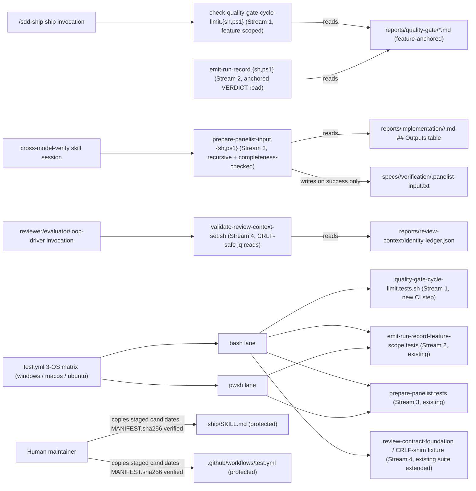

# Infrastructure Specification: quality-loop-fixes

4 independent script/skill-prose bugfixes. No cloud service, deployment
target, IaC resource, network route, or data store is added or changed.
The only infrastructure-facing edit across all 4 streams is Stream 1's
one new CI step for an already-registered suite
(`tests/quality-gate-cycle-limit.tests.sh`), staged via the epic-136
human-copy procedure because `.github/workflows/test.yml` is an
enforcement-chain protected file (design.md Protected-File Statement).
Streams 2, 3, and 4 extend suites already registered and running on the
existing 3-OS CI matrix (INV-025) — none of them requires a CI wiring
change.

## Deployment Topology



## CI/CD Sequence

`.github/workflows/test.yml`'s existing 3-OS matrix (`windows-latest`,
`macos-latest`, `ubuntu-latest`, `test.yml:18`) and existing step-pairing
pattern are unchanged in SHAPE by this feature. Streams 2, 3, and 4 extend
ASSERTIONS inside suites already registered as CI steps (INV-025) — no new
step is added for them. Stream 1 adds exactly ONE new step, a single
bash-only entry (matching the combined-suite convention, design.md
API/Contract Plan — NOT a `(bash)`/`(pwsh)` pair, because
`tests/quality-gate-cycle-limit.tests.sh` already drives both target
scripts internally via a `pwsh` subprocess call):

```yaml
      - name: Test quality-gate cycle-limit suite (bash)
        shell: bash
        run: bash ./tests/quality-gate-cycle-limit.tests.sh
```

Because `.github/workflows/test.yml` is itself an enforcement-chain
protected file
(`plugins/sdd-quality-loop/scripts/generated/guard_invariants.py:4`,
design.md Protected-File Statement), this registration is staged under
`specs/quality-loop-fixes/human-copy/.github/workflows/test.yml` with a
`MANIFEST.sha256` shared with the `ship/SKILL.md` candidate, following
`epic-136-phase2-gates/tasks.md:16-25`'s established Human-Copy Procedure
verbatim (same mechanism epic-159-pillar-d's infra-spec.md already
documents for its own single carve-out). The human maintainer applies
both staged candidates as pre-merge commits on the feature PR branch:
until they land, the PR's own CI is red on the suite's live-file
self-check (TEST-007) — the designed fail-closed state, with no
staged-candidate fallback.

`tests/run-all.ps1` receives NO new entry for this suite (design.md
Design Decisions, OQ-5) — `tests/quality-gate-cycle-limit.tests.sh` is a
"combined suite" (requirements.md Field Definitions) that already
exercises the `.ps1` target script internally via a `pwsh` subprocess,
matching the established convention that combined suites
(`tests/second-approval-mask.tests.sh`, `tests/review-agent-isolation.tests.sh`,
`tests/review-contract-foundation-parity.tests.sh`) register only in
`tests/run-all.sh`, confirmed by direct enumeration at spec-authoring
time.

Determinism lane (#126 note, carried from epic-159-pillar-a2/pillar-b/
pillar-d): every suite in this feature is fully deterministic — no LLM
invocation, no live network call, no live `gh` invocation. When #126
lands the deterministic/LLM CI lane separation, all 4 streams' suites
join the deterministic lane unchanged.

## Runtime Dependencies

| Dependency | Used by | Absence behavior |
|---|---|---|
| bash | all 4 streams' target scripts and test suites; `tests/run-all.sh` | already an established repository-wide precondition; GitHub-hosted runners ship bash by default |
| pwsh (PowerShell 7) | Streams 1-3's `.ps1` target scripts and test suites; `tests/run-all.ps1` | already an established repository-wide precondition for every `.ps1` suite; no new degradation this feature introduces |
| jq | `validate-review-context-set.sh` (Stream 4's target) | already a hard dependency of this script (`command -v jq \|\| fail RUNTIME`, unchanged); this feature only changes how the script consumes `jq`'s OWN output bytes |
| python3 | `prepare-panelist-input.sh` (Stream 3's target, sanitization/hashing) | already a hard dependency (unchanged; Stream 3's recursion/completeness-check additions are shell-native, not new Python) |
| git | human-copy staging verification (Streams 1's two carve-outs) | already a repository dependency |

No new services, containers, or package installations of any kind.

## Environments

| Environment | URL | Auth | Trigger | Classification | Promotion Rule |
|---|---|---|---|---|---|
| local | repository checkout | none / synthetic fixtures | `bash tests/run-all.sh` / `pwsh tests/run-all.ps1` | internal fixtures only | all 4 streams' extended/new suites green |
| CI matrix (`test.yml`) | no network use by any of the 4 streams' suites beyond checkout | scoped `GITHUB_TOKEN` (unchanged) | push / PR / merge_group | synthetic fixtures | all required checks green on 3 OSes, once the human-copied `test.yml` registration (Stream 1) is live |

## Runtime Budget

No stream's suite requires a runtime-budget assertion (design.md Test
Strategy item 4): every new/changed test is pure fixture-driven
function/script testing — no live network call, no subprocess-loop-driving
beyond what the existing suites already do (e.g. Stream 1's suite already
shells out to `pwsh` for parity checks, unchanged by this feature).

## Infrastructure as Code, Scaling, SLOs, and Residency

N/A — no change: no deployed service. The only IaC-like artifact touched
is `.github/workflows/test.yml` (existing, protected — one new step added
via human-copy, Stream 1 only).

## Observability

| Logs | Traces | Metrics | Alert | Owner | Runbook |
|---|---|---|---|---|---|
| each script's own stdout/stderr (unchanged contract shape per stream, except Stream 1's new usage-error branch and Stream 3's new gap-list-on-failure branch); GitHub Actions job status for the `test` job (unchanged mechanism, one new step for Stream 1) | N/A | pass/fail per suite per OS per lane (`test.yml`, unchanged mechanism) | none new — this feature adds no new alerting surface; a `check-quality-gate-cycle-limit` `Escalate-Human` result (now feature-scoped, closing the false-positive) is unchanged as a signal a human already knows to look for | maintainers | re-run the affected suite locally (`bash tests/<suite>.tests.sh` / `pwsh tests/<suite>.tests.ps1`) against a fresh fixture if a CI failure needs reproduction |

## Rollback

Per-stream reviewed revert (one issue = one stream = one set of commits).
Reverting Stream 1's commits removes the CLI-contract change and its
test-suite fixtures; the TWO protected-file registration edits
(`ship/SKILL.md` prose, `.github/workflows/test.yml`'s CI step)
additionally require a second human-copy application (staging a
candidate with each edit removed, then a human re-applying both) — the
same human-in-the-loop mechanism that added them, never a direct agent
revert of either live protected file. Reverting Streams 2, 3, or 4's
commits restores each script's pre-fix logic and removes each stream's
new test fixtures — none of the three touches a protected file, so no
human-copy round-trip is needed for their rollback.

## Open Questions

None. Owner: maintainers; non-blocking.
