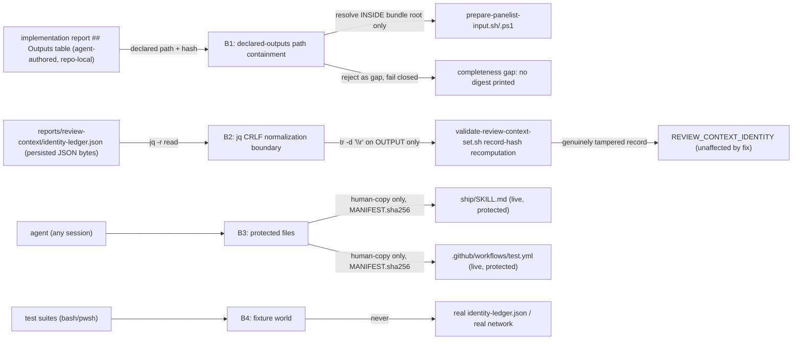

# Security Specification: quality-loop-fixes

Impact assessment is required for this feature class: Stream 3 adds a new
completeness check that RESOLVES agent-authored, repository-relative paths
from an implementation report's `## Outputs` table — a table an
implementation-agent session writes, not a human — against a bundle root,
which is exactly the shape of check a naive implementation could turn into
a path-traversal read. Stream 4 changes byte-level handling inside an
identity-chain tamper-detection comparison — a change that must not, even
incidentally, weaken the existing fail-closed behavior against a
genuinely tampered ledger. Streams 1 and 2 carry materially lower risk (no
new trust boundary, pure count-scoping/string-anchoring changes to
repository-local file reads) and are covered here for completeness rather
than because either introduces a new boundary of its own.

## Trust Boundaries

| Boundary | Source | Destination | Assets | Validation | AuthN/AuthZ | REQ | AC |
|---|---|---|---|---|---|---|---|
| B1 | implementation report `## Outputs` table (agent-authored) | `prepare-panelist-input.sh`/`.ps1` bundle root | declared path + SHA-256 pairs | each declared path is resolved and checked to remain INSIDE the bundle's own `--input` root before any read is attempted; a path resolving outside is a gap (fail closed), never read | filesystem path containment (reuses `validate-review-context-set.sh`'s existing canonical-path posture) | REQ-003 | AC-014, AC-015, AC-016, AC-017 |
| B2 | `reports/review-context/identity-ledger.json` (persisted JSON) via `jq -r` | `validate-review-context-set.sh`'s record-hash recomputation | ledger record fields (sequence, stage, role, run_id, host_session_id, previous_record_sha256, record_sha256) | `tr -d '\r'` is applied to the shell-variable ASSIGNMENT of each `jq -r` read, never to the ledger file's own bytes; the tamper-detection comparisons (`[[ "$computed_hash" == "$record_hash" ]]`, etc.) are otherwise unchanged | filesystem read-only; no write path added | REQ-005 | AC-022, AC-023, AC-024, AC-026 |
| B3 | any agent session | `ship/SKILL.md`, `.github/workflows/test.yml` (both live, protected) | enforcement-chain integrity; documented CLI-contract accuracy | staged candidates under `specs/quality-loop-fixes/human-copy/` + ONE shared `MANIFEST.sha256`; only a human applies either, as pre-merge commits on the feature PR branch | `_PROTECTED_GATE_SUFFIXES`/`PHASE2_HUMAN_COPY_TARGETS` (`guard_invariants.py:4,18`) + human review | REQ-001 | AC-006, AC-007 |
| B4 | test suites (all 4 streams) | fixture filesystem / fixture-scoped ledger copy | synthetic fixture reports, fixture bundles, fixture ledger copies, CRLF `jq` shim | mktemp-scoped; Stream-4 fixtures use a COPY of the ledger schema, never `--reserve` against the real `identity-ledger.json`; no live network call anywhere in any of the 4 streams' suites | filesystem/PATH isolation | REQ-001..005 | AC-004, AC-010, AC-015, AC-016, AC-022..024 |

## STRIDE Analysis

| Boundary | Threat | STRIDE | Abuse Case | Mitigation | Verification | REQ | AC |
|---|---|---|---|---|---|---|---|
| B1 | a crafted `## Outputs` table row (agent-authored implementation report) declares a path that resolves OUTSIDE the panelist-input bundle's own input root | Tampering / Information Disclosure | an implementation report declares an output path like `../../../etc/passwd` or an absolute path outside `--input`, and a naive completeness-check implementation follows it, causing `prepare-panelist-input.sh` to read (and potentially leak into the sanitized bundle, or into the printed gap list) content outside the intended bundle scope | the completeness check resolves each declared path relative to the bundle's own `--input` root FIRST and treats any path that would escape it as a gap (never read, never opened) — reusing the same canonical-path posture `validate-review-context-set.sh`'s `is_canonical_path`/symlink-component-walk already establishes for an analogous problem, not a bespoke resolver | code review + TEST-014..017 (positive/missing/mismatch/subdirectory cases, none of which exercise a path outside the bundle root by design) + a dedicated adversarial-path fixture at implementation time | REQ-003 | AC-014 |
| B1 | the completeness check's gap-reporting output (printed to stderr on a missing/mismatched path) echoes an attacker- or bug-influenced path string verbatim, potentially disclosing repository-external filesystem structure | Information Disclosure | a malformed declared-outputs row causes the gap message to include an absolute path or `..`-traversal string that reveals information about the host filesystem beyond the repository | the gap list prints only the DECLARED path string from the implementation report (already repository content, not attacker-supplied at runtime) and the reason (missing/hash-mismatch) — no resolved absolute path or filesystem-walk detail is echoed | code review | REQ-003 | AC-015, AC-016 |
| B2 | a bug in the `tr -d '\r'` fix accidentally strips a legitimate `\r` byte that is part of a genuinely tampered record's hash value, causing a tampered record to pass by accident | Tampering (non-regression) | a future maintainer assumes `tr -d '\r'` is a general "make comparisons more lenient" fix and applies it somewhere that would mask a real corruption, weakening the identity-chain's own tamper detection | `tr -d '\r'` is applied ONLY at the 4 enumerated `jq -r` OUTPUT sites (AC-022..024), never to the ledger file's own bytes, never to a value already read from elsewhere; BL-010's tampered-ledger cases (wrong sequence, wrong previous hash, symlink traversal, duplicate run/session id) are explicitly re-run and confirmed still fail closed after the fix (AC-026) — a `\r` byte is never part of a legitimately correct 64-hex-char SHA-256 value, so stripping it never masks a real mismatch | TEST-026 (BL-010 non-regression) | REQ-005 | AC-026 |
| B3 | an implementer, unaware Stream 1 touches TWO protected files (not one, unlike epic-159-pillar-d's single carve-out), writes `.github/workflows/test.yml`'s registration line directly, bypassing human-copy | Elevation of Privilege | the implementer stages `ship/SKILL.md` correctly (the more obviously "documentation" file) but forgets `.github/workflows/test.yml` is ALSO protected and edits it live | `sdd-hook-guard.py`'s PreToolUse enforcement independently denies the direct write attempt regardless of implementer awareness (defense in depth); the Protected-File Statement (design.md) explicitly calls out BOTH files by name and their shared `MANIFEST.sha256`, reducing the chance either is missed | TEST-007 + hook-guard enforcement | REQ-001 | AC-007 |
| B4 | a Stream-4 test fixture accidentally reserves a REAL record against `reports/review-context/identity-ledger.json` instead of a fixture-scoped copy, colliding with the real ledger's tail (`sequence: 319` at spec-authoring time) | Denial of Service (to the shared ledger) | a `--reserve` invocation in a new test targets the real ledger path instead of a mktemp copy, either colliding with a concurrent session's own reservation or permanently mutating shared, git-tracked state from a test run | every new Stream-4 fixture operates on a mktemp-scoped COPY of the ledger (matching the existing `tests/lib/loop-driver.sh` fixture convention); no new test invokes `--reserve` against the real path `reports/review-context/identity-ledger.json` | code review (fixture-path assertion) + TEST-022..026 | REQ-005 | AC-022..024 |

## Authorization

| Actor / Role | Resource | Action | Decision Point | Default | Denial Evidence | REQ | AC |
|---|---|---|---|---|---|---|---|
| `prepare-panelist-input.sh`/`.ps1` | declared-outputs path (from `## Outputs` table) | read | B1 path-containment check | allow, only if resolved path is INSIDE `--input` root and hash matches | a path resolving outside the root, or a hash mismatch, is a gap (fail closed), never read | REQ-003 | AC-014 |
| `validate-review-context-set.sh` | `reports/review-context/identity-ledger.json` | read (`jq -r`) | B2, unchanged read-only posture | allow | n/a — this feature adds no new write path | REQ-005 | AC-022..024 |
| any agent session | `ship/SKILL.md`, `.github/workflows/test.yml` (both live) | write | `_PROTECTED_GATE_SUFFIXES`/`PHASE2_HUMAN_COPY_TARGETS` (hook guard) | deny (human-copy staging required for both) | `sdd-hook-guard.py` PreToolUse denial; staged-candidate + shared `MANIFEST.sha256` is the only path forward | REQ-001 | AC-006, AC-007 |
| any agent session | `validate-review-context-set.sh` | write | `_PROTECTED_GATE_SUFFIXES` (hook guard) | allow — confirmed absent from both protected lists (OQ-1) | n/a — direct edit is authorized | REQ-005 | AC-022..026 |
| task implementer | `check-quality-gate-cycle-limit.{sh,ps1}`, `emit-run-record.{sh,ps1}`, `prepare-panelist-input.{sh,ps1}`, `cross-model-verify/SKILL.md` | write | design constraint (none of the 9 non-`ship`/non-`test.yml` files are protected, INV-021) | allow | n/a | REQ-001, REQ-002, REQ-003, REQ-004 | AC-001, AC-008, AC-013, AC-019 |

## Data Classification and Protection

| Entity | Classification | At Rest | In Transit | Retention | Deletion | Access Log | REQ | AC |
|---|---|---|---|---|---|---|---|---|
| `## Outputs` table declared paths/hashes (implementation reports) | internal, committed repository content | repository (`reports/implementation/<feature>/`) | n/a (local read) | repo lifetime | reviewed revert | git history | REQ-003 | AC-014 |
| panelist-input bundle (`specs/<feature>/verification/<task>.panelist-input.txt`) | sanitized, intended for external-LLM review (BL-007/BL-008 unchanged) | repository (bundle output path) | n/a (produced locally; transmission to a panelist CLI is out of this feature's scope, unchanged) | until superseded by a later run | reviewed revert | n/a | REQ-003 | AC-018 |
| identity-ledger record fields (`sequence`, `stage`, `role`, `run_id`, `host_session_id`, `previous_record_sha256`, `record_sha256`) | internal, committed, tamper-evident chain | repository (`reports/review-context/identity-ledger.json`) | n/a (local read via `jq -r`, now CRLF-normalized) | repo lifetime, append-only | none (append-only; this feature adds no delete path) | git history | REQ-005 | AC-022..024, AC-026 |
| staged `ship/SKILL.md` + `.github/workflows/test.yml` candidates + `MANIFEST.sha256` (`specs/quality-loop-fixes/human-copy/`) | internal, committed staging artifact | repository (staging path, not the live protected target) | local only | until a human applies both as pre-merge commits (AC-006, AC-007) | reviewed revert | git history | REQ-001 | AC-006, AC-007 |

No secret, token, or credential appears anywhere in fixtures, source, or
evidence produced by any of the 4 streams. None of the 4 streams reads or
writes `SDD_EVIDENCE_KEY`, `SDD_SUDO_KEY`, or any `.env`-class credential
— Stream 3's consent-gate and sanitization code (BL-007/BL-008) is
preserved unchanged, not touched by the recursion or completeness-check
additions (design.md API/Contract Plan: the new check is inserted before
sanitization runs, never inside it).

## OWASP Mapping

| OWASP Risk | Exposure | Control | Verification | Owner |
|---|---|---|---|---|
| Path Traversal / Broken Access Control | Stream 3's declared-outputs completeness check resolving a path outside the panelist-input bundle's own root | path-containment check reusing `validate-review-context-set.sh`'s existing canonical-path posture; a path outside the root is a gap, never read | TEST-014..017 + code review + adversarial-path fixture at implementation time | maintainers |
| Tampering (non-regression) | Stream 4's `tr -d '\r'` fix accidentally weakening the identity-chain's tamper detection | fix scoped to exactly 4 enumerated `jq -r` OUTPUT sites; BL-010's tampered-ledger cases re-run and confirmed still fail closed | TEST-026 | maintainers |
| Security Misconfiguration | either of Stream 1's two protected-file touches (`ship/SKILL.md`, `.github/workflows/test.yml`) being written live, bypassing human review | epic-136 human-copy procedure (shared `MANIFEST.sha256`) + `sdd-hook-guard.py` PreToolUse enforcement (defense in depth) | TEST-007 + hook-guard denial | maintainers |
| Information Disclosure | Stream 3's gap-list output echoing more than the declared path string and reason | gap messages print only repository-content declared paths and a fixed reason string, no resolved-absolute-path or filesystem-walk detail | code review | maintainers |
| Denial of Service (shared ledger) | a Stream-4 test fixture colliding with the real identity ledger's tail | all new fixtures use a mktemp-scoped ledger COPY, never `--reserve` against the real path | code review + TEST-022..024 | maintainers |

## Secrets Management

No secret is added, read, or logged by any of the 4 streams. None reads a
`.env` file or any `SDD_SUDO_KEY`/`SDD_EVIDENCE_KEY`-class credential.
Stream 3's changes sit entirely BEFORE the existing sanitization step
(design.md API/Contract Plan) and never alter what the sanitization step
itself redacts (BL-008, unchanged patterns). Stream 4 computes no new
hash or signature of its own — it changes how `jq -r` output bytes are
read into shell variables before the EXISTING SHA-256 comparisons run, a
plain content-integrity operation, not a signature or attestation
mechanism (consistent with ADR-0008's no-signature-crypto boundary, same
characterization epic-159-pillar-d's security-spec.md applied to its own
`MANIFEST.sha256` check).

## Security Tests

| Test | Boundary | Attack / Control | Expected Result | Evidence | AC |
|---|---|---|---|---|---|
| TEST-014..017 | B1 | declared-outputs completeness check against present/missing/hash-mismatched/subdirectory fixture paths, all resolved inside the bundle root | present+matching → success + digest; missing/mismatched → fail closed, gap printed, no digest; subdirectory case correctly located | `tests/prepare-panelist.tests.sh`/`.ps1` | AC-014, AC-015, AC-016, AC-017 |
| TEST-026 | B2 | BL-010's tampered-ledger cases (wrong sequence, wrong previous hash, symlink traversal, duplicate run/session id) re-run against the Stream-4-fixed `validate-review-context-set.sh` | every case still fails closed with its original coded error (`REVIEW_CONTEXT_IDENTITY`/`REVIEW_CONTEXT_PATH`/etc.), unaffected by the `tr -d '\r'` fix | `tests/loop-*.tests.sh` (non-degraded runtimes) + a Stream-4-specific re-run | AC-026 |
| TEST-006, TEST-007 | B3 | staged `ship/SKILL.md` + `.github/workflows/test.yml` candidates vs. the live (unmodified) protected files | staged candidates' SHA-256 matches the shared `MANIFEST.sha256`; live files confirmed unmodified by the agent at staging time; human-copy application observable as pre-merge commits turning TEST-007's live-file self-check green | `specs/quality-loop-fixes/human-copy/` + review-time diff | AC-006, AC-007 |
| TEST-022..024 | B2 | CRLF `jq` shim applied to every enumerated `jq -r` consumption site | the fixed script accepts a canonically valid genesis ledger fixture under the shim on ANY OS (portable exercise of the defect) | fixture suite (Stream 4) | AC-022, AC-023, AC-024 |

## Open Questions

None security-blocking. All investigation.md security-relevant open
questions (OQ-1, protected-file status of the Stream-4 target) are
resolved by direct verification in design.md's Protected-File Statement
and re-affirmed here (B3, Authorization); see requirements.md Open
Questions for the full resolution list.
