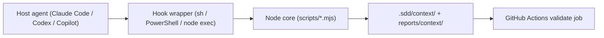

# Infrastructure Specification: sdd-context

Local-only work: the plugin executes inside the developer's agent harness and
in repository CI. There are no deployed services; sections below record the
equivalent execution environment or a reasoned N/A.

## Deployment Topology



Failure domains: host hook dispatch (must not block compaction), node absence
(graceful no-op), repository write permission (warn + no-op), CI runner
(retry).

## CI/CD Sequence

```mermaid
sequenceDiagram
  actor D as Developer
  participant CI as GitHub Actions
  D->>CI: Push branch (8th plugin change)
  CI->>CI: validate-repository.ps1 (8 plugins, version lock)
  CI->>CI: Pester suites incl. tests/sdd-context/*
  CI-->>D: Pass/fail; no artifact publication
```

Marketplace publication reuses the existing per-plugin manifest process; no
new pipeline.

## Environments

| Environment | URL | Auth | Trigger | Classification | Promotion Rule |
|---|---|---|---|---|---|
| local | repo working tree | OS user | host hook event | internal | n/a |
| CI | GitHub Actions | repo permissions | push / PR | internal | merge on green + review |
| staging | N/A | — | — | — | no deployed service |
| production | N/A | — | — | — | no deployed service |

## Infrastructure as Code

N/A — no change: no cloud resources. The only operational definitions are the
hook descriptors (`hooks/claude-hooks.json`, `hooks/hooks.json`) and the
triple manifest.

## Scaling Strategy

N/A — no change: single-user local execution. The only concurrency is repeated
hook invocations against `.sdd/context/`; writes are deterministic and
append-only where applicable.

## Service Level Objectives

| Signal | Numeric Target | Window | Measurement | Error-Budget Action | AC |
|---|---:|---|---|---|---|
| CI validate job pass on main | 100% | per merge | GitHub Actions | revert/fix-forward | AC-001 |
| Node-absent no-op regression | 100% | per release | TEST-010 fixture | block release | AC-010 |
| Deterministic snapshot regression | 100% | per release | TEST-002 fixture | block release | AC-002 |

## Data Residency and Retention

| Entity | Residency | Retention | Backup | Deletion Verification | REQ | AC |
|---|---|---|---|---|---|---|
| `.sdd/context/*` | local repo working tree (git-ignored) | until next compaction overwrites handoff; log retained per operator | n/a | `.gitignore` + absent from git status | REQ-002, REQ-005 | AC-002, AC-009 |
| `reports/context/*` | project repository (git) | project lifetime | git history | git rm | REQ-002 | AC-003 |

## Observability

| Logs | Traces | Metrics | Alert | Owner | Runbook |
|---|---|---|---|---|---|
| hook warning lines + compact-log.jsonl records | n/a | n/a | n/a | operator | plugins/sdd-context/docs/ |

No network telemetry; all observability is file-based and local.

## Cost Estimate

| Driver | Assumption | Monthly Range | Alert Threshold | Optimization |
|---|---|---:|---:|---|
| Hook execution | local file reads/writes only | negligible | n/a | no external service |

## Rollback

Trigger: release regression traced to sdd-context. Owner: maintainer.
Procedure: revert the plugin directory + marketplace/validate-repository
expectations in one commit (additive feature; no data migration). Existing
`.sdd/context/` files become inert after revert. Maximum rollback time: one
revert commit + CI run. Evidence: green validate job on the revert commit
(AC-001).

## Open Questions

- none
