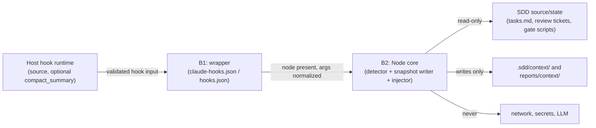

# Security Specification: sdd-context

Security impact assessment is required for this feature even though the
plugin has no interactive UI and does not change the SDD state machine. A
compaction hook runs in the host agent's privilege context and, if written
over-permissively, could block compaction, corrupt SDD state, or become an
agent-forgeable bypass channel. The design therefore treats the hook runtime
as an untrusted input source and confines all writes to two dedicated
directories.

## Trust Boundaries

| Boundary | Source | Destination | Assets | Validation | AuthN/AuthZ | REQ | AC |
|---|---|---|---|---|---|---|---|
| B1 | host hook input (`source`, optional `compact_summary`) | wrapper entry point | hook invocation integrity | fixed input-key allowlist; unknown fields ignored; no shell expansion of untrusted strings | host runtime invokes the trusted hook | REQ-001, REQ-006, REQ-007 | AC-010, AC-011 |
| B2 | wrapper | Node core | deterministic snapshot, boundary decision | JSON schema for `handoff.json`; detector consumes only task/status/file signals | process-local execution | REQ-002, REQ-003 | AC-002, AC-003, AC-004, AC-005, AC-006 |
| B3 | Node core | `.sdd/context/`, `reports/context/` | handoff artifacts and compact log | path allowlist check before every write; no other path accepted | filesystem permissions | REQ-007 | AC-011 |
| B4 | Node core | SDD source/state | `tasks.md`, review tickets, protected gate scripts | read-only access only; no write API is linked into the hook path | deny-by-construction | REQ-007 | AC-011 |
| B5 | stale or corrupt `handoff.json` | SessionStart injector | recovery context | JSON parse wrapped in fail-soft handler; invalid JSON yields empty recovery output | n/a | REQ-004, REQ-006 | AC-008, AC-010 |

## STRIDE Analysis

| Boundary | Threat | STRIDE | Abuse Case | Mitigation | Verification | REQ | AC |
|---|---|---|---|---|---|---|---|
| B1 | hook runs during host compaction and exits nonzero | Denial of Service | `node` missing or wrapper throws, blocking the host's compaction path | wrapper detects `node` before invoking core; every hook exits 0 and emits at most a warning on any failure | TEST-010 | REQ-006 | AC-010 |
| B1 | `compact_summary` or `source` contains shell metacharacters | Injection | crafted hook input is interpolated into a shell command | fixed input-key allowlist; `compact_summary` is never consumed; untrusted values are passed as argv, not evaluated | TEST-011 | REQ-007 | AC-011 |
| B2 | snapshot writer emits non-deterministic or attacker-controlled content | Tampering | a resumed agent receives fabricated task state | snapshot is derived only from repository state; byte-identical output for identical input; no LLM summarization | TEST-002, TEST-003 | REQ-002 | AC-002, AC-003 |
| B2 | detector misclassifies an UNSAFE boundary as SAFE | Spoofing | resumed agent treats in-flight work as safely resumable | detector uses explicit lifecycle signals; UNSAFE conditions include In Progress, gate running, missing report, uncommitted changes; auto-compaction maps to EMERGENCY_AUTO | TEST-004, TEST-005, TEST-006 | REQ-003 | AC-004, AC-005, AC-006 |
| B3 | writer escapes its allowed directories | Tampering / Elevation of Privilege | a handoff path is redirected to `tasks.md` or a gate script | path allowlist rejects all writes outside `.sdd/context/` and `reports/context/` | TEST-011 | REQ-007 | AC-011 |
| B4 | plugin mutates SDD state | Tampering | hook silently edits task statuses or review tickets | hook core has no write API for SDD source/state; design declares those paths read-only | TEST-011 | REQ-007 | AC-011 |
| B5 | corrupt handoff crashes SessionStart | Denial of Service | a truncated or hostile `handoff.json` stops resumption | fail soft: parse failure produces no injected context and exit 0 | TEST-008, TEST-010 | REQ-004, REQ-006 | AC-008, AC-010 |
| B5 | secret or model summary leaks into handoff | Information Disclosure | session context includes `.env` values or private payload | no secret reads; no network; no LLM; fields are deterministic file/task metadata only | TEST-011 | REQ-007 | AC-011 |

## Authentication Flow

N/A — no change: `sdd-context` has no interactive authentication surface and
issues no credentials. Hook invocation identity is established by the host
agent runtime. Humans remain responsible for trusting hook descriptors in
their runtime (`REQ-008`, `AC-012`).

## Authorization

| Actor / Role | Resource | Action | Decision Point | Default | Denial Evidence | REQ | AC |
|---|---|---|---|---|---|---|---|
| hook wrapper | Node core | invoke | `node` presence check | deny (no-op exit 0) | warning line plus exit 0 | REQ-006 | AC-010 |
| Node core | `.sdd/context/`, `reports/context/` | write | runtime path allowlist | deny | write rejected; warning; exit 0 during compaction | REQ-007 | AC-011 |
| Node core | SDD source/state | write | absent by construction | deny | no write call site exists | REQ-007 | AC-011 |
| agent | SDD artifacts | write | existing SDD hooks/guards | unchanged | existing guard evidence | REQ-007 | AC-011 |

Fail-closed behavior: every hook entry point defaults to a zero-exit no-op.
An unavailable runtime, malformed input, missing directory, or write failure
never blocks the host compaction path.

## Data Classification and Protection

| Entity | Classification | At Rest | In Transit | Retention | Deletion | Access Log | REQ | AC |
|---|---|---|---|---|---|---|---|---|
| `.sdd/context/HANDOFF.md`, `handoff.json` | internal, deterministic session metadata | local git-ignored directory | n/a (no network) | latest snapshot plus bounded log | manual delete | `handoff.json` records artifact paths and timestamp source | REQ-002, REQ-007 | AC-003, AC-011 |
| `.sdd/context/compact-log.jsonl` | internal, append-only | local git-ignored directory | n/a | bounded or rotated by operator | manual delete | one JSON line per PostCompact | REQ-005, REQ-007 | AC-009, AC-011 |
| `reports/context/<feature>/<timestamp>-handoff.md` | internal, committable | git repository | n/a | repository lifetime | git rm | git history | REQ-007, REQ-008 | AC-011, AC-012 |
| SDD source/state (`tasks.md`, tickets, gates) | internal, workflow-critical | git repository | n/a | repository lifetime | existing workflow | existing SDD evidence | REQ-007 | AC-011 |

No credential, secret, `.env` value, private host conversation payload, or
model-generated summary is written to any handoff artifact.

## OWASP Mapping

| OWASP Risk | Exposure | Control | Verification | Owner |
|---|---|---|---|---|
| Broken Access Control | hook writes beyond its two allowed directories | path allowlist plus no write API for SDD state | TEST-011 | maintainers |
| Injection | host hook input interpolated into commands | input-key allowlist, `compact_summary` never consumed, argv-only data flow | TEST-011 | maintainers |
| Software and Data Integrity Failures | nondeterministic or fabricated handoff content | deterministic snapshot writer, no LLM summarization | TEST-002, TEST-003 | maintainers |
| Security Misconfiguration | hook blocks compaction on a missing runtime | node-absent graceful no-op and zero-exit guarantee | TEST-010 | maintainers |

## Secrets Management

No secret is added, read, or logged. The plugin performs no network access and
does not open `.env` or credential files. `compact_summary` is deliberately
excluded from the input contract (`REQ-005`) so a host-provided private
summary cannot enter the plugin's persisted artifacts.

## SBOM and Supply Chain

The plugin uses the repository's existing version-locked manifest process and
adds no third-party runtime dependencies. Node 18+ is the implementation
runtime; hook descriptors and `scripts/*.mjs` are part of the plugin source
tree. Any lockfile or signature requirement for the new plugin follows the
existing sdd-forge distribution convention.

## Security Tests

| Test | Boundary | Attack / Control | Expected Result | Evidence | AC |
|---|---|---|---|---|---|
| TEST-010 | B1 | `node` removed from PATH | every hook exits 0 and emits at most a warning | `tests/sdd-context/node-absent.Tests.ps1` | AC-010 |
| TEST-011 | B1/B3/B4 | grep/scan for network calls, secret reads, and writes outside allowed paths | no network, no secret read, no disallowed write | `tests/sdd-context/security-scan.Tests.ps1` | AC-011 |
| TEST-002 | B2 | run PreCompact twice on unchanged input | byte-identical `HANDOFF.md` and `handoff.json` | `tests/sdd-context/determinism.Tests.ps1` | AC-002 |
| TEST-004 | B2 | SAFE lifecycle fixtures | detector reports `SAFE` for each defined SAFE branch | `tests/sdd-context/boundary-safe.Tests.ps1` | AC-004 |
| TEST-005 | B2 | UNSAFE lifecycle fixtures | detector reports `UNSAFE` for each defined UNSAFE branch | `tests/sdd-context/boundary-unsafe.Tests.ps1` | AC-005 |
| TEST-006 | B2 | auto-compaction signal during UNSAFE | detector reports `EMERGENCY_AUTO` | `tests/sdd-context/boundary-emergency.Tests.ps1` | AC-006 |
| TEST-008 | B5 | no handoff file or corrupt `handoff.json` | SessionStart exits 0 and prints nothing or fails soft | `tests/sdd-context/session-start.Tests.ps1` | AC-008, AC-010 |

## Open Questions

None security-blocking. The ADR identifier referenced by `design.md`
(`0031-context-handoff.md`) is a shared repository-wide sequence and must be
re-verified for the next-free number at drafting/implementation time
(WFI-013). Owner: maintainers; non-blocking for security review.
