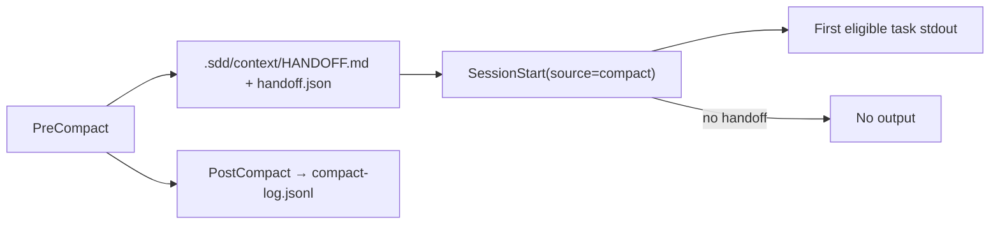

# UX Specification: sdd-context

The user interface of this feature is an automated compaction hook plus
generated Markdown/JSON recovery artifacts. Graphical-UI sections record
reasoned N/A values; the hook and artifact-readability UX are specified fully.

## Scope and User Journeys

- Primary user: an SDD ship-session agent whose host fires a compaction event.
- Entry point: host `PreCompact` / `SessionStart(source=compact)` /
  `PostCompact` hook dispatch.
- Success outcome: the resumed session sees exactly the minimal recovery
  context and can continue from the first eligible task (AC-007, AC-008).
- Excluded journey: interactive summary editing — snapshots are deterministic
  and file-based; no model-generated narrative is offered (REQ-002).

## Target Views

| View | User | Purpose | Entry | Exit | REQ | AC |
|---|---|---|---|---|---|---|
| PreCompact handoff write | agent | Persist a deterministic snapshot before context loss | host PreCompact event | HANDOFF.md + handoff.json written | REQ-002 | AC-002 |
| SessionStart recovery note | agent | Recover minimal continuation context | host SessionStart(source=compact) | stdout recovery line or clean no-op | REQ-004 | AC-007, AC-008 |
| PostCompact log record | operator | Append an audit record of compaction | host PostCompact event | one JSONL record | REQ-005 | AC-009 |
| HANDOFF.md artifact | human / resumed agent | Read the deterministic pre-compaction state | opening `.sdd/context/HANDOFF.md` | understands boundary + next task | REQ-002 | AC-003 |

## Component States

| Component | State | Trigger | Visible Feedback | Recovery | REQ | AC |
|---|---|---|---|---|---|---|
| Hook wrapper | No node | node not found on PATH | at most a warning; exit 0 | install Node 18+ or accept no-op | REQ-006 | AC-010 |
| Snapshot writer | Write blocked | `.sdd/context/` read-only/absent | warning; no non-zero exit | fix directory permissions; compaction continues | REQ-006 | AC-010 |
| SessionStart injector | Empty | no handoff exists | prints nothing | normal start without recovery | REQ-004 | AC-008 |
| SessionStart injector | Corrupt | handoff.json malformed/partial | fail soft, no throw | regenerate via next PreCompact | REQ-006 | AC-010 |
| Boundary detector | Emergency | auto-compaction while UNSAFE | `EMERGENCY_AUTO` boundary | human reviews emergency handoff | REQ-003 | AC-006 |
| PostCompact recorder | Optional | host supplies no/empty compact_summary | valid record without summary | none required | REQ-005 | AC-009 |

## Interaction Sequence

```mermaid
sequenceDiagram
  actor H as Host
  participant W as Hook wrapper
  participant N as Node core
  participant F as .sdd/context
  H->>W: PreCompact
  W->>W: detect node; absent → warn + exit 0
  W->>N: run deterministic snapshot
  N->>F: write HANDOFF.md + handoff.json
  H->>W: SessionStart(source=compact)
  W->>N: read latest handoff.json
  N-->>H: minimal recovery context or nothing
  H->>W: PostCompact
  W->>N: append one compact-log.jsonl record
```

## Wireframe Attachments

| View | Local Attachment | Source | Reviewed At | Notes |
|---|---|---|---|---|
| HANDOFF.md | none | deterministic render from handoff.json | 2026-08-14 | Markdown artifact, no graphical mockup |

None — manual visual refinement skipped: artifacts are deterministic
Markdown/JSON outputs, not graphical views.

## Navigation Map



Lost-state recovery: the latest handoff.json is the single machine-readable
recovery point; HANDOFF.md is its human-readable rendering.

## Accessibility

N/A — no change: no graphical UI. Artifact readability conventions apply:
plain Markdown with explicit boundary/status labels, JSON with stable fields,
no color-only semantics, and stdout limited to a compact text line.

## Responsive Behavior

N/A — no change: CLI/hook/Markdown only.

## Design Tokens

N/A — ds_profile: none (repository has no design-system/).

## Open Questions

- none
