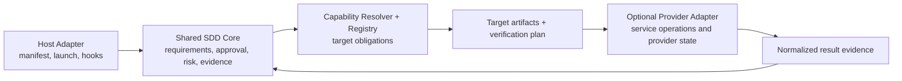

# Design: sdd-domain-multitarget (Issue #423 Phase 1)

Impl-Review-Status: Pending

Feature Type: staged architecture-boundary migration

## Technical Summary

This is a specification for a bounded migration, not a new multi-target
runtime. It preserves existing SDD entry points and gate ownership while
clarifying which decisions are shared, selected by target Capability, delegated
to providers, or adapted to hosts. The first implementation tranche should
make selection explicit at bootstrap and verification-contract consumers,
preserve `facet-hybrid` compatibility, and isolate concrete UI service
operations. Provider resource execution, new gate stages, facet-native-only
output, and package restructuring remain deferred.

All claims below about existing repository behavior cite checked-out
`origin/main` (`51adb50b`) and must be re-verified against the consuming files
at spec/design review and implementation planning. Line references describe
the baseline, not a claim that integration work is complete.

## Architecture and Ownership

| Owner | Owns | Does not own |
|---|---|---|
| SDD Core | Requirements and acceptance semantics, approval/status rules, task lifecycle, risk policy, evidence binding, gate aggregation, compatibility behavior | Cloud resource state, provider credentials, host-specific manifests, target-specific product internals |
| Capability / Registry | Provider-neutral target classification, applicable facets/artifact obligations, required verification kinds, N/A eligibility, resolver selection | Provider names or IDs, credentials, runtime execution, a second gate source of truth |
| Provider Adapter / Binding | Provider identity and binding IDs, credentials references, resource refs, provider command/API translation, authoritative provider state, normalized execution result | Core task status, risk policy, approval, required-check definitions |
| Host Adapter | Claude Code/Codex/Copilot manifest and invocation differences, hooks, supported capability detection, result transport | Separate workflow policy, approval semantics, evidence rules |
| Optional UI design provider | Design tool discovery, import/export formats, remote project operations, explicit egress/consent handling, tool-unavailable fallback | Core design requirements or canonical project decisions |

This is a logical ownership map, not an instruction to create new plugins or
repositories. ADR-0016 separates workflow axes and defines `facet-hybrid` as a
compatibility form ([ADR-0016:33-54](../../docs/adr/0016-workflow-axes-separation.md#L33));
ADR-0018 separates provider bindings and states that a Capability Pack has no
provider name while Project Context carries binding IDs
([ADR-0018:46-68](../../docs/adr/0018-provider-binding-separation.md#L46));
ADR-0017 limits Foundation implementation to implementation-stage gates
([ADR-0017:27-44](../../docs/adr/0017-gate-stage-model.md#L27)).

## Consumer Disposition

| Consumer and baseline evidence | Decision | Target design |
|---|---|---|
| `sdd-bootstrap-interviewer`: shared question bank and required outputs; current full-profile layer interview covers UX/contracts/workflow/frontend/backend/testing/infrastructure/security and always assesses security ([SKILL.md:102-117](../../plugins/sdd-bootstrap/skills/sdd-bootstrap-interviewer/SKILL.md#L102)); Phase 1 requires four layer documents ([SKILL.md:159-176](../../plugins/sdd-bootstrap/skills/sdd-bootstrap-interviewer/SKILL.md#L159)) | KEEP + PARAMETERIZE | Keep requirements, security, contract, and system-boundary questioning in the existing interviewer. Always generate and retain the complete legacy seven-layer document set for legacy and hybrid consumers, including non-UI targets. Record target applicability separately in a Facet manifest/selection; do not omit or delete UX/Frontend or other legacy documents to signal non-applicability. Preserve always-on security impact assessment. |
| `design.template.md` fixed layer rows ([design.template.md:20-30](../../plugins/sdd-bootstrap/skills/sdd-bootstrap-interviewer/templates/design.template.md#L20)) | PARAMETERIZE | Treat its rows as the legacy representation. Always generate and retain all seven legacy layer documents in `facet-hybrid`; additive target selection records applicability separately in the Facet manifest. Do not rewrite, delete, or omit documents. A `facet-native` path that omits non-applicable documents requires a separate approved, versioned migration with reader/writer compatibility evidence. |
| `check-contract.py` risk tiers and finite stack/check declarations ([check-contract.py:37-51](../../plugins/sdd-quality-loop/scripts/check-contract.py#L37), compile-check waiver behavior at [check-contract.py:303-320](../../plugins/sdd-quality-loop/scripts/check-contract.py#L303)) | PARAMETERIZE | Core retains risk-tier meanings and protected baseline checks. Target obligations are resolved from Registry and approved context. Do not replace hardcoded baselines with an editable project escape hatch. For non-code targets, record why code-centric checks do not apply; unavailable/unknown required checks fail closed. |
| DesignSync loop combines UI intent and external-tool details ([design-sync-loop/SKILL.md:8-30](../../plugins/sdd-bootstrap/skills/design-sync-loop/SKILL.md#L8), [design-sync-loop/SKILL.md:39-64](../../plugins/sdd-bootstrap/skills/design-sync-loop/SKILL.md#L39), consent regimes at [design-sync-loop/SKILL.md:87-148](../../plugins/sdd-bootstrap/skills/design-sync-loop/SKILL.md#L87)) | EXTRACT | Bootstrap retains generic UI/design questions, approved design-system input, local mockup semantics, and Mermaid canonical status. External DesignSync, claude.ai/design, Figma file import, and upload mechanics become an optional UI-provider boundary selected only for an applicable UI profile. Preserve live setting re-read and all `per-feature`/`standing`/`off` consent, record, no-upload, and manual-fallback semantics. |
| Architecture review's OpenAPI/JSON Schema endpoint check ([architecture-review-checklist.md:30-35](../../plugins/sdd-bootstrap/skills/sdd-bootstrap-interviewer/references/architecture-review-checklist.md#L32)) | PARAMETERIZE | Keep API/data contract completeness (preconditions, postconditions, failure semantics, compatibility) common. Resolve concrete contract representation by target Capability; avoid requiring HTTP endpoint schemas for non-HTTP designs. |
| `mcp/ci-mcp` GitHub Actions server/client ([server.ts:4-18](../../mcp/ci-mcp/src/server.ts#L4), [github-client.ts:102-117](../../mcp/ci-mcp/src/github-client.ts#L102)) | KEEP | Maintain its separate package and read-only GitHub boundary. Future GitHub/Azure DevOps/other CI integrations remain provider adapters; no GitHub API concepts enter Core contracts. |
| Provider state, credentials, resource schemas, deployment and cloud commands | DEFER | Each future provider design names its state authority and adapter contract. No provider writes or cloud deployment in this slice. |
| Artifact/promotion checks | DEFER | Registry vocabulary may reserve stages, but implementation and “Done” status remain owned by implementation gates. |
| Three host manifests/hooks and runtime-specific setup | KEEP | Preserve host adapters. Verify that the same required workflow and approval rules apply on each host while invocation and hook transport remain adapter-owned. |
| Facet-native migration and plugin/repository decomposition | DEFER | Revisit only with operational evidence, consumer inventory, and a separate approved migration decision. |

## Resolution Model

1. Without an active valid Project Context, the current legacy path remains the
   source of behavior. ADR-0016 defines the absent-context fallback and the
   independent workflow axes ([ADR-0016:56-75](../../docs/adr/0016-workflow-axes-separation.md#L56)).
2. With an active context, the deterministic resolver uses approved target
   classification and Registry-owned Capability definitions to select
   applicable facets and implementation-stage gates. This feature does not
   redefine the resolver or Registry schema.
3. The selected verification plan distinguishes `required`, `conditional`,
   `not-applicable` (with reason), and `not-run/unknown`. An unavailable
   required verifier or a `not-run`/`unknown` result for a required check cannot
   satisfy the gate; an optional check does not block the gate solely because
   it is not run. In the current legacy contract, all existing required checks
   remain required: target selection does not waive or automatically remove
   them. An unavailable or unrun legacy-required check yields `BLOCKED` with an
   explicit migration-pending reason, not gate success. `not-applicable` is
   allowed for a formerly required check only after an approved, versioned
   verification-contract migration; only successful required checks satisfy
   the gate.
4. Provider-backed operations return evidence that identifies the target and
   provider binding and identifies whether the observation is simulated or
   real. A mock result cannot establish a real deployment or provider-state
   claim.
5. Implementation completion remains separate from artifact readiness and
   promotion. ADR-0017 reserves the latter stages
   ([ADR-0017:27-32](../../docs/adr/0017-gate-stage-model.md#L27)).

## Target Selection Examples

These are design-level examples to validate selection boundaries. They do not
assert that named provider integrations are shipped.

| Target | Artifact emphasis | Verification examples | Explicitly not inferred |
|---|---|---|---|
| CLI/library | interface/contract, behavior, packaging, security | unit/integration/acceptance, compatibility, package/build checks where applicable | UI layers or cloud deployment |
| UI application | user flows/states, UX/UI facets, API/data contracts, security | component/interaction/accessibility and relevant unit/integration checks; visual verification when available | mandatory remote design service |
| Design-only | requirements, architecture views, decisions, contracts and traceability | validate design-only target-candidate selection; consistency review, scenario/constraint coverage, independent review, model validation where available | fabricated unit/TDD/build evidence; waiving existing legacy-required checks or claiming gate PASS when any such check is unavailable/unrun |
| IaC/cloud | resource intent, ownership, policy, deployment topology, interface contracts | syntax/format, provider validate/plan, policy checks, isolated tests where available | apply/deploy success from plan/mock evidence |
| Low-code | data model, permissions, business processes, solution/package boundaries | schema/permission/process checks and target-environment validation when available | a source-code build as a universal requirement |

## UI Provider Boundary

The current `design-sync-loop` is explicitly for UI applications and probes for
DesignSync; unavailable tools use a manual path and do not block specification
flow ([SKILL.md:10-30](../../plugins/sdd-bootstrap/skills/design-sync-loop/SKILL.md#L10)).
It also supports ui-ux-pro-max, file-based Figma DTCG input, and a manual
template source ([SKILL.md:39-64](../../plugins/sdd-bootstrap/skills/design-sync-loop/SKILL.md#L39)).
The loop creates local disposable HTML and gates remote upload on consent
([SKILL.md:74-86](../../plugins/sdd-bootstrap/skills/design-sync-loop/SKILL.md#L74),
[SKILL.md:150-164](../../plugins/sdd-bootstrap/skills/design-sync-loop/SKILL.md#L150)).

The first extraction must preserve those observable behaviors: UI applicability
is explicit, remote service use is optional, file import does not require an
API, local project artifacts remain canonical where specified, missing tools
fall back manually, and no upload occurs without the existing consent outcome.
This design does not choose a new plugin name or mandate an API abstraction.

## Compatibility Strategy

- Existing projects with no Project Context continue through legacy resolution;
  this is grounded in ADR-0016's fallback definition, which must be re-checked
  at implementation planning because the resolver implementation may evolve.
- New target selection is additive and uses the existing full-profile plus
  `facet-hybrid` migration posture before any facet-native change.
- In `facet-hybrid`, always generate and retain all seven legacy layer
  documents for every target, including non-UI targets; target applicability
  is represented separately in the Facet manifest/selection. Current readers
  and host formats continue to receive the unchanged legacy document shape.
  No consumer may interpret an omitted document as a target-selection result.
- Omitting non-applicable legacy documents is reserved for a separately
  approved, explicitly versioned `facet-native` migration with enumerated
  reader/writer compatibility evidence.
- Existing mandatory risk/evidence policies do not become optional merely
  because the target is non-code. Applicability must be resolved explicitly;
  unknown or unavailable remains failure for a required check, and an optional
  check does not block the gate solely because it is not run. In the current
  legacy contract, a missing or unrun legacy-required check is reported as
  `BLOCKED` with a migration-pending reason; it is not removed or treated as
  `not-applicable` by target selection. Such `not-applicable` status becomes
  permissible only under a separately approved, versioned migration.
- Existing `ds_upload_consent` behavior remains equivalent through the
  provider boundary: re-read the setting at every resolution; `per-feature`
  prompts only when current feature/session/destination consent is absent,
  keeps declines transient, records grants/withdrawals, and uses no-upload
  manual fallback for not-permitted egress; `standing` suppresses the prompt
  and writes one grant record per feature/destination pair; `off` records
  not-permitted and always uses no-upload manual fallback. See
  [design-sync-loop/SKILL.md:87-148](../../plugins/sdd-bootstrap/skills/design-sync-loop/SKILL.md#L87)
  and [design-sync-loop/SKILL.md:244-288](../../plugins/sdd-bootstrap/skills/design-sync-loop/SKILL.md#L244).
- `ci-mcp` remains a read-only GitHub Actions client. No write operation is
  introduced through this feature.

## Constraints and Deferred Decisions

- Gate definitions continue to have one Registry source of truth; do not add a
  per-Capability duplicate `gates.yaml`.
- Provider-neutral Capability identities remain separate from provider
  bindings. Provider state remains authoritative at its provider.
- Only implementation-stage verification is in scope; artifact and promotion
  gates await separate real-use design and approval.
- No provider-specific runtime, multi-cloud orchestration, or write-capable MCP
  is designed here.
- No default-profile/layout change, frozen-spec edit, or legacy artifact
  rewrite is authorized by this feature.

## Test and Evidence Strategy

The implementation plan should require, at minimum:

- A consumer inventory check that verifies every row in the disposition table
  against current source paths and direct consumers before edits.
- Resolver selection fixtures for the five target examples, including
  applicable, reasoned not-applicable, unavailable required verifier, and
  required-check not-run/unknown outcomes. The design-only fixture validates
  target-candidate selection only; it must preserve the current legacy check
  contract and return `BLOCKED` with an explicit migration-pending reason
  whenever a legacy-required check is unavailable or unrun. An optional
  not-run check alone must not block the gate. Only a separately approved,
  versioned migration may authorize `not-applicable` for a formerly required
  check.
- Legacy/no-context output and behavior comparisons against the pre-change
  baseline, plus a hybrid compatibility fixture consumed by existing reviews
  and quality gates.
- UI provider fixtures for available, unavailable/manual fallback, local-only,
  and all three consent settings: per-feature grant/decline/not-permitted,
  standing one-time grant record per feature/destination, and off persistent
  not-permitted record. Verify the live setting is re-read each time; every
  denied/not-permitted/off/unavailable case makes no upload call and follows
  the manual fallback, while a transient per-feature decline is prompted
  again at the next attempt.
- Provider-boundary fixtures that reject provider names in Capability data,
  ensure Core stores only binding IDs, preserve provider state ownership, and
  label mock versus real evidence distinctly.
- Host matrix evidence showing shared semantics with host-specific hook and
  invocation adapters.
- A check that no artifact/promotion status or deployment-success claim is
  produced by implementation-only gates.

## Factual-Claim Reverification

At specification/design review and again immediately before task decomposition,
re-run the cited source inspections and confirm the consumer/line mapping above
still holds. At implementation planning, re-verify shared state and identifiers
such as Resolver ownership, Registry source of truth, host count, and the
applicability of `facet-hybrid`; these are shared repository facts rather than
feature-owned state.
