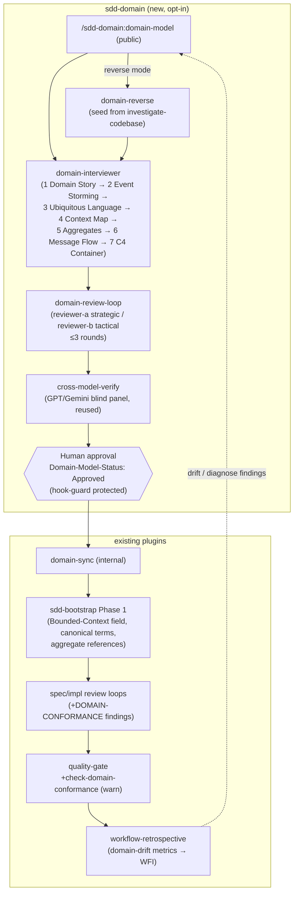

# Design: sdd-domain (DDD Upstream Lane Plugin)

Impl-Review-Status: Passed
Feature Type: framework plugin (new upstream lane in an existing multi-plugin repository)

## Technical Summary

A seventh plugin `plugins/sdd-domain` adds an opt-in DDD upstream lane. One
public skill (`domain-model`) orchestrates a seven-stage methodology pipeline
producing Markdown + Mermaid artifacts and one machine-readable contract under
`domain/`. Review reuses the existing independent two-reviewer loop pattern
plus cross-model verification. Downstream, a sync step injects approved
context/terms into bootstrap Phase 1, and a scripted warn-level gate checks
conformance at quality-gate time. Absence of `domain/` disables the whole lane.

## Architecture

Flow stays unidirectional (domain → spec → design → tasks → implementation);
feedback returns only via WFI/diagnose into a new `domain-model update` run.

## Components

| Component | Responsibility | Technology | New/Existing |
|---|---|---|---|
| `domain-model` (skill, public) | Entry point; routes new/update/reverse modes; orchestrates pipeline, review, approval handoff | SKILL.md | New |
| `domain-interviewer` (skill, internal) | Seven-stage interview; generates all `domain/` artifacts from templates; stage checkpointing | SKILL.md + templates | New |
| `domain-reverse` (skill, internal) | Runs investigate-codebase, converts investigation.md into a candidate model seed | SKILL.md | New |
| `domain-review-loop` (skill, internal) | 2 reviewers × ≤3 rounds; verdict JSON per review-contract v1; then invokes cross-model-verify | SKILL.md | New |
| `domain-sync` (skill, internal) | Detects Approved model; injects context/terms/aggregate refs into Phase 1 generation | SKILL.md | New |
| `domain-reviewer-a` (agent) | Strategic soundness: context boundaries, relation patterns, event coverage, term uniqueness | agent def (read-only) | New |
| `domain-reviewer-b` (agent) | Tactical implementability: invariants verifiable, transaction boundaries realistic, god-aggregate / anemic-model risks | agent def (read-only) | New |
| `check-domain-conformance` (script) | Deterministic conformance check of Phase 1 artifacts against domain-contract.json; warn default | PowerShell + bash | New |
| `contracts/domain-contract.v1.schema.json` | Schema for the machine-readable domain contract | JSON Schema | New |
| Hook guard extension | Reject agent-set `Domain-Model-Status: Approved`; reset-to-Pending on post-approval edits | sdd-hook-guard.js/.py (protected) | Existing (extended) |
| cross-model-verify (skill) | Blind multi-vendor verdict on the reviewed model | existing sdd-quality-loop skill | Existing (reused) |

Plugin/skill counts: plugins 6 → 7; skills 21 → 26; public skills 5 → 6.
All seven plugin manifests version-bump together to the next minor version.

## Layer Specifications

| Layer | Summary | Canonical Detail | Owner | Status |
|---|---|---|---|---|
| UX | Conversational CLI interview UX across seven checkpointed stages; artifact readability conventions (Mermaid canonical) | [UX specification](ux-spec.md#scope-and-user-journeys) | plugin author | Draft |
| Frontend | N/A — no change: Markdown/CLI plugin, no graphical frontend | [Frontend specification](frontend-spec.md#technology-stack) | plugin author | N/A |
| Infrastructure | Local execution + existing GitHub Actions validate job; no deployed services | [Infrastructure specification](infra-spec.md#deployment-topology) | plugin author | Draft |
| Security | Seed-input injection defense, approval-line guard, contract tamper handling | [Security specification](security-spec.md#trust-boundaries) | plugin author | Draft |

## Design System Compliance

N/A — ds_profile: none

## Cross-Layer Dependencies

| From | To | Contract / Decision | REQ | AC | Verification |
|---|---|---|---|---|---|
| requirements.md | design.md (this) | Seven-stage artifact set is the canonical pipeline output | REQ-002 | AC-002 | TEST-002 |
| requirements.md | security-spec.md | Approval lines are guard-protected, agent cannot self-approve | REQ-005 | AC-007 | TEST-007 |
| design.md | infra-spec.md | validate-repository expectations (7 plugins, 6 public skills) run in CI | REQ-009 | AC-011 | TEST-011 |
| ux-spec.md | design.md | Stage checkpointing: every stage artifact saved before next stage starts | REQ-002 | AC-002 | TEST-002 |
| security-spec.md | design.md | Corrupt contract fails toward warn+skip, never blocks spec generation | REQ-008 | AC-010 | TEST-010 |

## ADR Change Log

| ADR | Decision | Status | Layer Impact | Supersedes | Date |
|---|---|---|---|---|---|
| ADR-0004 | DDD upstream lane as seventh plugin with seven-stage pipeline, cross-model-verified domain gate, warn-first conformance | Accepted | all | none | 2026-07-03 |

## Data Plan

Data Entities: bounded contexts, terms (canonical EN + JA + forbidden
synonyms), aggregates (root entity, invariants, transaction boundary,
lifecycle), context relations (pattern-typed), domain events, commands,
policies, message flows.

Existing Data Affected: none (new `domain/` directory; additive
`Bounded-Context:` field in future requirements.md files).

Migration Strategy: none required. Projects adopt by running
`/sdd-domain:domain-model`; absence keeps legacy behavior (AC-010).

`domain/domain-contract.json` is the single machine-readable projection of the
Markdown artifacts (same pattern as design-tokens.json vs design-system.md).
Markdown is human-canonical; the JSON contract is the gate-consumable
projection regenerated by the interviewer on every approved change.

## API / Contract Plan

- `contracts/domain-contract.v1.schema.json` — meta envelope
  `{"schema": "domain-contract/v1"}` plus `contexts[]` (name, description,
  terms[], aggregates[], relations[]). Relation `pattern` is an enum:
  partnership, shared-kernel, customer-supplier, conformist,
  anticorruption-layer, open-host-service, published-language,
  separate-ways.
- Verdict outputs reuse `review-contract.v1` (stage: `domain`) and
  `cross-model-verdict/v1` unchanged.
- No HTTP APIs.

## Test Strategy

- Unit (Pester): schema validation fixtures (valid/corrupt), conformance
  check fixtures (conformant/deviant design.md, plus two-context fixtures for
  declared/undeclared relations per AC-015), guard line-diff tests, template
  language checks, validate-repository expectations.
- Integration: end-to-end artifact-set generation on a fixture project;
  domain-sync injection into a fixture bootstrap run; absence regression
  (byte-identical outputs without `domain/`); update-mode re-run semantics
  (edited + downstream stages in confirmation mode, upstream byte-identical,
  status reset — AC-016); cross-model gate fixtures for verdict mismatch and
  panelist-unavailable, both asserting `requires_human_decision` blocks
  auto-continuation (AC-006, AC-017).
- Windows-local constraint: integration tests must run under PowerShell 5.1
  and bash (Git Bash) like existing test suites; no non-ASCII in .ps1 files.

## Security Boundaries

| Trust Boundary | Auth/Authz Mechanism | Data Classification | OWASP Concerns |
|---|---|---|---|
| Seed inputs → interviewer | Content-as-data rule; URLs fetched read-only | internal | Injection (prompt) |
| Agent → approval lines | Hook guard line-diff rejection (existing guard class) | n/a | Broken Access Control |
| domain-contract.json → gates | JSON Schema validation, fail toward warn+skip | internal | Software/Data Integrity |
| Sanitized domain-artifact bundle → external vendor models (cross-model-verify) | Existing vendor API auth (reused unchanged); input-manifest allowlist limits the bundle to `domain/*` | internal — must exclude real person names and customer-identifying values (role/system names only) | Information Disclosure |

Detailed controls: [Security specification](security-spec.md#trust-boundaries).

## Deployment / CI Plan

No deployment. CI: existing GitHub Actions validate job runs
`tests/validate-repository.ps1` with updated expectations plus the new Pester
suites. Marketplace distribution follows the existing per-plugin
`.claude-plugin/plugin.json` + 3-environment manifest pattern.

## Constraint Compliance

| Requirement Constraint | Design Response |
|---|---|
| Visibility contract (public skills minimal) | Exactly one new public skill; four internal skills hidden; enforced by validate-repository (AC-001, AC-011) |
| Unidirectional flow | domain-sync only injects downstream; feedback returns via WFI/diagnose to a new update run |
| Graceful degradation | Every hook/gate checks `domain/` existence first and records one skip line (AC-010) |
| Warn-first gates | check-domain-conformance defaults to warn; `SDD_DOMAIN_ENFORCE=error`; default flips to error two releases after introduction, by human edit |
| R-10 protected files | Guard scripts and validate-repository edits follow the scratchpad → human-copy procedure |
| Human-owned judgment | LLM handles early domain understanding; model approval and cross-model mismatch resolution are human-only (methodology principle from interview) |

## Assumptions

- **cross-model-verify accepts a domain-scoped input bundle without skill
  changes.** Technical-default basis (verified against current source):
  `plugins/sdd-quality-loop/scripts/prepare-panelist-input.sh:27-59` parses
  `--task`, `--feature`, and `--input` as free-form strings with only a
  non-empty check — no task-existence lookup or path-shape validation
  (`--input <path|dir>` per the usage comment at line 4). The default output
  path (line 86) and `check-cross-model.sh:35` build their targets by plain
  string interpolation. A domain-scoped identifier (e.g. `DM-001`) with
  `--input domain/` therefore flows through both scripts unmodified.
  Residual design-level detail, accepted as a stated risk: the scripts'
  consent gate (`prepare-panelist-input.sh:91-95`) reads `tasks.md` for
  `Cross-Model: enabled`, which sdd-domain does not produce; domain-review-loop
  must invoke the underlying scripts directly under human authorization
  (`SDD_SUDO`-style), not through the tasks.md-mediated path. Human owner
  accepts this as the v1 invocation approach; revisit if cross-model-verify's
  consent contract changes.
- **Existing c4-container template is reusable for stage 7 output.**
  Technical-default basis: `plugins/sdd-bootstrap/skills/sdd-bootstrap-interviewer/templates/c4-container.template.md:1-21`
  contains only generic C4-model placeholders (`{{system_name}}`,
  `{{container_name}}`, `{{technology}}`, `{{db_name}}`,
  `{{external_system_1}}`, etc.) with no feature-specific or
  sdd-forge-specific coupling — directly reusable by supplying the
  domain-model's actors, containers, and external systems as template values.
- The interviewer templates (new, English) live under
  `plugins/sdd-domain/skills/domain-interviewer/templates/`.

## Open Questions

### OQ-001: Conformance matching strategy

v1 matches exact canonical terms on structured fields only
(`Bounded-Context:` values, aggregate names in design.md, heading-level term
usage). Lexical-variant/synonym detection is deferred to a WFI after drift
metrics exist.

Owner: human
Blocks Implementation: no
Resolution Path: confirm at task approval; revisit after first retrospective
with drift metrics.

**RESOLVED (2026-07-07, sign-off per repository owner's direction; closes
RT-20260707-002 item 3):** the `[[term:Name]]` heading-marker convention
introduced by T-008's check-domain-conformance Check-2 is confirmed as the
v1 mechanism for declaring heading-level canonical-term usage in
requirements.md. Rationale:

- **Opt-in and explicit** -- a heading without the marker is never checked,
  so brownfield prose can never false-positive (the exact failure class
  RT-20260706-001 documented for keyword-based scanning). All existing
  features' specs pass conformance untouched.
- **Deterministic** -- exact string match against
  `domain-contract.json` `contexts[].terms[].canonical`; no lexical
  heuristics, greppable, and pinned by a Pester scenario
  (check-domain-conformance.Tests.ps1 Scenario 7, including the
  `requirements.md:<lineno>:` finding format).
- **Collision-safe** -- the `term:` prefix inside `[[...]]` is disjoint from
  wiki-style `[[link]]` conventions.
- **Accepted cost** -- the marker renders literally in Markdown; acceptable
  in spec headings, which are working artifacts rather than published docs.
- **Alternatives rejected**: bare-name fuzzy matching (false-positive-prone,
  contradicts the deterministic-gate principle) and front-matter term lists
  (detach the claim from its usage site).

The marker remains optional until a project adopts a `domain/` directory;
lexical-variant matching stays deferred per the original v1 scope.

### OQ-002: Re-approval granularity

v1 resets the whole model to Pending on any `domain/` edit. Per-context
re-review is a later optimization once update frequency data exists.

Owner: human
Blocks Implementation: no
Resolution Path: confirm at task approval; revisit via WFI.

## Risks

- Guard/validate-repository edits touch R-10 protected files → scratchpad →
  human-copy procedure; plan tasks accordingly.
- Cross-model panel cost per revision → run once per review-loop PASS, not
  per round; unavailable panelists fail toward `requires_human_decision`.
- Interview fatigue across seven stages → stage checkpointing and resumable
  runs; `update` mode re-enters a single stage.
- Conformance false positives → warn-first, structured-field-only matching,
  two-release escalation rule.
