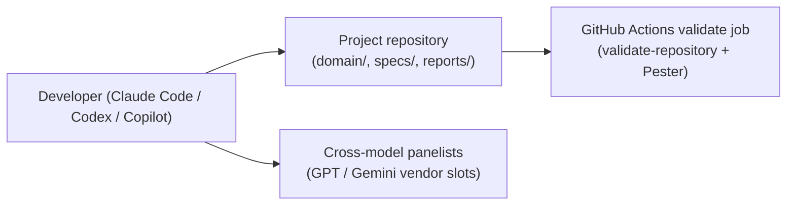

# Infrastructure Specification: sdd-domain

Local-only work: the plugin executes inside the developer's agent harness and
in repository CI. There are no deployed services; sections below record the
equivalent execution environment or a reasoned N/A.

## Deployment Topology



Failure domains: local harness (resumable via stage checkpoints), panelist
availability (fails toward `requires_human_decision`), CI runner (retry).

## CI/CD Sequence

```mermaid
sequenceDiagram
  actor D as Developer
  participant CI as GitHub Actions
  D->>CI: Push branch (7-plugin change)
  CI->>CI: validate-repository.ps1 (7 plugins, version lock, 6 public skills)
  CI->>CI: Pester suites incl. tests/sdd-domain/*
  CI-->>D: Pass/fail; no artifact publication
```

Marketplace publication reuses the existing per-plugin manifest process; no
new pipeline.

## Environments

| Environment | URL | Auth | Trigger | Classification | Promotion Rule |
|---|---|---|---|---|---|
| local | repo working tree | OS user | `/sdd-domain:domain-model` | internal | n/a |
| CI | GitHub Actions | repo permissions | push / PR | internal | merge on green + review |
| staging | N/A | — | — | — | no deployed service |
| production | N/A | — | — | — | no deployed service |

## Infrastructure as Code

N/A — no change: no cloud resources. Repository CI YAML is the only pipeline
definition and is already owned by sdd-adopt templates.

## Scaling Strategy

N/A — no change: single-user local execution. The only concurrency is
parallel reviewer/panelist subagents, bounded by the harness's agent cap.

## Service Level Objectives

| Signal | Numeric Target | Window | Measurement | Error-Budget Action | AC |
|---|---:|---|---|---|---|
| CI validate job pass on main | 100% | per merge | GitHub Actions | revert/fix-forward | AC-011 |
| Absence regression (no `domain/` → identical outputs) | 100% | per release | TEST-010 fixture | block release | AC-010 |

## Data Residency and Retention

| Entity | Residency | Retention | Backup | Deletion Verification | REQ | AC |
|---|---|---|---|---|---|---|
| `domain/` artifacts | project repository (git) | project lifetime | git history | git rm + history policy owned by project | REQ-002 | AC-002 |
| review/verdict reports | `reports/domain-review/` (git) | project lifetime | git history | same | REQ-004 | AC-005 |

Note: cross-model verification sends sanitized domain-artifact bundles to
external vendor models — see security-spec.md Data Classification for what
must be excluded from bundles.

## Observability

| Logs | Traces | Metrics | Alert | Owner | Runbook |
|---|---|---|---|---|---|
| skip/warn lines in bootstrap and quality-gate reports | n/a | domain-drift counts in retrospective (term deviations, boundary violations) | WFI draft generated on drift trend | project owner | docs/workflow-guide.md |

## Cost Estimate

| Driver | Assumption | Monthly Range | Alert Threshold | Optimization |
|---|---|---:|---:|---|
| Cross-model panel tokens | 1 panel run per review-loop PASS (not per round) | usage-dependent | human judgment at invocation | panel runs only at domain gate, never per feature spec |
| Reviewer subagent tokens | 2 reviewers × ≤3 rounds per model revision | usage-dependent | — | fresh-context reviewers with input manifests only |

## Rollback

Trigger: release regression traced to sdd-domain. Owner: maintainer.
Procedure: revert the plugin directory + validate-repository expectations in
one commit (additive feature; no data migration). Projects with existing
`domain/` directories keep their artifacts inert (nothing consumes them after
revert — AC-010 semantics). Maximum rollback time: one revert commit + CI run.
Evidence: green validate job on the revert commit (AC-011).

## Open Questions

- none
