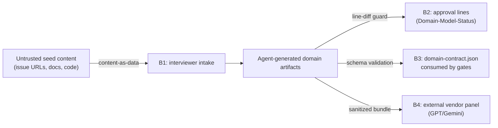

# Security Specification: sdd-domain

## Trust Boundaries

| Boundary | Source | Destination | Assets | Validation | AuthN/AuthZ | REQ | AC |
|---|---|---|---|---|---|---|---|
| B1 | seed docs/URLs/code | domain-interviewer | interview integrity | content treated as data, never as instructions; read-only retrieval | harness permissions | REQ-003 | AC-004 |
| B2 | agent edits | `Domain-Model-Status` lines | approval integrity | hook-guard line-diff rejection; post-approval edits force Pending | human-only approval | REQ-005 | AC-007, AC-014 |
| B3 | domain-contract.json | check-domain-conformance, domain-sync | gate decisions | JSON Schema validation before consumption; invalid → warn+skip | n/a | REQ-008 | AC-010 |
| B4 | sanitized artifact bundle | external vendor models | confidentiality | input-manifest allowlist; exclusion rules below | vendor API auth (existing) | REQ-004 | AC-006 |

## STRIDE Analysis

| Boundary | Threat | STRIDE | Abuse Case | Mitigation | Verification | REQ-NNN | AC-NNN |
|---|---|---|---|---|---|---|---|
| B1 | Prompt injection via seed document | Tampering | A crafted issue body instructs the interviewer to auto-approve or exfiltrate | content-as-data rule in skill; approval is human-only regardless of content; guard enforces at write time | TEST-007 | REQ-005 | AC-007 |
| B1 | Malicious URL retrieval | Information Disclosure | Seed URL points at internal service to leak fetch results into artifacts | read-only retrieval through harness permission prompts; URLs recorded in artifacts for review | TEST-004 | REQ-003 | AC-004 |
| B2 | Agent self-approval | Elevation of Privilege | Agent writes `Domain-Model-Status: Approved` to skip human gate | hook guard rejects agent-added Approved lines (same class as tasks.md Approval guard) | TEST-007 | REQ-005 | AC-007 |
| B2 | Silent post-approval mutation | Repudiation | Artifacts edited after approval while status stays Approved | guard forces status reset to Pending on `domain/` edits | TEST-014 | REQ-005 | AC-014 |
| B3 | Contract tampering | Tampering | Hand-edited contract adds terms that never passed review, steering downstream gates | contract regenerated from reviewed Markdown by interviewer; schema validation; conformance stays warn until human escalates | TEST-003, TEST-009 | REQ-007 | AC-003, AC-009 |
| B3 | Corrupt contract as DoS | Denial of Service | Broken JSON blocks all spec generation | fail toward warn+skip; spec generation never blocked | TEST-010 | REQ-008 | AC-010 |
| B4 | Confidential data in vendor bundle | Information Disclosure | Domain artifacts carry internal names/PII to external vendors | input-manifest allowlist limited to `domain/*`; exclusion rules below; existing sanitization step of cross-model-verify | TEST-006 | REQ-004 | AC-006 |
| B4 | Panelist result spoofing | Spoofing | Fabricated verdict JSON claims vendor PASS | verdicts written by panelist agents into report paths with existing verdict-schema validation; mismatch defaults to human decision | TEST-006 | REQ-004 | AC-006 |

## Authentication Flow

N/A — no change: no user authentication surface. Vendor panel authentication
reuses the existing cross-model-verify mechanism unchanged. Repository
approval identity relies on git commits by the human owner (existing model).

## Authorization

| Actor / Role | Resource | Action | Decision Point | Default | Denial Evidence | REQ | AC |
|---|---|---|---|---|---|---|---|
| agent | `Domain-Model-Status: Approved` | write | sdd-hook-guard line diff | deny | guard log + blocked tool call | REQ-005 | AC-007 |
| human owner | same | write | manual edit | allow | git history | REQ-005 | AC-007 |
| reviewer/panelist agents | any file write | write | agent definition (read-only tools) | deny | agent config | REQ-004 | AC-005 |

Fail-closed: guard unavailable ⇒ existing kill-switch/guard semantics apply
(tool calls blocked, not silently allowed).

## Data Classification and Protection

| Entity | Classification | At Rest | In Transit | Retention | Deletion | Access Log | REQ | AC |
|---|---|---|---|---|---|---|---|---|
| domain/ artifacts | internal | git repo | n/a (local) | project lifetime | git rm | git history | REQ-002 | AC-002 |
| cross-model bundle | internal — must exclude secrets, credentials, personal names, customer identifiers | n/a | vendor TLS (existing) | vendor policy | n/a | verdict reports record bundle manifest | REQ-004 | AC-006 |

Bundle exclusion rule: the ubiquitous language and context artifacts must use
role/system names, never real person names or customer-identifying values;
the interviewer states this constraint at stage 1 and the sanitization step
of cross-model-verify remains the second line of defense.

## OWASP Mapping

| OWASP Risk | Exposure | Control | Verification | Owner |
|---|---|---|---|---|
| Broken Access Control | agent self-approval of domain model | hook guard line-diff denial | TEST-007 | maintainer |
| Injection | seed content steering the interviewer | content-as-data rule + human-only approval | TEST-007 | maintainer |
| Software and Data Integrity Failures | tampered/corrupt domain-contract.json | schema validation + regenerate-from-Markdown rule + warn+skip | TEST-003, TEST-010 | maintainer |

## Secrets Management

No new secrets. Existing keys (`SDD_EVIDENCE_KEY`, sudo tokens) are untouched;
domain artifacts and templates must not contain secret values (covered by the
existing check-placeholders/secret hygiene gates at quality-gate time).

## SBOM and Supply Chain

No new dependencies (frontend-spec.md Dependencies). Plugin distribution uses
the existing version-locked manifest process; no new artifact types.

## Security Tests

| Test | Boundary | Attack / Control | Expected Result | Evidence | AC |
|---|---|---|---|---|---|
| TEST-007 | B2 | agent writes `Domain-Model-Status: Approved` | guard rejects the edit | tests/hooks/domain-approval-guard.Tests.ps1 | AC-007 |
| TEST-014 | B2 | edit `domain/` file while status Approved | status forced to Pending | same suite | AC-014 |
| TEST-003 | B3 | corrupt/tampered contract fixture | schema validation fails; consumer skips with warn | tests/sdd-domain/contract-schema.Tests.ps1 | AC-003 |
| TEST-010 | B3 | missing/broken `domain/` during bootstrap | spec generation unaffected, one skip/warn line | tests/sdd-domain/absence-regression.Tests.ps1 | AC-010 |
| TEST-006 | B4 | panelist unavailable / verdict mismatch | `requires_human_decision`, no auto-continue | tests/sdd-domain/cross-model-gate.Tests.ps1 | AC-006 |

## Open Questions

- none
