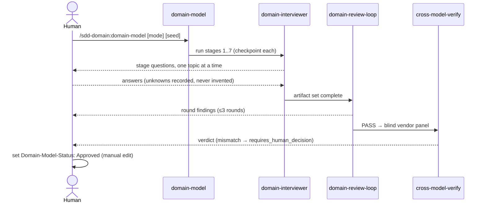
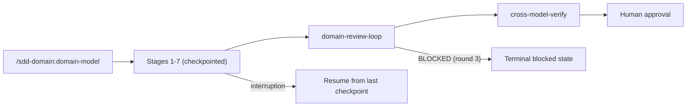

# UX Specification: sdd-domain

The user interface of this feature is a conversational CLI interview plus
generated Markdown/Mermaid artifacts. Graphical-UI sections record reasoned
N/A values; conversational and artifact-readability UX is specified fully.

## Scope and User Journeys

- Primary user: developer/architect running the DDD upstream lane before
  feature specification.
- Entry point: `/sdd-domain:domain-model` (modes: new | update | reverse).
- Success outcome: approved `domain/` artifact set exists and downstream
  bootstrap runs consume it (AC-002, AC-008).
- Excluded journey: graphical modeling canvas — Mermaid text diagrams remain
  canonical (repository-wide principle).

## Target Views

| View | User | Purpose | Entry | Exit | REQ | AC |
|---|---|---|---|---|---|---|
| Stage interview prompt (×7) | developer | Answer one stage's questions (Domain Story → … → C4 Container) | previous stage checkpoint | stage artifact written | REQ-002 | AC-002 |
| Review findings summary | developer | See reviewer-a/b findings and round verdicts | domain-review-loop round end | edits or PASS | REQ-004 | AC-005 |
| Cross-model verdict summary | human owner | Resolve vendor mismatch | cross-model-verify end | decision recorded | REQ-004 | AC-006 |
| Approval handoff | human owner | Set `Domain-Model-Status: Approved` manually | pipeline complete | approved model | REQ-005 | AC-007 |

## Component States

| Component | State | Trigger | Visible Feedback | Recovery | REQ-NNN | AC-NNN |
|---|---|---|---|---|---|---|
| Stage interview | Empty | new run, no seed | prompt offers seed options (text/path/URL/reverse) | provide seed or continue blank | REQ-003 | AC-004 |
| Stage interview | Loading | reverse mode investigation running | progress note naming investigate-codebase | resume from checkpoint on interruption | REQ-003 | AC-004 |
| Stage interview | Error | seed unreadable / URL unreachable | plain-language error + which seed failed | re-supply seed; never invent content | REQ-003 | AC-004 |
| Stage interview | Success | stage artifact written | checkpoint line with artifact path | next stage begins | REQ-002 | AC-002 |
| Sync notice | Error | contract corrupt at bootstrap time | warn line with schema error; spec generation continues | fix contract, rerun | REQ-008 | AC-010 |

## Interaction Sequence

## Wireframe Attachments

| View | Local Attachment | Source | Reviewed At | Notes |
|---|---|---|---|---|
| pipeline reference | none (methodology links) | domainstorytelling.org, eventstorming.com, visual-c4.com | 2026-07-03 | Seven-stage pipeline supplied by human at interview |

None — manual visual refinement skipped (methodology links above are the
supplied reference; no local mockup files).

## Navigation Map

Lost-state recovery: every stage writes its artifact before the next stage
starts; a re-run detects existing artifacts and offers resume or restart.

## Accessibility

N/A — no change: no graphical UI. Artifact readability conventions apply
instead: English templates, JA translation column in the ubiquitous language
table (AC-013), Mermaid diagrams with text labels (screen-reader-readable
source), no color-only semantics in diagrams.

## Responsive Behavior

N/A — no change: CLI/Markdown only.

## Design Tokens

N/A — ds_profile: none (repository has no design-system/).

## Open Questions

- none
