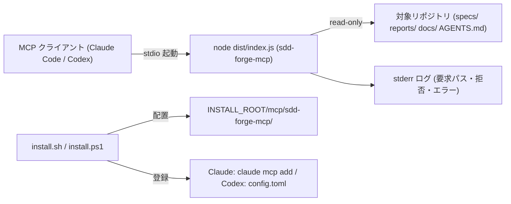
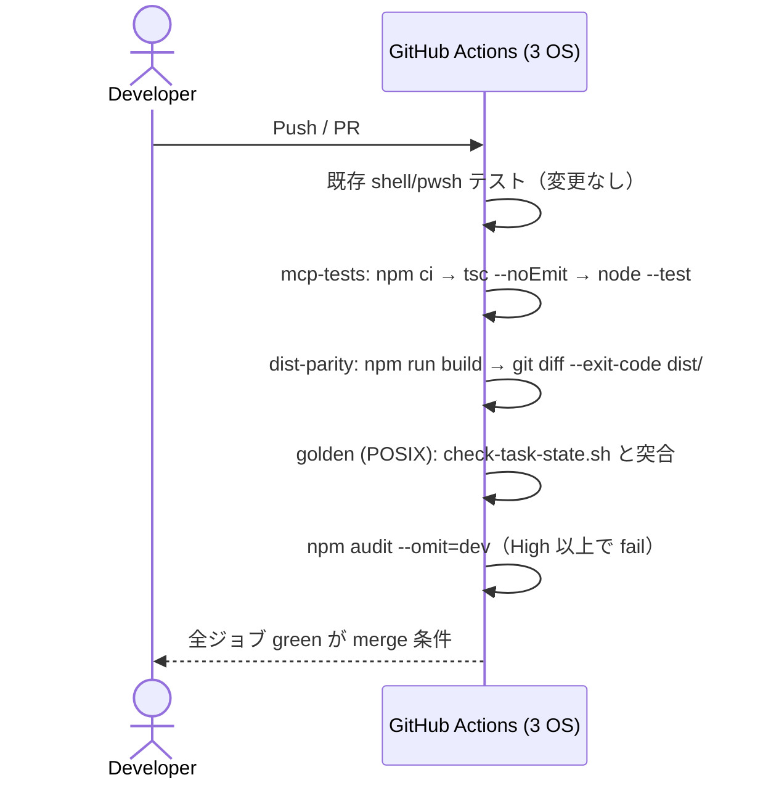

# Infrastructure Specification: sdd-forge-mcp

ローカル実行のみの feature。クラウド環境・IaC は適用外（理由を各節に記録）。

## Deployment Topology

- サーバーは MCP クライアントが必要時に stdio で起動するローカル子プロセス。
  常駐サービス・ポート待ち受け・ネットワーク送信なし。
- 配置先: `INSTALL_ROOT/mcp/sdd-forge-mcp/`（`dist/index.js` + `package.json` の
  最小セット）。既定 INSTALL_ROOT は POSIX
  `${XDG_DATA_HOME:-$HOME/.local/share}/sdd-plugins`、Windows
  `%LOCALAPPDATA%/sdd-plugins`（既存 installer と同一）。
- 対象リポジトリの決定: `--root` > `SDD_FORGE_ROOT` > cwd（REQ-007）。
  クライアント登録エントリには引数なし（cwd 解決）を既定とし、リポジトリ外
  から使う場合のみ env/引数を利用者が設定する。

## CI/CD Sequence

- 「デプロイ」= git merge + 利用者の installer 再実行。レジストリ公開なし
  （REQ-008、Non-goals）。

## Environments

| Environment | URL | Auth | Trigger | Classification | Promotion Rule |
|---|---|---|---|---|---|
| local (開発) | mcp/sdd-forge-mcp/（repo 内） | OS ユーザー権限 | `npm run build` / `node --test` | internal | CI green → merge |
| local (利用) | INSTALL_ROOT/mcp/sdd-forge-mcp/ | OS ユーザー権限 | install.sh / install.ps1 | internal | main ブランチから install |
| staging / production | N/A — ローカルツールのためサーバー環境なし | — | — | — | — |

## Infrastructure as Code

N/A — クラウドリソースなし。等価物として installer スクリプト
（install.sh / install.ps1 / uninstall.sh / uninstall.ps1）が配置・登録の
唯一の正であり、tests/*.tests.sh / *.tests.ps1 で回帰検証する（AC-007〜009）。

## Scaling Strategy

N/A — 単一ユーザー・単一プロセスのローカルツール。同時実行はクライアント側の
プロセス生成に従う（サーバーは無状態のため多重起動安全）。ファイルサイズ上限
2 MiB・入力長上限で資源消費を抑制（security-spec.md DoS 行参照）。

## Service Level Objectives

クラウド SLO は N/A。ローカル応答性の目標のみ規定する:

| Signal | Numeric Target | Window | Measurement | Error-Budget Action | AC |
|---|---:|---|---|---|---|
| tool 応答時間（既存 6 spec 規模） | p95 <= 500 ms | テスト実行毎 | node --test 内の計測 | 超過は最適化タスク起票（non-blocking） | AC-005 |
| 起動時間（プロセス spawn → ready） | <= 1 s | 同上 | smoke テスト | 同上 | AC-005 |

## Data Residency and Retention

| Entity | Residency | Retention | Backup | Deletion Verification | REQ | AC |
|---|---|---|---|---|---|---|
| 読み取り対象（SDD 状態） | 利用者ローカル | サーバーは保持しない（無状態・キャッシュなし v1） | リポジトリ（git）側の責務 | N/A | REQ-001 | AC-011 |

## Observability

| Logs | Traces | Metrics | Alert | Owner | Runbook |
|---|---|---|---|---|---|
| stderr: 起動時 root/設定、要求（tool 名・対象パス）、拒否（denied 理由）、エラー。ファイル内容・環境変数値は出力しない | N/A（ローカル） | N/A | N/A | 利用者 | [USERGUIDE.md「sdd-forge-mcp（MCP サーバー）」節のトラブルシュート](../../USERGUIDE.md#sdd-forge-mcpmcp-サーバー) |

- MCP プロトコル準拠のため stdout は JSON-RPC 専用。診断はすべて stderr。

## Cost Estimate

N/A — ローカル実行のためランニングコストなし。CI 追加ジョブは GitHub Actions
無料枠内（Node ジョブ 3 OS × 数分/run 想定）。

## Rollback

- トリガー: MCP サーバーの誤動作・誤判定の発見。
- 手段1（利用側）: `uninstall.sh --mcp sdd-forge-mcp`（または `--skip-mcp` で
  再 install）→ 登録解除 + 配置除去。SDD ワークフロー本体はシェルスクリプトで
  完結しており、MCP 除去による機能喪失はない（追加価値のみが失われる）。
- 手段2（repo 側）: 該当コミットの revert。dist/ も同コミットに含まれるため
  revert だけで成果物も戻る。
- 最大ロールバック時間: 5 分以内（uninstall 実行のみ）。
- スモーク確認: uninstall 後に `claude mcp list` 等で登録が消えていること
  （AC-009）。

## Open Questions

- なし（OQ-001: Codex 登録手段は design.md 管理）。
