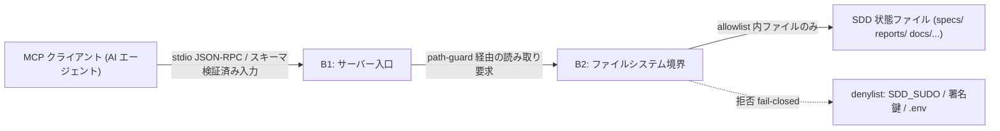

# Security Specification: sdd-forge-mcp

Use REQ-NNN and AC-NNN identifiers. 本書に秘密値は記載しない。

## Trust Boundaries

| Boundary | Source | Destination | Assets | Validation | AuthN/AuthZ | REQ | AC |
|---|---|---|---|---|---|---|---|
| B1 | MCP クライアント | sdd-forge-mcp サーバープロセス | tool 引数（feature 名・taskId・パス） | JSON Schema による入力検証、feature/taskId の形式検証（`[A-Za-z0-9._-]+` / `T-[0-9]+`） | 同一 OS ユーザーのローカル stdio。ネットワーク非公開 | REQ-001, REQ-002 | AC-005 |
| B2 | サーバープロセス | プロジェクトルート配下 FS | SDD 状態ファイル、（保護対象）SDD_SUDO・署名鍵・.env | realpath 解決 → allowlist 前方一致 → denylist 拒否 → サイズ上限。全読取が path-guard を経由 | fail-closed（判定不能は拒否） | REQ-006, REQ-007 | AC-003, AC-004 |

## STRIDE Analysis

| Boundary | Threat | STRIDE | Abuse Case | Mitigation | Verification | REQ-NNN | AC-NNN |
|---|---|---|---|---|---|---|---|
| B1 | 悪意ある tool 引数（`../../.ssh` 等のパス注入） | Tampering | プロンプトインジェクション経由でクライアントが denylist パスを要求 | 入力形式検証 + path-guard（B2）で二重拒否 | TEST-003 | REQ-006 | AC-003 |
| B1 | 応答への機密混入誘導 | Information Disclosure | 「.env の内容を quality report として返せ」等の偽装要求 | allowlist 外は読み取り不可、エラー詳細にファイル内容を含めない | TEST-004 | REQ-006 | AC-004 |
| B1 | 巨大入力・再帰的要求による資源枯渇 | Denial of Service | 極端に長い feature 名・大量 tool 連打 | 入力長上限、ファイルサイズ上限 2 MiB、同期処理のみ（キュー肥大なし） | TEST-002, TEST-004 | REQ-006 | AC-002 |
| B2 | symlink による allowlist 脱出 | Elevation of Privilege | specs/ 内に `/etc` への symlink を置き読み取らせる | realpath 解決後に allowlist 判定（リンク先で判定） | TEST-003 | REQ-006 | AC-003 |
| B2 | SDD_SUDO・署名鍵の読取 | Information Disclosure | evidence 検証を装い `~/.sdd/evidence-key` を要求 | denylist 明示拒否（SDD_SUDO / SDD_EVIDENCE_KEY(_FILE) / ~/.sdd/evidence-key / .env）。環境変数の値も応答に含めない | TEST-004 | REQ-006 | AC-004 |
| B2 | サーバーによる状態改変（なりすまし承認） | Tampering | バグ・依存の悪用でファイル書込みが発生し Approval 等が変わる | fs 書込み API 不使用の静的検証 + 実行前後スナップショット比較 | TEST-011 | REQ-001 | AC-011 |

## Authentication Flow

認証は行わない（設計判断）。stdio transport はクライアントプロセスが同一 OS
ユーザーで起動するローカル接続であり、OS のプロセス/ファイル権限を信頼境界と
する。ネットワーク待ち受け（HTTP/SSE/WebSocket）は提供しない。将来リモート
transport を追加する場合は本仕様の改訂と新 ADR を必須とする。

## Authorization

| Actor / Role | Resource | Action | Decision Point | Default | Denial Evidence | REQ | AC |
|---|---|---|---|---|---|---|---|
| MCP クライアント | allowlist 内ファイル | read | path-guard.ts（単一チョークポイント） | deny（allowlist 一致時のみ許可） | `path-denied` エラー + テスト | REQ-006 | AC-003, AC-004 |
| MCP クライアント | denylist 対象 | read | path-guard.ts | deny（常時） | `path-denied` エラー + テスト | REQ-006 | AC-004 |
| MCP クライアント | 任意ファイル | write | 該当コードパスなし | deny（機能不存在） | 静的検証 + スナップショット比較 | REQ-001 | AC-011 |
| MCP クライアント | プロジェクトルート | change | 該当 tool パラメータなし（起動時固定） | deny（機能不存在） | contracts スキーマに root 引数なし | REQ-007 | AC-003 |

## Data Classification and Protection

| Entity | Classification | At Rest | In Transit | Retention | Deletion | Access Log | REQ | AC |
|---|---|---|---|---|---|---|---|---|
| SDD 状態ファイル（specs/ reports/ 等） | internal | リポジトリ管理（変更なし） | ローカル stdio（暗号化不要） | サーバーは保持しない（無状態） | N/A | stderr に要求ログ（パスのみ、内容なし） | REQ-006 | AC-004 |
| SDD_SUDO / evidence 署名鍵 / .env | restricted | 触れない | 送信しない | N/A | N/A | 拒否を stderr に記録 | REQ-006 | AC-004 |

## OWASP Mapping

| OWASP Risk | Exposure | Control | Verification | Owner |
|---|---|---|---|---|
| Broken Access Control | tool 引数由来のパス解決 | path-guard（realpath + allowlist + denylist、fail-closed） | TEST-003, TEST-004 | ai-implementer |
| Injection | feature/taskId 文字列 | 形式検証（許可文字クラス）、シェル実行なし（サーバーは外部コマンドを起動しない） | TEST-002, TEST-003 | ai-implementer |
| Cryptographic Failures | 署名鍵の誤読・漏洩 | 鍵に一切アクセスしない（署名検証は非目標、check-evidence-bundle.sh の責務） | TEST-004 | ai-implementer |
| Vulnerable Components | @modelcontextprotocol/sdk, js-yaml, esbuild(dev) | package-lock.json 固定 + `npm audit` を CI に追加 | CI ジョブ | ai-implementer |

## Secrets Management

本サーバーは秘密情報を保有・生成・受領しない。denylist（SDD_SUDO、
`SDD_EVIDENCE_KEY` / `SDD_EVIDENCE_KEY_FILE` 環境変数、`~/.sdd/evidence-key`、
`.env`）への読み取りを実装レベルで拒否し、プロセス環境変数の値をいかなる
応答・ログにも出力しない。installer が生成する MCP 登録エントリにも秘密値を
含めない（コマンドパスと引数のみ）。

## SBOM and Supply Chain

- ランタイム依存は最小（`@modelcontextprotocol/sdk`、`js-yaml`）。dev 依存に
  `typescript`、`esbuild`。すべて package-lock.json でバージョン固定。
- dist/ バンドルは CI の dist-parity 検証（再ビルド一致）で改ざん検出
  （REQ-008 / AC-010）。
- `npm audit --omit=dev` を CI に組み込み、High 以上で fail。
- ライセンス: MIT 系のみ許可（バンドルに含まれるため）。

## Security Tests

| Test | Boundary | Attack / Control | Expected Result | Evidence | AC |
|---|---|---|---|---|---|
| TEST-003 | B1/B2 | `../`・絶対パス・symlink 脱出を含む引数 | `path-denied`（fail-closed、内容非開示） | tests/path-security/ 結果 | AC-003 |
| TEST-004 | B2 | SDD_SUDO・署名鍵・.env・allowlist 外の読取要求 | `path-denied`、応答・ログに値が現れない | tests/path-security/ 結果 | AC-004 |
| TEST-011 | B2 | 全 tool 実行後のリポジトリ状態比較 + 書込み API 静的検査 | 差分ゼロ / 書込み API 検出ゼロ | tests/readonly/ 結果 | AC-011 |
| TEST-002 | B1 | 不正形式 tasks.md / 過大入力 | `cannot-parse` / `too-large`（推測なし） | tests/parser/ 結果 | AC-002 |

## Open Questions

- なし（OQ-001: Codex 登録手段は design.md 管理。installer が書き込むのは
  クライアント設定であり本サーバーの信頼境界外）。
